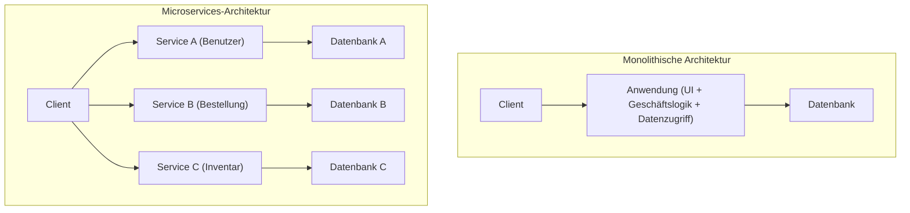
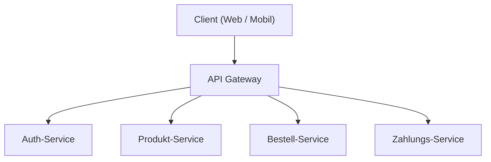
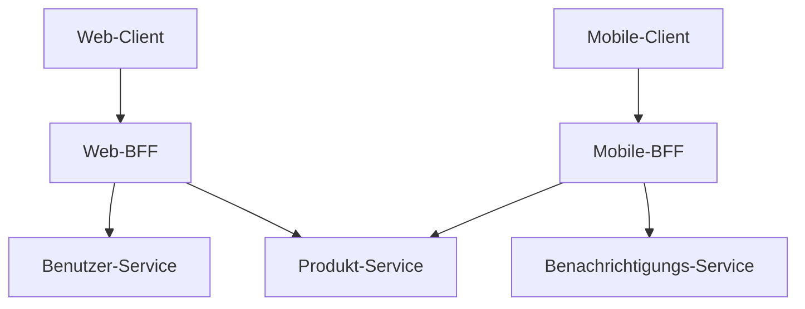

# Licht und Schatten der Microservices-Architektur (BFF und API Gateway)

In der modernen Softwareentwicklung wird zunehmend die **Microservices-Architektur** eingesetzt, um Skalierbarkeit und Entwicklungsagilität zu erhöhen. Die Aufteilung eines Systems führt jedoch gleichzeitig zu neuer Komplexität.

Dieser Artikel beginnt mit den Grenzen der monolithischen Architektur und geht tief auf die Vorteile von Microservices sowie den dahinterliegenden „Schatten“ (betriebliche Herausforderungen etc.) ein. Anschließend werden die Architekturmuster **API Gateway** und **BFF (Backend for Frontend)** zur Lösung dieser Herausforderungen anhand von Diagrammen und konkreten Codebeispielen detailliert erläutert.

---

## 1. Grenzen der monolithischen Architektur

Die **monolithische Architektur** ist ein Ansatz, bei dem alle Funktionen einer Anwendung (UI, Geschäftslogik, Datenzugriff usw.) als eine einzige Codebasis und ein einziger Prozess erstellt werden. In der Anfangsphase der Entwicklung ist dies eine sehr effektive Wahl, da es einfach und leicht zu implementieren (deployen) ist.

Wenn das System jedoch wächst und die Größe der Funktionen und Entwicklungsteams zunimmt, werden die folgenden Grenzen sichtbar:

*   **Aufblähen und Komplexität der Codebasis**: Wiederholte Funktionserweiterungen machen die Codebasis riesig und erschweren den Überblick über das Ganze. Das Risiko, dass eine Änderung unvorhergesehene Funktionen beeinträchtigt (Regressionsfehler), steigt.
*   **Mangelnde Flexibilität beim Deployment**: Selbst kleine Korrekturen erfordern einen Rebuild und ein erneutes Deployment der gesamten Anwendung. Dies verlängert die Vorlaufzeit für das Deployment und verringert die Agilität.
*   **Eingeschränkte Skalierbarkeit**: Auch wenn nur eine bestimmte Funktion (z.B. die Bildverarbeitung) große Mengen an Ressourcen verbraucht, muss die gesamte Anwendung skaliert werden, was die Ressourceneffizienz verschlechtert.
*   **Fixierung des Technologie-Stacks**: Da es sich um eine einzige Codebasis handelt, ist es schwierig, neue Sprachen oder Frameworks teilweise einzuführen, und man bleibt leicht an alte Technologien gebunden.

Um diese Herausforderungen zu überwinden, erwägen viele Unternehmen den Übergang zu einer **Microservices-Architektur**.

---

## 2. Vorteile der Microservices-Architektur

In einer **Microservices-Architektur** wird eine Anwendung als Sammlung kleiner, unabhängiger Services (Microservices) pro Geschäftsfunktion entworfen. Jeder Service kann unabhängig deployt werden und verfügt in der Regel über eine eigene Datenbank.



Microservices haben folgendes Licht (Vorteile):

*   **Unabhängiges Deployment**: Da jeder Service unabhängig entwickelt und deployt werden kann, lassen sich Release-Zyklen beschleunigen.
*   **Individuelle Skalierung**: Nur Services mit hoher Last können individuell skaliert werden, wodurch die Infrastrukturkosten optimiert werden.
*   **Technologische Vielfalt (Polyglott)**: Für jeden Service können die optimale Programmiersprache und Datenbank ausgewählt werden.
*   **Lokalisierung von Fehlern**: Selbst wenn ein Service ausfällt, kann verhindert werden, dass das gesamte System stoppt (sofern ein geeignetes fehlertolerantes Design vorhanden ist).

---

## 3. Der „Schatten“ von Microservices: Betriebliche Herausforderungen

Microservices sind jedoch keine „Silver Bullet“ (Wunderwaffe). Durch die Dezentralisierung des Systems entsteht der „Schatten“ der für verteilte Systeme typischen Komplexität.

### 3.1. Netzwerklatenz und Kommunikationskomplexität
Prozesse, die bei einem Monolithen noch als Funktionsaufrufe im Speicher abgewickelt wurden, werden durch Kommunikation über ein Netzwerk (HTTP/REST, gRPC etc.) ersetzt. Dies führt zu **Netzwerklatenz** und dem Risiko einer Verschlechterung der Reaktionsgeschwindigkeit des gesamten Systems. Da das Netzwerk zudem immer instabil ist, müssen komplexe Kommunikationssteuerungen wie Timeouts, Retry-Mechanismen und Circuit Breaker implementiert werden.

### 3.2. Verteilte Transaktionen und Datenkonsistenz
Da jeder Service seine eigene Datenbank hat, wird die Aktualisierung von Daten über mehrere Services hinweg (Transaktionen) sehr schwierig. [ACID](https://kenji.blog/de/p/rdbms-transaction-acid-isolation-level-lock/)-Transaktionen, die in herkömmlichen RDBMS verfügbar waren, können nicht verwendet werden, weshalb komplexe Designmuster wie das **Saga-Pattern** oder **Event Sourcing** eingeführt werden müssen, die eine eventuelle Konsistenz (Eventual [Consistency](https://kenji.blog/de/p/cap-theorem-distributed-systems-tradeoff/)) tolerieren.

### 3.3. Komplexität des Zugriffs von Clients
Wenn es Dutzende oder Hunderte von Services gibt, ist es für Clients (Webbrowser oder mobile Apps) unrealistisch, genau zu wissen, welchen API-Endpunkt sie aufrufen müssen, und einzeln zu kommunizieren. Darüber hinaus müssen möglicherweise zahlreiche Anfragen (Chatty API) an mehrere Services gesendet werden, um einen einzigen Bildschirm anzuzeigen, was zu einer Verschlechterung der Performance führt.

Um diese „Komplexität des Zugriffs von Clients“ zu lösen, treten **API Gateway** und **BFF** in Erscheinung.

---

## 4. Vermittler zwischen Client und Services: API Gateway

Das **API Gateway** wird zwischen dem Client und den Backend-Microservices platziert und fungiert als einzelner Einstiegspunkt (Empfangsschalter) für alle Anfragen.



### 4.1. Hauptrollen des API Gateways
*   **Routing**: Leitet Anfragen basierend auf dem Anforderungspfad des Clients an den entsprechenden Backend-Service weiter (Reverse Proxy).
*   **Authentifizierung / Autorisierung**: Die Validierung von Token (wie JWT) wird zentral auf der Gateway-Schicht durchgeführt, wodurch die Authentifizierungsverarbeitung in jedem Microservice entlastet wird.
*   **Rate Limiting (Flusskontrolle)**: Begrenzt die Anzahl der API-Aufrufe, um das Backend vor übermäßigen Anfragen zu schützen.
*   **Protokollkonvertierung**: Führt Protokollkonvertierungen durch, z.B. die Annahme von HTTP (REST) vom Client und die Kommunikation mit dem Backend über gRPC.

### 4.2. Herausforderungen des API Gateways (Single Point of Failure und Flaschenhals)
Obwohl das API Gateway sehr leistungsstark ist, besteht das Risiko, dass es zu einem **Single Point of Failure (SPOF)** für das gesamte System wird, da sich der gesamte Datenverkehr dort konzentriert. Wenn zudem zu viele Funktionen (Authentifizierung, Konvertierung, Teile der Geschäftslogik usw.) in das API Gateway gepackt werden, wird es zu einem riesigen monolithischen Gateway, was letztendlich die Agilität beeinträchtigt und die „Tragödie des ESB (Enterprise Service Bus)“ wiederholt.

---

## 5. Optimierung pro Client: Das BFF-Pattern (Backend for Frontend)

Das **BFF (Backend for Frontend)**-Pattern entwickelt das Konzept des API Gateways weiter und bietet eine API-Schicht, die auf die Anforderungen des jeweiligen Clients spezialisiert ist.

### 5.1. Konzept des BFF-Patterns
Je nach Art des Clients, wie Webbrowser, iOS-App, Android-App oder Smartwatch, unterscheiden sich die auf dem Bildschirm anzuzeigenden Daten und die Anforderungen an die Netzwerkbandbreite erheblich.

Wenn man versucht, all diese Anforderungen mit einem einzigen API Gateway zu erfüllen, wird die API zu generisch. Dies kann dazu führen, dass unnötige Daten enthalten sind (Over-Fetching) oder dass der Client mehrmals anfragen muss (Under-Fetching), um fehlende Daten auszugleichen.

Beim BFF wird **ein dediziertes Backend (BFF) für jeden Client-Typ bereitgestellt**. Das BFF verarbeitet (aggregiert) nur die Daten, die die UI dieses Clients benötigt, in das entsprechende Format und gibt sie zurück.

### 5.2. Trennung von Web-BFF und Mobile-BFF

Das folgende Diagramm zeigt eine Architektur, bei der separate BFFs für Web und Mobile platziert sind.



*   **Web-BFF**: Aggregiert und liefert ein reichhaltiges Datenset für die Anzeige auf dem großen Bildschirm eines PCs.
*   **Mobile-BFF**: Berücksichtigt kleine Bildschirme und instabile Netzwerkverbindungen und liefert eine Payload, bei der die Datenmenge auf ein Minimum reduziert ist.

Auf diese Weise kann das UI-Team sein eigenes, dediziertes BFF für seinen Client entwickeln und warten, was eine agile UI-Entwicklung ermöglicht, ohne auf API-Änderungen durch das Backend-Team warten zu müssen.

---

## 6. Implementierungsbeispiel für Datenaggregation im BFF (Node.js × GraphQL)

Als Technologie-[Stack](https://kenji.blog/de/p/c-language-pointers-memory-management-stack-heap/) für BFFs erfreut sich **GraphQL** in den letzten Jahren großer Beliebtheit. GraphQL passt perfekt zum Zweck des BFF, da der Client per Query genau „nur die erforderlichen Daten“ spezifizieren kann.

Hier zeigen wir ein einfaches BFF-Implementierungsbeispiel mit Node.js (Apollo Server), das APIs für Benutzerinformationen und den Bestellverlauf aggregiert.

### Codebeispiel: Datenaggregation mit GraphQL

```javascript
// index.js
const { ApolloServer, gql } = require('apollo-server');
const axios = require('axios');

// 1. Definition des GraphQL-Schemas
// Definiert die Struktur der Daten, die der Client benötigt.
const typeDefs = gql`
  type User {
    id: ID!
    name: String!
    email: String!
  }

  type Order {
    id: ID!
    productId: ID!
    amount: Int!
    status: String!
  }

  type UserProfile {
    user: User!
    orders: [Order]!
  }

  type Query {
    # Query zum gleichzeitigen Abrufen von Benutzerprofil und Bestellhistorie
    userProfile(userId: ID!): UserProfile
  }
`;

// 2. Definition der Resolver (Logik zur Datenaggregation)
const resolvers = {
  Query: {
    userProfile: async (_, { userId }) => {
      try {
        // Parallele HTTP-Anfragen an verschiedene Microservices (User und Order) senden
        // Durch die Verwendung von Promise.all wird die Netzwerkwartezeit minimiert.
        const [userResponse, ordersResponse] = await Promise.all([
          axios.get(\`http://user-service/api/users/\${userId}\`),
          axios.get(\`http://order-service/api/orders?userId=\${userId}\`)
        ]);

        // Die abgerufenen Daten kombinieren und entsprechend dem Format des GraphQL-Schemas zurückgeben
        return {
          user: userResponse.data,
          orders: ordersResponse.data
        };
      } catch (error) {
        console.error("Fehler beim Abrufen der Daten von Microservices", error);
        throw new Error("Fehler beim Abrufen der Benutzerprofildaten");
      }
    }
  }
};

// 3. Starten des Servers
const server = new ApolloServer({ typeDefs, resolvers });

server.listen({ port: 4000 }).then(({ url }) => {
  console.log(\`🚀 BFF-Server bereit unter \${url}\`);
});
```

Durch diese Implementierung können Clients Daten von mehreren Backend-Services (Benutzerinformationen und Bestellhistorie) auf einmal abrufen, indem sie einfach eine einzige GraphQL-Abfrage, `userProfile`, ausführen. Die Anzahl der Kommunikationsvorgänge auf Client-Seite wird drastisch reduziert, was die Performance und die Entwicklererfahrung verbessert.

---

## 7. Fazit

Die Microservices-Architektur ist ein leistungsstarker Ansatz zur Weiterentwicklung großer Systeme in eine skalierbare Form, jedoch muss man sich den Herausforderungen der „Schatten“-Seiten stellen, die für verteilte Systeme einzigartig sind.

Als Mittel zur Lösung dieser Herausforderungen und zur Optimierung der Kommunikation zwischen Client und Backend sind das **API Gateway** und das **BFF-Pattern** unverzichtbar geworden. Insbesondere das BFF, das dedizierte Endpunkte für jeden Client-Typ bereitstellt, ist eine hervorragende Architektur, die die Geschwindigkeit der UI-Entwicklung von den Einschränkungen des Backends befreit.

Lassen Sie uns durch das richtige Design und die Einführung von API Gateway und BFF ein robusteres und agileres System aufbauen, das auf Ihre Teamstruktur, die Vielfalt der Clients und die Systemgröße abgestimmt ist.
