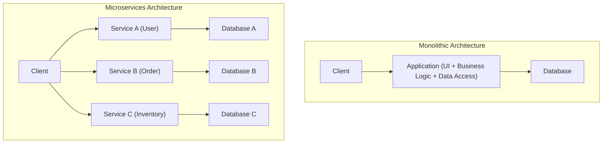
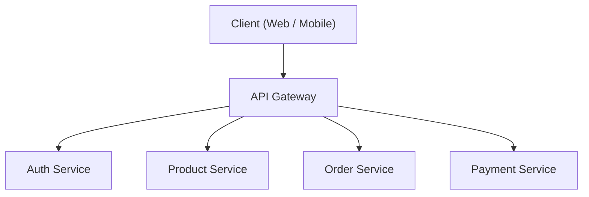
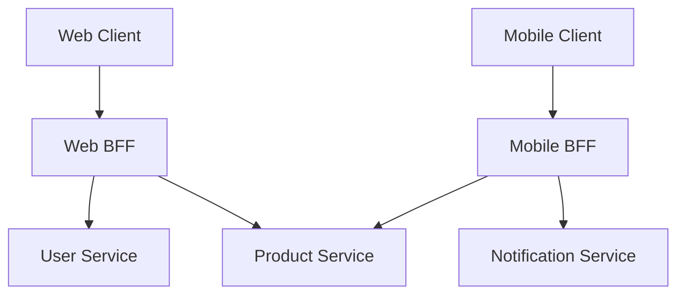

# Light and Shadow of Microservices Architecture (BFF and API Gateway)

In modern software development, **microservices architecture** is increasingly adopted to enhance scalability and development agility. However, splitting a system also creates new complexities.

In this article, starting from the limitations of monolithic architecture, we will deeply explore the benefits brought by microservices and the "shadow" parts behind them (such as operational challenges). Then, we will explain in detail the architecture patterns **API Gateway** and **BFF (Backend for Frontend)**, which solve these challenges, using diagrams and concrete code examples.

---

## 1. Limitations of Monolithic Architecture

**Monolithic architecture** is a method of building all functions of an application (UI, business logic, data access, etc.) as a single codebase and a single process. In the early stages of development, it is a very effective option because it is simple and easy to deploy.

However, as the system grows and the scale of features and development teams expands, the following limitations become apparent.

*   **Bloated and Complex Codebase**: With repeated feature additions, the codebase becomes massive, making it difficult to grasp the whole picture. The risk of one change unexpectedly affecting other features (regression bugs) increases.
*   **Lack of Deployment Flexibility**: Even for a small fix, the entire application needs to be rebuilt and redeployed. This lengthens the deployment lead time and reduces agility.
*   **Scalability Constraints**: Even if only a specific feature (for example, image processing) consumes a large amount of resources, the only way is to scale out the entire application, which deteriorates resource utilization efficiency.
*   **Technology [Stack](https://kenji.blog/en/p/c-language-pointers-memory-management-stack-heap/) [Lock](https://kenji.blog/en/p/rdbms-transaction-acid-isolation-level-lock/)-in**: Because it is a single codebase, it is difficult to partially introduce new languages or frameworks, making it easy to be tied down to older technologies.

To overcome these challenges, many companies consider migrating to a **microservices architecture**.

---

## 2. Benefits of Microservices Architecture

In a **microservices architecture**, an application is designed as a collection of small, independent services (microservices) for each business function. Each service can be deployed independently and typically has its own database.



Microservices have the following light (benefits):

*   **Independent Deployment**: Since each service can be developed and deployed independently, the release cycle can be accelerated.
*   **Individual Scaling**: Only the services with high loads can be individually scaled out, optimizing infrastructure costs.
*   **Technology Diversity (Polyglot)**: You can choose the most suitable programming language and database for each service.
*   **Fault Isolation**: Even if one service goes down, you can prevent the entire system from halting (if there is an appropriate fault-tolerance design).

---

## 3. The "Shadow" of Microservices: Operational Challenges

However, microservices are not a "silver bullet". By decentralizing the system, the "shadow" of complexities unique to [distributed systems](/en/p/cap-theorem-distributed-systems-tradeoff/) follows.

### 3.1. Network Latency and Communication Complexity
Processes that used to be in-memory function calls in a monolith change to communication over the network (HTTP/REST, gRPC, etc.). As a result, **network latency** occurs, risking a slowdown in the overall system response speed. In addition, since networks are always unstable, it is necessary to implement complex communication controls such as timeouts, retry controls, and circuit breakers.

### 3.2. Distributed [Transaction](https://kenji.blog/en/p/rdbms-transaction-acid-isolation-level-lock/)s and Data [Consistency](https://kenji.blog/en/p/cap-theorem-distributed-systems-tradeoff/)
Because each service has its own database, updating data across multiple services (transactions) becomes extremely difficult. The [ACID](https://kenji.blog/en/p/rdbms-transaction-acid-isolation-level-lock/) transactions available in traditional [RDBMS](https://kenji.blog/en/p/rdbms-transaction-acid-isolation-level-lock/) cannot be used, forcing the introduction of complex design patterns that tolerate eventual consistency, such as the **Saga pattern** and **Event Sourcing**.

### 3.3. Complexity of Client Access
When there are tens or hundreds of services, it is unrealistic for clients (web browsers or mobile apps) to know which API endpoints to call and communicate with them individually. Furthermore, it is necessary to send a large number of requests (Chatty API) to multiple services just to display a single screen, leading to a deterioration in performance.

To solve this "complexity of client access," **API Gateway** and **BFF** come into play.

---

## 4. The Intermediary Between Clients and Services: API Gateway

An **API Gateway** is placed between the client and backend microservices, acting as a single entry point (reception desk) for all requests.



### 4.1. Key Roles of an API Gateway
*   **Routing**: Forwards (reverse proxies) requests to the appropriate backend service based on the request path from the client.
*   **Authentication & Authorization**: Centrally verifies tokens (such as JWT) at the Gateway layer, reducing the authentication processing burden on each microservice.
*   **Rate Limiting**: Limits the number of API calls to protect backends from excessive requests.
*   **Protocol Translation**: Performs protocol translation, such as receiving HTTP (REST) from clients and communicating with backends via gRPC.

### 4.2. Challenges of API Gateway (SPOF and Bottlenecks)
Although the API Gateway is extremely powerful, because all traffic is concentrated, there is a risk of it easily becoming a **Single Point of Failure (SPOF)** for the entire system. Also, if too many functions (authentication, translation, parts of business logic, etc.) are crammed into the API Gateway, it becomes a massive monolithic Gateway, resulting in a repeat of the "tragedy of the ESB (Enterprise Service Bus)" that impairs agility.

---

## 5. Optimization for Each Client: BFF (Backend for Frontend) Pattern

Developing the concept of the API Gateway further, the **BFF (Backend for Frontend)** pattern provides an API layer specialized for client requirements.

### 5.1. Concept of the BFF Pattern
Depending on the type of client, such as web browsers, iOS apps, Android apps, or smartwatches, the requirements for the data to be displayed on the screen and network bandwidth vary greatly.

Trying to meet all these requirements with a single API Gateway can make the API too generic, resulting in unnecessary data being included (over-fetching), or conversely, requiring the client to send multiple requests to supplement missing data (under-fetching).

In BFF, a **dedicated backend (BFF) is prepared for each type of client**. The BFF aggregates only the data required by the client's UI into an appropriate format and returns it.

### 5.2. Separation of Web BFF and Mobile BFF

The figure below shows an architecture where separate BFFs are deployed for Web and Mobile.



*   **Web BFF**: Aggregates and returns a rich dataset to be displayed on the wide screen of a PC.
*   **Mobile BFF**: Returns a payload that has been minimized in terms of data volume, taking into account narrow screens and unstable network connections.

In this way, by the UI team themselves developing and maintaining the BFF dedicated to their own clients, it becomes possible to proceed with agile UI development without waiting for the backend team's API changes.

---

## 6. Example of Data Aggregation Implementation in BFF (Node.js × GraphQL)

As a technology stack for BFF, **GraphQL** has gained immense popularity in recent years. Since GraphQL allows the client to specify "only the required data" in a query, it perfectly matches the purpose of BFF.

Here, we will introduce a simple BFF implementation example that aggregates user information and order history APIs using Node.js (Apollo Server).

### Code Example: Data Aggregation using GraphQL

```javascript
// index.js
const { ApolloServer, gql } = require('apollo-server');
const axios = require('axios');

// 1. GraphQL Schema Definition
// Defines the structure of the data required by the client.
const typeDefs = gql`
  type User {
    id: ID!
    name: String!
    email: String!
  }

  type Order {
    id: ID!
    productId: ID!
    amount: Int!
    status: String!
  }

  type UserProfile {
    user: User!
    orders: [Order]!
  }

  type Query {
    # Query to fetch a user's profile and order history at once
    userProfile(userId: ID!): UserProfile
  }
`;

// 2. Resolver Definition (Data aggregation logic)
const resolvers = {
  Query: {
    userProfile: async (_, { userId }) => {
      try {
        // Send concurrent HTTP requests to different microservices (User and Order)
        // By using Promise.all, network wait time is minimized.
        const [userResponse, ordersResponse] = await Promise.all([
          axios.get(\`http://user-service/api/users/\${userId}\`),
          axios.get(\`http://order-service/api/orders?userId=\${userId}\`)
        ]);

        // Combine the fetched data and return it to match the format of the GraphQL schema
        return {
          user: userResponse.data,
          orders: ordersResponse.data
        };
      } catch (error) {
        console.error("Failed to fetch data from microservices", error);
        throw new Error("Failed to fetch user profile data");
      }
    }
  }
};

// 3. Start the Server
const server = new ApolloServer({ typeDefs, resolvers });

server.listen({ port: 4000 }).then(({ url }) => {
  console.log(\`🚀 BFF Server ready at \${url}\`);
});
```

With this implementation, simply by executing one GraphQL query called `userProfile`, the client can simultaneously retrieve data from multiple backend services, namely user information and order history. The number of communications on the client side is drastically reduced, improving performance and developer experience.

---

## 7. Conclusion

Microservices architecture is a powerful approach to evolving a massive system into a scalable form, but it requires facing the "shadow" challenges unique to [distributed systems](/en/p/cap-theorem-distributed-systems-tradeoff/).

As a means to solve these challenges and optimize communication between the client and backend, the **API Gateway** and **BFF pattern** have become indispensable. In particular, the BFF, which provides dedicated endpoints for each type of client, is an excellent architecture that frees the pace of UI evolution from backend constraints.

Depending on your team structure, client diversity, and system scale, let's appropriately design and introduce API Gateway and BFF to build a more robust and highly agile system.
