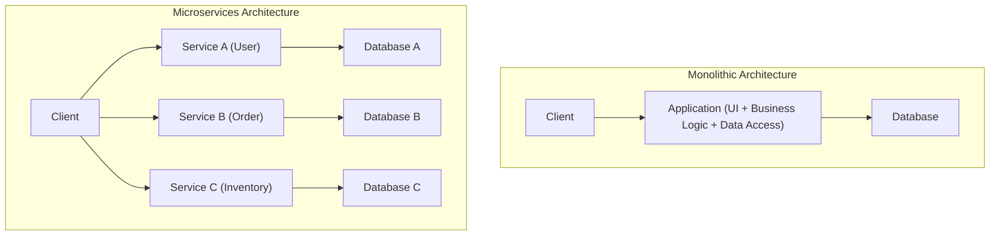
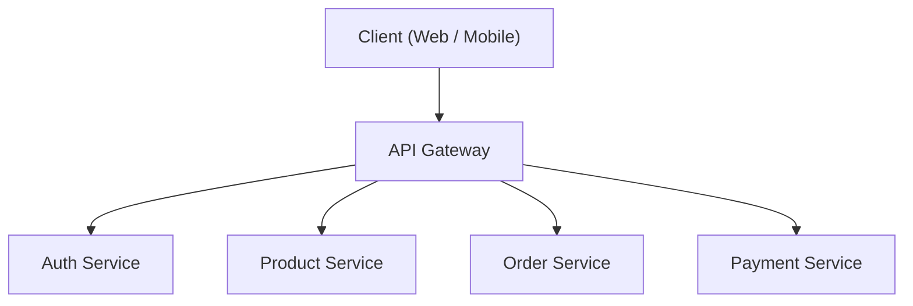
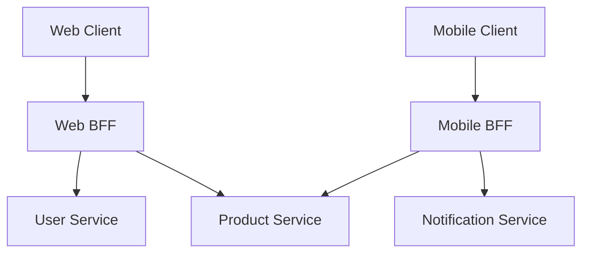

# Luces y sombras de la arquitectura de microservicios (BFF y API Gateway)

En el desarrollo de software moderno, cada vez se adoptan más los **microservicios** (arquitectura de microservicios) para mejorar la escalabilidad y la agilidad de desarrollo. Sin embargo, dividir un sistema también significa crear nuevas complejidades.

En este artículo, profundizaremos en los límites de la arquitectura monolítica, los beneficios que aportan los microservicios y sus "sombras" ocultas (desafíos operativos, etc.). Luego, explicaremos en detalle los patrones de arquitectura **API Gateway** y **BFF (Backend for Frontend)** para resolver estos problemas, utilizando diagramas y ejemplos de código específicos.

---

## 1. Límites de la arquitectura monolítica

La **arquitectura monolítica** es un enfoque en el que todas las funciones de la aplicación (UI, lógica de negocio, acceso a datos, etc.) se construyen como un único proceso de código y base de código. En el desarrollo inicial, es una opción muy eficaz debido a su simplicidad y facilidad de despliegue.

Sin embargo, a medida que el sistema crece y aumenta el tamaño de las funciones y de los equipos de desarrollo, se hacen evidentes los siguientes límites:

*   **Expansión y complejidad del código base** : Al añadir funciones repetidamente, el código base se vuelve enorme y difícil de comprender en su totalidad. Aumenta el riesgo de que un cambio afecte inesperadamente a otra función (errores de regresión).
*   **Falta de flexibilidad en el despliegue** : Incluso para correcciones pequeñas, es necesario reconstruir y redesplegar toda la aplicación. Esto alarga el tiempo de despliegue (lead time) y reduce la agilidad.
*   **Límites de escalabilidad** : Incluso si solo una función específica (por ejemplo, el procesamiento de imágenes) consume muchos recursos, no hay más remedio que escalar toda la aplicación, lo que empeora la eficiencia en el uso de los recursos.
*   **Bloqueo de la pila tecnológica** : Al ser un único código base, es difícil introducir nuevos lenguajes o frameworks de forma parcial, quedando atado a tecnologías antiguas.

Para superar estos desafíos, muchas empresas consideran la transición a una **arquitectura de microservicios**.

---

## 2. Ventajas de la arquitectura de microservicios

En la **arquitectura de microservicios**, la aplicación se diseña como una colección de pequeños servicios independientes (microservicios) agrupados por funciones de negocio. Generalmente, cada servicio se puede desplegar de forma independiente y tiene su propia base de datos.



Los microservicios tienen las siguientes "luces" (ventajas):

*   **Despliegue independiente** : Cada servicio puede ser desarrollado y desplegado independientemente, acelerando el ciclo de lanzamiento.
*   **Escalado individual** : Solo los servicios con alta carga pueden escalarse por separado, optimizando los costos de infraestructura.
*   **Diversidad tecnológica (Polyglot)** : Permite seleccionar el lenguaje de programación y la base de datos óptimos para cada servicio.
*   **Localización de fallos** : Si un servicio cae, se puede evitar que todo el sistema se detenga (si existe un diseño adecuado de tolerancia a fallos).

---

## 3. Las "sombras" de los microservicios: Desafíos operativos

Sin embargo, los microservicios no son una "bala de plata". Al descentralizar el sistema, aparecen las "sombras" inherentes a la complejidad de los sistemas distribuidos.

### 3.1. Latencia de red y complejidad de la comunicación
Lo que antes era una simple llamada de función en la memoria de un monolito, ahora se convierte en una comunicación a través de la red (HTTP/REST, gRPC, etc.). Esto introduce **latencia de red** y el riesgo de disminuir la velocidad de respuesta general del sistema. Además, dado que la red siempre es inestable, es necesario implementar controles de comunicación complejos, como control de tiempo de espera (timeouts), reintentos y disyuntores (circuit breakers).

### 3.2. Transacciones distribuidas e integridad de los datos
Dado que cada servicio tiene su propia base de datos, las actualizaciones de datos que abarcan varios servicios (transacciones) se vuelven muy difíciles. Las transacciones [ACID](https://kenji.blog/es/p/rdbms-transaction-acid-isolation-level-lock/), disponibles en los RDBMS tradicionales, ya no se pueden usar, obligando a introducir patrones de diseño complejos, como el **patrón Saga** o el **Event Sourcing**, que toleran la consistencia eventual (Eventual [Consistency](https://kenji.blog/es/p/cap-theorem-distributed-systems-tradeoff/)).

### 3.3. Complejidad en el acceso desde el cliente
Cuando existen decenas o cientos de servicios, es poco realista que los clientes (navegadores web o aplicaciones móviles) sepan a qué endpoint de API llamar y se comuniquen individualmente. Además, mostrar una sola pantalla podría requerir el envío de numerosas solicitudes a varios servicios (Chatty API), provocando una degradación del rendimiento.

Para resolver esta "complejidad en el acceso desde el cliente", surgen **API Gateway** y **BFF**.

---

## 4. El intermediario entre el cliente y los servicios: API Gateway

Un **API Gateway** se sitúa entre el cliente y el grupo de microservicios en el backend, actuando como un punto de entrada único (ventanilla única) para todas las solicitudes.



### 4.1. Principales roles del API Gateway
*   **Enrutamiento (Routing)** : Reenvía las solicitudes (proxy inverso) al servicio backend adecuado basándose en la ruta de la solicitud del cliente.
*   **Autenticación y autorización** : Centraliza la validación de tokens (como JWT) en la capa Gateway, reduciendo la carga de procesamiento de autenticación en cada microservicio.
*   **Límite de tasa (Rate Limiting)** : Limita el número de llamadas a la API para proteger el backend de un exceso de solicitudes.
*   **Conversión de protocolos** : Convierte protocolos, por ejemplo, aceptando HTTP (REST) del cliente y comunicándose con el backend mediante gRPC.

### 4.2. Desafíos del API Gateway (Punto único de fallo y cuello de botella)
Aunque el API Gateway es muy poderoso, concentra todo el tráfico, lo que lo hace propenso a convertirse en un **punto único de fallo (SPOF)** de todo el sistema. Además, si se sobrecarga el API Gateway con demasiadas funciones (autenticación, conversiones, parte de la lógica de negocio, etc.), puede convertirse en un enorme Gateway monolítico, repitiendo así la "tragedia del ESB (Enterprise Service Bus)", que acaba destruyendo la agilidad.

---

## 5. Optimización por cliente: Patrón BFF (Backend for Frontend)

El patrón **BFF (Backend for Frontend)** desarrolla aún más el concepto de API Gateway al proporcionar una capa de API específica para los requisitos de cada cliente.

### 5.1. Concepto del patrón BFF
Los requisitos de red y los datos a mostrar en pantalla varían enormemente dependiendo del tipo de cliente: navegadores web, aplicaciones iOS, aplicaciones Android o incluso relojes inteligentes.

Intentar satisfacer todos estos requisitos con un único API Gateway puede dar lugar a una API demasiado genérica que devuelva datos innecesarios (over-fetching) o, por el contrario, obligue al cliente a realizar varias solicitudes para completar la información faltante (under-fetching).

En el modelo BFF, **se prepara un backend dedicado (BFF) para cada tipo de cliente**. El BFF procesa (agrega) y devuelve únicamente los datos requeridos por la interfaz de usuario de ese cliente, en el formato adecuado.

### 5.2. Separación de BFF para Web y BFF para Móvil

El siguiente diagrama muestra una arquitectura con BFF separados para web y móvil.



*   **Web BFF** : Agrega y devuelve conjuntos de datos enriquecidos para ser mostrados en las pantallas amplias de las PC.
*   **Mobile BFF** : Teniendo en cuenta las pantallas pequeñas y las redes inestables, devuelve cargas útiles reducidas al mínimo de datos necesarios.

De este modo, si el equipo de interfaz de usuario (UI) desarrolla y mantiene su propio BFF dedicado al cliente, es posible avanzar en un desarrollo de UI ágil sin tener que esperar a los cambios de API por parte del equipo de backend.

---

## 6. Ejemplo de implementación de agregación de datos en un BFF (Node.js × GraphQL)

**GraphQL** ha ganado mucha popularidad recientemente como pila tecnológica para BFF. Dado que GraphQL permite a los clientes especificar en las consultas "solo los datos necesarios", encaja perfectamente con el propósito de un BFF.

A continuación, presentamos un ejemplo sencillo de implementación de un BFF utilizando Node.js (Apollo Server) para agregar una API de información del usuario y del historial de pedidos.

### Ejemplo de código: Agregación de datos mediante GraphQL

```javascript
// index.js
const { ApolloServer, gql } = require('apollo-server');
const axios = require('axios');

// 1. Definición del esquema GraphQL
// Define la estructura de los datos que el cliente necesita.
const typeDefs = gql`
  type User {
    id: ID!
    name: String!
    email: String!
  }

  type Order {
    id: ID!
    productId: ID!
    amount: Int!
    status: String!
  }

  type UserProfile {
    user: User!
    orders: [Order]!
  }

  type Query {
    # Consulta para obtener el perfil de usuario y el historial de pedidos a la vez
    userProfile(userId: ID!): UserProfile
  }
`;

// 2. Definición de resolvers (Lógica de agregación de datos)
const resolvers = {
  Query: {
    userProfile: async (_, { userId }) => {
      try {
        // Envía solicitudes HTTP paralelas a diferentes microservicios (User y Order)
        // Usar Promise.all minimiza el tiempo de espera de la red.
        const [userResponse, ordersResponse] = await Promise.all([
          axios.get(\`http://user-service/api/users/\${userId}\`),
          axios.get(\`http://order-service/api/orders?userId=\${userId}\`)
        ]);

        // Combina los datos obtenidos y los devuelve según el formato del esquema GraphQL
        return {
          user: userResponse.data,
          orders: ordersResponse.data
        };
      } catch (error) {
        console.error("Error al obtener datos de los microservicios", error);
        throw new Error("Error al obtener los datos del perfil de usuario");
      }
    }
  }
};

// 3. Inicio del servidor
const server = new ApolloServer({ typeDefs, resolvers });

server.listen({ port: 4000 }).then(({ url }) => {
  console.log(\`🚀 Servidor BFF listo en \${url}\`);
});
```

Con esta implementación, el cliente solo necesita ejecutar una consulta GraphQL (`userProfile`) para obtener simultáneamente los datos de múltiples servicios backend: información del usuario y su historial de pedidos. El número de comunicaciones en el lado del cliente se reduce drásticamente, mejorando el rendimiento y la experiencia de desarrollo.

---

## 7. Conclusión

La arquitectura de microservicios es un enfoque poderoso para evolucionar grandes sistemas de una forma escalable, pero exige hacer frente a los desafíos ("sombras") inherentes a los sistemas distribuidos.

Para resolver estos problemas y optimizar la comunicación entre el cliente y el backend, patrones como **API Gateway** y **BFF** se han vuelto indispensables. En particular, el modelo BFF, que proporciona endpoints dedicados para cada tipo de cliente, es una arquitectura excelente para liberar la velocidad de evolución de la interfaz de usuario de las restricciones del backend.

Diseñando e implementando adecuadamente API Gateway y BFF de acuerdo a la estructura de su equipo, la diversidad de los clientes y la escala de su sistema, podremos construir un sistema más robusto y de gran agilidad.
