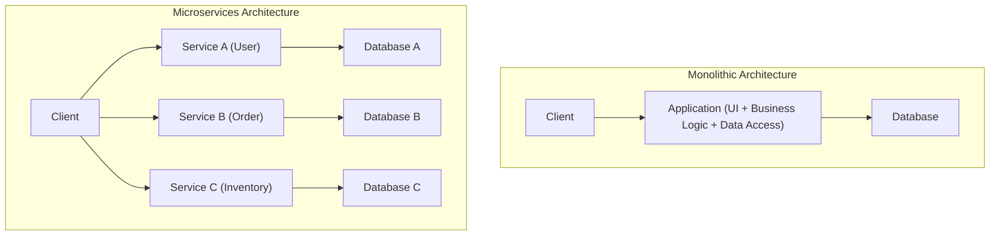
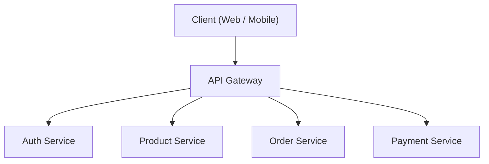
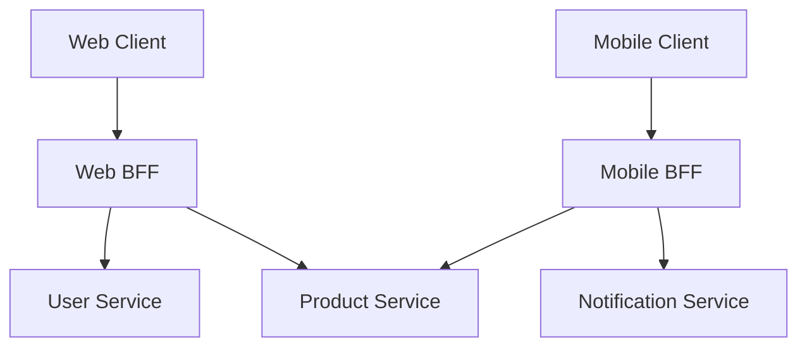

# L'ombre et la lumière de l'architecture microservices (BFF et API Gateway)

Dans le développement logiciel moderne, l'**architecture microservices** est de plus en plus adoptée pour améliorer la scalabilité et l'agilité du développement. Cependant, diviser un système crée également de nouvelles complexités.

Cet article commence par les limites de l'architecture monolithique et explore en profondeur les avantages apportés par les microservices, ainsi que les « ombres » qui se cachent derrière (telles que les défis opérationnels). Ensuite, nous expliquerons en détail les modèles d'architecture **API Gateway** et **BFF (Backend for Frontend)**, qui permettent de résoudre ces problèmes, à l'aide de schémas et d'exemples de code concrets.

---

## 1. Les limites de l'architecture monolithique

L'**architecture monolithique** est une approche où toutes les fonctionnalités d'une application (interface utilisateur, logique métier, accès aux données, etc.) sont construites comme une base de code unique et un processus unique. Lors des premières phases de développement, c'est une option très efficace car elle est simple et facile à déployer.

Cependant, à mesure que le système se développe et que la taille des fonctionnalités et des équipes de développement augmente, les limites suivantes apparaissent.

*   **Grossissement et complexification de la base de code** : L'ajout répété de fonctionnalités rend la base de code énorme, ce qui rend difficile la compréhension de l'ensemble. Le risque qu'une seule modification affecte des fonctionnalités inattendues (régressions) augmente.
*   **Manque de flexibilité de déploiement** : Même pour une petite correction, l'ensemble de l'application doit être reconstruit et redéployé. Cela allonge les délais de déploiement et réduit l'agilité.
*   **Limites de scalabilité** : Même si seule une fonctionnalité spécifique (par exemple, le traitement d'images) consomme beaucoup de ressources, il est nécessaire de faire évoluer l'ensemble de l'application (scale-out), ce qui entraîne une mauvaise efficacité d'utilisation des ressources.
*   **Fixation de la pile technologique** : En raison de la base de code unique, il est difficile d'introduire partiellement de nouveaux langages ou frameworks, ce qui rend les équipes dépendantes de technologies anciennes.

Pour surmonter ces défis, de nombreuses entreprises envisagent de passer à une **architecture microservices**.

---

## 2. Les avantages de l'architecture microservices

Dans l'**architecture microservices**, l'application est conçue comme un ensemble de petits services indépendants (microservices) pour chaque fonction métier. Chaque service peut être déployé indépendamment et possède généralement sa propre base de données.



Les microservices offrent la lumière (avantages) suivante :

*   **Déploiement indépendant** : Chaque service peut être développé et déployé indépendamment, ce qui permet d'accélérer les cycles de publication.
*   **Mise à l'échelle individuelle** : Seuls les services soumis à une forte charge peuvent être mis à l'échelle individuellement (scale-out), ce qui optimise les coûts d'infrastructure.
*   **Diversité technologique (Polyglot)** : Le langage de programmation et la base de données optimaux peuvent être sélectionnés pour chaque service.
*   **Localisation des pannes** : Même si un service tombe en panne, le système dans son ensemble peut être empêché de s'arrêter (si une conception appropriée de tolérance aux pannes est en place).

---

## 3. Les « ombres » des microservices : Les défis opérationnels

Cependant, les microservices ne sont pas une « solution miracle ». La décentralisation du système s'accompagne d'« ombres », à savoir des complexités propres aux systèmes distribués.

### 3.1. Latence du réseau et complexité des communications
Les traitements qui étaient résolus par des appels de fonctions en mémoire dans un monolithe sont remplacés par des communications via le réseau (HTTP/REST, gRPC, etc.). Cela génère de la **latence réseau** et risque de ralentir le temps de réponse global du système. De plus, le réseau étant toujours instable, il est nécessaire d'implémenter des contrôles de communication complexes tels que des délais d'attente (timeouts), des contrôles de nouvelles tentatives (retries) et des disjoncteurs (circuit breakers).

### 3.2. [Transaction](https://kenji.blog/fr/p/rdbms-transaction-acid-isolation-level-lock/)s distribuées et cohérence des données
Comme chaque service possède sa propre base de données, la mise à jour de données impliquant plusieurs services (transactions) devient extrêmement difficile. Les transactions [ACID](https://kenji.blog/fr/p/rdbms-transaction-acid-isolation-level-lock/), disponibles dans les SGBDR traditionnels, ne peuvent pas être utilisées, ce qui oblige à introduire des modèles de conception complexes tolérant une cohérence à terme (Eventual [Consistency](https://kenji.blog/fr/p/cap-theorem-distributed-systems-tradeoff/)), tels que le **modèle Saga** ou l'**Event Sourcing**.

### 3.3. Complexité de l'accès par les clients
Lorsqu'il existe des dizaines ou des centaines de services, il est irréaliste pour le client (navigateur Web ou application mobile) de savoir quel point de terminaison d'API appeler et de communiquer individuellement avec chacun d'eux. De plus, pour afficher un seul écran, il est nécessaire d'envoyer un grand nombre de requêtes à plusieurs services (Chatty API), ce qui entraîne une dégradation des performances.

C'est pour résoudre cette « complexité de l'accès par les clients » que sont apparus **API Gateway** et **BFF**.

---

## 4. L'intermédiaire entre le client et les services : API Gateway

L'**API Gateway** est placée entre le client et les microservices d'arrière-plan, et sert de point d'entrée unique (guichet) pour toutes les requêtes.



### 4.1. Principaux rôles de l'API Gateway
*   **Routage** : Transfère (reverse proxy) la requête vers le service d'arrière-plan approprié en fonction du chemin de la requête du client.
*   **Authentification et autorisation** : Vérifie les jetons (JWT, etc.) de manière centralisée dans la couche Gateway, réduisant ainsi la charge de traitement d'authentification de chaque microservice.
*   **Limitation de débit (Rate limiting)** : Limite le nombre d'appels d'API pour protéger les services d'arrière-plan contre des requêtes excessives.
*   **Conversion de protocole** : Effectue des conversions de protocole, par exemple, en acceptant le HTTP (REST) du client et en communiquant avec l'arrière-plan via gRPC.

### 4.2. Les défis de l'API Gateway (Point de défaillance unique et goulot d'étranglement)
Bien que l'API Gateway soit très puissante, comme tout le trafic s'y concentre, elle risque facilement de devenir un **point de défaillance unique (SPOF)** pour l'ensemble du système. De plus, si on y intègre trop de fonctionnalités (authentification, conversion, partie de la logique métier, etc.), elle se transforme en une Gateway monolithique massive, répétant ainsi la « tragédie de l'ESB (Enterprise Service Bus) » qui finit par compromettre l'agilité.

---

## 5. Optimisation par client : Le modèle BFF (Backend for Frontend)

Le modèle **BFF (Backend for Frontend)** pousse le concept d'API Gateway plus loin en offrant une couche d'API spécifiquement adaptée aux besoins du client.

### 5.1. Concept du modèle BFF
Selon le type de client (navigateur Web, application iOS, application Android, ou encore montre connectée), les données à afficher à l'écran et les exigences en matière de bande passante réseau varient considérablement.

Essayer de satisfaire toutes ces exigences avec une API Gateway unique rend l'API trop générique. Cela inclura des données inutiles (sur-récupération ou overfetching), ou à l'inverse, obligera le client à envoyer plusieurs requêtes pour compléter les données manquantes (sous-récupération ou underfetching).

Dans le modèle BFF, on prépare un **backend dédié (BFF) pour chaque type de client**. Le BFF traite et agrège les données requises uniquement pour l'interface utilisateur de ce client, et les renvoie dans le format approprié.

### 5.2. Séparation du BFF pour le Web et du BFF pour le Mobile

Le schéma ci-dessous illustre une architecture où des BFF distincts sont déployés pour le Web et le mobile.



*   **BFF Web** : Agrège et renvoie un ensemble de données riche pour un affichage sur les grands écrans de PC.
*   **BFF Mobile** : Tient compte des écrans étroits et des connexions réseau instables, en renvoyant une charge utile où la quantité de données est réduite au minimum.

De cette façon, l'équipe en charge de l'UI peut développer et maintenir son propre BFF dédié à son client, ce qui permet de faire avancer le développement de l'UI de manière agile sans devoir attendre que l'équipe backend modifie l'API.

---

## 6. Exemple d'implémentation d'agrégation de données dans un BFF (Node.js × GraphQL)

**GraphQL** est une pile technologique devenue très populaire ces dernières années pour les BFF. GraphQL correspond parfaitement aux objectifs du BFF, car il permet au client de spécifier exactement « les données nécessaires » dans sa requête.

Voici un exemple simple d'implémentation d'un BFF à l'aide de Node.js (Apollo Server) pour agréger les API des informations utilisateur et de l'historique des commandes.

### Exemple de code : Agrégation de données avec GraphQL

```javascript
// index.js
const { ApolloServer, gql } = require('apollo-server');
const axios = require('axios');

// 1. Définition du schéma GraphQL
// Définit la structure des données dont le client a besoin.
const typeDefs = gql`
  type User {
    id: ID!
    name: String!
    email: String!
  }

  type Order {
    id: ID!
    productId: ID!
    amount: Int!
    status: String!
  }

  type UserProfile {
    user: User!
    orders: [Order]!
  }

  type Query {
    # Requête pour récupérer simultanément le profil utilisateur et l'historique des commandes
    userProfile(userId: ID!): UserProfile
  }
`;

// 2. Définition des résolveurs (Logique d'agrégation des données)
const resolvers = {
  Query: {
    userProfile: async (_, { userId }) => {
      try {
        // Envoi de requêtes HTTP parallèles vers différents microservices (User et Order)
        // L'utilisation de Promise.all minimise le temps d'attente du réseau.
        const [userResponse, ordersResponse] = await Promise.all([
          axios.get(\`http://user-service/api/users/\${userId}\`),
          axios.get(\`http://order-service/api/orders?userId=\${userId}\`)
        ]);

        // Combinaison des données récupérées et retour selon le format du schéma GraphQL
        return {
          user: userResponse.data,
          orders: ordersResponse.data
        };
      } catch (error) {
        console.error("Échec de la récupération des données depuis les microservices", error);
        throw new Error("Échec de la récupération des données du profil utilisateur");
      }
    }
  }
};

// 3. Démarrage du serveur
const server = new ApolloServer({ typeDefs, resolvers });

server.listen({ port: 4000 }).then(({ url }) => {
  console.log(\`🚀 Serveur BFF prêt à l'adresse \${url}\`);
});
```

Avec cette implémentation, le client peut récupérer simultanément les données de plusieurs services d'arrière-plan, telles que les informations utilisateur et l'historique des commandes, en effectuant une seule requête GraphQL `userProfile`. Le nombre de communications côté client est considérablement réduit, ce qui améliore les performances et l'expérience de développement.

---

## 7. Conclusion

L'architecture microservices est une approche puissante pour faire évoluer de grands systèmes de manière extensible, mais il est nécessaire de faire face aux défis obscurs (« l'ombre ») inhérents aux systèmes distribués.

Pour résoudre ces problèmes et optimiser la communication entre le client et l'arrière-plan, les modèles **API Gateway** et **BFF** sont devenus indispensables. Le BFF, en particulier, qui fournit des points de terminaison dédiés pour chaque type de client, est une excellente architecture qui libère la vitesse d'évolution de l'UI des contraintes de l'arrière-plan.

En fonction de la structure de votre équipe, de la diversité de vos clients et de la taille de votre système, concevez et mettez en œuvre de manière appropriée l'API Gateway et le BFF, et construisez des systèmes plus robustes et plus agiles.
