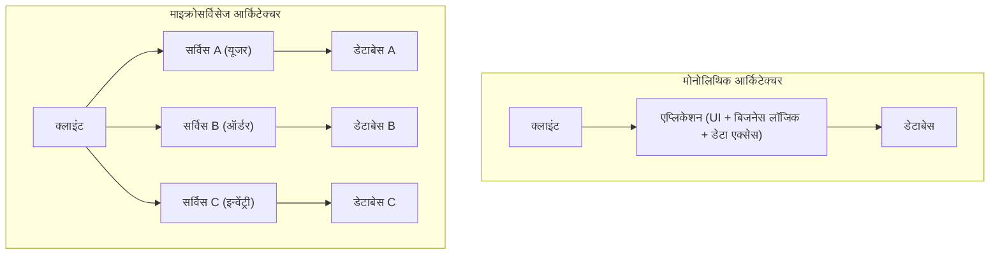
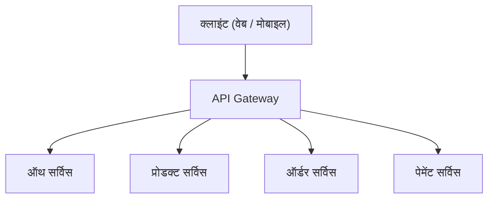
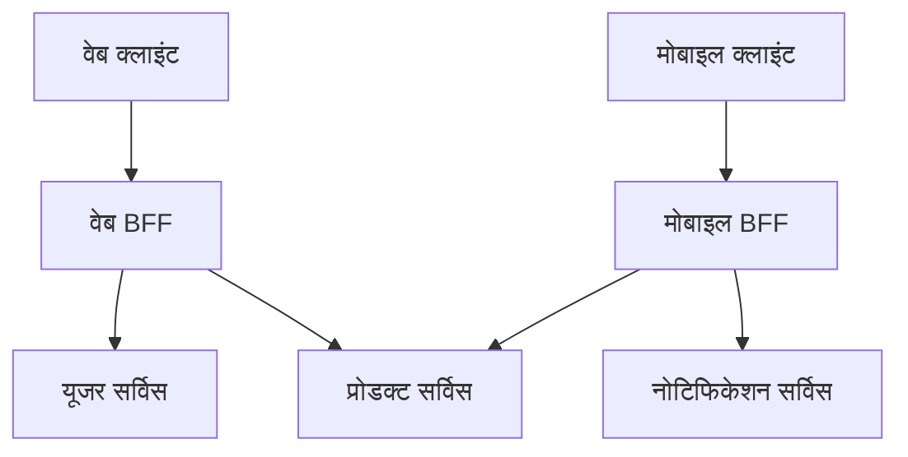

# माइक्रोसर्विसेज आर्किटेक्चर के प्रकाश और अंधकार (BFF और API Gateway)

आधुनिक सॉफ्टवेयर विकास में, स्केलेबिलिटी और विकास की चपलता को बढ़ाने के लिए **माइक्रोसर्विसेज आर्किटेक्चर** का उपयोग करने के मामले बढ़ रहे हैं। हालाँकि, सिस्टम को विभाजित करना भी नई जटिलताओं को जन्म देना है।

इस लेख में, हम मोनोलिथिक आर्किटेक्चर की सीमाओं से शुरू करते हुए, माइक्रोसर्विसेज द्वारा प्रदान किए जाने वाले लाभों और इसके पीछे के "अंधकार" वाले हिस्सों (जैसे परिचालन संबंधी चुनौतियां) का गहराई से पता लगाएंगे। फिर, हम आरेखों और विशिष्ट कोड उदाहरणों के साथ इन चुनौतियों को हल करने के लिए आर्किटेक्चरल पैटर्न, **API Gateway** और **BFF (Backend for Frontend)** के बारे में विस्तार से बताएंगे।

---

## 1. मोनोलिथिक आर्किटेक्चर की सीमाएं

**मोनोलिथिक आर्किटेक्चर** एप्लिकेशन के सभी कार्यों (UI, बिजनेस लॉजिक, डेटा एक्सेस, आदि) को सिंगल कोडबेस और सिंगल प्रोसेस के रूप में बनाने का एक तरीका है। प्रारंभिक विकास में, यह एक बहुत ही प्रभावी विकल्प होता है क्योंकि यह सरल और तैनात (deploy) करने में आसान है।

हालाँकि, जैसे-जैसे सिस्टम बढ़ता है और सुविधाओं तथा विकास टीमों का पैमाना बढ़ता है, निम्नलिखित सीमाएं दिखाई देने लगती हैं:

*   **कोडबेस का बढ़ना और जटिल होना** : सुविधाओं को बार-बार जोड़ने से कोडबेस विशाल हो जाता है, जिससे पूरी तस्वीर को समझना मुश्किल हो जाता है। यह जोखिम (रिग्रेशन बग) बढ़ जाता है कि एक बदलाव अप्रत्याशित रूप से अन्य सुविधाओं को प्रभावित करेगा।
*   **डिप्लॉयमेंट में लचीलेपन की कमी** : छोटे सुधारों के लिए भी, पूरे एप्लिकेशन को फिर से बनाना और फिर से डिप्लॉय करना आवश्यक होता है। इससे डिप्लॉयमेंट का लीड टाइम बढ़ जाता है और चपलता कम हो जाती है।
*   **स्केलेबिलिटी की सीमाएं** : यदि केवल कोई विशिष्ट सुविधा (उदाहरण के लिए, इमेज प्रोसेसिंग सुविधा) बड़ी मात्रा में संसाधनों की खपत करती है, तो भी पूरे एप्लिकेशन को स्केल आउट करने के अलावा कोई विकल्प नहीं होता है, जिससे संसाधन उपयोग दक्षता खराब हो जाती है।
*   **टेक्नोलॉजी स्टैक का फिक्स होना** : सिंगल कोडबेस होने के कारण, नई भाषाओं या फ्रेमवर्क को आंशिक रूप से पेश करना मुश्किल होता है, और पुरानी तकनीकों से बंधे रहना आसान हो जाता है।

इन चुनौतियों को दूर करने के लिए, कई कंपनियां **माइक्रोसर्विसेज आर्किटेक्चर** में जाने पर विचार कर रही हैं।

---

## 2. माइक्रोसर्विसेज आर्किटेक्चर के लाभ

**माइक्रोसर्विसेज आर्किटेक्चर** में, एप्लिकेशन को व्यावसायिक कार्यों के आधार पर स्वतंत्र छोटी सेवाओं (माइक्रोसर्विसेज) के संग्रह के रूप में डिज़ाइन किया गया है। प्रत्येक सेवा को स्वतंत्र रूप से डिप्लॉय किया जा सकता है और आमतौर पर इसका अपना डेटाबेस होता है।



माइक्रोसर्विसेज में निम्नलिखित प्रकाश (लाभ) हैं:

*   **स्वतंत्र डिप्लॉयमेंट** : प्रत्येक सेवा को स्वतंत्र रूप से विकसित और डिप्लॉय किया जा सकता है, जिससे रिलीज़ चक्र में तेज़ी आती है।
*   **अलग स्केलिंग** : उच्च लोड वाली सेवाओं को व्यक्तिगत रूप से स्केल आउट किया जा सकता है, जिससे इन्फ्रास्ट्रक्चर लागत को अनुकूलित किया जा सकता है।
*   **तकनीकी विविधता (Polyglot)** : प्रत्येक सेवा के लिए इष्टतम प्रोग्रामिंग भाषा और डेटाबेस चुना जा सकता है।
*   **खराबी का स्थानीयकरण** : भले ही एक सेवा बंद हो जाए, यह पूरे सिस्टम को रुकने से रोक सकता है (यदि उचित फॉल्ट टॉलरेंस डिज़ाइन मौजूद है)।

---

## 3. माइक्रोसर्विसेज का "अंधकार": परिचालन संबंधी चुनौतियां

हालाँकि, माइक्रोसर्विसेज कोई "सिल्वर बुलेट" नहीं हैं। सिस्टम को विकेंद्रीकृत करके, वितरित सिस्टम के लिए विशिष्ट जटिलता का "अंधकार" हमेशा बना रहता है।

### 3.1. नेटवर्क लेटेंसी और संचार की जटिलता
मोनोलिथ में, मेमोरी के भीतर एक फंक्शन कॉल द्वारा संभाली जाने वाली प्रक्रिया नेटवर्क के पार संचार (HTTP/REST, gRPC, आदि) में बदल जाती है। इसके परिणामस्वरूप **नेटवर्क लेटेंसी** होती है, जिससे समग्र सिस्टम प्रतिक्रिया गति कम होने का जोखिम होता है। इसके अलावा, चूंकि नेटवर्क हमेशा अस्थिर होते हैं, इसलिए टाइमआउट, रिट्राई कंट्रोल और सर्किट ब्रेकर जैसे जटिल संचार नियंत्रणों को लागू करना आवश्यक है।

### 3.2. डिस्ट्रीब्यूटेड ट्रांजेक्शन और डेटा कंसिस्टेंसी
चूंकि प्रत्येक सेवा का अपना डेटाबेस होता है, इसलिए कई सेवाओं में डेटा (ट्रांजेक्शन) को अपडेट करना बहुत मुश्किल हो जाता है। पारंपरिक [RDBMS](https://kenji.blog/hi/p/rdbms-transaction-acid-isolation-level-lock/) में उपलब्ध ACID ट्रांजेक्शन का उपयोग नहीं किया जा सकता है, और इसके बजाय, **Saga पैटर्न** और **इवेंट सोर्सिंग** जैसे जटिल डिज़ाइन पैटर्न पेश करने होंगे जो परिणामी निरंतरता (Eventual [Consistency](https://kenji.blog/hi/p/cap-theorem-distributed-systems-tradeoff/)) की अनुमति देते हैं।

### 3.3. क्लाइंट की ओर से एक्सेस की जटिलता
जब दर्जनों या सैकड़ों सेवाएं मौजूद होती हैं, तो क्लाइंट (वेब ​​ब्राउज़र और मोबाइल ऐप) के लिए यह जानना अव्यावहारिक है कि कौन से API एंडपॉइंट को कॉल करना है और व्यक्तिगत रूप से संचार करना है। साथ ही, एक ही स्क्रीन को प्रदर्शित करने के लिए कई सेवाओं को बड़ी संख्या में अनुरोध (Chatty API) भेजना आवश्यक है, जिससे प्रदर्शन में गिरावट आती है।

इस "क्लाइंट की ओर से एक्सेस की जटिलता" को हल करने के लिए **API Gateway** और **BFF** सामने आते हैं।

---

## 4. क्लाइंट और सेवाओं के बीच मध्यस्थ: API Gateway

**API Gateway** को क्लाइंट और बैकएंड माइक्रोसर्विसेज के बीच रखा जाता है, और यह सभी अनुरोधों के लिए सिंगल एंट्री पॉइंट (रिसेप्शन डेस्क) के रूप में कार्य करता है।



### 4.1. API Gateway की मुख्य भूमिकाएं
*   **राउटिंग** : क्लाइंट से अनुरोध पथ के आधार पर उचित बैकएंड सेवा (रिवर्स प्रॉक्सी) पर अनुरोध को अग्रेषित करता है।
*   **प्रमाणीकरण/प्राधिकरण** : गेटवे परत पर केंद्रीय रूप से टोकन (जैसे JWT) को मान्य करता है, प्रत्येक माइक्रोसर्विस पक्ष पर प्रमाणीकरण प्रक्रिया के बोझ को कम करता है।
*   **रेट लिमिट (प्रवाह नियंत्रण)** : अत्यधिक अनुरोधों से बैकएंड की रक्षा करने के लिए API कॉल्स की संख्या को सीमित करता है।
*   **प्रोटोकॉल रूपांतरण** : प्रोटोकॉल को परिवर्तित करता है, जैसे क्लाइंट से HTTP (REST) ​​के माध्यम से स्वीकार करना और gRPC के माध्यम से बैकएंड के साथ संचार करना।

### 4.2. API Gateway की चुनौतियां (विफलता का एकल बिंदु और अड़चन)
API Gateway बहुत शक्तिशाली है, लेकिन चूंकि सारा ट्रैफ़िक एक जगह केंद्रित होता है, इसलिए यह पूरे सिस्टम की **विफलता का एकल बिंदु (SPOF)** बनने का जोखिम उठाता है। इसके अलावा, यदि आप API Gateway में बहुत सारी कार्यक्षमता (प्रमाणीकरण, रूपांतरण, व्यवसाय तर्क के कुछ हिस्से, आदि) पैक करते हैं, तो यह एक विशाल मोनोलिथिक गेटवे बन जाएगा, और परिणामस्वरूप आप "ESB (एंटरप्राइज सर्विस बस) की त्रासदी" को दोहराएंगे जो चपलता को कम कर देती है।

---

## 5. प्रति-क्लाइंट अनुकूलन: BFF (Backend for Frontend) पैटर्न

API Gateway की अवधारणा को और विकसित करते हुए, **BFF (Backend for Frontend)** पैटर्न एक API परत प्रदान करता है जो क्लाइंट की आवश्यकताओं के लिए विशिष्ट है।

### 5.1. BFF पैटर्न की अवधारणा
क्लाइंट के प्रकार, जैसे वेब ब्राउज़र, iOS ऐप, एंड्रॉइड ऐप या स्मार्टवॉच के आधार पर स्क्रीन पर प्रदर्शित किए जाने वाले डेटा और नेटवर्क बैंडविड्थ की आवश्यकताएं काफी भिन्न होती हैं।

यदि आप एक ही API Gateway के साथ इन सभी आवश्यकताओं को पूरा करने का प्रयास करते हैं, तो API बहुत सामान्य हो जाएगा और इसमें अनावश्यक डेटा (ओवरफेच) शामिल होगा, या इसके विपरीत, लापता डेटा (अंडरफेच) को पूरा करने के लिए क्लाइंट को कई बार अनुरोध भेजने की आवश्यकता होगी।

BFF में, हम **प्रत्येक प्रकार के क्लाइंट के लिए एक समर्पित बैकएंड (BFF) तैयार करते हैं**। BFF केवल उस डेटा को संसाधित (एकत्र) करता है और लौटाता है जिसकी उस क्लाइंट के UI को उचित प्रारूप में आवश्यकता होती है।

### 5.2. वेब BFF और मोबाइल BFF का अलगाव

नीचे दिया गया चित्र एक आर्किटेक्चर है जहां वेब और मोबाइल के लिए अलग-अलग BFF तैनात किए गए हैं।



*   **वेब BFF** : PC की विस्तृत स्क्रीन पर प्रदर्शित करने के लिए एक समृद्ध डेटासेट एकत्र करता है और लौटाता है।
*   **मोबाइल BFF** : संकीर्ण स्क्रीन और अस्थिर नेटवर्क कनेक्शन को ध्यान में रखते हुए, यह एक पेलोड देता है जिसमें डेटा की मात्रा न्यूनतम कर दी जाती है।

इस तरह, UI टीम स्वयं अपने क्लाइंट-विशिष्ट BFF को विकसित और बनाए रखती है, जिससे वे बैकएंड टीम के API परिवर्तनों की प्रतीक्षा किए बिना फुर्तीली UI विकास के साथ आगे बढ़ सकते हैं।

---

## 6. BFF में डेटा एग्रीगेशन कार्यान्वयन उदाहरण (Node.js × GraphQL)

**GraphQL** हाल के वर्षों में BFF के लिए टेक्नोलॉजी स्टैक के रूप में काफी लोकप्रिय हो रहा है। GraphQL BFF के उद्देश्य से पूरी तरह मेल खाता है क्योंकि यह क्लाइंट को क्वेरी में "केवल आवश्यक डेटा" निर्दिष्ट करने की अनुमति देता है।

यहां, हम एक साधारण BFF का कार्यान्वयन उदाहरण प्रस्तुत करते हैं जो Node.js (Apollo Server) का उपयोग करके उपयोगकर्ता की जानकारी और ऑर्डर इतिहास API को एकत्रित करता है।

### कोड उदाहरण: GraphQL का उपयोग करके डेटा एग्रीगेशन

```javascript
// index.js
const { ApolloServer, gql } = require('apollo-server');
const axios = require('axios');

// 1. GraphQL स्कीमा की परिभाषा
// क्लाइंट के लिए आवश्यक डेटा की संरचना को परिभाषित करता है।
const typeDefs = gql`
  type User {
    id: ID!
    name: String!
    email: String!
  }

  type Order {
    id: ID!
    productId: ID!
    amount: Int!
    status: String!
  }

  type UserProfile {
    user: User!
    orders: [Order]!
  }

  type Query {
    # एक ही बार में यूजर प्रोफाइल और ऑर्डर इतिहास प्राप्त करने के लिए क्वेरी
    userProfile(userId: ID!): UserProfile
  }
`;

// 2. रिज़ॉल्वर की परिभाषा (डेटा एग्रीगेशन का लॉजिक)
const resolvers = {
  Query: {
    userProfile: async (_, { userId }) => {
      try {
        // विभिन्न माइक्रोसर्विसेज (User और Order) पर समानांतर में HTTP अनुरोध भेजें
        // Promise.all का उपयोग करके, नेटवर्क प्रतीक्षा समय को कम किया जाता है।
        const [userResponse, ordersResponse] = await Promise.all([
          axios.get(\`http://user-service/api/users/\${userId}\`),
          axios.get(\`http://order-service/api/orders?userId=\${userId}\`)
        ]);

        // प्राप्त डेटा को मिलाएं और GraphQL स्कीमा प्रारूप के अनुसार वापस करें
        return {
          user: userResponse.data,
          orders: ordersResponse.data
        };
      } catch (error) {
        console.error("माइक्रोसर्विसेज से डेटा प्राप्त करने में विफल", error);
        throw new Error("यूजर प्रोफाइल डेटा प्राप्त करने में विफल");
      }
    }
  }
};

// 3. सर्वर स्टार्ट करना
const server = new ApolloServer({ typeDefs, resolvers });

server.listen({ port: 4000 }).then(({ url }) => {
  console.log(\`🚀 BFF Server ready at \${url}\`);
});
```

इस कार्यान्वयन के साथ, क्लाइंट केवल एक GraphQL क्वेरी `userProfile` भेजकर कई बैकएंड सेवाओं (उपयोगकर्ता की जानकारी और ऑर्डर इतिहास) से एक साथ डेटा प्राप्त कर सकते हैं। क्लाइंट-साइड संचार की संख्या नाटकीय रूप से कम हो जाती है, जिससे प्रदर्शन और विकास अनुभव में सुधार होता है।

---

## 7. निष्कर्ष

माइक्रोसर्विसेज आर्किटेक्चर विशाल सिस्टम को स्केलेबल रूप में विकसित करने के लिए एक शक्तिशाली दृष्टिकोण है, लेकिन इसके साथ आपको वितरित सिस्टम की विशिष्ट "अंधकार" जैसी चुनौतियों का सामना करने की आवश्यकता है।

इन चुनौतियों को हल करने और क्लाइंट और बैकएंड के बीच संचार को अनुकूलित करने के साधन के रूप में **API Gateway** और **BFF पैटर्न** अपरिहार्य हो गए हैं। विशेष रूप से, BFF जो प्रत्येक प्रकार के क्लाइंट के लिए समर्पित एंडपॉइंट प्रदान करता है, एक उत्कृष्ट आर्किटेक्चर है जो UI विकास की गति को बैकएंड की बाधाओं से मुक्त करता है।

आइए अपनी टीम की संरचना, क्लाइंट की विविधता और सिस्टम के पैमाने के अनुसार API Gateway और BFF को उचित रूप से डिज़ाइन और पेश करके अधिक मजबूत और चुस्त सिस्टम का निर्माण करें।
