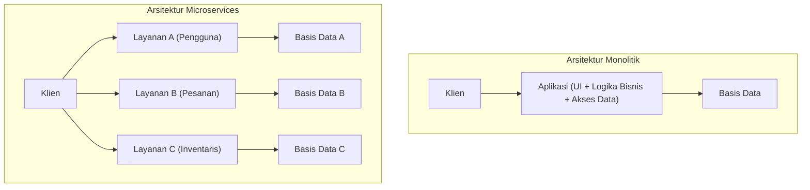
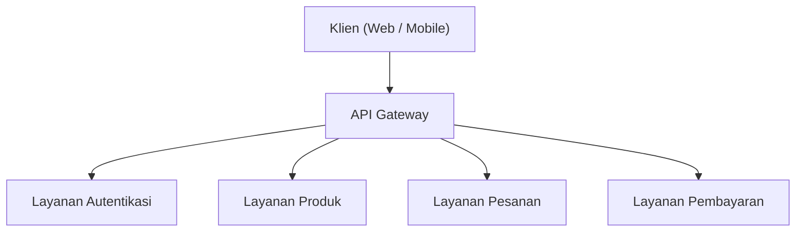
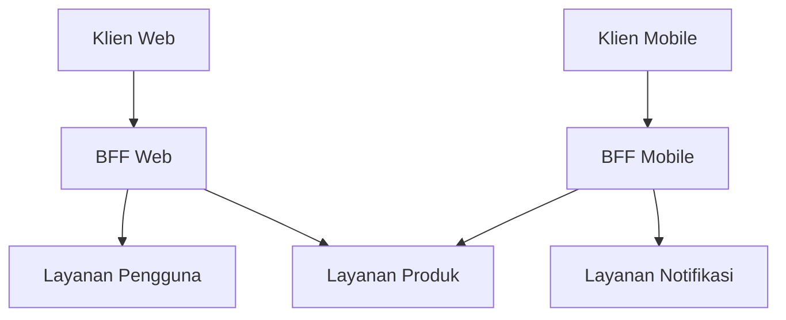

# Cahaya dan Bayangan Arsitektur Microservices (BFF dan API Gateway)

Dalam pengembangan perangkat lunak modern, **Arsitektur Microservices** semakin banyak diadopsi untuk meningkatkan skalabilitas dan kelincahan pengembangan. Namun, membagi sistem juga berarti menciptakan kompleksitas baru.

Artikel ini akan menggali lebih dalam, mulai dari keterbatasan arsitektur monolitik hingga manfaat yang dibawa oleh microservices dan sisi "bayangan" di baliknya (seperti tantangan operasional). Kemudian, kita akan membahas secara detail pola arsitektur untuk menyelesaikan tantangan tersebut, yaitu **API Gateway** dan **BFF (Backend for Frontend)**, dengan dilengkapi diagram dan contoh kode yang spesifik.

---

## 1. Keterbatasan Arsitektur Monolitik

**Arsitektur Monolitik** adalah pendekatan di mana seluruh fungsi aplikasi (UI, logika bisnis, akses data, dll.) dibangun sebagai satu basis kode (codebase) dan satu proses tunggal. Pada awal pengembangan, ini adalah pilihan yang sangat efektif karena sederhana dan mudah untuk di-deploy.

Namun, seiring pertumbuhan sistem dan bertambahnya skala fitur serta tim pengembang, keterbatasan berikut akan mulai terlihat:

*   **Basis Kode yang Membengkak dan Semakin Kompleks**: Penambahan fitur yang terus-menerus membuat basis kode menjadi sangat besar, sehingga sulit untuk memahami keseluruhan sistem. Risiko sebuah perubahan berdampak pada fitur lain yang tidak terduga (bug regresi) menjadi tinggi.
*   **Kurangnya Fleksibilitas Deployment**: Bahkan untuk perbaikan kecil, seluruh aplikasi harus di-build ulang dan di-deploy ulang. Hal ini memperpanjang lead time deployment dan menurunkan kelincahan (agility).
*   **Keterbatasan Skalabilitas**: Meskipun hanya fitur tertentu (misalnya, fitur pemrosesan gambar) yang menghabiskan banyak sumber daya, kita terpaksa melakukan scale out pada seluruh aplikasi, yang memperburuk efisiensi penggunaan sumber daya.
*   **Terpaku pada Tech [Stack](https://kenji.blog/id/p/c-language-pointers-memory-management-stack-heap/) Tertentu**: Karena berupa satu basis kode tunggal, sulit untuk memperkenalkan bahasa atau framework baru secara parsial, sehingga mudah terikat pada teknologi lama.

Untuk mengatasi tantangan ini, banyak perusahaan mulai mempertimbangkan untuk beralih ke **Arsitektur Microservices**.

---

## 2. Manfaat Arsitektur Microservices

Dalam **Arsitektur Microservices**, aplikasi didesain sebagai kumpulan layanan kecil (microservices) yang independen berdasarkan fungsi bisnisnya. Setiap layanan dapat di-deploy secara mandiri dan umumnya memiliki basis datanya sendiri.



Microservices memiliki "cahaya" (manfaat) sebagai berikut:

*   **Deployment Independen**: Setiap layanan dapat dikembangkan dan di-deploy secara mandiri, sehingga mempercepat siklus rilis.
*   **Penskalaan Individual**: Hanya layanan dengan beban tinggi yang di-scale out secara mandiri, sehingga mengoptimalkan biaya infrastruktur.
*   **Keberagaman Teknologi (Polyglot)**: Kita dapat memilih bahasa pemrograman atau basis data yang paling sesuai untuk setiap layanan.
*   **Lokalisasi Kegagalan**: Jika satu layanan down, sistem secara keseluruhan dapat dicegah agar tidak ikut terhenti (asalkan ada desain toleransi kesalahan/fault tolerance yang tepat).

---

## 3. "Bayangan" Microservices: Tantangan Operasional

Namun, microservices bukanlah "peluru perak". Dengan mendistribusikan sistem, muncul "bayangan" berupa kompleksitas yang khas pada sistem terdistribusi.

### 3.1. Latensi Jaringan dan Kompleksitas Komunikasi
Proses yang pada monolitik cukup diselesaikan dengan pemanggilan fungsi di dalam memori, kini berubah menjadi komunikasi melalui jaringan (HTTP/REST, gRPC, dll.). Hal ini menimbulkan **latensi jaringan** dan risiko menurunnya kecepatan respons sistem secara keseluruhan. Selain itu, karena jaringan tidak selalu stabil, kita harus mengimplementasikan kontrol komunikasi yang kompleks seperti timeout, kontrol retry, dan circuit breaker.

### 3.2. Transaksi Terdistribusi dan Konsistensi Data
Karena setiap layanan memiliki basis datanya sendiri, pembaruan data (transaksi) yang melibatkan beberapa layanan menjadi sangat sulit. Transaksi [ACID](https://kenji.blog/id/p/rdbms-transaction-acid-isolation-level-lock/) yang tersedia pada RDBMS konvensional tidak dapat digunakan, sehingga terpaksa menerapkan pola desain yang kompleks seperti **Saga Pattern** atau **Event Sourcing** yang mentolerir konsistensi pada akhirnya (Eventual [Consistency](https://kenji.blog/id/p/cap-theorem-distributed-systems-tradeoff/)).

### 3.3. Kompleksitas Akses dari Klien
Ketika terdapat puluhan atau ratusan layanan, tidak praktis bagi klien (browser web atau aplikasi seluler) untuk mengetahui endpoint API mana yang harus dipanggil dan melakukan komunikasi secara individual. Selain itu, untuk menampilkan satu layar, klien mungkin harus mengirimkan banyak permintaan (Chatty API) ke beberapa layanan, yang menyebabkan penurunan kinerja.

Untuk menyelesaikan masalah "kompleksitas akses dari klien" ini, muncullah **API Gateway** dan **BFF**.

---

## 4. Perantara Antara Klien dan Kumpulan Layanan: API Gateway

**API Gateway** ditempatkan di antara klien dan kumpulan microservices backend, berfungsi sebagai titik masuk tunggal (single entry point) untuk semua permintaan.



### 4.1. Peran Utama API Gateway
*   **Routing**: Meneruskan permintaan (reverse proxy) ke layanan backend yang sesuai berdasarkan path permintaan dari klien.
*   **Autentikasi dan Otorisasi**: Memvalidasi token (seperti JWT) secara terpusat di lapisan Gateway, mengurangi beban pemrosesan autentikasi di masing-masing microservice.
*   **Rate Limiting (Kontrol Lalu Lintas)**: Membatasi jumlah panggilan API untuk melindungi backend dari permintaan yang berlebihan.
*   **Konversi Protokol**: Menerima permintaan HTTP (REST) dari klien dan mengubahnya menjadi komunikasi gRPC ke backend, misalnya.

### 4.2. Tantangan API Gateway (Titik Kegagalan Tunggal dan Bottleneck)
Meskipun API Gateway sangat kuat, karena semua lalu lintas terpusat di sana, ada risiko ia menjadi **titik kegagalan tunggal (SPOF)** bagi seluruh sistem. Selain itu, jika terlalu banyak fungsi (autentikasi, konversi, sebagian logika bisnis) dijejalkan ke dalam API Gateway, ia akan menjadi Gateway monolitik yang besar, yang pada akhirnya mengulangi "Tragedi ESB (Enterprise Service Bus)" dan mengurangi kelincahan.

---

## 5. Optimasi untuk Setiap Klien: Pola BFF (Backend for Frontend)

Mengembangkan lebih jauh konsep API Gateway, pola **BFF (Backend for Frontend)** menyediakan lapisan API yang disesuaikan dengan kebutuhan spesifik masing-masing klien.

### 5.1. Konsep Pola BFF
Tergantung pada jenis klien seperti browser web, aplikasi iOS, aplikasi Android, atau jam tangan pintar, kebutuhan akan data yang ditampilkan di layar dan bandwidth jaringan sangat bervariasi.

Mencoba memenuhi semua kebutuhan ini dengan satu API Gateway dapat membuat API menjadi terlalu umum, menyebabkan penyertaan data yang tidak berguna (overfetching), atau sebaliknya, mengharuskan klien mengirim beberapa permintaan (underfetching) untuk melengkapi data yang kurang.

Dalam BFF, **backend khusus (BFF) disiapkan untuk setiap jenis klien**. BFF hanya mengumpulkan (aggregation) data yang dibutuhkan oleh UI klien tersebut dan mengembalikannya dalam format yang sesuai.

### 5.2. Pemisahan BFF Web dan BFF Mobile

Diagram di bawah ini menunjukkan arsitektur di mana BFF yang berbeda disiapkan untuk Web dan seluler (mobile).



*   **Web BFF**: Mengumpulkan dan mengembalikan set data yang kaya (rich) untuk ditampilkan di layar PC yang luas.
*   **Mobile BFF**: Mempertimbangkan layar yang kecil atau jaringan yang tidak stabil, ia mengembalikan payload dengan jumlah data yang ditekan seminimal mungkin.

Dengan cara ini, tim UI dapat mengembangkan dan memelihara BFF khusus klien mereka sendiri, memungkinkan pengembangan UI yang tangkas (agile) tanpa harus menunggu perubahan API dari tim backend.

---

## 6. Contoh Implementasi Agregasi Data di BFF (Node.js × GraphQL)

Sebagai tech stack untuk BFF, **GraphQL** sangat populer akhir-akhir ini. GraphQL sangat cocok dengan tujuan BFF karena memungkinkan klien untuk meminta "hanya data yang dibutuhkan" melalui query.

Di sini, kita akan melihat contoh implementasi BFF sederhana menggunakan Node.js (Apollo Server) yang mengagregasi API informasi pengguna dan riwayat pesanan.

### Contoh Kode: Agregasi Data Menggunakan GraphQL

```javascript
// index.js
const { ApolloServer, gql } = require('apollo-server');
const axios = require('axios');

// 1. Definisi Skema GraphQL
// Mendefinisikan struktur data yang dibutuhkan oleh klien.
const typeDefs = gql`
  type User {
    id: ID!
    name: String!
    email: String!
  }

  type Order {
    id: ID!
    productId: ID!
    amount: Int!
    status: String!
  }

  type UserProfile {
    user: User!
    orders: [Order]!
  }

  type Query {
    # Query untuk mengambil profil pengguna dan riwayat pesanan sekaligus
    userProfile(userId: ID!): UserProfile
  }
`;

// 2. Definisi Resolver (Logika agregasi data)
const resolvers = {
  Query: {
    userProfile: async (_, { userId }) => {
      try {
        // Mengirimkan permintaan HTTP secara paralel ke microservices yang berbeda (User dan Order)
        // Penggunaan Promise.all meminimalkan waktu tunggu jaringan.
        const [userResponse, ordersResponse] = await Promise.all([
          axios.get(\`http://user-service/api/users/\${userId}\`),
          axios.get(\`http://order-service/api/orders?userId=\${userId}\`)
        ]);

        // Menggabungkan data yang diambil dan mengembalikannya sesuai format skema GraphQL
        return {
          user: userResponse.data,
          orders: ordersResponse.data
        };
      } catch (error) {
        console.error("Gagal mengambil data dari microservices", error);
        throw new Error("Gagal mengambil data profil pengguna");
      }
    }
  }
};

// 3. Menjalankan Server
const server = new ApolloServer({ typeDefs, resolvers });

server.listen({ port: 4000 }).then(({ url }) => {
  console.log(\`🚀 Server BFF siap di \${url}\`);
});
```

Dengan implementasi ini, klien hanya perlu menjalankan satu query GraphQL bernama `userProfile` untuk mendapatkan data informasi pengguna sekaligus riwayat pesanan dari beberapa layanan backend secara bersamaan. Frekuensi komunikasi di sisi klien berkurang drastis, meningkatkan kinerja dan pengalaman pengembangan.

---

## 7. Penutup

Arsitektur Microservices adalah pendekatan yang sangat kuat untuk mengembangkan sistem berskala besar menjadi bentuk yang dapat diperluas, namun kita juga harus siap menghadapi tantangan "bayangan" yang unik dari sistem terdistribusi.

Sebagai sarana untuk mengatasi tantangan tersebut dan mengoptimalkan komunikasi antara klien dan backend, **API Gateway** dan pola **BFF** menjadi sangat penting. Secara khusus, BFF, yang menyediakan endpoint khusus untuk setiap jenis klien, adalah arsitektur luar biasa yang membebaskan kecepatan evolusi UI dari kendala backend.

Sesuaikan dengan struktur tim, keragaman klien, serta skala sistem di perusahaan Anda saat merancang dan mengadopsi API Gateway dan BFF yang tepat, untuk membangun sistem yang lebih tangguh dan gesit.
