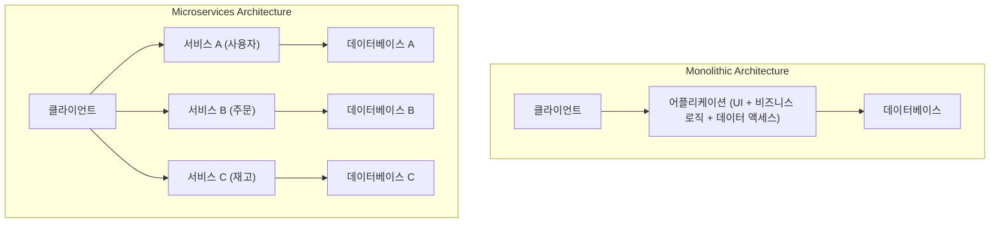
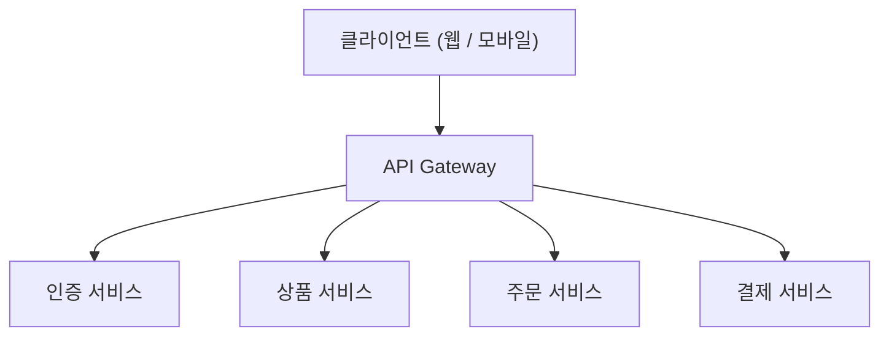
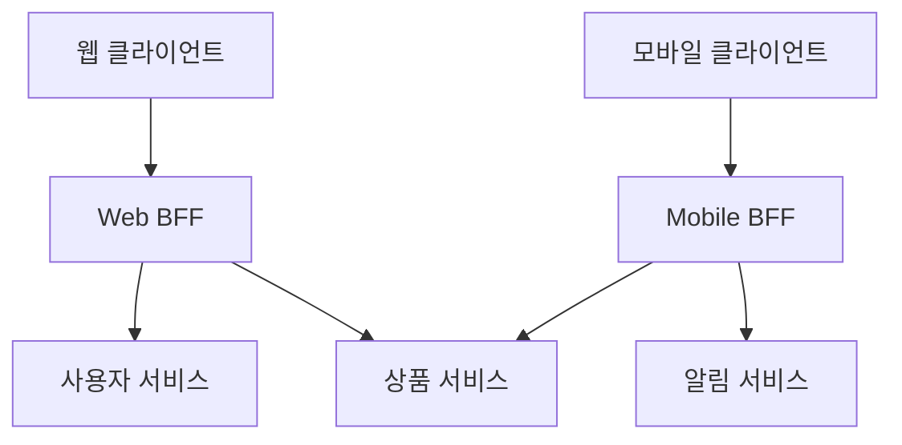

# 마이크로서비스 아키텍처의 빛과 그림자 (BFF와 API Gateway)

현대 소프트웨어 개발에서 확장성과 개발의 민첩성을 높이기 위해 **마이크로서비스 아키텍처** 가 채택되는 사례가 늘고 있습니다. 하지만 시스템을 분할하는 것은 동시에 새로운 복잡성을 만들어내는 것이기도 합니다.

본 기사에서는 모놀리식 아키텍처의 한계부터 시작하여, 마이크로서비스가 가져다주는 이점과 그 이면에 있는 '그림자' 부분(운영상의 과제 등)을 깊이 파고듭니다. 그리고 이러한 과제를 해결하기 위한 아키텍처 패턴인 **API Gateway** 와 **BFF(Backend for Frontend)** 에 대해 도해와 구체적인 코드 예시를 섞어가며 상세히 해설해 나가겠습니다.

---

## 1. 모놀리식 아키텍처의 한계

**모놀리식 아키텍처** 는 애플리케이션의 모든 기능(UI, 비즈니스 로직, 데이터 액세스 등)을 단일 코드 베이스, 단일 프로세스로 구축하는 기법입니다. 초기 개발에서는 단순하고 배포도 용이하기 때문에 매우 효과적인 선택지가 됩니다.

하지만 시스템이 성장하고 기능이나 개발 팀의 규모가 커짐에 따라 다음과 같은 한계가 드러나게 됩니다.

*   **코드 베이스의 비대화와 복잡화** : 기능 추가가 반복되면서 코드 베이스가 거대해져 전체를 파악하기 어려워집니다. 하나의 변경이 예상치 못한 기능에 영향을 미칠 위험(회귀 버그)이 높아집니다.
*   **배포 유연성 부족** : 작은 수정이라도 애플리케이션 전체를 다시 빌드하고 재배포해야 합니다. 이로 인해 배포 리드 타임이 길어지고 민첩성이 저하됩니다.
*   **확장성의 제한** : 특정 기능(예: 이미지 처리 기능 등)만이 리소스를 대량으로 소비하는 경우라도 애플리케이션 전체를 스케일 아웃시킬 수밖에 없어 리소스 이용 효율이 악화됩니다.
*   **기술 스택의 고정화** : 단일 코드 베이스이기 때문에 새로운 언어나 프레임워크를 부분적으로 도입하기 어려우며 오래된 기술에 얽매이기 쉽습니다.

이러한 과제를 극복하기 위해 많은 기업이 **마이크로서비스 아키텍처** 로의 전환을 검토하게 됩니다.

---

## 2. 마이크로서비스 아키텍처의 이점

**마이크로서비스 아키텍처** 에서는 애플리케이션을 비즈니스 기능별로 독립된 작은 서비스(마이크로서비스)의 집합체로 설계합니다. 각 서비스는 독립적으로 배포 가능하며 자체 데이터베이스를 갖는 것이 일반적입니다.



마이크로서비스에는 다음과 같은 빛(이점)이 있습니다.

*   **독립적인 배포** : 서비스별로 독립적으로 개발하고 배포할 수 있어 릴리스 주기를 가속화할 수 있습니다.
*   **개별 스케일링** : 부하가 높은 서비스만을 개별적으로 스케일 아웃할 수 있어 인프라 비용을 최적화할 수 있습니다.
*   **기술의 다양성 (Polyglot)** : 서비스마다 최적의 프로그래밍 언어나 데이터베이스를 선택할 수 있습니다.
*   **장애의 국소화** : 하나의 서비스가 다운되더라도 시스템 전체가 정지하는 것을 방지할 수 있습니다(적절한 내결함성 설계가 있는 경우).

---

## 3. 마이크로서비스의 '그림자': 운영상의 과제

하지만 마이크로서비스는 '은탄환'이 아닙니다. 시스템을 분산시킴으로써 분산 시스템 특유의 복잡성이라는 '그림자'가 따라다닙니다.

### 3.1. 네트워크 지연 및 통신 복잡화
모놀리스라면 메모리 내 함수 호출로 끝났을 처리가 네트워크를 통한 통신(HTTP/REST, gRPC 등)으로 바뀝니다. 이로 인해 **네트워크 지연** 이 발생하여 시스템 전체의 응답 속도가 저하될 위험이 있습니다. 또한 네트워크는 항상 불안정하기 때문에 타임아웃이나 재시도 제어, 서킷 브레이커와 같은 복잡한 통신 제어를 구현해야 합니다.

### 3.2. 분산 트랜잭션 및 데이터 정합성
각 서비스가 자체 데이터베이스를 가지므로 여러 서비스에 걸친 데이터 업데이트(트랜잭션)가 매우 어려워집니다. 기존 [RDBMS](https://kenji.blog/ko/p/rdbms-transaction-acid-isolation-level-lock/)에서 이용할 수 있었던 [ACID](https://kenji.blog/ko/p/rdbms-transaction-acid-isolation-level-lock/) 트랜잭션을 사용할 수 없어, **Saga 패턴** 이나 **이벤트 소싱** 과 같은 최종 일관성(Eventual [Consistency](https://kenji.blog/ko/p/cap-theorem-distributed-systems-tradeoff/))을 허용하는 복잡한 설계 패턴을 도입해야만 합니다.

### 3.3. 클라이언트 접근의 복잡화
수십, 수백 개의 서비스가 존재할 경우 클라이언트(웹 브라우저나 모바일 앱)가 어느 API 엔드포인트를 호출해야 할지 파악하고 개별적으로 통신하는 것은 비현실적입니다. 또한 하나의 화면을 표시하기 위해 여러 서비스에 대해 대량의 요청(Chatty API)을 보내야 하므로 성능 악화를 초래합니다.

이러한 '클라이언트 접근의 복잡화'를 해결하기 위해 등장하는 것이 **API Gateway** 와 **BFF** 입니다.

---

## 4. 클라이언트와 서비스 군의 중재자: API Gateway

**API Gateway** 는 클라이언트와 백엔드 마이크로서비스 군 사이에 배치되어 모든 요청의 단일 진입점(접수 창구) 역할을 합니다.



### 4.1. API Gateway의 주요 역할
*   **라우팅** : 클라이언트로부터의 요청 경로를 기반으로 적절한 백엔드 서비스로 요청을 전달(리버스 프록시)합니다.
*   **인증 및 인가** : 토큰(JWT 등) 검증을 Gateway 계층에서 일원화하여 각 마이크로서비스 측의 인증 처리 부담을 줄입니다.
*   **속도 제한 (트래픽 제어)** : 과도한 요청으로부터 백엔드를 보호하기 위해 API 호출 횟수를 제한합니다.
*   **프로토콜 변환** : 클라이언트에서는 HTTP(REST)로 받고, 백엔드로는 gRPC로 통신하는 등 프로토콜 변환을 수행합니다.

### 4.2. API Gateway의 과제 (단일 장애점 및 병목 현상)
API Gateway는 매우 강력하지만 모든 트래픽이 집중되기 때문에 시스템 전체의 **단일 장애점 (SPOF)** 이 되기 쉽다는 위험이 있습니다. 또한 모든 기능(인증, 변환, 비즈니스 로직의 일부 등)을 API Gateway에 너무 많이 넣게 되면 거대한 모놀리식 Gateway가 되어 결과적으로 민첩성을 해치는 'ESB(엔터프라이즈 서비스 버스)의 비극'을 반복하게 됩니다.

---

## 5. 클라이언트별 최적화: BFF(Backend for Frontend) 패턴

API Gateway의 개념을 더욱 발전시켜 클라이언트의 요구 사항에 특화된 API 계층을 제공하는 것이 **BFF(Backend for Frontend)** 패턴입니다.

### 5.1. BFF 패턴의 개념
웹 브라우저, iOS 앱, Android 앱 또는 스마트워치 등 클라이언트 종류에 따라 화면에 표시할 데이터나 네트워크 대역폭 요구 사항이 크게 다릅니다.

단일 API Gateway로 이 모든 요구 사항을 충족시키려고 하면 API가 너무 범용적이 되어 불필요한 데이터(오버패치)가 포함되거나 반대로 부족한 데이터를 보충하기 위해 클라이언트에서 여러 번 요청(언더패치)을 보내야 하는 상황이 발생합니다.

BFF에서는 **클라이언트 종류별로 전용 백엔드(BFF)를 준비** 합니다. BFF는 해당 클라이언트의 UI가 필요로 하는 데이터만을 적절한 형식으로 가공(애그리게이션)하여 반환합니다.

### 5.2. 웹용 BFF와 모바일용 BFF의 분리

아래 그림은 웹과 모바일용으로 각각의 BFF를 배치한 아키텍처입니다.



*   **웹 BFF** : PC의 넓은 화면에 표시하기 위한 풍부한 데이터 세트를 집계하여 반환합니다.
*   **모바일 BFF** : 좁은 화면이나 불안정한 네트워크 회선을 고려하여 데이터 양을 최소한으로 줄인 페이로드를 반환합니다.

이와 같이 UI 팀 스스로 자신들의 클라이언트 전용 BFF를 개발 및 유지보수함으로써 백엔드 팀의 API 변경을 기다리지 않고 민첩하게 UI 개발을 진행할 수 있게 됩니다.

---

## 6. BFF에서의 데이터 애그리게이션 구현 예시 (Node.js × GraphQL)

BFF의 기술 스택으로 최근 매우 인기를 끌고 있는 것이 **GraphQL** 입니다. GraphQL은 클라이언트가 '필요한 데이터만'을 쿼리로 지정할 수 있기 때문에 BFF의 목적에 완벽하게 부합합니다.

여기에서는 Node.js(Apollo Server)를 사용하여 사용자 정보와 주문 내역 API를 애그리게이션하는 간단한 BFF 구현 예시를 소개합니다.

### 코드 예시: GraphQL을 사용한 데이터 애그리게이션

```javascript
// index.js
const { ApolloServer, gql } = require('apollo-server');
const axios = require('axios');

// 1. GraphQL 스키마 정의
// 클라이언트가 필요로 하는 데이터의 구조를 정의합니다.
const typeDefs = gql\`
  type User {
    id: ID!
    name: String!
    email: String!
  }

  type Order {
    id: ID!
    productId: ID!
    amount: Int!
    status: String!
  }

  type UserProfile {
    user: User!
    orders: [Order]!
  }

  type Query {
    # 사용자의 프로필과 주문 내역을 한 번에 가져오는 쿼리
    userProfile(userId: ID!): UserProfile
  }
\`;

// 2. 리졸버 정의 (데이터 애그리게이션 로직)
const resolvers = {
  Query: {
    userProfile: async (_, { userId }) => {
      try {
        // 서로 다른 마이크로서비스(User와 Order)에 병렬로 HTTP 요청을 전송
        // Promise.all을 사용하여 네트워크 대기 시간을 최소화합니다.
        const [userResponse, ordersResponse] = await Promise.all([
          axios.get(\`http://user-service/api/users/\${userId}\`),
          axios.get(\`http://order-service/api/orders?userId=\${userId}\`)
        ]);

        // 가져온 데이터를 결합하여 GraphQL 스키마 형식에 맞게 반환
        return {
          user: userResponse.data,
          orders: ordersResponse.data
        };
      } catch (error) {
        console.error("Failed to fetch data from microservices", error);
        throw new Error("Failed to fetch user profile data");
      }
    }
  }
};

// 3. 서버 실행
const server = new ApolloServer({ typeDefs, resolvers });

server.listen({ port: 4000 }).then(({ url }) => {
  console.log(\`🚀 BFF Server ready at \${url}\`);
});
```

이 구현을 통해 클라이언트는 `userProfile` 이라는 하나의 GraphQL 쿼리를 실행하는 것만으로 사용자 정보와 주문 내역이라는 여러 백엔드 서비스의 데이터를 한 번에 가져올 수 있게 됩니다. 클라이언트 측의 통신 횟수가 극적으로 감소하고 성능과 개발 경험이 향상됩니다.

---

## 7. 맺음말

마이크로서비스 아키텍처는 거대한 시스템을 확장 가능한 형태로 진화시키기 위한 강력한 접근 방식이지만 분산 시스템 특유의 '그림자' 과제와 마주해야 합니다.

그 과제를 해결하고 클라이언트와 백엔드 간의 통신을 최적화하는 수단으로서 **API Gateway** 와 **BFF 패턴** 은 필수적인 존재가 되었습니다. 특히 클라이언트 종류마다 전용 엔드포인트를 두는 BFF는 UI의 진화 속도를 백엔드의 제약으로부터 해방시키는 훌륭한 아키텍처입니다.

자사 팀 체제, 클라이언트의 다양성, 그리고 시스템 규모에 맞춰 API Gateway와 BFF를 적절히 설계 및 도입하여 보다 견고하고 민첩성이 높은 시스템을 구축해 나갑시다.
