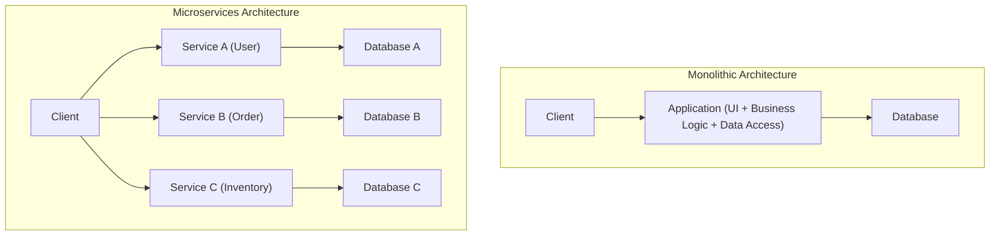
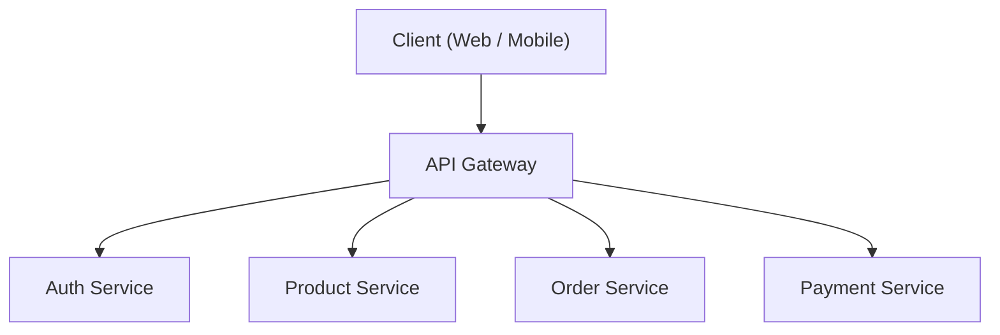
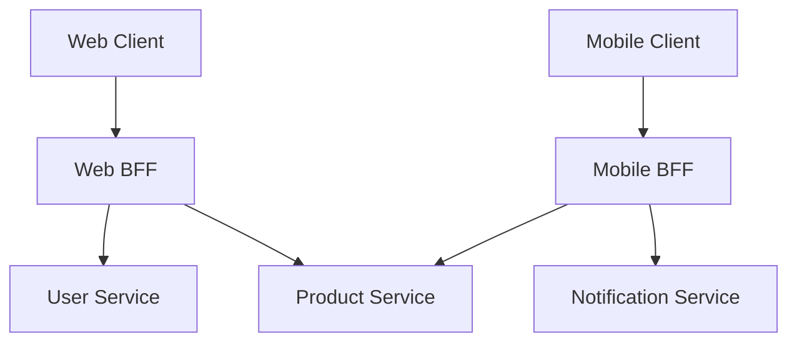

# マイクロサービス・アーキテクチャの光と影（BFFとAPI Gateway）

現代のソフトウェア開発において、スケーラビリティや開発の俊敏性を高めるために **マイクロサービス・アーキテクチャ** が採用されるケースが増えています。しかし、システムを分割することは、同時に新たな複雑さを生み出すことでもあります。

本記事では、モノリシックアーキテクチャの限界から始まり、マイクロサービスがもたらすメリットとその背後にある「影」の部分（運用上の課題など）を深く掘り下げます。そして、それらの課題を解決するためのアーキテクチャパターンである **API Gateway** と **BFF（Backend for Frontend）** について、図解や具体的なコード例を交えながら詳細に解説していきます。

---

## 1. モノリシックアーキテクチャの限界

**モノリシックアーキテクチャ** は、アプリケーションのすべての機能（UI、ビジネスロジック、データアクセスなど）を単一のコードベース、単一のプロセスとして構築する手法です。初期の開発においては、シンプルでデプロイも容易であるため、非常に有効な選択肢となります。

しかし、システムが成長し、機能や開発チームの規模が拡大するにつれて、以下のような限界が見えてきます。

*   **コードベースの肥大化と複雑化** : 機能追加が繰り返されることでコードベースが巨大化し、全体を把握することが困難になります。一つの変更が予期せぬ機能に影響を与えるリスク（回帰バグ）が高まります。
*   **デプロイの柔軟性の欠如** : 小さな修正であっても、アプリケーション全体を再ビルドし、再デプロイする必要があります。これにより、デプロイのリードタイムが長くなり、アジリティが低下します。
*   **スケーラビリティの制限** : 特定の機能（例えば、画像処理機能など）だけがリソースを大量に消費する場合でも、アプリケーション全体をスケールアウトさせるしかなく、リソースの利用効率が悪化します。
*   **技術[スタック](https://kenji.blog/p/c-language-pointers-memory-management-stack-heap/)の固定化** : 単一のコードベースであるため、新しい言語やフレームワークを部分的に導入することが難しく、古い技術に縛られやすくなります。

これらの課題を克服するため、多くの企業が **マイクロサービス・アーキテクチャ** への移行を検討することになります。

---

## 2. マイクロサービス・アーキテクチャのメリット

**マイクロサービス・アーキテクチャ** では、アプリケーションをビジネス機能ごとに独立した小さなサービス（マイクロサービス）の集合体として設計します。各サービスは独立してデプロイ可能であり、独自のデータベースを持つことが一般的です。



マイクロサービスには、以下の光（メリット）があります。

*   **独立したデプロイメント** : サービスごとに独立して開発・デプロイできるため、リリースサイクルを高速化できます。
*   **個別のスケーリング** : 負荷が高いサービスのみを個別にスケールアウトできるため、インフラコストを最適化できます。
*   **技術の多様性（Polyglot）** : サービスごとに最適な[プログラミング言語](https://kenji.blog/p/programming-languages-history-paradigm-evolution/)やデータベースを選択できます。
*   **障害の局所化** : 一つのサービスがダウンしても、システム全体が停止することを防ぐことができます（適切なフォールトトレランス設計がある場合）。

---

## 3. マイクロサービスの「影」：運用上の課題

しかし、マイクロサービスには「銀の弾丸」ではありません。システムを分散化させることで、[分散システム](https://kenji.blog/p/cap-theorem-distributed-systems-tradeoff/)特有の複雑さという「影」が付きまといます。

### 3.1. ネットワークレイテンシと通信の複雑化
モノリスであればメモリ内の関数呼び出しで済んでいた処理が、ネットワーク越しの通信（HTTP/REST、gRPCなど）に変わります。これにより、 **ネットワークレイテンシ** が発生し、システム全体の応答速度が低下するリスクがあります。また、ネットワークは常に不安定であるため、タイムアウトやリトライ制御、サーキットブレーカーといった複雑な通信制御を実装する必要があります。

### 3.2. 分散[トランザクション](https://kenji.blog/p/rdbms-transaction-acid-isolation-level-lock/)とデータ整合性
各サービスが独自のデータベースを持つため、複数のサービスにまたがるデータの更新（トランザクション）が非常に困難になります。従来の[RDBMS](https://kenji.blog/p/rdbms-transaction-acid-isolation-level-lock/)で利用できたACIDトランザクションが使えず、 **Sagaパターン** や **イベントソーシング** といった結果整合性（Eventual [Consistency](https://kenji.blog/p/cap-theorem-distributed-systems-tradeoff/)）を許容する複雑な設計パターンを導入せざるを得ません。

### 3.3. クライアントからのアクセスの複雑化
数十、数百のサービスが存在する場合、クライアント（Webブラウザやモバイルアプリ）がどのAPIエンドポイントを呼び出せばよいかを把握し、個別に通信を行うのは非現実的です。また、1つの画面を表示するために複数のサービスに対して大量のリクエスト（Chatty API）を送る必要があり、パフォーマンスの悪化を招きます。

この「クライアントからのアクセスの複雑化」を解決するために登場するのが、 **API Gateway** と **BFF** です。

---

## 4. クライアントとサービス群の仲介役：API Gateway

**API Gateway** は、クライアントとバックエンドのマイクロサービス群の間に配置され、すべてのリクエストの単一のエントリポイント（受付窓口）として機能します。



### 4.1. API Gatewayの主な役割
*   **ルーティング** : クライアントからのリクエストパスに基づいて、適切なバックエンドサービスへリクエストを転送（リバースプロキシ）します。
*   **認証・認可** : トークン（JWTなど）の検証をGateway層で一元的に行い、各マイクロサービス側での認証処理の負担を軽減します。
*   **レートリミット（流量制御）** : 過剰なリクエストからバックエンドを保護するために、APIの呼び出し回数を制限します。
*   **プロトコル変換** : クライアントからはHTTP（REST）で受け付け、バックエンドへはgRPCで通信するといったプロトコルの変換を行います。

### 4.2. API Gatewayの課題（単一障害点とボトルネック化）
API Gatewayは非常に強力ですが、すべてのトラフィックが集中するため、システム全体の **単一障害点（SPOF）** になりやすいというリスクがあります。また、あらゆる機能（認証、変換、ビジネスロジックの一部など）をAPI Gatewayに詰め込みすぎると、巨大なモノリシックGatewayとなってしまい、結果的にアジリティを損なう「ESB（エンタープライズ・サービス・バス）の悲劇」を繰り返すことになります。

---

## 5. クライアントごとの最適化：BFF（Backend for Frontend）パターン

API Gatewayの概念をさらに発展させ、クライアントの要件に特化したAPI層を提供するのが **BFF（Backend for Frontend）** パターンです。

### 5.1. BFFパターンの概念
Webブラウザ、iOSアプリ、Androidアプリ、あるいはスマートウォッチなど、クライアントの種類によって、画面に表示したいデータやネットワーク帯域の要件は大きく異なります。

単一のAPI Gatewayでこれらすべての要件を満たそうとすると、APIが汎用的になりすぎて無駄なデータ（オーバーフェッチ）が含まれたり、逆に不足しているデータを補うためにクライアントから複数回リクエスト（アンダーフェッチ）を送る必要が生じます。

BFFでは、 **クライアントの種類ごとに専用のバックエンド（BFF）を用意** します。BFFは、そのクライアントのUIが必要とするデータだけを、適切なフォーマットに加工（アグリゲーション）して返します。

### 5.2. Web用BFFとMobile用BFFの分離

以下の図は、Webとモバイルで別々のBFFを配置したアーキテクチャです。



*   **Web BFF** : PCの広い画面に表示するためのリッチなデータセットを集約して返します。
*   **Mobile BFF** : 狭い画面や不安定なネットワーク回線を考慮し、データ量を最小限に絞り込んだペイロードを返します。

このように、UIチーム自身が自分たちのクライアント専用のBFFを開発・保守することで、バックエンドチームのAPI変更を待つことなく、アジャイルなUI開発を進めることが可能になります。

---

## 6. BFFでのデータアグリゲーションの実装例（Node.js × GraphQL）

BFFの技術[スタック](https://kenji.blog/p/c-language-pointers-memory-management-stack-heap/)として、近年非常に人気を集めているのが **GraphQL** です。GraphQLは、クライアントが「必要なデータのみ」をクエリで指定できるため、BFFの目的に完璧に合致します。

ここでは、Node.js（Apollo Server）を用いて、ユーザー情報と注文履歴のAPIをアグリゲーションする簡単なBFFの実装例を紹介します。

### コード例：GraphQLを用いたデータアグリゲーション

```javascript
// index.js
const { ApolloServer, gql } = require('apollo-server');
const axios = require('axios');

// 1. GraphQLスキーマの定義
// クライアントが必要とするデータの構造を定義します。
const typeDefs = gql`
  type User {
    id: ID!
    name: String!
    email: String!
  }

  type Order {
    id: ID!
    productId: ID!
    amount: Int!
    status: String!
  }

  type UserProfile {
    user: User!
    orders: [Order]!
  }

  type Query {
    # ユーザーのプロファイルと注文履歴を一度に取得するクエリ
    userProfile(userId: ID!): UserProfile
  }
`;

// 2. リゾルバの定義（データアグリゲーションのロジック）
const resolvers = {
  Query: {
    userProfile: async (_, { userId }) => {
      try {
        // 異なるマイクロサービス（UserとOrder）へ並行してHTTPリクエストを送信
        // Promise.allを使用することで、ネットワークの待機時間を最小化しています。
        const [userResponse, ordersResponse] = await Promise.all([
          axios.get(\`http://user-service/api/users/\${userId}\`),
          axios.get(\`http://order-service/api/orders?userId=\${userId}\`)
        ]);

        // 取得したデータを結合し、GraphQLスキーマの形式に合わせて返却
        return {
          user: userResponse.data,
          orders: ordersResponse.data
        };
      } catch (error) {
        console.error("Failed to fetch data from microservices", error);
        throw new Error("Failed to fetch user profile data");
      }
    }
  }
};

// 3. サーバーの起動
const server = new ApolloServer({ typeDefs, resolvers });

server.listen({ port: 4000 }).then(({ url }) => {
  console.log(\`🚀 BFF Server ready at \${url}\`);
});
```

この実装により、クライアントは `userProfile` という1つのGraphQLクエリを叩くだけで、ユーザー情報と注文履歴という複数のバックエンドサービスのデータを一度に取得できるようになります。クライアント側の通信回数が劇的に削減され、パフォーマンスと開発体験が向上します。

---

## 7. おわりに

マイクロサービス・アーキテクチャは、巨大なシステムを拡張可能な形に進化させるための強力なアプローチですが、[分散システム](https://kenji.blog/p/cap-theorem-distributed-systems-tradeoff/)ならではの「影」の課題と向き合う必要があります。

その課題を解決し、クライアントとバックエンド間の通信を最適化する手段として、 **API Gateway** や **BFFパターン** は不可欠な存在となっています。特に、クライアントの種類ごとに専用のエンドポイントを設けるBFFは、UIの進化速度をバックエンドの制約から解放する素晴らしいアーキテクチャです。

自社のチーム体制、クライアントの多様性、そしてシステムの規模に合わせて、API GatewayとBFFを適切に設計・導入し、より堅牢でアジリティの高いシステムを構築していきましょう。
