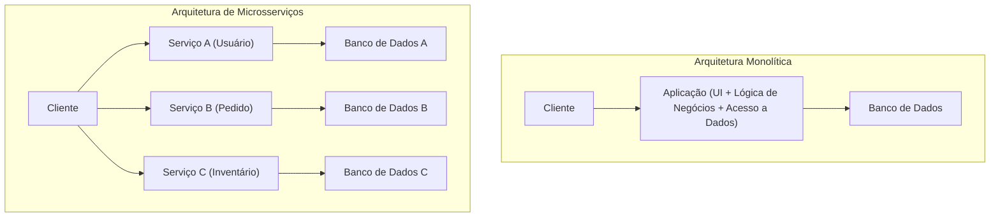
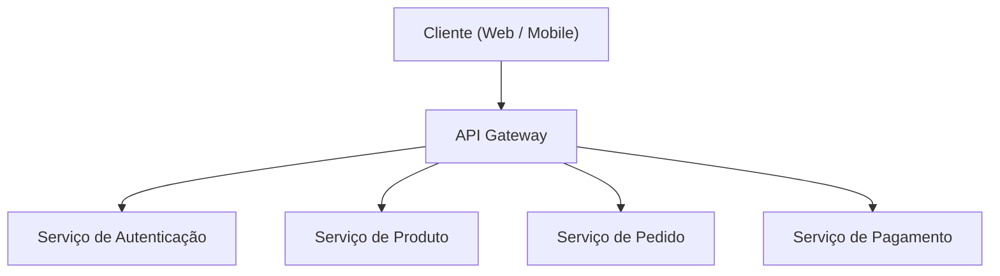
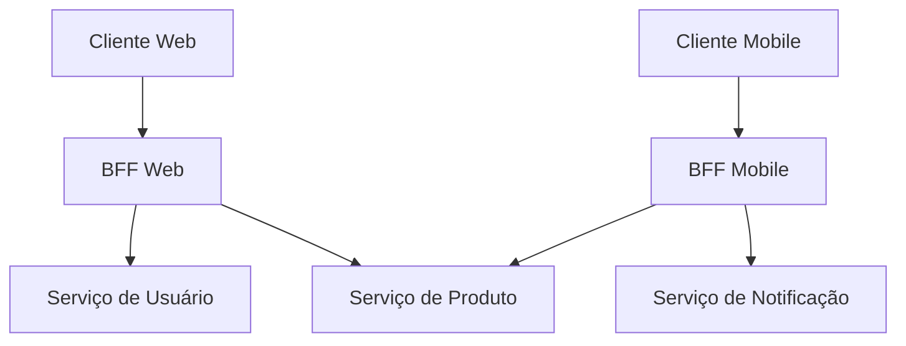

# Luzes e Sombras da Arquitetura de Microsserviços (BFF e API Gateway)

No desenvolvimento de software moderno, a **Arquitetura de Microsserviços** é cada vez mais adotada para aumentar a escalabilidade e a agilidade do desenvolvimento. No entanto, dividir um sistema também cria novas complexidades.

Este artigo aprofunda-se, começando pelos limites da arquitetura monolítica, até os benefícios que os microsserviços trazem e o lado "sombrio" por trás deles (como desafios operacionais). E para resolver esses desafios, explicaremos em detalhes os padrões de arquitetura **API Gateway** e **BFF (Backend for Frontend)**, utilizando diagramas e exemplos de código concretos.

---

## 1. Os Limites da Arquitetura Monolítica

A **Arquitetura Monolítica** é uma abordagem onde todas as funcionalidades de uma aplicação (UI, lógica de negócios, acesso a dados, etc.) são construídas como uma base de código única e um processo único. No desenvolvimento inicial, é uma opção muito eficaz por ser simples e fácil de implementar.

No entanto, à medida que o sistema cresce e a escala das funcionalidades e das equipes de desenvolvimento se expandem, os seguintes limites tornam-se aparentes:

*   **Inchaço e complexidade da base de código**: A repetição da adição de funcionalidades torna a base de código gigantesca, dificultando a compreensão do todo. Aumenta o risco de que uma única alteração afete funções de forma inesperada (bugs de regressão).
*   **Falta de flexibilidade na implantação**: Mesmo para pequenas correções, é necessário recompilar e reimplantar toda a aplicação. Isso prolonga o tempo de liderança da implantação (lead time) e reduz a agilidade.
*   **Limitações de escalabilidade**: Mesmo quando apenas uma função específica (por exemplo, processamento de imagens) consome muitos recursos, não há outra escolha senão escalar a aplicação inteira (scale-out), deteriorando a eficiência do uso dos recursos.
*   **Fixação do stack tecnológico**: Sendo uma base de código única, é difícil introduzir parcialmente novas linguagens e frameworks, tornando-se mais propenso a ficar preso em tecnologias antigas.

Para superar esses desafios, muitas empresas começam a considerar a transição para a **Arquitetura de Microsserviços**.

---

## 2. Benefícios da Arquitetura de Microsserviços

Na **Arquitetura de Microsserviços**, a aplicação é projetada como um conjunto de pequenos serviços (microsserviços) independentes para cada função de negócio. Cada serviço pode ser implantado de forma independente e geralmente possui seu próprio banco de dados.



Os microsserviços têm as seguintes luzes (benefícios):

*   **Implantação independente**: Como podem ser desenvolvidos e implantados de forma independente por serviço, os ciclos de lançamento podem ser acelerados.
*   **Escalonamento individual**: Apenas os serviços com alta carga podem ser escalonados individualmente, otimizando os custos de infraestrutura.
*   **Diversidade tecnológica (Polyglot)**: É possível escolher a linguagem de programação ou banco de dados mais adequado para cada serviço.
*   **Localização de falhas**: Mesmo se um serviço cair, é possível evitar que o sistema inteiro pare (se houver um design adequado de tolerância a falhas).

---

## 3. A "Sombra" dos Microsserviços: Desafios Operacionais

No entanto, microsserviços não são uma "bala de prata". Ao descentralizar o sistema, a complexidade peculiar dos sistemas distribuídos surge como uma "sombra".

### 3.1. Latência de rede e complexidade de comunicação
Processos que antes eram chamadas de funções em memória em um monolito, agora se tornam comunicação através da rede (HTTP/REST, gRPC, etc.). Isso gera **latência de rede** e corre-se o risco de diminuir a velocidade de resposta de todo o sistema. Além disso, como as redes são sempre instáveis, é necessário implementar controles de comunicação complexos, como timeouts, controle de tentativas (retries) e circuit breakers.

### 3.2. Transações distribuídas e consistência de dados
Como cada serviço tem seu próprio banco de dados, as atualizações de dados que abrangem vários serviços (transações) tornam-se extremamente difíceis. As transações [ACID](https://kenji.blog/pt/p/rdbms-transaction-acid-isolation-level-lock/) disponíveis nos [RDBMS](https://kenji.blog/pt/p/rdbms-transaction-acid-isolation-level-lock/) tradicionais não podem ser usadas, forçando a adoção de padrões de projeto complexos que toleram consistência eventual (Eventual [Consistency](https://kenji.blog/pt/p/cap-theorem-distributed-systems-tradeoff/)), como o **padrão Saga** e **Event Sourcing**.

### 3.3. Complexidade de acesso por parte do cliente
Quando dezenas ou centenas de serviços existem, é impraticável para o cliente (navegador da web ou aplicativo móvel) saber qual endpoint da API deve chamar e se comunicar individualmente. Além disso, pode ser necessário enviar um grande número de solicitações para vários serviços (Chatty API) apenas para exibir uma única tela, o que leva à degradação do desempenho.

Para resolver essa "complexidade de acesso por parte do cliente", surgem o **API Gateway** e o **BFF**.

---

## 4. O Intermediário entre o Cliente e os Serviços: API Gateway

O **API Gateway** é posicionado entre os clientes e os microsserviços de back-end, atuando como um ponto de entrada único (ponto de recepção) para todas as solicitações.



### 4.1. Principais Funções do API Gateway
*   **Roteamento**: Com base no caminho da solicitação do cliente, ele encaminha a solicitação (reverse proxy) para o serviço de back-end apropriado.
*   **Autenticação e Autorização**: Centraliza a verificação de tokens (como JWT) na camada do Gateway, reduzindo a carga de processamento de autenticação em cada microsserviço.
*   **Rate Limit (Controle de Fluxo)**: Limita o número de chamadas da API para proteger o back-end de solicitações excessivas.
*   **Conversão de Protocolo**: Recebe solicitações do cliente via HTTP (REST) e se comunica com o back-end via gRPC, realizando conversões de protocolo.

### 4.2. Desafios do API Gateway (Ponto Único de Falha e Gargalo)
O API Gateway é muito poderoso, mas como todo o tráfego se concentra nele, há um risco maior de se tornar um **Ponto Único de Falha (SPOF - Single Point of Failure)** para todo o sistema. Além disso, se muitas funcionalidades (autenticação, conversões, partes da lógica de negócios, etc.) forem amontoadas no API Gateway, ele se tornará um Gateway monolítico gigantesco, resultando na repetição da "Tragédia do ESB (Enterprise Service Bus)" que prejudica a agilidade.

---

## 5. Otimização por Cliente: O Padrão BFF (Backend for Frontend)

O padrão **BFF (Backend for Frontend)** desenvolve ainda mais o conceito de API Gateway e fornece uma camada de API especificamente adaptada aos requisitos do cliente.

### 5.1. Conceito do Padrão BFF
Os requisitos de rede e os dados que precisam ser exibidos na tela variam muito de acordo com o tipo de cliente, seja um navegador web, um aplicativo iOS, um aplicativo Android ou até mesmo um smartwatch.

Tentar satisfazer todos esses requisitos com um único API Gateway faria com que a API se tornasse muito genérica, incluindo dados desnecessários (Over-fetching) ou, inversamente, forçando o cliente a enviar várias solicitações (Under-fetching) para compensar os dados que faltam.

No padrão BFF, **um back-end dedicado (BFF) é preparado para cada tipo de cliente**. O BFF agrega os dados necessários para a interface de usuário daquele cliente específico e os retorna em um formato adequado.

### 5.2. Separação de BFF para Web e BFF para Mobile

A figura abaixo mostra uma arquitetura onde BFFs separados são implantados para Web e Mobile.



*   **BFF Web**: Agrega e retorna conjuntos de dados ricos para exibição nas telas grandes de PCs.
*   **BFF Mobile**: Considera telas pequenas e conexões de rede instáveis, retornando payloads reduzidos ao mínimo de dados necessários.

Dessa forma, ao permitir que a própria equipe de UI desenvolva e mantenha o BFF dedicado de seu cliente, é possível avançar com o desenvolvimento ágil de UI sem ter que esperar por alterações na API da equipe de back-end.

---

## 6. Exemplo de Implementação de Agregação de Dados em um BFF (Node.js × GraphQL)

O **GraphQL** tornou-se extremamente popular nos últimos anos como um stack tecnológico para BFF. O GraphQL atende perfeitamente ao propósito do BFF porque permite que o cliente especifique "apenas os dados necessários" em uma consulta.

Aqui, mostraremos um exemplo simples de implementação de BFF, usando Node.js (Apollo Server) para agregar APIs de informações do usuário e histórico de pedidos.

### Exemplo de Código: Agregação de Dados usando GraphQL

```javascript
// index.js
const { ApolloServer, gql } = require('apollo-server');
const axios = require('axios');

// 1. Definição do esquema GraphQL
// Define a estrutura dos dados que o cliente precisa.
const typeDefs = gql`
  type User {
    id: ID!
    name: String!
    email: String!
  }

  type Order {
    id: ID!
    productId: ID!
    amount: Int!
    status: String!
  }

  type UserProfile {
    user: User!
    orders: [Order]!
  }

  type Query {
    # Consulta para obter o perfil do usuário e o histórico de pedidos de uma só vez
    userProfile(userId: ID!): UserProfile
  }
`;

// 2. Definição de resolvers (Lógica de agregação de dados)
const resolvers = {
  Query: {
    userProfile: async (_, { userId }) => {
      try {
        // Envia solicitações HTTP paralelas a diferentes microsserviços (User e Order)
        // O uso do Promise.all minimiza o tempo de espera da rede.
        const [userResponse, ordersResponse] = await Promise.all([
          axios.get(\`http://user-service/api/users/\${userId}\`),
          axios.get(\`http://order-service/api/orders?userId=\${userId}\`)
        ]);

        // Combina os dados obtidos e retorna conforme o formato do esquema GraphQL
        return {
          user: userResponse.data,
          orders: ordersResponse.data
        };
      } catch (error) {
        console.error("Falha ao buscar dados dos microsserviços", error);
        throw new Error("Falha ao buscar os dados do perfil do usuário");
      }
    }
  }
};

// 3. Inicializando o servidor
const server = new ApolloServer({ typeDefs, resolvers });

server.listen({ port: 4000 }).then(({ url }) => {
  console.log(\`🚀 Servidor BFF pronto em \${url}\`);
});
```

Com esta implementação, o cliente só precisa chamar uma consulta GraphQL `userProfile` para obter dados de vários serviços de back-end, como informações do usuário e histórico de pedidos, de uma só vez. O número de solicitações de rede do lado do cliente é reduzido drasticamente, melhorando o desempenho e a experiência de desenvolvimento.

---

## 7. Conclusão

A Arquitetura de Microsserviços é uma abordagem poderosa para evoluir sistemas gigantes para uma forma escalável, mas é necessário enfrentar os desafios da "sombra" que são únicos aos sistemas distribuídos.

Como meio para resolver esses desafios e otimizar a comunicação entre o cliente e o back-end, o **API Gateway** e o **padrão BFF** tornaram-se indispensáveis. O BFF, em particular, que estabelece endpoints dedicados para cada tipo de cliente, é uma arquitetura fantástica que libera o ritmo de evolução da UI das restrições do back-end.

Vamos projetar e introduzir o API Gateway e o BFF adequadamente, de acordo com a estrutura da equipe de sua empresa, a diversidade dos clientes e o tamanho do sistema, para construir um sistema mais robusto e ágil.
