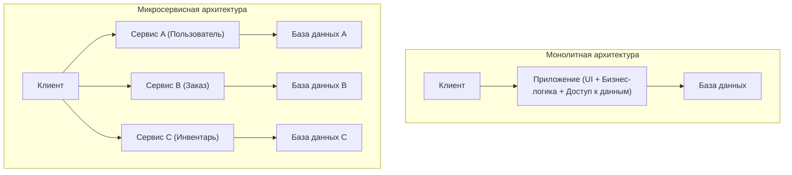
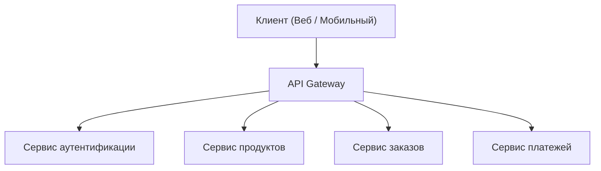
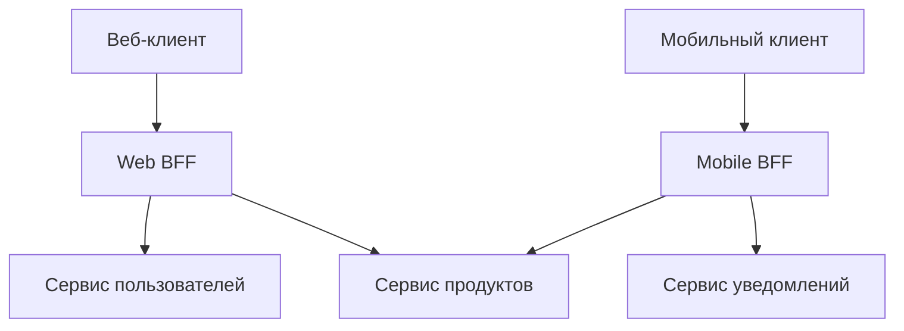

# Свет и тень микросервисной архитектуры (BFF и API Gateway)

В современной разработке программного обеспечения для повышения масштабируемости и гибкости разработки все чаще применяется **микросервисная архитектура**. Однако разделение системы одновременно порождает новую сложность.

В этой статье мы начнем с ограничений монолитной архитектуры и глубоко погрузимся в преимущества микросервисов и их «теневую» сторону (например, проблемы эксплуатации). Затем мы подробно рассмотрим архитектурные паттерны **API Gateway** и **BFF (Backend for Frontend)**, которые решают эти проблемы, используя иллюстрации и конкретные примеры кода.

---

## 1. Ограничения монолитной архитектуры

**Монолитная архитектура** — это подход, при котором вся функциональность приложения (UI, бизнес-логика, доступ к данным и т.д.) создается как единая кодовая база и единый процесс. На начальных этапах разработки это очень эффективный выбор, поскольку он прост и легко развертывается.

Однако по мере роста системы, увеличения количества функций и размера команд разработчиков становятся очевидными следующие ограничения:

*   **Разбухание и усложнение кодовой базы** : По мере добавления функций кодовая база становится огромной, и её трудно охватить целиком. Возрастает риск того, что одно изменение повлияет на непредвиденную функциональность (регрессионные ошибки).
*   **Отсутствие гибкости развертывания** : Даже при незначительных изменениях необходимо пересобирать и повторно развертывать все приложение. Это увеличивает время выполнения развертывания (lead time) и снижает гибкость (agility).
*   **Ограничения масштабируемости** : Даже если только определенная функция (например, обработка изображений) потребляет много ресурсов, масштабировать приходится все приложение целиком, что ухудшает эффективность использования ресурсов.
*   **Фиксация технологического стека** : Поскольку кодовая база единая, частичное внедрение новых языков или фреймворков затруднительно, и вы легко становитесь привязанными к старым технологиям.

Чтобы преодолеть эти проблемы, многие компании рассматривают возможность перехода на **микросервисную архитектуру**.

---

## 2. Преимущества микросервисной архитектуры

В **микросервисной архитектуре** приложение проектируется как набор небольших независимых сервисов (микросервисов) для каждой бизнес-функции. Каждый сервис может развертываться независимо и, как правило, имеет собственную базу данных.



У микросервисов есть следующие светлые стороны (преимущества):

*   **Независимое развертывание** : Поскольку каждый сервис можно разрабатывать и развертывать независимо, циклы релизов можно ускорить.
*   **Индивидуальное масштабирование** : Только сервисы с высокой нагрузкой можно масштабировать индивидуально, что оптимизирует затраты на инфраструктуру.
*   **Технологическое разнообразие (Polyglot)** : Для каждого сервиса можно выбрать наиболее подходящий язык программирования и базу данных.
*   **Локализация сбоев** : Даже если один сервис выходит из строя, можно предотвратить остановку всей системы (при наличии надлежащего проектирования отказоустойчивости).

---

## 3. «Тень» микросервисов: эксплуатационные проблемы

Однако микросервисы — это не «серебряная пуля». Децентрализация системы приносит с собой специфическую сложность распределенных систем, которая является её «тенью».

### 3.1. Сетевая задержка и усложнение связи
Процессы, которые в монолите решались вызовами функций в памяти, заменяются сетевой связью (HTTP/REST, gRPC и т. д.). Это создает **сетевую задержку (network latency)** и риск снижения общей скорости отклика системы. Кроме того, поскольку сеть всегда нестабильна, необходимо реализовать сложное управление связью, такое как контроль таймаутов, повторные попытки (retry) и паттерн "Circuit Breaker" (предохранитель).

### 3.2. Распределенные транзакции и целостность данных
Поскольку каждый сервис имеет свою собственную базу данных, обновление данных (транзакции), охватывающие несколько сервисов, становится очень сложным. Традиционные [ACID](https://kenji.blog/ru/p/rdbms-transaction-acid-isolation-level-lock/)-транзакции из [RDBMS](https://kenji.blog/ru/p/rdbms-transaction-acid-isolation-level-lock/) недоступны, и приходится внедрять сложные шаблоны проектирования, допускающие согласованность в конечном счете (Eventual [Consistency](https://kenji.blog/ru/p/cap-theorem-distributed-systems-tradeoff/)), такие как **паттерн Saga** или **Event Sourcing**.

### 3.3. Усложнение доступа со стороны клиентов
При наличии десятков или сотен сервисов для клиента (веб-браузера или мобильного приложения) нереалистично знать, какие конечные точки API вызывать и общаться с ними по отдельности. Кроме того, для отображения одного экрана может потребоваться отправка большого количества запросов (Chatty API) к нескольким сервисам, что приводит к ухудшению производительности.

Для решения этой проблемы «усложнения доступа со стороны клиентов» появились **API Gateway** и **BFF**.

---

## 4. Посредник между клиентом и микросервисами: API Gateway

**API Gateway** располагается между клиентом и набором бэкенд-микросервисов и выступает в качестве единой точки входа (окна приема) для всех запросов.



### 4.1. Основные роли API Gateway
*   **Маршрутизация** : Перенаправляет (реверс-прокси) запросы в соответствующие бэкенд-сервисы на основе пути запроса от клиента.
*   **Аутентификация и авторизация** : Централизованно проверяет токены (например, JWT) на уровне Gateway, снижая нагрузку по обработке аутентификации на стороне каждого микросервиса.
*   **Ограничение скорости (Rate Limit)** : Ограничивает количество вызовов API для защиты бэкенда от чрезмерного количества запросов.
*   **Преобразование протоколов** : Выполняет преобразование протоколов, например, принимает HTTP (REST) от клиента и общается с бэкендом по gRPC.

### 4.2. Проблемы API Gateway (единая точка отказа и узкое место)
API Gateway очень мощен, но поскольку на нем концентрируется весь трафик, он несет в себе риск стать **единой точкой отказа (SPOF)** для всей системы. Кроме того, если вы втиснете в API Gateway слишком много функций (аутентификация, преобразование, часть бизнес-логики и т.д.), он превратится в гигантский монолитный Gateway, что в конечном итоге приведет к потере гибкости и повторению «трагедии ESB (Enterprise Service Bus)».

---

## 5. Оптимизация для каждого клиента: паттерн BFF (Backend for Frontend)

Развивая концепцию API Gateway, паттерн **BFF (Backend for Frontend)** предоставляет уровень API, специализированный под требования конкретного клиента.

### 5.1. Концепция паттерна BFF
Требования к отображаемым на экране данным и пропускной способности сети сильно различаются в зависимости от типа клиента, будь то веб-браузер, приложение для iOS, приложение для Android или смарт-часы.

Если попытаться удовлетворить все эти требования с помощью одного API Gateway, API станет слишком универсальным и будет включать ненужные данные (over-fetching) или, наоборот, потребует от клиента отправки нескольких запросов (under-fetching) для восполнения недостающих данных.

В BFF подготавливается **выделенный бэкенд (BFF) для каждого типа клиента**. BFF агрегирует и форматирует только те данные, которые необходимы пользовательскому интерфейсу (UI) этого клиента, и возвращает их.

### 5.2. Разделение Web BFF и Mobile BFF

На диаграмме ниже показана архитектура с отдельными BFF для веба и мобильных устройств.



*   **Web BFF** : Агрегирует и возвращает богатый набор данных для отображения на большом экране ПК.
*   **Mobile BFF** : Возвращает полезную нагрузку (payload) с минимальным объемом данных, учитывая узкие экраны и нестабильные сетевые соединения.

Таким образом, если команды UI разрабатывают и поддерживают собственные специализированные BFF для своих клиентов, они могут вести гибкую разработку UI без необходимости ждать изменений API от команды бэкенда.

---

## 6. Пример реализации агрегации данных в BFF (Node.js × GraphQL)

В последние годы **GraphQL** стал очень популярным в качестве технологического стека для BFF. GraphQL идеально подходит для целей BFF, поскольку позволяет клиенту запрашивать «только необходимые данные» в самом запросе.

Здесь мы представим простой пример реализации BFF на базе Node.js (Apollo Server), который агрегирует API информации о пользователях и истории заказов.

### Пример кода: Агрегация данных с использованием GraphQL

```javascript
// index.js
const { ApolloServer, gql } = require('apollo-server');
const axios = require('axios');

// 1. Определение схемы GraphQL
// Определяет структуру данных, требуемую клиенту.
const typeDefs = gql\`
  type User {
    id: ID!
    name: String!
    email: String!
  }

  type Order {
    id: ID!
    productId: ID!
    amount: Int!
    status: String!
  }

  type UserProfile {
    user: User!
    orders: [Order]!
  }

  type Query {
    # Запрос для одновременного получения профиля пользователя и истории заказов
    userProfile(userId: ID!): UserProfile
  }
\`;

// 2. Определение резолверов (логика агрегации данных)
const resolvers = {
  Query: {
    userProfile: async (_, { userId }) => {
      try {
        // Параллельная отправка HTTP-запросов к разным микросервисам (User и Order)
        // Использование Promise.all минимизирует время ожидания сети.
        const [userResponse, ordersResponse] = await Promise.all([
          axios.get(\`http://user-service/api/users/\${userId}\`),
          axios.get(\`http://order-service/api/orders?userId=\${userId}\`)
        ]);

        // Объединение полученных данных и возврат их в соответствии с форматом схемы GraphQL
        return {
          user: userResponse.data,
          orders: ordersResponse.data
        };
      } catch (error) {
        console.error("Failed to fetch data from microservices", error);
        throw new Error("Failed to fetch user profile data");
      }
    }
  }
};

// 3. Запуск сервера
const server = new ApolloServer({ typeDefs, resolvers });

server.listen({ port: 4000 }).then(({ url }) => {
  console.log(\`🚀 BFF Server ready at \${url}\`);
});
```

Благодаря этой реализации клиент может получить данные из нескольких бэкенд-сервисов (информацию о пользователе и историю заказов) одновременно, просто выполнив один GraphQL запрос `userProfile`. Это значительно сокращает количество обращений по сети со стороны клиента и улучшает производительность и опыт разработки.

---

## 7. Заключение

Микросервисная архитектура — это мощный подход к развитию огромных систем в масштабируемую форму, но необходимо сталкиваться с «теневыми» проблемами, присущими распределенным системам.

В качестве средств решения этих проблем и оптимизации взаимодействия между клиентом и бэкендом, **API Gateway** и **паттерн BFF** стали неотъемлемыми элементами. В частности, BFF, который предоставляет выделенные конечные точки для каждого типа клиента, является замечательной архитектурой, освобождающей скорость развития UI от ограничений бэкенда.

Давайте проектировать и внедрять API Gateway и BFF соответствующим образом, исходя из структуры вашей команды, разнообразия клиентов и масштаба системы, чтобы создать более надежную и гибкую систему (agile).
