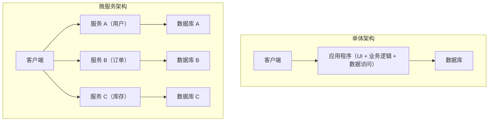
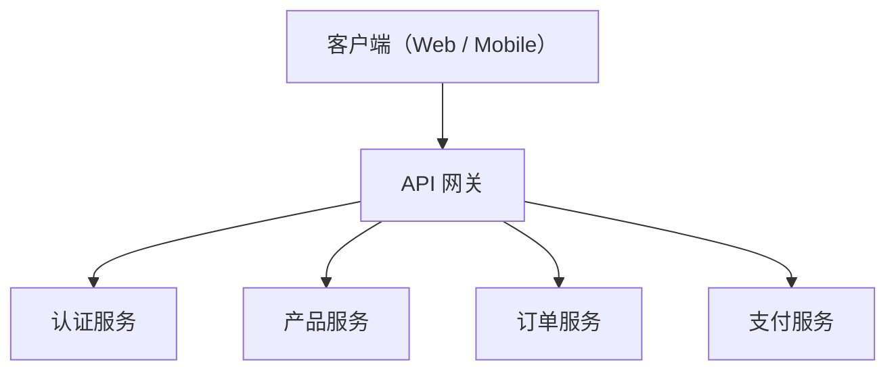
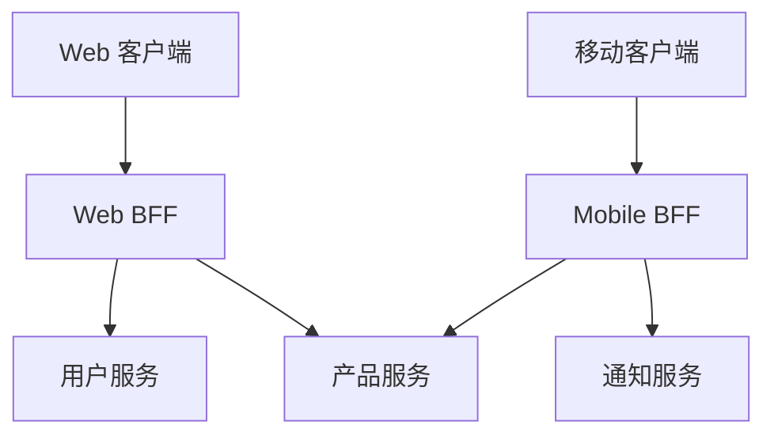

# 微服务架构的明与暗（BFF与API Gateway）

在现代软件开发中，为了提高可扩展性和开发敏捷性，越来越多地采用 **微服务架构** 。然而，拆分系统同时也意味着会产生新的复杂性。

本文将从单体架构的局限性开始，深入探讨微服务带来的优势及其背后的“暗”面（如运维上的挑战等）。接着，我们将结合图解和具体的代码示例，详细解说为解决这些挑战而生的架构模式—— **API Gateway** 和 **BFF（Backend for Frontend）** 。

---

## 1. 单体架构的局限性

**单体架构** 是一种将应用程序的所有功能（UI、业务逻辑、数据访问等）作为单一代码库、单一进程来构建的方法。在开发初期，由于它简单且易于部署，因此是非常有效的选择。

但是，随着系统的成长，功能和开发团队规模的扩大，会出现以下局限性：

*   **代码库的臃肿与复杂化** ：随着功能的不断添加，代码库变得庞大，难以把握整体。一次修改影响到意想不到功能的风险（回归Bug）会增加。
*   **缺乏部署灵活性** ：即使是很小的修改，也需要重新构建并重新部署整个应用程序。这导致部署的交付时间变长，敏捷性下降。
*   **可扩展性受限** ：即使只有特定功能（例如，图像处理功能等）大量消耗资源，也只能对整个应用程序进行横向扩展，导致资源利用效率恶化。
*   **技术栈的固化** ：由于是单一代码库，很难在局部引入新的语言或框架，容易被旧技术所束缚。

为了克服这些挑战，许多企业开始考虑向 **微服务架构** 转型。

---

## 2. 微服务架构的优势

在 **微服务架构** 中，应用程序被设计为按业务功能划分的、相互独立的小型服务（微服务）的集合体。每个服务都可以独立部署，并且通常拥有自己的数据库。



微服务具有以下光芒（优势）：

*   **独立部署** ：每个服务都可以独立开发、部署，因此可以加快发布周期。
*   **独立扩展** ：只需对负载较高的服务进行独立的横向扩展，从而优化基础设施成本。
*   **技术多样性（Polyglot）** ：可以为每个服务选择最合适的编程语言和数据库。
*   **故障局部化** ：即使一个服务宕机，也能防止整个系统停止（在有适当的容错设计的情况下）。

---

## 3. 微服务的“暗”：运维上的挑战

然而，微服务并不是“银弹”。通过将系统分布式化，[分布式系统](/zh-cn/p/cap-theorem-distributed-systems-tradeoff/)特有的复杂性这一“暗”面也随之而来。

### 3.1. 网络延迟与通信的复杂化
在单体架构中只需在内存中进行函数调用的处理，变成了跨网络的通信（HTTP/REST、gRPC等）。由此会产生 **网络延迟** ，存在系统整体响应速度下降的风险。此外，由于网络始终是不稳定的，因此必须实现超时、重试控制、断路器等复杂的通信控制。

### 3.2. 分布式事务与数据一致性
由于每个服务都拥有自己的数据库，跨多个服务的数据更新（事务）变得非常困难。传统的[RDBMS](https://kenji.blog/zh-cn/p/rdbms-transaction-acid-isolation-level-lock/)中可用的ACID事务不再适用，不得不引入容忍最终一致性（Eventual [Consistency](https://kenji.blog/zh-cn/p/cap-theorem-distributed-systems-tradeoff/)）的复杂设计模式，如 **Saga模式** 或 **事件溯源（Event Sourcing）** 。

### 3.3. 客户端访问的复杂化
当存在数十、数百个服务时，让客户端（Web浏览器或移动应用）掌握应该调用哪个API端点并分别进行通信是不现实的。此外，为了显示一个页面，可能需要向多个服务发送大量请求（Chatty API），从而导致性能恶化。

为了解决这个“客户端访问的复杂化”问题， **API Gateway** 和 **BFF** 应运而生。

---

## 4. 客户端与服务群的桥梁：API Gateway

**API Gateway** 位于客户端和后端的微服务群之间，作为所有请求的单一入口点（接待窗口）发挥作用。



### 4.1. API Gateway的主要作用
*   **路由** ：根据客户端的请求路径，将请求转发（反向代理）到适当的后端服务。
*   **认证与授权** ：在网关层集中进行令牌（如JWT）的验证，减轻各微服务侧在认证处理上的负担。
*   **限流（流量控制）** ：为了保护后端免受过多请求的影响，限制API的调用次数。
*   **协议转换** ：将客户端发起的HTTP（REST）请求，转换为面向后端的gRPC通信等协议转换。

### 4.2. API Gateway的挑战（单点故障与瓶颈化）
API Gateway虽然非常强大，但由于所有流量都会集中于此，很容易成为整个系统的 **单点故障（SPOF）** 。此外，如果将所有功能（认证、转换、部分业务逻辑等）都过度塞入API Gateway，就会变成一个庞大的单体Gateway，最终损失敏捷性，重演“ESB（企业服务总线）的悲剧”。

---

## 5. 面向各客户端的优化：BFF（Backend for Frontend）模式

进一步发展API Gateway的概念，提供专门针对客户端需求的API层，这就是 **BFF（Backend for Frontend）** 模式。

### 5.1. BFF模式的概念
无论是Web浏览器、iOS应用、Android应用，还是智能手表，根据客户端种类的不同，想要在屏幕上显示的数据和网络带宽的要求都会有很大差异。

如果试图用单一的API Gateway来满足所有这些需求，API就会变得过于通用，从而包含多余的数据（过度获取，Over-fetching），或者反过来，为了补充不足的数据，客户端需要发送多次请求（获取不足，Under-fetching）。

在BFF中， **为每种客户端准备专用的后端（BFF）** 。BFF会将该客户端UI所需的数据，加工（聚合）成合适的格式并返回。

### 5.2. Web用BFF与Mobile用BFF的分离

下图是为Web和移动端分别部署了不同BFF的架构。



*   **Web BFF** ：聚合返回用于在PC宽大屏幕上显示的丰富数据集。
*   **Mobile BFF** ：考虑到屏幕较小和网络线路不稳定，返回将数据量缩减到最低限度的负载。

这样一来，UI团队可以自行开发和维护其客户端专用的BFF，无需等待后端团队的API变更，从而能够推进敏捷的UI开发。

---

## 6. BFF中的数据聚合实现示例（Node.js × GraphQL）

作为BFF的技术栈，近年来非常受欢迎的是 **GraphQL** 。由于GraphQL允许客户端通过查询精确指定“需要的数据”，这与BFF的目的完美契合。

在这里，我们将介绍一个简单的BFF实现示例，使用Node.js（Apollo Server）来聚合用户信息和订单历史的API。

### 代码示例：使用GraphQL进行数据聚合

```javascript
// index.js
const { ApolloServer, gql } = require('apollo-server');
const axios = require('axios');

// 1. 定义GraphQL Schema
// 定义客户端所需数据的结构。
const typeDefs = gql`
  type User {
    id: ID!
    name: String!
    email: String!
  }

  type Order {
    id: ID!
    productId: ID!
    amount: Int!
    status: String!
  }

  type UserProfile {
    user: User!
    orders: [Order]!
  }

  type Query {
    # 一次性获取用户资料和订单历史的查询
    userProfile(userId: ID!): UserProfile
  }
`;

// 2. 定义Resolver（数据聚合的逻辑）
const resolvers = {
  Query: {
    userProfile: async (_, { userId }) => {
      try {
        // 向不同的微服务（User和Order）并行发送HTTP请求
        // 通过使用Promise.all，将网络等待时间最小化。
        const [userResponse, ordersResponse] = await Promise.all([
          axios.get(\`http://user-service/api/users/\${userId}\`),
          axios.get(\`http://order-service/api/orders?userId=\${userId}\`)
        ]);

        // 合并获取到的数据，并按照GraphQL Schema的格式返回
        return {
          user: userResponse.data,
          orders: ordersResponse.data
        };
      } catch (error) {
        console.error("从微服务获取数据失败", error);
        throw new Error("获取用户资料数据失败");
      }
    }
  }
};

// 3. 启动服务器
const server = new ApolloServer({ typeDefs, resolvers });

server.listen({ port: 4000 }).then(({ url }) => {
  console.log(\`🚀 BFF 服务器已在 \${url} 启动\`);
});
```

通过这一实现，客户端只需调用一次 `userProfile` GraphQL查询，就可以一次性获取用户信息和订单历史这两个后端服务的数据。客户端的通信次数大幅减少，性能和开发体验都得到了提升。

---

## 7. 结语

微服务架构是将庞大系统演进为可扩展形式的强大方法，但我们也必须面对[分布式系统](/zh-cn/p/cap-theorem-distributed-systems-tradeoff/)特有的“暗”面挑战。

作为解决这些挑战、优化客户端与后端之间通信的手段， **API Gateway** 和 **BFF模式** 已经成为不可或缺的存在。特别是为不同类型的客户端设置专用端点的BFF，是一种能够将UI进化速度从后端制约中解放出来的卓越架构。

请根据自身团队的体制、客户端的多样性以及系统的规模，适当设计并引入API Gateway和BFF，构建一个更加健壮且敏捷度更高的系统吧。
