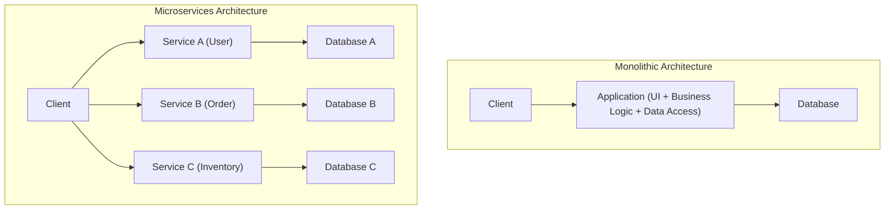
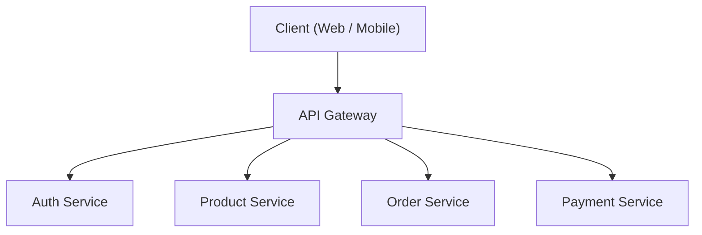
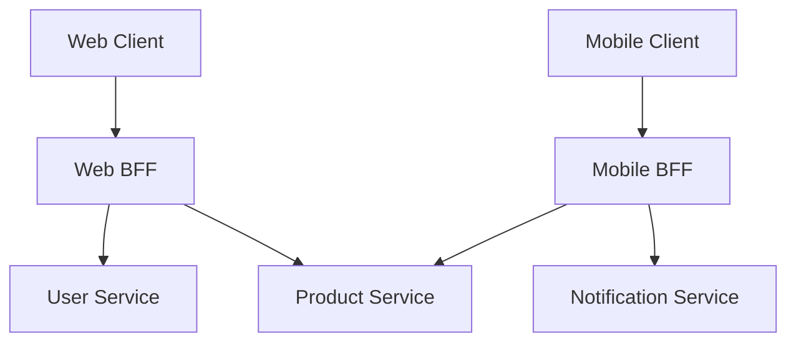

# 微服務架構的光與影（BFF與API Gateway）

在現代軟體開發中，為了提升擴展性與開發的敏捷性，越來越多企業選擇採用 **微服務架構** 。然而，將系統拆分的同時，也意味著會產生新的複雜度。

本文將從單體架構的侷限性開始，深入探討微服務帶來的優勢以及其背後的「陰影」部分（如營運上的挑戰等）。接著，將介紹為解決這些挑戰而生的架構模式—— **API Gateway** 與 **BFF（Backend for Frontend）** ，並搭配圖解與具體的程式碼範例進行詳細解說。

---

## 1. 單體架構的侷限性

**單體架構** 是一種將應用程式的所有功能（UI、商業邏輯、資料存取等）建構為單一程式碼庫、單一進程的手法。在開發初期，因為簡單且易於部署，這是一個非常有效的選擇。

然而，隨著系統成長，功能與開發團隊的規模不斷擴大，以下侷限性便會逐漸浮現：

*   **程式碼庫的肥大化與複雜化** ：隨著功能不斷新增，程式碼庫會變得巨大，難以掌握整體架構。單一的修改影響到未預期功能（回歸錯誤）的風險也會隨之升高。
*   **缺乏部署的彈性** ：即使是微小的修正，也需要重新建置並重新部署整個應用程式。這會拉長部署的交付週期，降低敏捷性。
*   **擴展性的限制** ：即使只有特定功能（例如圖片處理功能等）大量消耗資源，也只能向外擴展整個應用程式，導致資源使用效率低落。
*   **技術堆疊的固化** ：由於是單一的程式碼庫，難以局部導入新的語言或框架，容易被舊有技術所束縛。

為克服這些挑戰，許多企業開始考慮轉向 **微服務架構** 。

---

## 2. 微服務架構的優勢

在 **微服務架構** 中，會將應用程式設計為依商業功能劃分且各自獨立的小型服務（微服務）集合體。每個服務皆可獨立部署，通常也會擁有自己的資料庫。



微服務擁有以下的光（優勢）：

*   **獨立的部署** ：可針對各個服務獨立進行開發與部署，從而加快發布週期。
*   **個別的擴展** ：僅針對高負載的服務進行個別的向外擴展，能夠最佳化基礎設施成本。
*   **技術的多樣性（Polyglot）** ：可為每個服務選擇最合適的程式語言或資料庫。
*   **故障的局部化** ：即使單一服務停機，也能防止整個系統停擺（在有適當容錯設計的情況下）。

---

## 3. 微服務的「陰影」：營運上的挑戰

然而，微服務並非「銀彈」。將系統分散化，也伴隨著分散式系統特有的複雜度這種「陰影」。

### 3.1. 網路延遲與通訊的複雜化
如果在單體架構中，只需透過記憶體內的函式呼叫即可完成的處理，將轉變為跨網路的通訊（HTTP/REST、gRPC 等）。這會產生 **網路延遲** ，並帶來系統整體回應速度下降的風險。此外，由於網路總是不穩定的，因此需要實作如超時控制、重試機制或斷路器（Circuit Breaker）等複雜的通訊控制。

### 3.2. 分散式交易與資料一致性
由於每個服務擁有自己的資料庫，橫跨多個服務的資料更新（交易）會變得非常困難。無法使用傳統 [RDBMS](https://kenji.blog/zh-tw/p/rdbms-transaction-acid-isolation-level-lock/) 提供的 [ACID](https://kenji.blog/zh-tw/p/rdbms-transaction-acid-isolation-level-lock/) 交易，而必須被迫導入如 **Saga 模式** 或 **事件溯源（Event Sourcing）** 等允許最終一致性（Eventual [Consistency](https://kenji.blog/zh-tw/p/cap-theorem-distributed-systems-tradeoff/)）的複雜設計模式。

### 3.3. 來自客戶端存取的複雜化
當存在數十、數百個服務時，要求客戶端（網頁瀏覽器或行動應用程式）掌握應呼叫哪個 API 端點並分別進行通訊，是不切實際的。此外，為了顯示一個畫面，可能需要對多個服務發送大量請求（Chatty API），這將導致效能惡化。

為解決這種「來自客戶端存取的複雜化」， **API Gateway** 與 **BFF** 應運而生。

---

## 4. 客戶端與服務群的仲介角色：API Gateway

**API Gateway** 配置於客戶端與後端微服務群之間，作為所有請求的單一入口點（接待窗口）發揮作用。



### 4.1. API Gateway 的主要職責
*   **路由（Routing）** ：根據來自客戶端的請求路徑，將請求轉發（反向代理）至適當的後端服務。
*   **驗證與授權** ：在 Gateway 層集中驗證權杖（如 JWT 等），減輕各微服務端進行驗證處理的負擔。
*   **速率限制（流量控制）** ：為了保護後端免受過多請求的影響，會限制 API 的呼叫次數。
*   **協定轉換** ：進行協定轉換，例如從客戶端接收 HTTP（REST）請求，而對後端則使用 gRPC 進行通訊。

### 4.2. API Gateway 的挑戰（單點故障與效能瓶頸）
API Gateway 雖然非常強大，但由於所有流量都會集中於此，容易成為系統整體的 **單點故障（SPOF）** 。此外，若將所有功能（驗證、轉換、部分商業邏輯等）過度塞入 API Gateway 中，將會使其變成一個巨大的單體 Gateway，最終損害敏捷性，重蹈「ESB（企業服務匯流排）悲劇」的覆轍。

---

## 5. 針對個別客戶端的最佳化：BFF（Backend for Frontend）模式

進一步發展 API Gateway 的概念，提供專門針對客戶端需求的 API 層，這就是 **BFF（Backend for Frontend）** 模式。

### 5.1. BFF 模式的概念
根據客戶端類型的不同（例如網頁瀏覽器、iOS 應用程式、Android 應用程式，甚至是智慧手錶等），畫面上需要顯示的資料與網路頻寬的需求會有很大的差異。

若試圖用單一的 API Gateway 滿足所有這些需求，API 會變得過於通用，從而包含不必要的資料（過度獲取），或是相反地，為了補足缺失的資料，客戶端需要發送多次請求（獲取不足）。

在 BFF 中，會 **為每種客戶端類型準備專用的後端（BFF）** 。BFF 會將該客戶端 UI 所需的資料，加工（聚合）成適當的格式並回傳。

### 5.2. Web 用 BFF 與 Mobile 用 BFF 的分離

下圖是將 Web 與 Mobile 配置為不同 BFF 的架構。



*   **Web BFF** ：為了在 PC 的寬螢幕上顯示，會聚合並回傳豐富的資料集。
*   **Mobile BFF** ：考慮到窄螢幕與不穩定的網路連線，會將資料量縮減至最低限度後回傳有效載荷（Payload）。

像這樣，藉由讓 UI 團隊自行開發與維護專屬於自己客戶端的 BFF，便能在無需等待後端團隊修改 API 的情況下，推進敏捷的 UI 開發。

---

## 6. BFF 中的資料聚合實作範例（Node.js × GraphQL）

作為 BFF 的技術堆疊，近年來 **GraphQL** 受到極大的歡迎。因為 GraphQL 允許客戶端透過查詢指定「僅需的資料」，完美契合了 BFF 的目的。

在此，我們將介紹一個使用 Node.js（Apollo Server）來聚合使用者資訊與訂單歷史 API 的簡單 BFF 實作範例。

### 程式碼範例：使用 GraphQL 進行資料聚合

```javascript
// index.js
const { ApolloServer, gql } = require('apollo-server');
const axios = require('axios');

// 1. 定義 GraphQL 結構（Schema）
// 定義客戶端所需資料的結構。
const typeDefs = gql`
  type User {
    id: ID!
    name: String!
    email: String!
  }

  type Order {
    id: ID!
    productId: ID!
    amount: Int!
    status: String!
  }

  type UserProfile {
    user: User!
    orders: [Order]!
  }

  type Query {
    # 一次獲取使用者個人資料與訂單歷史的查詢
    userProfile(userId: ID!): UserProfile
  }
`;

// 2. 定義解析器（資料聚合的邏輯）
const resolvers = {
  Query: {
    userProfile: async (_, { userId }) => {
      try {
        // 平行向不同的微服務（User 與 Order）發送 HTTP 請求
        // 透過使用 Promise.all，將網路等待時間降至最低。
        const [userResponse, ordersResponse] = await Promise.all([
          axios.get(\`http://user-service/api/users/\${userId}\`),
          axios.get(\`http://order-service/api/orders?userId=\${userId}\`)
        ]);

        // 結合獲取的資料，並依照 GraphQL 結構的格式回傳
        return {
          user: userResponse.data,
          orders: ordersResponse.data
        };
      } catch (error) {
        console.error("Failed to fetch data from microservices", error);
        throw new Error("Failed to fetch user profile data");
      }
    }
  }
};

// 3. 啟動伺服器
const server = new ApolloServer({ typeDefs, resolvers });

server.listen({ port: 4000 }).then(({ url }) => {
  console.log(\`🚀 BFF Server ready at \${url}\`);
});
```

透過此實作，客戶端只需發出一個 `userProfile` 的 GraphQL 查詢，就能一次取得來自多個後端服務（使用者資訊與訂單歷史）的資料。客戶端的通訊次數大幅減少，從而提升了效能與開發體驗。

---

## 7. 結語

微服務架構是讓龐大系統朝可擴展形式進化的一種強大方法，但我們必須面對分散式系統所帶來的「陰影」挑戰。

作為解決這些挑戰並最佳化客戶端與後端之間通訊的手段， **API Gateway** 與 **BFF 模式** 已成為不可或缺的存在。特別是為每種客戶端類型設立專用端點的 BFF，是一種能將 UI 演進速度從後端限制中解放出來的優秀架構。

根據自家團隊的體制、客戶端的多樣性以及系統的規模，適當地設計與導入 API Gateway 及 BFF，建構出更穩健且具備高度敏捷性的系統吧。
