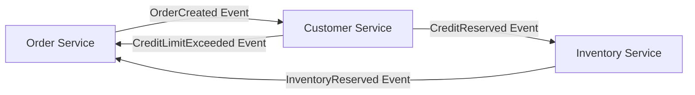
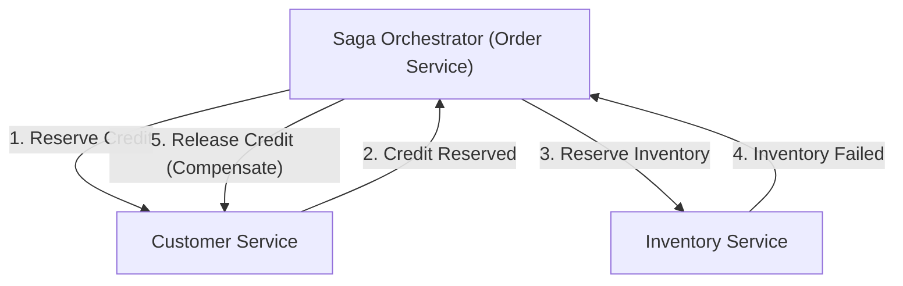

# مقدمة: التحول النموذجي من البنية المتجانسة إلى الخدمات المصغرة

في هندسة البرمجيات الحديثة، مع زيادة حجم الأنظمة وتعقيدها، أصبح الانتقال من البنية المتجانسة (Monolithic Architecture) إلى بنية الخدمات المصغرة (Microservices Architecture) مساراً لا مفر منه للعديد من الشركات. تقدم الخدمات المصغرة فوائد لا تحصى مثل قابلية التوسع (Scalability)، والنشر المستقل (Independent Deployment)، وتنوع حزم التكنولوجيا، وخفة حركة المؤسسة (Organizational Agility). ومع ذلك، فإن هذا التحول النموذجي ليس حلاً سحرياً بأي حال من الأحوال. من أصعب التحديات التي تواجه فرق التطوير التي تتبنى الخدمات المصغرة هي "إدارة البيانات الموزعة" (Distributed Data Management) و"المعاملات الموزعة" (Distributed Transactions).

في هذه المقالة، سنتعمق بشكل كبير في سبب مواجهتنا لصعوبات المعاملات الموزعة المصاحبة لتقسيم الخدمات المصغرة، وذلك بعد التحول من راحة معاملات ACID في عصر البنية المتجانسة. سنناقش لماذا يُعتبر الالتزام ثنائي المراحل (Two-Phase Commit أو 2PC) التقليدي نمطاً مضاداً (Anti-pattern) في البيئات الموزعة، وسنستكشف الصورة الكاملة لنمط "ساجا" (Saga Pattern)، الذي أصبح المعيار الفعلي (De facto standard) في بنى الخدمات المصغرة الحديثة، مع التطرق إلى قبول "الاتساق النهائي" (Eventual Consistency) وصعوبة تصميم المعاملات التعويضية (Compensating Transactions).

## المشهد الرعوي لعصر البنية المتجانسة: الفخ الجميل لخصائص ACID

في عالم التطبيقات المتجانسة، كانت إدارة البيانات بسيطة ويمكن التنبؤ بها بشكل مذهل. تألف التطبيق بأكمله من قاعدة تعليمات برمجية (Codebase) ضخمة واحدة، وعادة ما كان يتشارك في قاعدة بيانات علائقية واحدة (RDBMS). بفضل قاعدة البيانات الفردية هذه، تمكن المطورون من الاستمتاع بخصائص ACID القوية التي توفرها قاعدة البيانات كأمر مسلم به.

ACID هي اختصار للخصائص الأربع التالية:

1. **الذرية (Atomicity):** تضمن أن جميع العمليات داخل المعاملة إما "تنجح بالكامل" أو "تفشل بالكامل (ويتم التراجع عنها)". لا توجد حالة وسيطة.
2. **الاتساق (Consistency):** تضمن أنه قبل وبعد تنفيذ المعاملة، يتم دائماً استيفاء قيود قاعدة البيانات وقواعد العمل.
3. **العزل / الاستقلالية (Isolation):** تضمن أنه حتى عند تنفيذ معاملات متعددة في نفس الوقت، فإن كل معاملة لا تتداخل مع الأخرى.
4. **المتانة (Durability):** تضمن أنه بمجرد الالتزام بالمعاملة (Commit)، لن تضيع نتيجتها حتى في حالة حدوث فشل في النظام.

على سبيل المثال، لنفكر في عملية "الطلب" في موقع تجارة إلكترونية. عندما يطلب العميل منتجاً، يتم تنفيذ الخطوات الثلاث التالية:
1. إنشاء سجل الطلب في جدول `orders`.
2. تقليل الحد الائتماني للعميل في جدول `customers`.
3. تقليل مخزون المنتج في جدول `inventory`.

في البنية المتجانسة، كان يكفي إحاطة جميع هذه العمليات بمعاملة قاعدة بيانات واحدة (`BEGIN; ... COMMIT;`). إذا حدث خطأ في الخطوة 3 بسبب نقص المخزون، تقوم قاعدة البيانات تلقائياً بالتراجع (Rollback) عن الخطوتين 1 و 2، ويحافظ النظام على حالة متسقة. لم يكن المطورون بحاجة إلى القلق بعمق بشأن معالجة الأخطاء المعقدة أو تناقضات الحالة، حيث تم ضمان اتساق البيانات تماماً على مستوى البنية التحتية. يمكن القول إن هذه الراحة التي توفرها معاملات ACID كانت حقاً "فخاً جميلاً".

## برية الخدمات المصغرة: كابوس إدارة البيانات الموزعة

عندما ينمو النظام ويصل إلى حدود قابلية التوسع وسرعة التطوير، تتوجه الفرق نحو بنية الخدمات المصغرة، التي تقسم النظام المتجانس إلى خدمات صغيرة متعددة. من أفضل الممارسات في الخدمات المصغرة هو نمط "قاعدة بيانات لكل خدمة" (Database per Service). وهذا مبدأ ينص على أن كل خدمة مصغرة تدير بياناتها الخاصة وتُمنع من الوصول المباشر إلى قواعد البيانات الخاصة بالخدمات الأخرى.

إذا طبقنا هذا المبدأ على موقع التجارة الإلكترونية المذكور سابقاً، فسيتم تقسيم النظام على النحو التالي:
- **خدمة الطلبات (Order Service):** تمتلك قاعدة بيانات لإدارة بيانات الطلبات.
- **خدمة العملاء (Customer Service):** تمتلك قاعدة بيانات لإدارة معلومات العملاء والحد الائتماني.
- **خدمة المخزون (Inventory Service):** تمتلك قاعدة بيانات لإدارة مخزون المنتجات.

بينما يعزز هذا التكوين من استقلالية الخدمات، فإنه يتسبب في "كابوس إدارة البيانات الموزعة". لم يعد من الممكن تحديث جداول متعددة بمعاملة قاعدة بيانات واحدة. تتطلب عمليات "إنشاء الطلب" و"تأمين الحد الائتماني" و"تأمين المخزون" تنسيقاً عبر عدة خدمات مستقلة من خلال الشبكة.

ماذا يحدث إذا نجح إنشاء الطلب في خدمة الطلبات وتأمين الائتمان في خدمة العملاء، ولكن خدمة المخزون كانت معطلة وفشل تأمين المخزون؟
سحر معاملة قاعدة البيانات المحلية غير موجود هنا. سيتم تقليل الائتمان، ولن يتم تقليل المخزون، ولكن سيكون الطلب في حالة معلقة أو فاشلة، مما يؤدي إلى "عدم اتساق بيانات" كارثي (Data Inconsistency). هذا هو جوهر مشكلة المعاملات الموزعة في الخدمات المصغرة.

## إغراء الالتزام ثنائي المراحل (2PC) والقيود القاتلة

كنهج كلاسيكي للحفاظ على اتساق المعاملات في الأنظمة الموزعة، يوجد بروتوكول الالتزام ثنائي المراحل (Two-Phase Commit أو 2PC). يحاول العديد من المطورين إيجاد حل في تطبيقات 2PC، مثل معاملات XA التي توفرها قواعد البيانات الموزعة أو وسطاء الرسائل (Message Queues).

يتكون 2PC من مدير المعاملات (المنسق - Coordinator) ومديري الموارد المتعددين (المشاركين - Participants)، ويتقدم في المرحلتين التاليتين:

1. **مرحلة الإعداد (Prepare Phase):** يستفسر المنسق من جميع المشاركين عما إذا كانوا "مستعدين للالتزام". يقوم كل مشارك بقفل (Lock) الموارد، ووضعها في حالة قابلة للالتزام، ثم يرسل "نعم" أو "لا".
2. **مرحلة الالتزام / التراجع (Commit / Rollback Phase):** إذا أجاب جميع المشاركين بـ "نعم"، يوجه المنسق الجميع لـ "الالتزام". إذا أجاب مشارك واحد على الأقل بـ "لا" أو لم يستجب، فإنه يوجه الجميع لـ "التراجع".

للوهلة الأولى، يبدو حلاً مثالياً، ولكن في بيئات الخدمات المصغرة الحديثة السحابية الأصلية (Cloud-native)، يُعتبر 2PC نمطاً مضاداً خطيراً للأسباب التالية:

- **الحظر المتزامن وتدهور الأداء:** العيب الأكبر لـ 2PC هو أن البروتوكول بأكمله متزامن (Synchronous)، ويستمر المشاركون في الاحتفاظ بأقفال الموارد. في حالة حدوث تأخير في الشبكة أو فشل مؤقت لأحد المشاركين، ستُجبر جميع الخدمات الأخرى على الانتظار حتى يتم تحرير القفل، مما يقلل بشكل كبير من إنتاجية (Throughput) النظام بأكمله.
- **نقطة الفشل الفردية (SPOF):** إذا فشل منسق المعاملات، يقع المشاركون في حالة انتظار (حالة شك - In-doubt state) مع الاحتفاظ بالأقفال، وهناك خطر من أن يصل النظام إلى حالة الجمود (Deadlock).
- **عدم التوافق مع قواعد بيانات NoSQL ووسطاء الرسائل:** لا تدعم العديد من قواعد بيانات NoSQL الحديثة ووسطاء الرسائل معاملات XA (أي 2PC) لإعطاء الأولوية لقابلية التوسع. هذا يضيق الخيارات التكنولوجية بشكل كبير.
- **تأثير سلبي على التوافر (Availability):** يجب تصميم الخدمات المصغرة على افتراض "الفشل الجزئي". ولكن في 2PC، إذا تعطلت خدمة واحدة، تفشل المعاملة بأكملها، مما يعني أن التوافر الكلي للنظام يصبح نتاج ضرب توافر الخدمات الفردية وينخفض بشكل حاد.

## نظرية CAP وقبول الاتساق النهائي (Eventual Consistency)

إذا تخلينا عن الاتساق القوي (Strong Consistency) مثل 2PC، فماذا يجب أن نفعل؟ هنا يأتي دور فهم المبدأ الأساسي للأنظمة الموزعة "نظرية CAP" وخصائص "BASE".

تنص نظرية CAP (CAP Theorem) على أنه في النظام الموزع، لا يمكن تلبية سوى ضمانين كحد أقصى من الضمانات الثلاثة التالية في نفس الوقت:
- **الاتساق (Consistency):** تُرجع جميع العقد (Nodes) نفس البيانات.
- **التوافر (Availability):** يُرجع كل طلب إلى عقدة غير معطلة دائماً استجابة ناجحة.
- **التسامح مع التقسيم (Partition tolerance):** يستمر النظام في العمل حتى في حالة حدوث انقسام في الشبكة.

نظراً لأن انقسام الشبكة (P) أمر لا مفر منه في البيئات السحابية الحقيقية، فنحن مضطرون دائماً لإجراء مفاضلة بين "C" و "A" (إما CP أو AP). في بنية الخدمات المصغرة، من الشائع اختيار "أنظمة AP" التي تعطي الأولوية لتوافر النظام (A) وقابليته للتوسع، وتساوم على الاتساق المطلق (C).

نتاج هذه التسوية هو "الاتساق النهائي" (Eventual Consistency). يشير الاتساق النهائي إلى فكرة أنه "قد لا تتطابق جميع البيانات على الفور، ولكن بمرور الوقت (Eventually) ستتطابق جميع البيانات في النهاية وتصل إلى حالة متسقة".

بدلاً من ACID، في الأنظمة الموزعة، يتم تطبيق مفهوم **BASE**:
- **متاح بشكل أساسي (Basically Available):** حتى لو تعطل جزء من النظام، سيستمر النظام ككل في العمل.
- **حالة مرنة (Soft state):** لا يتم الحفاظ على اتساق البيانات دائماً، وتتغير الحالة بمرور الوقت.
- **متسق في النهاية (Eventually consistent):** سيتم ضمان اتساق البيانات في النهاية.

يعتمد تصميم المعاملات في الخدمات المصغرة على كيفية تحقيق هذا الاتساق النهائي كنظام متكامل بأمان وبطريقة يمكن التنبؤ بها. النمط المعماري المحدد لذلك هو "نمط ساجا" (Saga Pattern).

## فجر نمط ساجا: المعيار الجديد للمعاملات الموزعة

نمط ساجا هو مفهوم لإدارة المعاملات طويلة المدى (Long-Lived Transaction: LLT)، والذي نشأ من ورقة بحثية نُشرت في عام 1987 بواسطة هيكتور غارسيا مولينا (Hector Garcia-Molina) وكينيث سالم (Kenneth Salem). في العصر الحديث، تم إحياؤه كمعيار فعلي لحل مشكلة المعاملات الموزعة في الخدمات المصغرة.

الفكرة الأساسية وراء نمط ساجا هي تقسيم المعاملة الموزعة واسعة النطاق إلى سلسلة من "المعاملات المحلية ACID" المستقلة، حيث تكتمل كل منها داخل خدمة مصغرة معينة.

لإكمال ساجا بالكامل، تنفذ كل خدمة معاملتها المحلية وتصدر "حدثاً" (Event) أو "رسالة" تشير إلى اكتمالها. تتلقى الخدمة التالية هذا الحدث وتنفذ معاملتها المحلية الخاصة. إذا حدث انتهاك لقواعد العمل أو خطأ (مثل: نقص المخزون، تجاوز الحد الائتماني) في خطوة وسيطة، تتراجع ساجا من تلك النقطة لتنفيذ عمليات "لإلغاء" المعاملات المحلية التي تم تنفيذها حتى الآن. يُسمى هذا بـ **المعاملة التعويضية (Compensating Transaction)**.

يكون تدفق المعاملات في ساجا كالتالي:
لنفترض سلسلة من المعاملات المحلية $T_1, T_2, \dots, T_n$. والمعاملات التعويضية المقابلة لها هي $C_1, C_2, \dots, C_{n-1}$.

1. الحالة الطبيعية: تنجح $T_1 \rightarrow T_2 \rightarrow \dots \rightarrow T_n$ بالكامل، وتكتمل ساجا.
2. الحالة الاستثنائية (عند الفشل في $T_k$): تنجح المعاملات حتى $T_1 \rightarrow T_2 \rightarrow \dots \rightarrow T_{k-1}$، ويحدث خطأ في $T_k$. بعد ذلك، يتم تنفيذ $C_{k-1} \rightarrow C_{k-2} \rightarrow \dots \rightarrow C_1$ بترتيب عكسي، ويعود النظام بأكمله إلى حالة متسقة أصلية (حالة التراجع الدلالي).

يوجد نهجان رئيسيان لتنفيذ نمط ساجا، بناءً على من يتولى دور تنسيق المعاملة: "الكوريغرافيا" (Choreography) و "التنسيق" (Orchestration).

### الكوريغرافيا (Choreography): رقصة الخدمات المستقلة

في نهج الكوريغرافيا، لا يوجد منسق مركزي يدير ساجا. تعمل كل خدمة مصغرة بشكل مستقل وتدفع المعاملة للأمام من خلال نشر والاشتراك (Pub/Sub) في أحداث النطاق (Domain Events). الأمر يشبه الراقصين الذين يرقصون بشكل مستقل (Choreography) بالتزامن مع الموسيقى وحركة من حولهم بدون قائد فرقة مركزي.

**مزايا الكوريغرافيا:**
- **الاقتران الفضفاض (Loose Coupling):** نظراً لعدم الاعتماد على منسق مركزي، لا توجد نقطة فشل واحدة، ويظل مستوى الاقتران بين الخدمات منخفضاً.
- **تنفيذ بسيط (في المقاييس الصغيرة):** عندما يكون عدد الخدمات المشاركة قليلاً (من 2 إلى 4 تقريباً)، يمكن تنفيذه فقط عن طريق إصدار الأحداث والاستماع إليها، مما يسهل اعتماده.

**عيوب الكوريغرافيا:**
- **صعوبة فهم الصورة الكاملة:** نظراً لأن تدفق معاملات النظام بأكمله متناثر عبر أجزاء الكود المصدري، يصبح من الصعب جداً تتبع وتصحيح (Debug) ما يحدث بشكل عام (الحالة الحالية لساجا).
- **خطر التبعيات الدائرية:** عندما تستمع الخدمات لأحداث بعضها البعض، يزداد خطر الوقوع في مراجع دائرية (Circular References) أو حلقات لا نهائية.
- **الضعف أمام التعقيد:** عندما يزداد عدد الخطوات أو تصبح الشروط الفرعية معقدة، تتحول البنية بأكملها إلى "سباغيتي" (Spaghetti) وتصبح غير قابلة للصيانة.

### التنسيق (Orchestration): القائد المركزي

في نهج التنسيق، يتم وضع "منسق ساجا" (Saga Orchestrator) الذي يتحكم مركزياً في تدفق التنفيذ لساجا. يعمل المنسق مثل قائد الأوركسترا، حيث يوجه أي خدمة يجب أن تنفذ معاملة محلية بعد ذلك، ويتلقى نتيجتها لإصدار التعليمات التالية، ويوجه المعاملة التعويضية المناسبة في حالة حدوث خطأ.

**مزايا التنسيق:**
- **الإدارة المركزية والرؤية:** نظراً لتجميع تعريف سير العمل (Workflow) لساجا في مكان واحد (المنسق)، يصبح من السهل جداً فهم الصورة الكاملة، ومراقبة الحالة، وتصحيح الأخطاء.
- **القضاء على التبعيات الدائرية:** تستجيب الخدمات المشاركة لتعليمات المنسق فقط ولا تحتاج إلى معرفة بعضها البعض، مما يجعل التبعيات أحادية الاتجاه.
- **التعامل مع التدفقات المعقدة:** يمكن تنفيذ منطق المعاملات المعقد بمرونة مثل التفرع الشرطي، والتنفيذ المتوازي، وإعادة المحاولة (Retry)، وانتهاء الوقت (Timeout).

**عيوب التنسيق:**
- **الاعتماد على المنسق:** إذا تركز منطق العمل بشكل كبير في المنسق، فهناك خطر من أن يصبح "بنية متجانسة ذكية" فعلية، مما يقلص الخدمات الأخرى إلى مجرد خدمات CRUD (نموذج النطاق الضعيف - Anemic Domain Model).
- **تعقيد البنية التحتية:** لإدارة انتقالات الحالة، يتطلب الأمر تكلفة لتقديم وتشغيل محركات سير العمل أو أطر عمل آلات الحالة (State Machine Frameworks) مثل AWS Step Functions أو Camunda أو Temporal.

بشكل عام، بالنسبة للأنظمة التجارية حيث تمتد المعاملات عبر خدمات متعددة وتتضمن منطق عمل معقداً، **يُوصى باستخدام نهج التنسيق**.

## اللحم والدم الداعم لنمط ساجا: فلسفة تصميم المعاملات التعويضية

إن الحاجز الأكبر أمام فهم وتطبيق نمط ساجا بشكله الحقيقي هو تصميم "المعاملات التعويضية". في البيئة الموزعة، من المستحيل إعادة النظام "بالكامل إلى نفس حالته السابقة" مثل أمر `ROLLBACK` في قاعدة البيانات. والسبب هو أنه أثناء محاولتك التراجع عن المعاملة، قد تكون هناك بالفعل معاملة أخرى قرأت هذه البيانات أو قامت بتعديلها.

لذلك، يجب تصميم المعاملات التعويضية كعملية "تلغي بمعنى الأعمال (Business Sense)" بدلاً من "العودة بالنظام مادياً إلى الوراء".

على سبيل المثال، فكر في ساجا لحجز رحلة يتضمن حجز فندق وحجز رحلة طيران.
1. حجز فندق (نجاح)
2. حجز رحلة طيران (فشل لأنها محجوزة بالكامل)

في هذه الحالة، يجب إلغاء حجز الفندق (تعويضه) لأنه لم نتمكن من الحصول على رحلة الطيران. ومع ذلك، لا يمكنك ببساطة القيام بحذف مادي (DELETE) للبيانات من نظام حجز الفنادق. في العالم الحقيقي، قد يتم فرض رسوم إلغاء بناءً على سياسة الإلغاء في الفندق، وسيكون من الضروري ترك سجل يفيد بالإلغاء.
بعبارة أخرى، تصبح المعاملة التعويضية للفندق "تنفيذاً لمنطق عمل جديد وهو عملية الإلغاء (إدراج سجل جديد INSERT أو تحديث الحالة UPDATE)".

**المبادئ المهمة لتصميم المعاملة التعويضية:**

1. **ضمان الاستدامة (Idempotency):**
   في الأنظمة الموزعة، ونظراً لتأخير الشبكات وآليات إعادة المحاولة، يكون التسليم "على الأقل مرة واحدة" (At-Least-Once) حيث تصل نفس الرسالة عدة مرات هو المعيار. لذلك، يجب أن تتمتع المعاملات التعويضية (وكذلك المعاملات الأمامية) بـ "الاستدامة"، بحيث لا تتغير النتيجة بغض النظر عن عدد مرات التنفيذ. من الضروري تطبيق مفتاح الاستدامة (Idempotency Key) باستخدام مُعرّف معاملة فريد لتحديد ما إذا تمت معالجتها أم لا.

2. **الضمان المطلق للنجاح:**
   يُسمح للمعاملات الأمامية بالفشل بناءً على قواعد العمل (مثل نفاد المخزون). ومع ذلك، **يجب ألا تفشل المعاملات التعويضية مطلقاً من الناحية الفنية أو التجارية**. يجب أن تستمر إعادة المحاولة في التعويض الذي بدأ حتى يصل النظام إلى الاتساق النهائي. في حالة حدوث خطأ فادح يتطلب تدخلاً يدوياً، يجب توفير آلية لإرسال الرسالة إلى طابور الرسائل الميتة (Dead Letter Queue أو DLQ)، وإطلاق تنبيه ليتمكن المشغل من التعامل معه.

3. **استقلالية الترتيب (Commutativity):**
   في بيئات المراسلة غير المتزامنة، يمكن أن تحدث حالة غير طبيعية (Out of order) حيث يصل طلب المعاملة التعويضية لسبب ما قبل طلب تنفيذ المعاملة الأمامية. لمنع النظام من الانهيار حتى في مثل هذه الحالات، من الضروري إدارة حالة المعاملة بدقة واستخدام البرمجة الدفاعية مثل: "إذا ورد طلب تعويض لمعاملة لم تبدأ بعد، ضع علامة على هذه المعاملة كـ 'ملغاة' (Cancelled)، وتجاهل الطلب الأمامي إذا ورد لاحقاً".

4. **إجراءات مضادة لغياب العزل (Isolation):**
   نظراً لأن كل خطوة من خطوات ساجا تلتزم بقاعدة البيانات المحلية (Commit)، تصبح البيانات في "الحالة المتوسطة" الجارية لساجا مرئية للمعاملات الأخرى (ويسمى هذا بالقراءة القذرة - Dirty Read). لمنع ذلك، يُنصح بإعطاء البيانات "حالة" (State). على سبيل المثال، بدلاً من جعل حالة الطلب `APPROVED` (تمت الموافقة) منذ البداية، اجعلها `PENDING` (معلق)، ثم قم بتحديثها إلى `APPROVED` فقط عندما تنجح جميع خطوات ساجا، أو قم بتحديثها إلى `CANCELLED` (ملغى) في حالة الفشل. يمكن للخدمات الأخرى التعامل مع البيانات ذات الحالة `PENDING` على أنها غير مؤكدة (نمط القفل الدلالي - Semantic Lock Pattern).

## التحديات العملية وأنماط التصميم في تنفيذ نمط ساجا

عند تنفيذ نمط ساجا، يحتاج المطورون إلى الكتابة في قاعدة البيانات ونشر الرسائل إلى وسيط الرسائل (Message Broker) بشكل ذري (Atomically). في تسلسل "تحديث قاعدة البيانات ثم إرسال الرسالة"، إذا تعطل النظام بعد تحديث قاعدة البيانات، فلن يتم إرسال الرسالة وستنقطع ساجا (مشكلة الكتابة المزدوجة - Dual Write Problem).

النمط المعتمد على نطاق واسع لحل هذه المشكلة هو **نمط صندوق الصادر (Transactional Outbox Pattern)**.

في نمط صندوق الصادر، يتم إعداد جدول "صندوق الصادر" (Outbox) إلى جانب جدول "بيانات الأعمال" (Business Data) داخل قاعدة بيانات الخدمة نفسها.
ضمن المعاملة المحلية، وفي نفس وقت تحديث بيانات الأعمال، يتم إدراج (INSERT) الرسائل المراد إرسالها في جدول Outbox. نظراً لأنه يتم تنفيذ هذه العمليات داخل معاملة قاعدة البيانات نفسها، يتم ضمان الذرية (Atomicity) بشكل كامل.
بعد ذلك، تراقب عملية غير متزامنة أخرى (مثل أداة CDC كـ Debezium أو Message Relay) جدول Outbox، وتقرأ السجلات وترسلها بشكل موثوق إلى وسيط الرسائل (مثل Kafka أو RabbitMQ)، وتحذف السجل من جدول Outbox (أو تضع علامة "تم الإرسال") بعد اكتمال الإرسال. من خلال هذا، يتم بناء بنية تحتية للمراسلة تضمن التسليم "على الأقل مرة واحدة" بشكل موثوق، وتتحسن موثوقية ساجا بشكل كبير.

## الخلاصة: لكي تصبح مصمم أنظمة موزعة حقيقي

إن الانتقال إلى بنية الخدمات المصغرة ليس مجرد تغيير في البنية التحتية أو إطار العمل. إنه تحول نموذجي نحو "اتساق البيانات" ويتطلب تغييراً في النموذج الفكري لمهندسي البرمجيات.

يجب علينا التخلي عن الوهم المتزامن المسمى 2PC، وقبول واقع الأنظمة الموزعة — الشبكات غير مستقرة، وحالات الفشل تحدث بانتظام، والبيانات دائماً ما تتأخر قليلاً في المزامنة. إن إتقان الاتساق النهائي ونمط ساجا هو شرط أساسي للتغلب على أمواج الخدمات المصغرة العاتية وبناء أنظمة قابلة للتوسع ومرنة (Resilient) حقاً.

من الجيد البدء بسهولة الكوريغرافيا، ولكن يجب أن تكون مستعداً للانتقال إلى متانة التنسيق مع نمو النظام. وفوق كل شيء، يجب أن تناقش بعمق الآثار التجارية التي تحدثها المعاملات التعويضية مع مديري المنتجات وفرق الأعمال، وتصبح مهارات التصميم المدفوع بالمجال (Domain-Driven Design أو DDD) ضرورية لترجمة سلوكيات النطاق بدقة إلى كود برمجي.

إن مسار نمط ساجا ليس مسطحاً بأي حال من الأحوال، ولكن في نهايته تقبع بنية متينة قادرة على تحمل أي حمل أو فشل. مهندس الأنظمة الذي يفهم حقيقة المعاملات الموزعة ويمكنه تصميم التوازن الأمثل بين الاتساق والتوافر هو الذي سيقود تطوير الجيل القادم من الأنظمة.
