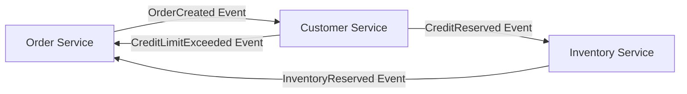
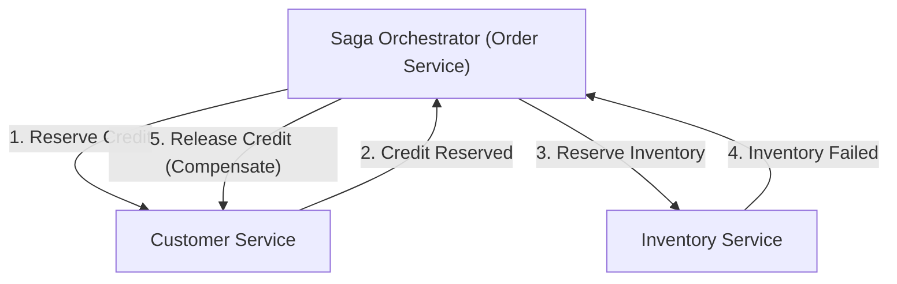

# Einführung: Der Paradigmenwechsel vom Monolithen zu Microservices

Im modernen Software-Engineering ist der Übergang von einer monolithischen Architektur zu einer Microservices-Architektur für viele Unternehmen zu einem unvermeidbaren Weg geworden, da Systeme immer größer und komplexer werden. Microservices bieten unzählige Vorteile, darunter Skalierbarkeit, unabhängige Deployments, eine vielfältige Technologie-Stack und organisatorische Agilität. Dieser Paradigmenwechsel ist jedoch keineswegs eine Wunderwaffe (Silver Bullet). Eine der schwierigsten Herausforderungen, denen sich Entwicklungsteams bei der Einführung von Microservices gegenübersehen, ist das "verteilte Datenmanagement" und "verteilte Transaktionen".

In diesem Artikel werden wir tiefgreifend untersuchen, warum wir, ausgehend von der Bequemlichkeit der ACID-Transaktionen in der Monolithen-Ära, nun mit den Schwierigkeiten verteilter Transaktionen konfrontiert werden, die mit der Aufteilung in Microservices einhergehen. Wir werden erörtern, warum das traditionelle 2PC (Two-Phase Commit) in verteilten Umgebungen als Anti-Pattern angesehen wird, und das "Saga-Pattern", den De-facto-Standard in modernen Microservices-Architekturen, umfassend beleuchten – einschließlich der Akzeptanz von "Eventual Consistency" (letztendliche Konsistenz) und der Komplexität beim Design von Kompensationstransaktionen.

## Die idyllische Landschaft der Monolithen-Ära: Die süße Falle der ACID-Eigenschaften

In der Welt monolithischer Anwendungen war das Datenmanagement erstaunlich einfach und vorhersehbar. Die gesamte Anwendung bestand aus einer einzigen, riesigen Codebasis und teilte sich in der Regel eine einzige relationale Datenbank (RDBMS). Dank dieser zentralen Datenbank konnten Entwickler die leistungsstarken "ACID-Eigenschaften", die von der Datenbank bereitgestellt wurden, als selbstverständlich betrachten.

ACID ist ein Akronym, das für die folgenden vier Eigenschaften steht:

1. **Atomicity (Atomarität)**: Garantiert, dass alle Operationen innerhalb einer Transaktion entweder "alle erfolgreich sind" oder "alle fehlschlagen (zurückgerollt werden)". Es gibt keinen Zwischenzustand.
2. **Consistency (Konsistenz)**: Garantiert, dass Datenbank-Constraints und Geschäftsregeln vor und nach der Ausführung einer Transaktion stets erfüllt sind.
3. **Isolation (Isolation)**: Garantiert, dass sich mehrere gleichzeitig ausgeführte Transaktionen nicht gegenseitig stören.
4. **Durability (Dauerhaftigkeit)**: Garantiert, dass das Ergebnis einer einmal festgeschriebenen (committed) Transaktion auch bei einem Systemausfall nicht verloren geht.

Betrachten wir zum Beispiel den "Bestellprozess" auf einer E-Commerce-Website. Wenn ein Kunde einen Artikel bestellt, werden die folgenden drei Schritte ausgeführt:
1. Einen Bestelldatensatz in der Tabelle `orders` erstellen.
2. Den Kreditrahmen des Kunden in der Tabelle `customers` reduzieren.
3. Den Lagerbestand des Artikels in der Tabelle `inventory` reduzieren.

Beim Monolithen reichte es aus, all diese Operationen in eine einzige Datenbanktransaktion (`BEGIN; ... COMMIT;`) einzuschließen. Wenn Schritt 3 aufgrund unzureichenden Lagerbestands fehlgeschlagen ist, hat die Datenbank automatisch die Schritte 1 und 2 zurückgerollt, und das System behielt einen konsistenten Zustand bei. Entwickler mussten sich nicht tiefgreifend mit komplexer Fehlerbehandlung oder inkonsistenten Zuständen befassen; die Datenkonsistenz wurde auf der Infrastrukturebene vollständig gewährleistet. Die Bequemlichkeit dieser ACID-Transaktionen war in der Tat eine "süße Falle".

## Die Wildnis der Microservices: Der Albtraum des verteilten Datenmanagements

Wenn ein System wächst und die Grenzen von Skalierbarkeit und Entwicklungsgeschwindigkeit erreicht sind, steuern Teams in Richtung einer Microservices-Architektur, bei der der Monolith in mehrere kleine Services aufgeteilt wird. Eine der Best Practices für Microservices ist das "Database per Service"-Pattern (Datenbank pro Service). Dies ist das Prinzip, nach dem jeder Microservice seine eigenen Daten verwaltet und es anderen Services untersagt ist, direkt auf diese Datenbank zuzugreifen.

Wenden wir dieses Prinzip auf die zuvor erwähnte E-Commerce-Website an, wird das System wie folgt aufgeteilt:
- **Order Service**: Besitzt eine Datenbank zur Verwaltung von Bestelldaten.
- **Customer Service**: Besitzt eine Datenbank zur Verwaltung von Kundeninformationen und Kreditrahmen.
- **Inventory Service**: Besitzt eine Datenbank zur Verwaltung der Warenbestände.

Während diese Struktur die Unabhängigkeit der Services erhöht, führt sie zu einem "Albtraum des verteilten Datenmanagements". Es ist nicht mehr möglich, mehrere Tabellen mit einer einzigen Datenbanktransaktion zu aktualisieren. Die "Erstellung der Bestellung", die "Sicherung des Kredits" und die "Sicherung des Lagerbestands" erfordern nun die Koordination zwischen mehreren unabhängigen Services über das Netzwerk.

Was passiert, wenn die Auftragserstellung im Order Service und die Kreditsicherung im Customer Service erfolgreich sind, aber der Inventory Service ausgefallen ist und die Bestandssicherung fehlschlägt?
Die Magie lokaler Datenbanktransaktionen existiert hier nicht. Es entsteht eine kritische "Dateninkonsistenz", bei der der Kreditrahmen reduziert wurde, der Lagerbestand jedoch nicht, während die Bestellung im Status "ausstehend" oder "fehlgeschlagen" verbleibt. Dies ist der Kern des Problems verteilter Transaktionen bei Microservices.

## Die Verlockung und die fatalen Grenzen von 2PC (Two-Phase Commit)

Als klassischer Ansatz zur Aufrechterhaltung der Transaktionskonsistenz in verteilten Systemen existiert das 2PC (Two-Phase Commit) Protokoll. Viele Entwickler versuchen, Lösungen in 2PC-Implementierungen wie XA-Transaktionen zu finden, die von verteilten Datenbanken oder Message Queues angeboten werden.

2PC besteht aus einem Transaktionsmanager (Koordinator) und mehreren Ressourcenmanagern (Teilnehmern) und läuft in den folgenden zwei Phasen ab:

1. **Prepare Phase (Vorbereitungsphase)**: Der Koordinator fragt alle Teilnehmer, ob sie "bereit für den Commit" sind. Jeder Teilnehmer sperrt (lock) die Ressourcen, versetzt sie in einen commit-fähigen Zustand und antwortet mit "Yes" oder "No".
2. **Commit / Rollback Phase (Commit- / Rollback-Phase)**: Wenn alle Teilnehmer mit "Yes" antworten, weist der Koordinator alle an zu "committen". Wenn auch nur einer mit "No" antwortet oder nicht reagiert, weist er alle an, ein "Rollback" durchzuführen.

Auf den ersten Blick mag dies wie eine perfekte Lösung erscheinen, aber in modernen, Cloud-nativen Microservices-Umgebungen gilt 2PC als schwerwiegendes Anti-Pattern. Die Gründe dafür sind wie folgt:

- **Synchrones Blockieren und Leistungsabfall**: Der größte Nachteil von 2PC ist, dass das gesamte Protokoll synchron abläuft und die Teilnehmer ihre Ressourcensperren (Locks) aufrechterhalten. Wenn es zu Netzwerkverzögerungen oder temporären Ausfällen bei einem Teilnehmer kommt, müssen alle anderen Services auf die Freigabe der Sperren warten, was den Durchsatz des gesamten Systems drastisch reduziert.
- **Single Point of Failure (SPOF)**: Wenn der Transaktionskoordinator ausfällt, geraten die Teilnehmer, die Sperren halten, in einen Wartezustand (In-Doubt-Zustand), und es besteht die Gefahr eines Deadlocks im gesamten System.
- **Fehlende Unterstützung durch NoSQL und Message Broker**: Viele moderne NoSQL-Datenbanken und neueste Message Broker unterstützen keine XA-Transaktionen (2PC), um Skalierbarkeit zu priorisieren. Dies schränkt die technologischen Auswahlmöglichkeiten stark ein.
- **Negative Auswirkungen auf die Verfügbarkeit**: Microservices sollten unter der Prämisse von "partiellen Ausfällen" entworfen werden. Bei 2PC führt jedoch der Ausfall eines einzigen Services zum Fehlschlagen der gesamten Transaktion, sodass sich die Gesamtverfügbarkeit des Systems aus der Multiplikation der Verfügbarkeiten der einzelnen Services ergibt und somit stark abnimmt.

## Das CAP-Theorem und die Akzeptanz von Eventual Consistency (Letztendliche Konsistenz)

Was sollen wir tun, wenn wir starke Konsistenz (Strong Consistency) wie bei 2PC aufgeben? Hier ist es entscheidend, das "CAP-Theorem", ein Grundprinzip verteilter Systeme, und die "BASE-Eigenschaften" zu verstehen.

Das CAP-Theorem definiert, dass ein verteiltes System maximal zwei der folgenden drei Garantien gleichzeitig erfüllen kann:
- **Consistency (Konsistenz)**: Alle Knoten geben die gleichen Daten zurück.
- **Availability (Verfügbarkeit)**: Anfragen an nicht fehlerhafte Knoten geben immer eine erfolgreiche Antwort zurück.
- **Partition tolerance (Ausfalltoleranz bei Netzwerkpartitionierung)**: Das System arbeitet auch dann weiter, wenn das Netzwerk partitioniert (aufgeteilt) ist.

Da Netzwerkpartitionierungen (P) in realen Cloud-Umgebungen unvermeidlich sind, müssen wir immer einen Kompromiss zwischen "C" und "A" eingehen (CP oder AP). In Microservices-Architekturen ist es üblich, ein "AP-System" zu wählen, das die Systemverfügbarkeit (A) und Skalierbarkeit priorisiert und bei der absoluten Konsistenz (C) Kompromisse eingeht.

Das Ergebnis dieses Kompromisses ist die "Eventual Consistency". Eventual Consistency ist die Idee, dass "möglicherweise nicht alle Daten sofort übereinstimmen, aber nach einiger Zeit (Eventually) letztendlich alle Daten übereinstimmen und einen konsistenten Zustand erreichen".

Anstelle von ACID wird in verteilten Systemen das **BASE**-Konzept angewendet:
- **Basically Available (Grundsätzlich verfügbar)**: Selbst wenn ein Teil des Systems ausfällt, arbeitet das System als Ganzes weiter.
- **Soft state (Weicher Zustand)**: Die Datenkonsistenz wird nicht immer aufrechterhalten, und der Zustand ändert sich im Laufe der Zeit.
- **Eventually consistent (Letztendlich konsistent)**: Letztendlich wird die Datenkonsistenz sichergestellt.

Das Transaktionsdesign in Microservices hängt davon ab, wie diese Eventual Consistency im gesamten System sicher und in vorhersehbarer Weise erreicht werden kann. Das spezifische Architekturmuster hierfür ist das "Saga"-Pattern.

## Der Anbruch des Saga-Patterns: Der neue Standard für verteilte Transaktionen

Das Saga-Pattern ist ein Konzept zur Verwaltung langlebiger Transaktionen (Long-Lived Transactions: LLT), das auf einem 1987 von Hector Garcia-Molina und Kenneth Salem veröffentlichten Paper basiert. In der heutigen Zeit wurde es als De-facto-Standard zur Lösung verteilter Transaktionen in Microservices wiederbelebt.

Die Grundidee von Saga besteht darin, eine große, verteilte Transaktion in eine Kette mehrerer "lokaler ACID-Transaktionen" aufzuteilen, die jeweils innerhalb eines Microservices abgeschlossen werden.

Um die gesamte Saga abzuschließen, jeder Service führt eine lokale Transaktion aus und veröffentlicht "Ereignisse" (Events) oder "Nachrichten" (Messages), die den Abschluss anzeigen. Der nächste Service empfängt dieses Ereignis und führt seine eigene lokale Transaktion aus. Wenn in einem Zwischenschritt eine Geschäftsregel verletzt wird oder ein Fehler auftritt (z. B. unzureichender Lagerbestand, Überschreitung des Kreditlimits), geht die Saga rückwärts vor und führt Operationen aus, um die zuvor ausgeführten lokalen Transaktionen zu "annullieren". Dies wird als **Kompensationstransaktion (Compensating Transaction)** bezeichnet.

Der Transaktionsfluss in einer Saga sieht wie folgt aus:
Seien die Serie von lokalen Transaktionen $T_1, T_2, \dots, T_n$. Die entsprechenden Kompensationstransaktionen seien $C_1, C_2, \dots, C_{n-1}$.

1. Erfolgsfall: $T_1 \rightarrow T_2 \rightarrow \dots \rightarrow T_n$ sind alle erfolgreich, und die Saga ist abgeschlossen.
2. Fehlerfall (bei Fehlschlag in $T_k$): Erfolgreich bis $T_1 \rightarrow T_2 \rightarrow \dots \rightarrow T_{k-1}$, und ein Fehler tritt in $T_k$ auf. Danach wird in umgekehrter Reihenfolge $C_{k-1} \rightarrow C_{k-2} \rightarrow \dots \rightarrow C_1$ ausgeführt, und das gesamte System kehrt in den ursprünglichen konsistenten Zustand (semantischer Rollback-Zustand) zurück.

Beim Saga-Pattern gibt es zwei Hauptansätze für die Implementierung, abhängig davon, wer die Rolle des Transaktionskoordinators übernimmt. Diese sind "Choreography" (Choreografie) und "Orchestration" (Orchestrierung).

### Choreography (Choreografie): Der Tanz der autonomen Services

Beim Choreography-Ansatz gibt es keinen zentralen Koordinator, der die Saga steuert. Jeder Microservice handelt autonom und treibt Transaktionen in einer Kette voran, indem er Domain-Events veröffentlicht und abonniert (Pub/Sub). Es ist, als würden Tänzer autonom ohne zentralen Dirigenten tanzen, sich der Musik und den Bewegungen der anderen anpassend (Choreografie).

**Vorteile von Choreography:**
- **Lose Kopplung**: Da keine Abhängigkeit von einem zentralen Orchestrator besteht, gibt es keinen Single Point of Failure, und die Kopplung zwischen den Services bleibt gering.
- **Einfache Implementierung (für kleine Skalierungen)**: Wenn nur wenige Services (etwa 2 bis 4) beteiligt sind, ist die Einführung einfach, da sie nur durch das Veröffentlichen und Abhören von Ereignissen implementiert werden kann.

**Nachteile von Choreography:**
- **Schwierigkeit, das Gesamtbild zu erfassen**: Da der Transaktionsfluss des gesamten Systems über die gesamte Codebasis verteilt ist, wird es extrem schwierig zu verfolgen und zu debuggen, was insgesamt passiert (der aktuelle Status der Saga).
- **Risiko zirkulärer Abhängigkeiten**: Da die Services gegenseitig auf Ereignisse hören, steigt das Risiko, in zirkuläre Referenzen oder Endlosschleifen zu geraten.
- **Anfälligkeit für Komplexität**: Mit zunehmender Anzahl von Schritten oder wenn komplexe Verzweigungsbedingungen erforderlich sind, wird die gesamte Architektur zu Spaghetti-Code und nicht mehr wartbar.

### Orchestration (Orchestrierung): Der zentralisierte Dirigent

Beim Orchestration-Ansatz wird ein "Saga-Orchestrator (Koordinator)" eingesetzt, der den Ausführungsfluss der Saga zentral steuert. Ähnlich wie ein Dirigent in einem Orchester weist der Orchestrator an, welcher Service als nächstes seine lokale Transaktion ausführen soll, empfängt das Ergebnis, gibt die nächste Anweisung und weist bei Fehlern angemessene Kompensationstransaktionen an.

**Vorteile von Orchestration:**
- **Zentrale Verwaltung und Transparenz**: Da die Workflow-Definition der Saga an einem Ort (dem Orchestrator) zentralisiert ist, ist es sehr einfach, das Gesamtbild zu erfassen, den Status zu überwachen und zu debuggen.
- **Vermeidung zirkulärer Abhängigkeiten**: Teilnehmende Services müssen nur auf die Anweisungen des Orchestrators reagieren und nicht übereinander Bescheid wissen, was zu unidirektionalen Abhängigkeiten führt.
- **Umgang mit komplexen Abläufen**: Komplexe Transaktionslogiken wie bedingte Verzweigungen, parallele Ausführung, Wiederholungen (Retries) und Timeouts können flexibel implementiert werden.

**Nachteile von Orchestration:**
- **Abhängigkeit vom Orchestrator**: Wenn zu viel Geschäftslogik im Orchestrator zentralisiert wird, besteht die Gefahr, dass dieser praktisch zu einem "smarten Monolithen" wird, während andere Services zu reinen CRUD-Services degradiert werden (Anemic Domain Model).
- **Komplexität der Infrastruktur**: Um Statusübergänge zu verwalten, fallen Kosten für die Einführung und den Betrieb von Workflow-Engines oder State-Machine-Frameworks wie AWS Step Functions, Camunda oder Temporal an.

Im Allgemeinen wird für kommerzielle Systeme mit komplexer Geschäftslogik, in denen sich Transaktionen über mehrere Services erstrecken, der **Orchestration-Ansatz empfohlen**.

## Das Fleisch und Blut des Saga-Patterns: Die Designphilosophie der Kompensationstransaktion (Compensating Transaction)

Das größte Hindernis beim tatsächlichen Verstehen und Praktizieren des Saga-Patterns ist das Design der "Kompensationstransaktion". In einer verteilten Umgebung ist es unmöglich, das System wie mit dem Datenbankbefehl `ROLLBACK` "vollständig in denselben vergangenen Zustand" zurückzuversetzen. Der Grund dafür ist, dass, während Sie versuchen, eine Transaktion zurückzurollen, möglicherweise bereits eine andere Transaktion diese Daten gelesen oder geändert hat.

Daher müssen Kompensationstransaktionen so konzipiert sein, dass sie Vorgänge "im geschäftlichen Sinne aufheben", anstatt das System "physisch zurückzuspulen".

Betrachten wir beispielsweise eine Reisebuchungs-Saga, die eine Hotelreservierung und eine Flugbuchung durchführt:
1. Hotel buchen (Erfolgreich)
2. Flug buchen (Fehlgeschlagen wegen Vollbelegung)

In diesem Fall muss die Hotelreservierung storniert (kompensiert) werden, da der Flug nicht gebucht werden konnte. Die Daten können jedoch nicht einfach physisch aus dem Hotelreservierungssystem gelöscht werden (DELETE). In der realen Welt können basierend auf den Stornierungsbedingungen des Hotels Stornogebühren anfallen, und es muss ein Verlauf darüber geführt werden, dass eine Stornierung stattgefunden hat.
Mit anderen Worten, die Kompensationstransaktion für das Hotel ist die "Ausführung einer neuen Geschäftslogik, die Stornierung genannt wird (ein neuer INSERT-Datensatz oder ein UPDATE des Status)".

**Wichtige Prinzipien beim Design von Kompensationstransaktionen:**

1. **Sicherstellung der Idempotenz (Idempotency)**:
   In verteilten Systemen ist aufgrund von Netzwerkverzögerungen und Retry-Mechanismen eine "At-Least-Once"-Zustellung (mindestens einmal), bei der dieselbe Nachricht mehrmals ankommen kann, die Regel. Daher müssen Kompensationstransaktionen (und auch die Vorwärts-Transaktionen) "idempotent" sein, d. h. ihr Ergebnis ändert sich nicht, unabhängig davon, wie oft sie ausgeführt werden. Die Implementierung von Idempotenz-Keys mit Hilfe eindeutiger Transaktions-IDs, um zu bestimmen, ob eine Verarbeitung bereits stattgefunden hat, ist unerlässlich.

2. **Garantie des absoluten Erfolgs**:
   Vorwärts-Transaktionen dürfen gemäß den Geschäftsregeln fehlschlagen (z. B. wenn der Artikel nicht auf Lager ist). **Kompensationstransaktionen dürfen jedoch aus technischen oder geschäftlichen Gründen niemals fehlschlagen**. Eine einmal gestartete Kompensation muss so lange wiederholt werden, bis das System Eventual Consistency erreicht hat. Sollte ein schwerwiegender Fehler auftreten, der ein manuelles Eingreifen erfordert, muss ein Mechanismus vorbereitet sein, der die Nachricht an eine Dead Letter Queue (DLQ) sendet, einen Alarm auslöst und es Operatoren ermöglicht, einzugreifen.

3. **Unabhängigkeit von der Reihenfolge (Commutativity / Kommutativität)**:
   In asynchronen Messaging-Umgebungen kann es zu einem abnormalen Zustand (Out of order) kommen, bei dem eine Anforderung für eine Kompensationstransaktion aus irgendeinem Grund vor der Anforderung für die Ausführung der Vorwärts-Transaktion eintrifft. Um zu verhindern, dass das System in solchen Fällen zusammenbricht, ist ein striktes Transaktions-Zustandsmanagement erforderlich, kombiniert mit defensiver Programmierung: "Wenn eine Kompensationsanforderung für eine noch nicht begonnene Transaktion eintrifft, wird diese Transaktion als 'storniert' markiert, und spätere Vorwärts-Anforderungen werden ignoriert."

4. **Gegenmaßnahmen für die fehlende Isolation**:
   Da jeder Schritt einer Saga in einer lokalen Datenbank committet wird, können "Zwischenzustände" von Daten einer laufenden Saga von anderen Transaktionen gelesen werden (dies wird als Dirty Read bezeichnet). Um dies zu verhindern, wird empfohlen, den Daten einen "Status (State)" zu geben. Anstatt beispielsweise den Bestellstatus von Anfang an auf `APPROVED` zu setzen, wird er als `PENDING` (in Bearbeitung) erstellt und erst auf `APPROVED` aktualisiert, wenn die gesamte Saga erfolgreich war, und auf `CANCELLED` aktualisiert, wenn sie fehlschlägt. Andere Services können Daten im `PENDING`-Zustand als unbestätigt erkennen und entsprechend behandeln (Semantic Lock Pattern).

## Praktische Herausforderungen und Design-Patterns bei der Saga-Implementierung

Bei der Implementierung des Saga-Patterns müssen Entwickler sicherstellen, dass Schreibvorgänge in die Datenbank und das Veröffentlichen von Nachrichten an den Message Broker atomar (atomic) erfolgen. Wenn die Reihenfolge "Datenbank aktualisieren und dann Nachricht senden" gewählt wird und das System nach der Datenbankaktualisierung abstürzt, wird die Nachricht nicht gesendet und die Saga bricht ab (Dual Write Problem).

Das **Outbox-Pattern (Transactional Outbox Pattern)** ist ein weit verbreiteter Ansatz zur Lösung dieses Problems.

Beim Outbox-Pattern wird in der eigenen Datenbank des Services neben der "Geschäftsdaten"-Tabelle eine "Outbox (Postausgang)"-Tabelle erstellt.
Innerhalb einer lokalen Transaktion wird zusammen mit der Aktualisierung der Geschäftsdaten die zu sendende Nachricht in die Outbox-Tabelle ge-INSERT-et. Da diese in derselben Datenbanktransaktion erfolgen, ist eine vollständige Atomarität gewährleistet.
Danach überwacht ein anderer asynchroner Prozess (wie ein Message Relay oder ein CDC-Tool wie Debezium) die Outbox-Tabelle, liest die Datensätze, sendet sie zuverlässig an den Message Broker (wie Kafka oder RabbitMQ) und löscht den Datensatz aus der Outbox-Tabelle (oder markiert ihn als gesendet), sobald das Senden abgeschlossen ist. Dadurch wird eine zuverlässige At-Least-Once-Messaging-Grundlage geschaffen und die Zuverlässigkeit der Saga drastisch verbessert.

## Fazit: Um ein wahrer Designer verteilter Systeme zu werden

Der Wechsel zu einer Microservices-Architektur ist nicht nur eine Änderung der Infrastruktur oder des Frameworks. Es ist ein Paradigmenwechsel in Bezug auf die "Datenkonsistenz" und erfordert eine Änderung des Denkmodells von Software-Ingenieuren.

Wir müssen die synchrone Illusion von 2PC aufgeben und die Realität verteilter Systeme akzeptieren – Netzwerke sind instabil, Ausfälle treten täglich auf und Daten werden immer mit einer leichten Verzögerung synchronisiert. Die Beherrschung von Eventual Consistency und des Saga-Patterns ist eine wesentliche Voraussetzung, um durch die rauen Gewässer der Microservices zu navigieren und wirklich skalierbare und resiliente Systeme aufzubauen.

Es ist in Ordnung, mit der Einfachheit der Choreography zu beginnen, aber Sie sollten bereit sein, zur Robustheit der Orchestration überzugehen, wenn das System wächst. Und vor allem müssen Sie die geschäftlichen Implikationen, die Kompensationstransaktionen mit sich bringen, tiefgreifend mit Produktmanagern und Business-Teams diskutieren. Die Fähigkeiten im Bereich Domain-Driven Design (DDD), um das Verhalten der Domäne exakt in Code zu übersetzen, werden unverzichtbar sein.

Der Weg des Saga-Patterns ist keineswegs flach, aber am Ende wartet eine robuste Architektur, die jeder Last und jedem Ausfall standhalten kann. Architekten, die die Wahrheit verteilter Transaktionen verstehen und die optimale Balance zwischen Konsistenz und Verfügbarkeit entwerfen können, werden die Systementwicklung der nächsten Generation vorantreiben.
