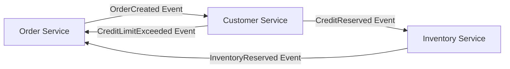
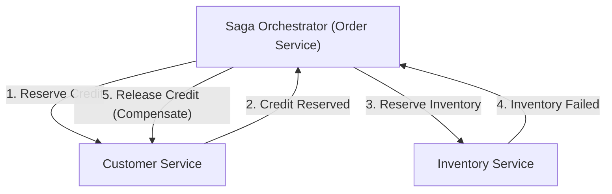

# Introduction: The Paradigm Shift from Monolith to Microservices

In modern software engineering, as systems grow in scale and complexity, the transition from a monolithic architecture to a microservices architecture has become an unavoidable path for many enterprises. Microservices bring countless benefits, including scalability, independent deployment, technological stack diversity, and organizational agility. However, this paradigm shift is by no means a silver bullet. One of the most difficult challenges faced by development teams adopting microservices is "distributed data management" and "distributed transactions."

In this article, we will delve deeply into why we face the difficulties of distributed transactions brought about by microservice partitioning—a sharp contrast from the comfort of ACID transactions in the monolith era. We will explore why the traditional 2PC (Two-Phase Commit) is considered an anti-pattern in distributed environments, and uncover the full picture of the "Saga pattern," which has become the de facto standard in modern microservices architecture, along with the acceptance of Eventual Consistency and the complexities of designing compensating transactions.

## The Idyllic Scenery of the Monolith Era: The Sweet Trap of ACID Properties

In the world of monolithic applications, data management was surprisingly simple and predictable. The entire application was composed of a single massive codebase, usually sharing a single relational database (RDBMS). Thanks to this single database, developers could take for granted the powerful "ACID properties" it provided.

ACID is an acronym for the following four properties:

1. **Atomicity**: Guarantees that all operations within a transaction either "all succeed" or "all fail (roll back)." There are no intermediate states.
2. **Consistency**: Guarantees that the database constraints and business rules are always satisfied before and after the transaction execution.
3. **Isolation**: Guarantees that even when multiple transactions are executed concurrently, they do not interfere with each other.
4. **Durability**: Guarantees that once a transaction is committed, its results will not be lost even in the event of a system failure.

For example, consider the "order" process on an e-commerce site. When a customer orders a product, the following three steps are executed:
1. Create an order record in the `orders` table.
2. Reduce the customer's credit limit in the `customers` table.
3. Reduce the product's stock in the `inventory` table.

In a monolith, all of these operations could simply be wrapped in a single database transaction (`BEGIN; ... COMMIT;`). If an error occurred in step 3 due to insufficient stock, the database would automatically roll back steps 1 and 2, keeping the system in a consistent state. Developers did not need to worry deeply about complex error handling or state inconsistencies; data consistency was entirely guaranteed at the infrastructure level. This comfort of ACID transactions was truly a "sweet trap."

## The Wilderness of Microservices: The Nightmare of Distributed Data Management

When a system grows and reaches the limits of scalability and development speed, teams steer toward a microservices architecture that splits the monolith into multiple smaller services. One of the best practices in microservices is the "Database per Service" pattern. This is a principle where each microservice manages its own data and prohibits other services from directly accessing its database.

Applying this principle to the aforementioned e-commerce site, the system would be divided as follows:
- **Order Service**: Has a database that manages order data.
- **Customer Service**: Has a database that manages customer information and credit limits.
- **Inventory Service**: Has a database that manages product inventory.

While this configuration enhances the independence of services, it causes a "nightmare of distributed data management." It is no longer possible to update multiple tables in a single database transaction. "Creating an order," "reserving a credit limit," and "reserving inventory" require coordination among multiple independent services over a network.

What happens if creating the order in the Order Service and reserving the credit in the Customer Service succeed, but the Inventory Service is down and fails to reserve the inventory?
The magic of local database transactions does not exist here. The credit is reduced, but the inventory is not, and the order is left in a pending or failed state, resulting in a fatal "data inconsistency." This is the core of the distributed transaction problem in microservices.

## The Temptation and Fatal Limitations of 2PC (Two-Phase Commit)

As a classical approach to maintaining transaction consistency in distributed systems, the 2PC (Two-Phase Commit) protocol exists. Many developers try to seek solutions in 2PC implementations, such as XA transactions provided by distributed databases and message queues.

2PC consists of a transaction manager (coordinator) and multiple resource managers (participants), progressing in the following two phases:

1. **Prepare Phase**: The coordinator queries all participants to see if they are "ready to commit." Each participant locks resources, enters a committable state, and then returns "Yes" or "No."
2. **Commit / Rollback Phase**: If all participants answer "Yes," the coordinator instructs everyone to "commit." If even one answers "No" or fails to respond, it instructs everyone to "rollback."

At first glance, it looks like a perfect solution, but in modern cloud-native microservice environments, 2PC is considered a severe anti-pattern. The reasons are as follows:

- **Synchronous Blocking and Performance Degradation**: The biggest drawback of 2PC is that the entire protocol is synchronous, and participants keep holding resource locks. When network latency or temporary participant failures occur, all other services are kept waiting for lock releases, significantly degrading the overall system throughput.
- **Single Point of Failure (SPOF)**: If the transaction coordinator fails, participants are left in a waiting state (in-doubt state) while holding locks, risking a system deadlock.
- **Incompatibility with NoSQL and Message Brokers**: Many modern NoSQL databases and recent message brokers do not support XA transactions (2PC) to prioritize scalability. This drastically narrows technology choices.
- **Negative Impact on Availability**: Microservices should be designed with the assumption of "partial failures." However, in 2PC, if one service goes down, the entire transaction fails, causing overall system availability to drop sharply as the product of individual service availabilities.

## Embracing the CAP Theorem and Eventual Consistency

If we give up strong consistency like 2PC, what should we do? This is where understanding the "CAP theorem" and "BASE properties"—fundamental principles of distributed systems—becomes important.

The CAP theorem defines that in a distributed system, at most two of the following three guarantees can be satisfied simultaneously:
- **Consistency**: All nodes return the same data.
- **Availability**: Requests to non-failing nodes always return a successful response.
- **Partition tolerance**: The system continues to operate even if a network partition occurs.

Since network partitions (P) are unavoidable in real-world cloud environments, we are always forced to trade off "C" and "A" (CP or AP). In microservices architecture, it is common to choose an "AP system," prioritizing system availability (A) and scalability while compromising absolute consistency (C).

The product of this compromise is "Eventual Consistency." Eventual consistency is the concept that "not all data may match immediately, but given time (eventually), all data will ultimately match and reach a consistent state."

Instead of ACID, the concept of **BASE** is applied in distributed systems:
- **Basically Available**: Even if a part of the system fails, the whole continues to operate.
- **Soft state**: Data consistency is not always maintained; the state changes over time.
- **Eventually consistent**: Data consistency is ultimately ensured.

Transaction design in microservices relies on how this eventual consistency can be realized safely and predictably across the entire system. The specific architectural pattern for this is the "Saga."

## The Dawn of the Saga Pattern: The New Standard for Distributed Transactions

The Saga pattern is a concept for managing Long-Lived Transactions (LLT), originating from a paper published in 1987 by Hector Garcia-Molina and Kenneth Salem. In modern times, this has been revived as the de facto standard for solving distributed transactions in microservices.

The basic idea of a Saga is to divide a massive distributed transaction into a chain of multiple "local ACID transactions" that are completed within each microservice.

To complete the entire Saga, each service executes a local transaction and publishes an "event" or "message" indicating its completion. The next service receives that event and executes its own local transaction. If a business rule violation or error (e.g., insufficient stock, credit limit exceeded) occurs at an intermediate step, the Saga works backward from there, executing operations to "undo" the local transactions executed so far. This is called a **Compensating Transaction**.

The flow of transactions in a Saga is as follows.
Let the series of local transactions be $T_1, T_2, \dots, T_n$. Let the corresponding compensating transactions be $C_1, C_2, \dots, C_{n-1}$.

1. Normal flow: $T_1 \rightarrow T_2 \rightarrow \dots \rightarrow T_n$ all succeed, completing the Saga.
2. Abnormal flow (Failure at $T_k$): Succeeds up to $T_1 \rightarrow T_2 \rightarrow \dots \rightarrow T_{k-1}$, and an error occurs at $T_k$. After that, $C_{k-1} \rightarrow C_{k-2} \rightarrow \dots \rightarrow C_1$ are executed in reverse order, returning the whole system to its original consistent state (a semantic rollback state).

The Saga pattern has two major implementation approaches, depending on who takes the role of coordinating the transactions: "Choreography" and "Orchestration."

### Choreography: The Dance of Autonomous Services

In the Choreography approach, there is no central coordinator governing the Saga. Each microservice acts autonomously, advancing the transaction sequentially by publishing and subscribing to domain events (Pub/Sub). It is as if dancers are dancing autonomously (choreography) in time with the music and the movements around them, without a central conductor.

**Advantages of Choreography:**
- **Loose Coupling**: Without relying on a central orchestrator, there is no single point of failure, keeping the coupling between services low.
- **Simple Implementation (for small scales)**: When few services are involved (around 2 to 4), it can be implemented just by publishing and listening to events, making adoption easy.

**Disadvantages of Choreography:**
- **Difficulty in Grasping the Big Picture**: Since the transaction flow across the system is scattered throughout the codebase, tracking and debugging what is happening overall (the current state of the Saga) becomes extremely difficult.
- **Risk of Cyclic Dependencies**: Services listening to each other's events increase the risk of cyclic references and infinite loops.
- **Vulnerability to Complexity**: As the number of steps increases or complex branching conditions are required, the entire architecture becomes spaghetti-like and unmaintainable.

### Orchestration: The Centralized Conductor

In the Orchestration approach, a "Saga Orchestrator (Coordinator)" is placed centrally to control the execution flow of the Saga. The orchestrator, like a conductor in an orchestra, instructs which service should execute the local transaction next, receives the result, issues the next instruction, and instructs appropriate compensating transactions upon error.

**Advantages of Orchestration:**
- **Centralized Management and Visibility**: Because the Saga workflow definition is consolidated in one place (the orchestrator), grasping the big picture, monitoring the state, and debugging become very easy.
- **Elimination of Cyclic Dependencies**: Participating services only respond to instructions from the orchestrator and do not need to know about each other, making dependencies unidirectional.
- **Handling Complex Flows**: Flexible implementation of complex transaction logic, such as conditional branching, parallel execution, retries, and timeouts, is possible.

**Disadvantages of Orchestration:**
- **Dependency on the Orchestrator**: If too much business logic is concentrated in the orchestrator, it risks becoming a de facto "smart monolith," reducing other services to mere CRUD services (anemic domain model).
- **Infrastructure Complexity**: Managing state transitions incurs the cost of introducing and operating workflow engines or state machine frameworks like AWS Step Functions, Camunda, or Temporal.

Generally, in commercial systems where transactions span multiple services and involve complex business logic, the **Orchestration approach is recommended**.

## The Flesh and Blood Supporting the Saga Pattern: The Design Philosophy of Compensating Transactions

The biggest hurdle in truly understanding and practicing the Saga pattern is designing "compensating transactions." In a distributed environment, it is impossible to return the system to the "exact same state in the past" like a database `ROLLBACK` command. This is because while you are trying to roll back a transaction, another transaction may have already read or modified that data.

Therefore, compensating transactions must be designed not as operations that "physically rewind the system" but as operations that "cancel out in a business sense."

For example, consider a travel booking Saga that involves booking a hotel and booking a flight.
1. Book a hotel (Success)
2. Book a flight (Fails due to fully booked)

In this case, it is necessary to cancel (compensate for) the hotel booking because the flight could not be secured. However, you cannot simply perform a physical deletion (`DELETE`) on the hotel booking system. In the real world, cancellation fees might be incurred based on the hotel's cancellation policy, and a history of the cancellation must be kept.
In other words, the compensating transaction for the hotel is "the execution of a new business logic called cancellation processing (an `INSERT` of a new record or an `UPDATE` of status)."

**Key Principles of Compensating Transaction Design:**

1. **Ensuring Idempotency**:
   In distributed systems, due to network latency and retry mechanisms, "At-Least-Once" delivery, where the same message arrives multiple times, is standard. Therefore, compensating transactions (as well as forward transactions) must be "idempotent," meaning the result does not change no matter how many times they are executed. Implementing an idempotency key using a unique transaction ID to determine if a process has already been executed is essential.

2. **Guarantee of Absolute Success**:
   Forward transactions are allowed to fail due to business rules (e.g., out of stock). However, **compensating transactions must absolutely never fail, technically or in a business sense**. Once initiated, compensations must continue to be retried until the system reaches eventual consistency. In the rare event that a fatal error requiring manual intervention occurs, a mechanism should be prepared to send it to a Dead Letter Queue (DLQ), trigger an alert, and allow operators to respond.

3. **Commutativity (Independence of Order)**:
   In an asynchronous messaging environment, anomalous situations (Out of order) can occur where a request for a compensating transaction arrives before the request for a forward transaction execution for some reason. To prevent the system from breaking down even in such cases, strict transaction state management is necessary. Defensive programming is required, such as "if a compensation request comes for a transaction that has not yet started, mark that transaction as 'canceled' and ignore the forward request if it arrives later."

4. **Countermeasures Against Lack of Isolation**:
   Because each step in a Saga is committed to a local DB, "intermediate state" data of an ongoing Saga is visible to other transactions (this is called a Dirty Read). To prevent this, it is recommended to give data a "State." For example, instead of making an order status `APPROVED` from the beginning, create it as `PENDING` (processing), and update it to `APPROVED` only when the entire Saga succeeds, or update it to `CANCELLED` if it fails. Other services can treat `PENDING` state data recognizing that it is indeterminate (Semantic Lock Pattern).

## Practical Challenges and Design Patterns in Saga Pattern Implementation

When implementing the Saga pattern, developers must perform database writes and message publication to a message broker atomically. If the order is "update the database then send a message," and the system crashes after the database update, the message will not be sent, and the Saga will be broken (Dual Write Problem).

The **Outbox pattern (Transactional Outbox Pattern)** is widely adopted to solve this problem.

In the Outbox pattern, an "Outbox (outbox tray)" table is prepared alongside the "business data" table within the service's own database.
Within the local transaction, the message to be sent is INSERTed into the Outbox table simultaneously with the business data update. Since these are performed within the same database transaction, complete atomicity is guaranteed.
Afterward, a separate asynchronous process (a CDC tool like Message Relay or Debezium) monitors the Outbox table, reliably reads records and sends them to the message broker (like Kafka or RabbitMQ), and deletes (or marks as sent) the record from the Outbox table after the transmission is complete. This builds a reliable At-Least-Once messaging foundation, dramatically improving the reliability of the Saga.

## Conclusion: Becoming a True Distributed Systems Architect

Transitioning to a microservices architecture is not merely a change in infrastructure or frameworks. It is a paradigm shift regarding "data consistency" and demands a transformation in the mental model of software engineers.

It is necessary to discard the synchronous illusion of 2PC and accept the reality of distributed systems—networks are unstable, failures occur routinely, and data is always synchronized with a slight delay. Mastering eventual consistency and the Saga pattern is an essential condition for riding the rough waves of microservices and building truly scalable and resilient systems.

While it is good to start with the simplicity of Choreography, you should prepare to transition to the robustness of Orchestration as the system grows. Above all, it is indispensable to have Domain-Driven Design (DDD) skills to discuss deeply with product managers and business teams about the business implications of compensating transactions, and accurately translate domain behaviors into code.

The path of the Saga pattern is by no means flat, but a robust architecture capable of withstanding any load or failure awaits at the end. Architects who understand the truth of distributed transactions and can design the optimal balance between consistency and availability will undoubtedly lead the next generation of system development.
