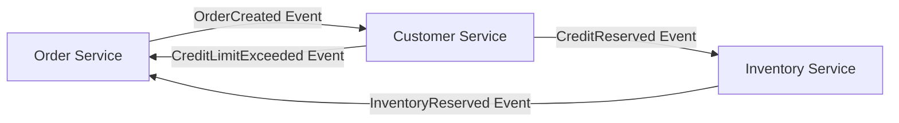
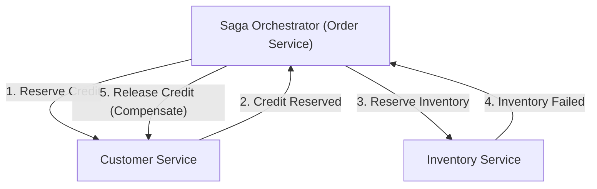

# Introducción: El Cambio de Paradigma del Monolito a los Microservicios

En la ingeniería de software moderna, a medida que aumenta la escala y la complejidad de los sistemas, la transición de una arquitectura monolítica a una arquitectura de microservicios se ha convertido en un camino inevitable para muchas empresas. Los microservicios ofrecen innumerables ventajas, como la escalabilidad, el despliegue independiente, la diversidad de pilas tecnológicas y la agilidad organizacional. Sin embargo, este cambio de paradigma no es en absoluto una bala de plata. Uno de los desafíos más difíciles a los que se enfrentan los equipos de desarrollo que adoptan microservicios es la "gestión de datos distribuidos" y las "transacciones distribuidas".

En este artículo, exploraremos por qué pasamos de la comodidad de las transacciones ACID en la era de los monolitos a las dificultades de las transacciones distribuidas asociadas con la división en microservicios, por qué el tradicional 2PC (Two-Phase Commit o Commit de Dos Fases) se considera un antipatrón en entornos distribuidos, y profundizaremos en el "Patrón Saga", que se ha convertido en el estándar de facto en las arquitecturas de microservicios modernas, abordando la aceptación de la consistencia eventual (Eventual Consistency) y las dificultades en el diseño de transacciones de compensación.

## El Paisaje Idílico de la Era del Monolito: La Dulce Trampa de las Propiedades ACID

En el mundo de las aplicaciones monolíticas, la gestión de datos era sorprendentemente simple y predecible. Toda la aplicación estaba compuesta por una única y enorme base de código y, por lo general, compartía una única base de datos relacional (RDBMS). Gracias a esta base de datos única, los desarrolladores podían disfrutar como algo natural de las potentes "propiedades ACID" que proporcionaba la base de datos.

ACID es un acrónimo de las siguientes cuatro propiedades (en inglés):

1. **Atomicity (Atomicidad)**: Garantiza que todas las operaciones dentro de una transacción "tengan éxito en su totalidad" o "fallen en su totalidad (se reviertan)". No existen estados intermedios.
2. **Consistency (Consistencia)**: Garantiza que las restricciones de la base de datos y las reglas de negocio se cumplan siempre antes y después de la ejecución de la transacción.
3. **Isolation (Aislamiento)**: Garantiza que, incluso cuando se ejecutan múltiples transacciones simultáneamente, cada transacción no interfiera con las demás.
4. **Durability (Durabilidad)**: Garantiza que, una vez confirmada (commited) una transacción, su resultado no se perderá incluso si ocurre una falla en el sistema.

Por ejemplo, consideremos el proceso de "pedido" en un sitio de comercio electrónico (e-commerce). Cuando un cliente pide un producto, se ejecutan los siguientes tres pasos:
1. Crear un registro de pedido en la tabla `orders`.
2. Reducir el límite de crédito del cliente en la tabla `customers`.
3. Reducir el inventario del producto en la tabla `inventory`.

En un monolito, bastaba con encerrar todas estas operaciones en una única transacción de base de datos (`BEGIN; ... COMMIT;`). Si el inventario era insuficiente y se producía un error en el paso 3, la base de datos revertía (rollback) automáticamente los pasos 1 y 2, manteniendo el sistema en un estado consistente. Los desarrolladores no tenían que preocuparse profundamente por el manejo complejo de errores o la inconsistencia de estados, ya que la consistencia de los datos estaba completamente garantizada a nivel de infraestructura. Podría decirse que esta comodidad de las transacciones ACID era verdaderamente una "dulce trampa".

## El Páramo de los Microservicios: La Pesadilla de la Gestión de Datos Distribuidos

Cuando un sistema crece y alcanza los límites de su escalabilidad y velocidad de desarrollo, el equipo cambia el rumbo hacia una arquitectura de microservicios, dividiendo el monolito en múltiples servicios pequeños. Una de las mejores prácticas de los microservicios es el patrón "Database per Service" (Base de datos por servicio). Este es el principio de que cada microservicio gestiona sus propios datos y prohíbe que otros servicios accedan a su base de datos directamente.

Si aplicamos este principio al sitio de comercio electrónico anterior, el sistema se dividiría de la siguiente manera:
- **Order Service (Servicio de Pedidos)**: Tiene una base de datos para gestionar los datos de los pedidos.
- **Customer Service (Servicio de Clientes)**: Tiene una base de datos para gestionar la información de los clientes y sus límites de crédito.
- **Inventory Service (Servicio de Inventario)**: Tiene una base de datos para gestionar el inventario de productos.

Si bien esta configuración aumenta la independencia de los servicios, provoca la "pesadilla de la gestión de datos distribuidos". Ya no es posible actualizar varias tablas en una sola transacción de base de datos. La "creación de pedidos", la "reserva del límite de crédito" y la "reserva de inventario" requieren la coordinación entre varios servicios independientes a través de la red.

¿Qué sucedería si, después de que la creación del pedido en el Order Service y la reserva de crédito en el Customer Service tuvieran éxito, el Inventory Service estuviera inactivo y la reserva de inventario fallara?
La magia de las transacciones de bases de datos locales no existe aquí. El crédito se reduciría, el inventario no, pero el pedido quedaría en un estado pendiente o fallido, lo que resultaría en una "inconsistencia de datos" fatal. Este es el núcleo del problema de las transacciones distribuidas en los microservicios.

## La Tentación del 2PC (Commit de Dos Fases) y sus Límites Fatales

Como enfoque clásico para mantener la consistencia de las transacciones en sistemas distribuidos, existe el protocolo 2PC (Two-Phase Commit). Muchos desarrolladores intentan buscar una solución en implementaciones de 2PC, como las transacciones XA proporcionadas por bases de datos distribuidas o colas de mensajes (message queues).

El 2PC está compuesto por un gestor de transacciones (coordinador) y múltiples gestores de recursos (participantes), y avanza en las siguientes dos fases:

1. **Prepare Phase (Fase de Preparación)**: El coordinador pregunta a todos los participantes si están "listos para confirmar". Cada participante bloquea sus recursos, los pone en un estado confirmable y luego devuelve "Sí" o "No".
2. **Commit / Rollback Phase (Fase de Confirmación / Reversión)**: Si todos los participantes responden "Sí", el coordinador ordena a todos "confirmar" (commit). Si incluso uno responde "No" o no responde, ordena a todos "revertir" (rollback).

A primera vista, parece una solución perfecta, pero en los modernos entornos de microservicios nativos de la nube, el 2PC se considera un antipatrón grave. Las razones son las siguientes:

- **Bloqueo sincrónico y degradación del rendimiento**: El mayor inconveniente del 2PC es que todo el protocolo es sincrónico y los participantes deben mantener bloqueos (locks) de los recursos continuamente. Si se produce un retraso en la red o un fallo temporal en un participante, todos los demás servicios se ven obligados a esperar a que se liberen los bloqueos, lo que reduce drásticamente el rendimiento general del sistema.
- **Punto único de fallo (SPOF)**: Si el coordinador de transacciones falla, los participantes quedan en estado de espera manteniendo los bloqueos (estado dudoso o in-doubt), con el riesgo de que el sistema caiga en un punto muerto (deadlock).
- **Incompatibilidad con NoSQL y Message Brokers**: Muchas bases de datos NoSQL modernas y los últimos brokers de mensajes no soportan transacciones XA (2PC) porque priorizan la escalabilidad. Esto reduce significativamente las opciones tecnológicas.
- **Impacto negativo en la disponibilidad**: Los microservicios deben diseñarse asumiendo "fallos parciales". Sin embargo, en el 2PC, si un servicio cae, toda la transacción falla, por lo que la disponibilidad de todo el sistema se convierte en la multiplicación de las disponibilidades de los servicios individuales, disminuyendo abruptamente.

## El Teorema CAP y la Aceptación de la Consistencia Eventual (Eventual Consistency)

Si renunciamos a la consistencia fuerte (Strong Consistency) como la del 2PC, ¿qué debemos hacer? Aquí es donde resulta fundamental comprender el "Teorema CAP" y las características "BASE", que son los principios fundamentales de los sistemas distribuidos.

El teorema CAP define que, en un sistema distribuido, solo se pueden satisfacer simultáneamente un máximo de dos de las siguientes tres garantías:
- **Consistency (Consistencia)**: Todos los nodos devuelven los mismos datos.
- **Availability (Disponibilidad)**: Una solicitud a un nodo sin fallas siempre devuelve una respuesta exitosa.
- **Partition tolerance (Tolerancia a particiones)**: El sistema sigue funcionando incluso si se produce una partición (división) en la red.

Dado que las particiones de red (P) son inevitables en los entornos de nube del mundo real, siempre nos vemos obligados a hacer una compensación (trade-off) entre "C" y "A" (CP o AP). En la arquitectura de microservicios, es común elegir un "sistema AP" que prioriza la disponibilidad (A) y la escalabilidad del sistema, y compromete la consistencia absoluta (C).

El producto de este compromiso es la "Consistencia eventual" (Eventual Consistency). La consistencia eventual es la idea de que "es posible que no todos los datos coincidan de inmediato, pero con el tiempo (eventually), todos los datos coincidirán y alcanzarán un estado consistente".

En lugar de ACID, el concepto **BASE** se aplica en sistemas distribuidos:
- **Basically Available (Básicamente Disponible)**: Incluso si una parte del sistema falla, el conjunto sigue funcionando.
- **Soft state (Estado suave)**: La consistencia de los datos no se mantiene constantemente, y el estado cambia con el tiempo.
- **Eventually consistent (Consistencia eventual)**: Al final, se asegura la consistencia de los datos.

El diseño de transacciones en microservicios depende de cómo lograr esta consistencia eventual de manera segura y predecible en todo el sistema. El patrón arquitectónico concreto para ello es la "Saga".

## El Amanecer del Patrón Saga: El Nuevo Estándar para Transacciones Distribuidas

El patrón Saga es un concepto para gestionar transacciones de larga duración (Long-Lived Transactions: LLT), que se originó en un documento publicado por Hector Garcia-Molina y Kenneth Salem en 1987. En la actualidad, esto ha resurgido como el estándar de facto para resolver las transacciones distribuidas en microservicios.

La idea básica de Saga es dividir una gran transacción distribuida en una cadena de múltiples "transacciones ACID locales" que se completan dentro de cada microservicio.

Para completar toda la Saga, cada servicio ejecuta una transacción local y emite un "evento" o "mensaje" que indica su finalización. El siguiente servicio recibe ese evento y ejecuta su propia transacción local. Si se produce una violación de una regla de negocio o un error (por ejemplo, falta de inventario, límite de crédito excedido) en un paso intermedio, la Saga retrocede desde allí y ejecuta operaciones para "deshacer" las transacciones locales ejecutadas hasta el momento. A esto se le llama **Transacción de Compensación (Compensating Transaction)**.

El flujo de transacciones en Saga es el siguiente:
Supongamos que una serie de transacciones locales es $T_1, T_2, \dots, T_n$. Las transacciones de compensación correspondientes son $C_1, C_2, \dots, C_{n-1}$.

1. Camino normal (éxito): $T_1 \rightarrow T_2 \rightarrow \dots \rightarrow T_n$ todas tienen éxito y la Saga se completa.
2. Camino anormal (falla en $T_k$): Tienen éxito hasta $T_1 \rightarrow T_2 \rightarrow \dots \rightarrow T_{k-1}$, y ocurre un error en $T_k$. Luego, se ejecutan en orden inverso $C_{k-1} \rightarrow C_{k-2} \rightarrow \dots \rightarrow C_1$, y todo el sistema vuelve a su estado consistente original (estado de reversión semántica).

El patrón Saga tiene principalmente dos enfoques de implementación, dependiendo de quién asuma el papel de coordinador de la transacción. Estos son "Coreografía (Choreography)" y "Orquestación (Orchestration)".

### Coreografía (Choreography): La Danza Autónoma de los Servicios

En el enfoque de Coreografía, no hay un coordinador central que supervise la Saga. Cada microservicio actúa de forma autónoma, avanzando en la transacción en cadena mediante la publicación y suscripción (Pub/Sub) de eventos de dominio. Es como si los bailarines bailaran de forma autónoma al ritmo de la música y los movimientos de su entorno, sin un director de orquesta central (coreografía).

**Ventajas de la Coreografía:**
- **Acoplamiento débil**: Al no depender de un orquestador central, no hay un punto único de falla, y el grado de acoplamiento entre servicios se mantiene bajo.
- **Implementación simple (para casos pequeños)**: Si hay pocos servicios participantes (alrededor de 2 a 4), se puede implementar solo emitiendo y escuchando eventos, lo que facilita su adopción.

**Desventajas de la Coreografía:**
- **Difícil de comprender el panorama general**: Dado que el flujo de transacciones de todo el sistema se dispersa por toda la base de código, resulta extremadamente difícil rastrear y depurar lo que está sucediendo en su conjunto (el estado actual de la Saga).
- **Riesgo de dependencias circulares**: Cuando los servicios escuchan los eventos de los demás, aumenta el riesgo de caer en referencias circulares o bucles infinitos.
- **Vulnerabilidad a la complejidad**: Si aumenta el número de pasos o se requieren condiciones de ramificación complejas, toda la arquitectura puede convertirse en un código espagueti y volverse inmantenible.

### Orquestación (Orchestration): El Director Centralizado

En el enfoque de Orquestación, se coloca un "Orquestador de Saga (Coordinador)" que controla el flujo de ejecución de la Saga de forma centralizada. El orquestador, como un director en una orquesta, indica qué servicio debe ejecutar la transacción local a continuación, recibe el resultado y da la siguiente instrucción, y en caso de error, ordena las transacciones de compensación adecuadas.

**Ventajas de la Orquestación:**
- **Gestión centralizada y visibilidad**: Como la definición del flujo de trabajo de la Saga se concentra en un solo lugar (el orquestador), es muy fácil comprender el panorama general, monitorear el estado y depurar.
- **Eliminación de dependencias circulares**: Los servicios participantes solo tienen que responder a las instrucciones del orquestador y no necesitan saber unos de otros, por lo que las dependencias son unidireccionales.
- **Soporte para flujos complejos**: Permite implementar de forma flexible lógicas de transacciones complejas, como ramificaciones condicionales, ejecución en paralelo, reintentos (retries) y tiempos de espera (timeouts).

**Desventajas de la Orquestación:**
- **Dependencia del orquestador**: Si se concentra demasiada lógica de negocio en el orquestador, existe el riesgo de que se convierta en un "monolito inteligente" en la práctica, y que otros servicios se reduzcan a meros servicios CRUD (modelo de dominio anémico).
- **Complejidad de la infraestructura**: Gestionar las transiciones de estado implica un costo para introducir y operar motores de flujo de trabajo o marcos de máquinas de estado, como AWS Step Functions, Camunda o Temporal.

Generalmente, en sistemas comerciales donde las transacciones abarcan múltiples servicios y conllevan una lógica de negocio compleja, **se recomienda el enfoque de Orquestación**.

## La Carne y la Sangre que Sostienen el Patrón Saga: La Filosofía de Diseño de las Transacciones de Compensación (Compensating Transactions)

La mayor barrera para comprender verdaderamente y poner en práctica el patrón Saga es el diseño de las "transacciones de compensación". En un entorno distribuido, es imposible devolver el sistema "completamente al mismo estado pasado" como con el comando `ROLLBACK` de una base de datos. Esto se debe a que, mientras intenta revertir una transacción, es posible que otra transacción ya haya leído o modificado esos datos.

Por lo tanto, la transacción de compensación debe diseñarse no como una operación para "rebobinar el sistema físicamente", sino como una operación para "deshacer en un sentido de negocio".

Por ejemplo, consideremos una Saga de reserva de viajes que reserva un hotel y un vuelo.
1. Reservar hotel (Éxito)
2. Reservar vuelo (Falla por estar lleno)

En este caso, es necesario cancelar (compensar) la reserva del hotel porque no se pudo conseguir el vuelo. Sin embargo, no podemos simplemente eliminar físicamente los datos (DELETE) en el sistema de reservas de hotel. En el mundo real, puede haber una tarifa de cancelación basada en la política de cancelación de la reserva de hotel, o puede ser necesario dejar un historial de que se canceló.
En otras palabras, la transacción de compensación para el hotel se convierte en "la ejecución de una nueva lógica de negocio llamada proceso de cancelación (un INSERT de un nuevo registro o un UPDATE de un estado)".

**Principios importantes del diseño de transacciones de compensación:**

1. **Asegurar la Idempotencia (Idempotency)**:
   En los sistemas distribuidos, debido a la latencia de la red y los mecanismos de reintento, la entrega "At-Least-Once (Al menos una vez)", donde el mismo mensaje llega varias veces, es la norma. Por lo tanto, la transacción de compensación (así como la transacción normal) debe tener "idempotencia", lo que significa que el resultado no cambia por más veces que se ejecute. Es fundamental implementar claves de idempotencia (idempotency keys) utilizando IDs de transacción únicos para determinar si ya se ha procesado.

2. **Garantía absoluta de éxito**:
   Las transacciones normales pueden fallar debido a las reglas de negocio (por ejemplo, falta de inventario). Sin embargo, **las transacciones de compensación nunca deben fallar técnica o empresarialmente**. Una vez que comienza una compensación, debe continuar reintentándose hasta que el sistema alcance la consistencia eventual. En el improbable caso de que ocurra un error fatal que requiera intervención manual, se debe enviar a una cola de mensajes no entregados (Dead Letter Queue - DLQ) para hacer sonar una alerta y preparar un mecanismo para que un operador lo maneje.

3. **Independencia del orden (Conmutatividad)**:
   En los entornos de mensajería asíncrona, puede ocurrir una situación anormal (Out of order) en la que, por alguna razón, llegue una solicitud de transacción de compensación antes de la solicitud de ejecución de la transacción normal. Para evitar que el sistema colapse incluso en tales casos, es necesario realizar una gestión estricta del estado de las transacciones y usar programación defensiva del estilo: "Si llega una solicitud de compensación para una transacción que aún no ha comenzado, marque esa transacción como 'cancelada' e ignore cualquier solicitud normal que llegue después".

4. **Medidas contra la falta de Aislamiento (Isolation)**:
   Como cada paso de la Saga se confirma en una base de datos local, los datos del "estado intermedio" de una Saga en curso serán visibles para otras transacciones (esto se llama Dirty Read o Lectura Sucia). Para evitar esto, se recomienda dar a los datos un "estado" (State). Por ejemplo, en lugar de establecer el estado de un pedido como `APPROVED` (aprobado) desde el principio, se crea como `PENDING` (pendiente), y solo se actualiza a `APPROVED` cuando toda la Saga tiene éxito, y a `CANCELLED` (cancelado) si falla. Otros servicios pueden reconocer y tratar los datos en estado `PENDING` como inciertos (patrón de Bloqueo Semántico o Semantic Lock).

## Desafíos Prácticos y Patrones de Diseño en la Implementación del Patrón Saga

Al implementar el patrón Saga, los desarrolladores deben realizar la escritura en la base de datos y la emisión de mensajes al broker de mensajes de forma atómica. En un orden de "actualizar la base de datos y luego enviar el mensaje", si el sistema falla después de actualizar la base de datos, el mensaje no se enviará y la Saga se interrumpirá (Problema de Doble Escritura o Dual Write Problem).

El patrón ampliamente adoptado para resolver este problema es el **Patrón Outbox (Transactional Outbox Pattern)**.

En el patrón Outbox, se prepara una tabla "Outbox (bandeja de salida)" junto con las tablas de "datos de negocio" dentro de la propia base de datos del servicio.
Dentro de una transacción local, simultáneamente con la actualización de los datos de negocio, se insertan (INSERT) los mensajes que deben enviarse en la tabla Outbox. Como ambos ocurren dentro de la misma transacción de la base de datos, se garantiza una atomicidad completa.
Posteriormente, un proceso asíncrono separado (como un Message Relay o herramientas CDC como Debezium) monitorea la tabla Outbox, lee los registros, los envía de manera confiable al broker de mensajes (como Kafka o RabbitMQ) y, después de que se completa el envío, elimina el registro de la tabla Outbox (o lo marca como enviado). Con esto, se construye una base de mensajería confiable de "Al menos una vez" (At-Least-Once), mejorando drásticamente la fiabilidad de la Saga.

## Conclusión: Para Convertirse en un Verdadero Diseñador de Sistemas Distribuidos

La transición a una arquitectura de microservicios no es un simple cambio de infraestructura o marco de trabajo (framework). Es un cambio de paradigma respecto a la "consistencia de datos" y requiere una transformación en el modelo mental de los ingenieros de software.

Es necesario descartar la ilusión sincrónica del 2PC y aceptar la realidad de los sistemas distribuidos: la red es inestable, los fallos ocurren a diario y los datos siempre se sincronizan con un ligero retraso. Dominar la consistencia eventual y el patrón Saga es un requisito indispensable para navegar por las aguas turbulentas de los microservicios y construir sistemas verdaderamente escalables y resilientes.

Si bien es bueno comenzar con la simplicidad de la Coreografía, a medida que el sistema crezca, se debe estar preparado para migrar a la robustez de la Orquestación. Y sobre todo, será indispensable contar con las habilidades del Diseño Dirigido por el Dominio (DDD) para discutir profundamente con los gerentes de producto y el equipo de negocios sobre las implicaciones empresariales que traen las transacciones de compensación, traduciendo con precisión el comportamiento del dominio en código.

El camino del patrón Saga no es de ninguna manera plano, pero más allá de él, aguarda una arquitectura robusta capaz de soportar cualquier carga o fallo. Son precisamente los arquitectos que pueden comprender la verdad de las transacciones distribuidas y diseñar el equilibrio óptimo entre consistencia y disponibilidad, los que liderarán el desarrollo de sistemas de próxima generación.
