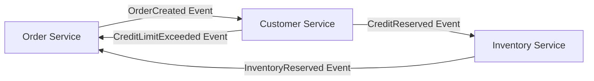
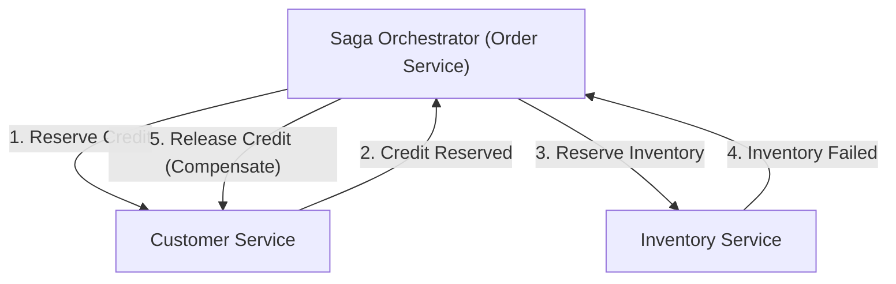

# Introduction : Le changement de paradigme du monolithe aux microservices

Dans l'ingénierie logicielle moderne, à mesure que l'échelle et la complexité des systèmes augmentent, la transition d'une architecture monolithique à une architecture de microservices est devenue une voie inévitable pour de nombreuses entreprises. Les microservices offrent d'innombrables avantages, tels que l'évolutivité, le déploiement indépendant, la diversité des piles technologiques et l'agilité organisationnelle. Cependant, ce changement de paradigme n'est en aucun cas une solution miracle. L'un des défis les plus difficiles auxquels sont confrontées les équipes de développement adoptant les microservices est la « gestion distribuée des données » et les « transactions distribuées ».

Dans cet article, nous explorerons en profondeur pourquoi le confort des transactions ACID de l'ère du monolithe se transforme en la difficulté des transactions distribuées lors de la division en microservices, pourquoi le traditionnel 2PC (Two-Phase Commit ou validation en deux phases) est considéré comme un anti-modèle dans les environnements distribués, et l'ensemble du « Modèle Saga », devenu la norme de facto dans l'architecture moderne des microservices, tout en abordant l'acceptation de la cohérence éventuelle (Eventual Consistency) et la difficulté de concevoir des transactions de compensation.

## Le paysage idyllique de l'ère du monolithe : Le doux piège des propriétés ACID

Dans le monde des applications monolithiques, la gestion des données était étonnamment simple et prévisible. L'application entière était constituée d'une seule et immense base de code et partageait généralement une seule base de données relationnelle (SGBDR). Grâce à cette base de données unique, les développeurs pouvaient profiter des puissantes « propriétés ACID » fournies par la base de données comme d'une évidence.

ACID est l'acronyme des quatre propriétés suivantes :

1. **Atomicité (Atomicity)** : Garantit que toutes les opérations d'une transaction « réussissent toutes » ou « échouent toutes (sont annulées) ». Il n'y a pas d'état intermédiaire.
2. **Cohérence (Consistency)** : Garantit que les contraintes de la base de données et les règles métier sont toujours respectées avant et après l'exécution de la transaction.
3. **Isolation (Isolation)** : Garantit que même si plusieurs transactions sont exécutées simultanément, chaque transaction n'interfère pas avec les autres.
4. **Durabilité (Durability)** : Garantit qu'une fois la transaction validée (commit), son résultat ne sera pas perdu, même en cas de panne du système.

Prenons l'exemple du processus de « commande » sur un site de commerce électronique. Lorsqu'un client commande un produit, les trois étapes suivantes sont exécutées :
1. Créer un enregistrement de commande dans la table `orders`.
2. Réduire le crédit du client dans la table `customers`.
3. Réduire le stock du produit dans la table `inventory`.

Dans un monolithe, il suffisait d'envelopper toutes ces opérations dans une seule transaction de base de données (`BEGIN; ... COMMIT;`). S'il n'y a pas assez de stock et qu'une erreur se produit à l'étape 3, la base de données annule automatiquement les étapes 1 et 2 (rollback), et le système reste dans un état cohérent. Les développeurs n'avaient pas à se soucier de la gestion complexe des erreurs ou des incohérences d'état, et la cohérence des données était totalement garantie au niveau de l'infrastructure. Ce confort des transactions ACID était véritablement un « doux piège ».

## Les terres sauvages des microservices : Le cauchemar de la gestion distribuée des données

Lorsque le système se développe et atteint les limites de son évolutivité ou de sa vitesse de développement, l'équipe s'oriente vers une architecture de microservices qui divise le monolithe en plusieurs petits services. L'une des meilleures pratiques pour les microservices est le modèle « Database per Service » (une base de données par service). C'est le principe selon lequel chaque microservice gère ses propres données et interdit l'accès direct à la base de données par d'autres services.

Si l'on applique ce principe au site de commerce électronique précédent, le système est divisé comme suit :
- **Order Service** : Possède une base de données pour gérer les données de commande.
- **Customer Service** : Possède une base de données pour gérer les informations et le crédit des clients.
- **Inventory Service** : Possède une base de données pour gérer le stock des produits.

Si cette configuration améliore l'indépendance des services, elle provoque également le « cauchemar de la gestion distribuée des données ». Il n'est plus possible de mettre à jour plusieurs tables avec une seule transaction de base de données. « La création d'une commande », « la réservation du crédit » et « la réservation du stock » nécessitent une coordination entre plusieurs services indépendants sur le réseau.

Que se passe-t-il si la création de la commande dans l'Order Service et la réservation du crédit dans le Customer Service réussissent, mais que l'Inventory Service est en panne et que la réservation du stock échoue ?
La magie des transactions de la base de données locale n'existe pas ici. Le crédit reste réduit et le stock ne l'est pas, mais la commande est en attente ou en échec, créant une « incohérence des données » fatale. C'est là le cœur du problème des transactions distribuées dans les microservices.

## La tentation et les limites fatales du 2PC (validation en deux phases)

En tant qu'approche classique pour maintenir la cohérence des transactions dans les systèmes distribués, il existe le protocole 2PC (Two-Phase Commit). De nombreux développeurs tentent de trouver une solution dans des implémentations 2PC telles que les transactions XA fournies par des bases de données distribuées ou des files d'attente de messages.

Le 2PC se compose d'un gestionnaire de transactions (coordinateur) et de plusieurs gestionnaires de ressources (participants) et se déroule en deux phases :

1. **Phase de préparation (Prepare Phase)** : Le coordinateur demande à tous les participants : « Êtes-vous prêts à valider (commit) ? ». Chaque participant verrouille les ressources et les place dans un état de validation avant de renvoyer « Oui » ou « Non ».
2. **Phase de validation / annulation (Commit / Rollback Phase)** : Si tous les participants répondent « Oui », le coordinateur leur demande à tous de « valider (commit) ». Si un seul participant répond « Non » ou ne répond pas, il ordonne à tous « d'annuler (rollback) ».

À première vue, cela semble être la solution parfaite, mais dans les environnements de microservices natifs du cloud modernes, le 2PC est considéré comme un sérieux anti-modèle pour les raisons suivantes :

- **Blocage synchrone et dégradation des performances** : Le plus gros inconvénient du 2PC est que le protocole entier est synchrone et que les participants conservent leurs verrous sur les ressources. Lorsqu'une latence du réseau ou une défaillance temporaire d'un participant se produit, tous les autres services doivent attendre la libération des verrous, ce qui réduit considérablement le débit global du système.
- **Point de défaillance unique (SPOF)** : Si le coordinateur de transactions tombe en panne, les participants restent en attente avec leurs verrous maintenus (état de doute ou in-doubt), ce qui risque de provoquer un interblocage (deadlock) du système.
- **Incompatibilité avec NoSQL et les courtiers de messages** : De nombreuses bases de données NoSQL modernes et les courtiers de messages les plus récents ne prennent pas en charge les transactions XA (2PC) afin de privilégier l'évolutivité. Cela réduit considérablement les choix technologiques.
- **Impact négatif sur la disponibilité** : Les microservices doivent être conçus en partant du principe de « défaillances partielles ». Cependant, avec le 2PC, si un service tombe en panne, la transaction entière échoue. Par conséquent, la disponibilité globale du système devient le produit de la disponibilité des services individuels, ce qui entraîne une baisse drastique de celle-ci.

## Le théorème CAP et l'acceptation de la cohérence éventuelle (Eventual Consistency)

Si nous renonçons à une cohérence forte (Strong Consistency) comme le 2PC, que devons-nous faire ? C'est ici que la compréhension du « théorème CAP » et des « caractéristiques BASE », principes fondamentaux des systèmes distribués, devient importante.

Le théorème CAP définit que dans un système distribué, seules deux des trois garanties suivantes peuvent être satisfaites simultanément :
- **Cohérence (Consistency)** : Tous les nœuds renvoient les mêmes données.
- **Disponibilité (Availability)** : Une requête vers un nœud sans panne renvoie toujours une réponse de réussite.
- **Tolérance au partitionnement (Partition tolerance)** : Le système continue de fonctionner même si le réseau est divisé (partitionnement).

Puisque le partitionnement du réseau (P) est inévitable dans les environnements cloud du monde réel, nous sommes toujours contraints de faire un compromis entre « C » et « A » (CP ou AP). Dans l'architecture des microservices, il est courant de choisir un « système AP » qui privilégie la disponibilité (A) et l'évolutivité du système, en compromettant la cohérence absolue (C).

Le produit de ce compromis est la « cohérence éventuelle (Eventual Consistency) ». La cohérence éventuelle est l'idée selon laquelle « toutes les données peuvent ne pas correspondre immédiatement, mais avec le temps (Eventually), toutes les données finiront par correspondre et atteindront un état cohérent ».

Au lieu d'ACID, le concept de **BASE** s'applique aux systèmes distribués :
- **Basically Available (Fondamentalement disponible)** : Même si une partie du système tombe en panne, le système dans son ensemble continue de fonctionner.
- **Soft state (État souple)** : La cohérence des données n'est pas toujours maintenue et l'état change avec le temps.
- **Eventually consistent (Cohérence éventuelle)** : En fin de compte, la cohérence des données est assurée.

La conception des transactions dans les microservices dépend de la manière dont cette cohérence éventuelle peut être mise en œuvre de manière sûre et prévisible dans l'ensemble du système. Le modèle d'architecture spécifique pour cela est le modèle « Saga ».

## L'aube du modèle Saga : La nouvelle norme des transactions distribuées

Le modèle Saga est un concept permettant de gérer des transactions à longue durée de vie (Long-Lived Transaction : LLT), originaire d'un article publié par Hector Garcia-Molina et Kenneth Salem en 1987. Aujourd'hui, il a été ressuscité comme la norme de facto pour résoudre les transactions distribuées dans les microservices.

L'idée de base de Saga est de diviser une grande transaction distribuée en une chaîne de plusieurs « transactions ACID locales » qui se terminent au sein de chaque microservice.

Pour terminer la Saga complète, chaque service exécute une transaction locale et émet un « événement » ou un « message » indiquant son achèvement. Le service suivant reçoit cet événement et exécute sa propre transaction locale. Si une violation des règles métier ou une erreur (par exemple, rupture de stock, dépassement de la limite de crédit) se produit à une étape intermédiaire, la Saga fait marche arrière et exécute des opérations pour « annuler » les transactions locales exécutées jusqu'à présent. C'est ce qu'on appelle une **transaction de compensation (Compensating Transaction)**.

Le flux des transactions dans une Saga est le suivant :
Soit une série de transactions locales $T_1, T_2, \dots, T_n$. Soient $C_1, C_2, \dots, C_{n-1}$ les transactions de compensation correspondantes.

1. Cas normal : $T_1 \rightarrow T_2 \rightarrow \dots \rightarrow T_n$ réussissent toutes, et la Saga se termine.
2. Cas anormal (échec à $T_k$) : Réussite jusqu'à $T_1 \rightarrow T_2 \rightarrow \dots \rightarrow T_{k-1}$, puis une erreur se produit à $T_k$. Ensuite, l'exécution s'effectue dans l'ordre inverse $C_{k-1} \rightarrow C_{k-2} \rightarrow \dots \rightarrow C_1$, ramenant l'ensemble du système à son état cohérent d'origine (état de rollback sémantique).

Le modèle Saga a deux grandes approches d'implémentation selon qui joue le rôle de coordinateur de la transaction. Ce sont la « Chorégraphie (Choreography) » et « l'Orchestration (Orchestration) ».

### Chorégraphie (Choreography) : La danse des services autonomes

Dans l'approche de chorégraphie, il n'y a pas de coordinateur central pour superviser la Saga. Chaque microservice agit de manière autonome et fait avancer les transactions en chaîne en publiant et en s'abonnant (Pub/Sub) à des événements de domaine. C'est comme si des danseurs dansaient de manière autonome (chorégraphie) au rythme de la musique et des mouvements environnants, sans chef d'orchestre central.

**Avantages de la Chorégraphie :**
- **Couplage lâche** : Puisqu'il n'y a pas de dépendance envers un orchestrateur central, il n'y a pas de point de défaillance unique et le niveau de couplage entre les services reste faible.
- **Implémentation simple (pour les petites échelles)** : Lorsque le nombre de services participants est faible (environ 2 à 4), sa mise en place est facile car elle peut être implémentée simplement en émettant et en écoutant des événements.

**Inconvénients de la Chorégraphie :**
- **Difficulté à saisir la vue d'ensemble** : Le flux des transactions de l'ensemble du système étant dispersé dans toute la base de code, il devient extrêmement difficile de suivre et de déboguer ce qui se passe globalement (l'état actuel de la Saga).
- **Risque de dépendance circulaire** : Les services s'écoutant mutuellement, le risque de tomber dans des références circulaires ou des boucles infinies augmente.
- **Vulnérabilité à la complexité** : Au fur et à mesure que le nombre d'étapes augmente ou que des conditions de branchement complexes deviennent nécessaires, l'ensemble de l'architecture se transforme en code spaghetti et devient impossible à maintenir.

### Orchestration (Orchestration) : Le chef d'orchestre centralisé

Dans l'approche d'orchestration, un « orchestrateur Saga (coordinateur) » qui contrôle le flux d'exécution de la Saga au centre est mis en place. L'orchestrateur, tel le chef d'un orchestre, indique au service suivant d'exécuter sa transaction locale, reçoit son résultat et donne les instructions suivantes, et en cas d'erreur, ordonne la transaction de compensation appropriée.

**Avantages de l'Orchestration :**
- **Gestion centralisée et visibilité** : La définition du flux de travail de la Saga étant centralisée en un seul endroit (l'orchestrateur), il devient beaucoup plus facile de saisir la vue d'ensemble, de surveiller l'état et de déboguer.
- **Élimination des dépendances circulaires** : Les services participants répondent uniquement aux instructions de l'orchestrateur et n'ont pas besoin de se connaître, rendant ainsi les dépendances unidirectionnelles.
- **Prise en charge des flux complexes** : Il est possible d'implémenter de manière flexible une logique transactionnelle complexe telle que les branchements conditionnels, l'exécution concurrente, les tentatives (retries) et les délais d'attente (timeouts).

**Inconvénients de l'Orchestration :**
- **Dépendance envers l'orchestrateur** : Si la logique métier se concentre trop sur l'orchestrateur, il risque de devenir de facto un « monolithe intelligent », réduisant les autres services à de simples services CRUD (modèle de domaine anémique).
- **Complexité de l'infrastructure** : Afin de gérer les transitions d'état, il y a un coût de mise en place et d'exploitation de moteurs de flux de travail ou de frameworks de machines à états tels que AWS Step Functions, Camunda ou Temporal.

En général, pour les systèmes commerciaux où les transactions s'étendent sur plusieurs services et impliquent une logique métier complexe, **l'approche d'Orchestration est recommandée**.

## La chair et le sang qui soutiennent le modèle Saga : Philosophie de conception des transactions de compensation (Compensating Transaction)

Le plus grand obstacle à la compréhension et à la mise en pratique du modèle Saga est la conception de la « transaction de compensation ». Dans un environnement distribué, il est impossible de ramener le système à un « état passé identique » comme avec la commande `ROLLBACK` d'une base de données. En effet, pendant que vous essayez d'annuler une transaction, une autre transaction a peut-être déjà lu ou modifié ces données.

Par conséquent, une transaction de compensation ne doit pas être conçue comme une opération visant à « rembobiner physiquement le système », mais à « l'annuler d'un point de vue métier ».

Prenons par exemple une Saga de réservation de voyage comprenant la réservation d'un hôtel et la réservation d'un vol.
1. Réserver un hôtel (succès)
2. Réserver un vol (échec car complet)

Dans ce cas, la réservation d'hôtel doit être annulée (compensée) parce que le vol n'a pas pu être réservé. Cependant, vous ne pouvez pas simplement supprimer physiquement les données (DELETE) dans le système de réservation de l'hôtel. Dans le monde réel, des frais d'annulation peuvent s'appliquer en fonction de la politique d'annulation de la réservation d'hôtel, et vous devez conserver un historique de l'annulation.
En d'autres termes, la transaction de compensation pour l'hôtel devient « l'exécution d'une nouvelle logique métier appelée processus d'annulation (INSERTION de nouveaux enregistrements et MISE À JOUR des statuts) ».

**Principes importants de la conception de transactions de compensation :**

1. **Garantie d'idempotence (Idempotency)** :
   Dans les systèmes distribués, en raison des latences du réseau et des mécanismes de répétition (retry), la distribution « au moins une fois (At-Least-Once) », où le même message arrive plusieurs fois, est fondamentale. Par conséquent, la transaction de compensation (ainsi que la transaction aller) doit avoir la propriété « d'idempotence », ce qui signifie que le résultat ne change pas, quel que soit le nombre de fois où elle est exécutée. L'implémentation d'une clé d'idempotence, utilisant un ID de transaction unique pour déterminer si la transaction a déjà été traitée, est essentielle.

2. **Garantie de réussite absolue** :
   Les transactions aller peuvent échouer en raison de règles métier (par exemple : rupture de stock). Cependant, **les transactions de compensation ne doivent absolument jamais échouer, que ce soit pour des raisons techniques ou métier**. Une fois qu'une compensation a commencé, elle doit être retentée en continu jusqu'à ce que le système atteigne une cohérence éventuelle. Dans le cas improbable d'une erreur fatale nécessitant une intervention manuelle, le message doit être envoyé à une file d'attente de lettres mortes (Dead Letter Queue - DLQ) pour déclencher une alerte, et un mécanisme doit être mis en place pour qu'un opérateur puisse s'en occuper.

3. **Indépendance de l'ordre (Commutativity)** :
   Dans un environnement de messagerie asynchrone, une situation anormale (Out of order) peut se produire où la demande de transaction de compensation arrive pour une raison quelconque avant la demande d'exécution de la transaction aller. Pour éviter que le système ne s'effondre même dans de tels cas, il est nécessaire de gérer strictement l'état de la transaction et de mettre en œuvre une programmation défensive du type : « Si une demande de compensation arrive pour une transaction qui n'a pas encore commencé, marquez la transaction comme 'annulée' et ignorez toute demande aller ultérieure ».

4. **Mesures contre le manque d'isolation (Isolation)** :
   Puisque chaque étape de la Saga est validée (committed) dans la base de données locale, les données à « l'état intermédiaire » de la Saga en cours sont visibles par d'autres transactions (c'est ce qu'on appelle la lecture incorrecte ou Dirty Read). Pour éviter cela, il est recommandé de donner un « état (State) » aux données. Par exemple, au lieu de définir le statut de la commande sur `APPROVED` dès le début, créez-le comme `PENDING` (en cours de traitement), et mettez-le à jour à `APPROVED` uniquement lorsque la Saga est entièrement terminée avec succès, ou mettez-le à jour à `CANCELLED` en cas d'échec. Les autres services peuvent traiter les données à l'état `PENDING` en reconnaissant qu'elles sont non confirmées (modèle de verrouillage sémantique - Semantic Lock).

## Défis pratiques et modèles de conception dans l'implémentation du modèle Saga

Lors de la mise en œuvre du modèle Saga, les développeurs doivent effectuer de manière atomique l'écriture dans la base de données et la publication de messages sur le courtier de messages. Dans une séquence « mettre à jour la base de données puis envoyer le message », si le système plante après la mise à jour de la base de données, le message ne sera pas envoyé et la Saga sera interrompue (problème de double écriture - Dual Write Problem).

Le **modèle Outbox (Transactional Outbox Pattern)** est largement adopté pour résoudre ce problème.

Dans le modèle Outbox, vous préparez une table « Outbox (boîte d'envoi) » aux côtés de la table des « données métier » dans la propre base de données du service.
Au sein d'une transaction locale, en même temps que la mise à jour des données métier, vous INSEREZ le message à envoyer dans la table Outbox. Étant donné que ces opérations sont effectuées dans la même transaction de base de données, une atomicité totale est garantie.
Ensuite, un autre processus asynchrone (un relais de messages ou un outil CDC comme Debezium) surveille la table Outbox, lit les enregistrements, les envoie de manière fiable au courtier de messages (Kafka, RabbitMQ, etc.), puis supprime l'enregistrement de la table Outbox (ou le marque comme envoyé) après un envoi réussi. Cela permet de construire une base de messagerie fiable de type « au moins une fois » (At-Least-Once), ce qui améliore considérablement la fiabilité de la Saga.

## Conclusion : Pour devenir un véritable concepteur de systèmes distribués

La transition vers une architecture de microservices n'est pas un simple changement d'infrastructure ou de framework. Il s'agit d'un changement de paradigme vers la « cohérence des données » et exige un changement dans le modèle de réflexion des ingénieurs logiciels.

Il est nécessaire d'abandonner l'illusion synchrone du 2PC et d'accepter la réalité des systèmes distribués : les réseaux sont instables, les pannes surviennent quotidiennement et les données sont toujours synchronisées avec un léger décalage. Maîtriser la cohérence éventuelle et le modèle Saga est une exigence essentielle pour naviguer sur les eaux agitées des microservices et construire des systèmes véritablement évolutifs et résilients.

Bien qu'il soit bon de commencer par la simplicité de la Chorégraphie, vous devriez vous préparer à migrer vers la robustesse de l'Orchestration à mesure que votre système se développe. Surtout, les compétences en conception pilotée par le domaine (Domain-Driven Design - DDD) sont indispensables pour discuter en profondeur avec les chefs de produit et l'équipe commerciale des implications métier des transactions de compensation, et pour traduire avec précision le comportement du domaine dans le code.

Le chemin du modèle Saga n'est en aucun cas facile, mais à son extrémité se trouve une architecture robuste capable de résister à n'importe quelle charge ou défaillance. Ce sont les architectes capables de comprendre la vérité des transactions distribuées et de concevoir l'équilibre optimal entre cohérence et disponibilité qui dirigeront le développement de systèmes de la prochaine génération.
