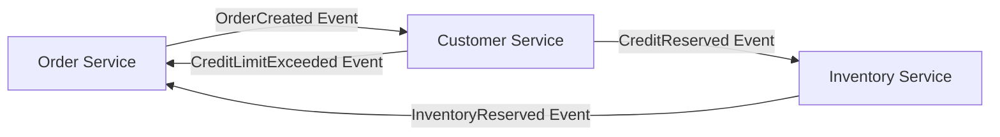
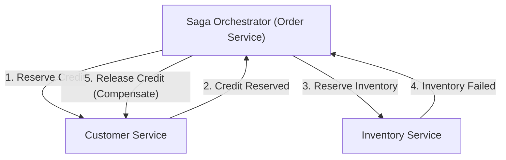

# परिचय: मोनोलिथ से माइक्रोसर्विसेज़ तक पैराडाइम शिफ्ट

आधुनिक सॉफ़्टवेयर इंजीनियरिंग में, जैसे-जैसे सिस्टम का पैमाना और जटिलता बढ़ती है, मोनोलिथिक आर्किटेक्चर से माइक्रोसर्विसेज़ आर्किटेक्चर की ओर जाना कई कंपनियों के लिए अपरिहार्य हो गया है। माइक्रोसर्विसेज़ अनगिनत लाभ लाते हैं, जैसे कि स्केलेबिलिटी, स्वतंत्र डिप्लॉयमेंट, प्रौद्योगिकी स्टैक की विविधता, और संगठनात्मक चपलता। हालाँकि, यह पैराडाइम शिफ्ट कोई जादुई छड़ी नहीं है। माइक्रोसर्विसेज़ को अपनाने वाली डेवलपमेंट टीमों के सामने आने वाली सबसे कठिन चुनौतियों में से एक "डिस्ट्रिब्यूटेड डेटा मैनेजमेंट" और "डिस्ट्रिब्यूटेड ट्रांज़ैक्शन" है।

इस लेख में, हम गहराई से जानेंगे कि क्यों मोनोलिथ युग के ACID ट्रांज़ैक्शन की सुविधा से एकदम उलट, माइक्रोसर्विसेज़ में विभाजन के साथ डिस्ट्रिब्यूटेड ट्रांज़ैक्शन की कठिनाइयों का सामना करना पड़ता है। साथ ही, पारंपरिक 2PC (Two-Phase Commit) को डिस्ट्रिब्यूटेड वातावरण में एंटी-पैटर्न क्यों माना जाता है, और आधुनिक माइक्रोसर्विसेज़ आर्किटेक्चर में वास्तविक मानक (de facto standard) बन चुके "सागा (Saga) पैटर्न" के पूरे परिदृश्य पर चर्चा करेंगे, जिसमें इवेंचुअल कंसिस्टेंसी (Eventual Consistency) को स्वीकार करने और कॉम्पेन्सेटिंग ट्रांज़ैक्शन के डिज़ाइन की कठिनाइयों को भी शामिल किया गया है।

## मोनोलिथ युग का सुखद परिदृश्य: ACID गुणों का मीठा जाल

मोनोलिथिक एप्लिकेशन की दुनिया में, डेटा प्रबंधन आश्चर्यजनक रूप से सरल और पूर्वानुमानित था। पूरा एप्लिकेशन एक विशाल कोडबेस से बना था और आमतौर पर एक सिंगल रिलेशनल डेटाबेस (RDBMS) साझा करता था। इस सिंगल डेटाबेस के लाभ के कारण, डेवलपर्स डेटाबेस द्वारा प्रदान किए गए शक्तिशाली "ACID गुणों" का स्वाभाविक रूप से आनंद ले सकते थे।

ACID निम्नलिखित 4 गुणों का संक्षिप्त रूप है:

1. **Atomicity (परमाणुता)**: यह सुनिश्चित करता है कि ट्रांज़ैक्शन के सभी ऑपरेशन या तो "सभी सफल" होंगे या "सभी विफल (रोलबैक)" हो जाएंगे। कोई मध्यवर्ती स्थिति मौजूद नहीं होती है।
2. **Consistency (निरंतरता)**: यह सुनिश्चित करता है कि ट्रांज़ैक्शन के निष्पादन से पहले और बाद में डेटाबेस की बाधाएं और व्यावसायिक नियम हमेशा संतुष्ट रहते हैं।
3. **Isolation (पृथक्करण)**: यह सुनिश्चित करता है कि जब कई ट्रांज़ैक्शन एक साथ निष्पादित होते हैं, तो वे एक-दूसरे के साथ हस्तक्षेप नहीं करते हैं।
4. **Durability (स्थायित्व)**: यह सुनिश्चित करता है कि एक बार ट्रांज़ैक्शन कमिट हो जाने के बाद, सिस्टम के विफल होने पर भी उसका परिणाम नष्ट नहीं होता है।

उदाहरण के लिए, ई-कॉमर्स साइट पर "ऑर्डर" प्रक्रिया पर विचार करें। जब कोई ग्राहक कोई उत्पाद ऑर्डर करता है, तो निम्नलिखित 3 चरण निष्पादित होते हैं:
1. `orders` टेबल में एक ऑर्डर रिकॉर्ड बनाएँ।
2. `customers` टेबल में ग्राहक की क्रेडिट सीमा को कम करें।
3. `inventory` टेबल में उत्पाद की इन्वेंट्री कम करें।

मोनोलिथ में, इन सभी ऑपरेशनों को बस एक सिंगल डेटाबेस ट्रांज़ैक्शन (`BEGIN; ... COMMIT;`) में लपेटना पर्याप्त था। यदि इन्वेंट्री अपर्याप्त थी और चरण 3 में कोई त्रुटि आती है, तो डेटाबेस स्वचालित रूप से चरण 1 और 2 को रोलबैक कर देता है, और सिस्टम एक सुसंगत स्थिति बनाए रखता है। डेवलपर्स को जटिल त्रुटि प्रबंधन या असंगत स्थितियों के बारे में गहराई से चिंता करने की आवश्यकता नहीं थी, बुनियादी ढांचे के स्तर पर डेटा की निरंतरता पूरी तरह से सुनिश्चित थी। ACID ट्रांज़ैक्शन की यह सुविधा वास्तव में एक "मीठा जाल" थी।

## माइक्रोसर्विसेज़ की बंजर भूमि: डिस्ट्रिब्यूटेड डेटा प्रबंधन का दुःस्वप्न

जब सिस्टम बढ़ता है और स्केलेबिलिटी या डेवलपमेंट की गति अपनी सीमा तक पहुँचती है, तो टीमें माइक्रोसर्विसेज़ आर्किटेक्चर की ओर बढ़ती हैं, जो मोनोलिथ को कई छोटी सेवाओं में विभाजित करता है। माइक्रोसर्विसेज़ की सर्वोत्तम प्रथाओं में से एक "Database per Service" पैटर्न है। यह एक सिद्धांत है जिसके तहत प्रत्येक माइक्रोसर्विस अपने स्वयं के डेटा का प्रबंधन करती है और अन्य सेवाओं को सीधे इसके डेटाबेस तक पहुंचने से रोकती है।

यदि हम इस सिद्धांत को पहले बताई गई ई-कॉमर्स साइट पर लागू करते हैं, तो सिस्टम को इस प्रकार विभाजित किया जाएगा:
- **Order Service**: ऑर्डर डेटा को प्रबंधित करने के लिए अपना डेटाबेस।
- **Customer Service**: ग्राहक जानकारी और क्रेडिट सीमा को प्रबंधित करने के लिए अपना डेटाबेस।
- **Inventory Service**: उत्पाद सूची को प्रबंधित करने के लिए अपना डेटाबेस।

यह कॉन्फ़िगरेशन सेवाओं की स्वतंत्रता को बढ़ाता है, लेकिन साथ ही "डिस्ट्रिब्यूटेड डेटा प्रबंधन का दुःस्वप्न" भी पैदा करता है। अब एक सिंगल डेटाबेस ट्रांज़ैक्शन के साथ कई टेबल्स को अपडेट करना संभव नहीं है। "ऑर्डर बनाना", "क्रेडिट सुरक्षित करना", और "इन्वेंट्री सुरक्षित करना" नेटवर्क के माध्यम से कई स्वतंत्र सेवाओं के बीच समन्वय की आवश्यकता पैदा करता है।

क्या होगा यदि Order Service में ऑर्डर का निर्माण और Customer Service में क्रेडिट का आरक्षण सफल हो जाता है, लेकिन Inventory Service डाउन हो और इन्वेंट्री आरक्षण विफल हो जाए?
स्थानीय डेटाबेस ट्रांज़ैक्शन का जादू यहाँ मौजूद नहीं है। क्रेडिट कम हो गया है, इन्वेंट्री कम नहीं हुई है, लेकिन ऑर्डर पेंडिंग या विफल स्थिति में रहता है, जिसके परिणामस्वरूप एक घातक "डेटा असंगति" उत्पन्न होती है। माइक्रोसर्विसेज़ में डिस्ट्रिब्यूटेड ट्रांज़ैक्शन की समस्या का यही मूल है।

## 2PC (2-फ़ेज़ कमिट) का प्रलोभन और घातक सीमाएँ

डिस्ट्रिब्यूटेड सिस्टम में ट्रांज़ैक्शन की निरंतरता बनाए रखने के लिए एक क्लासिक दृष्टिकोण के रूप में 2PC (Two-Phase Commit) प्रोटोकॉल मौजूद है। कई डेवलपर्स डिस्ट्रिब्यूटेड डेटाबेस या मैसेज कतारों द्वारा प्रदान किए जाने वाले XA ट्रांज़ैक्शन जैसे 2PC कार्यान्वयन में समाधान खोजने का प्रयास करते हैं।

2PC में एक ट्रांज़ैक्शन मैनेजर (कोऑर्डिनेटर) और कई रिसोर्स मैनेजर (प्रतिभागी) होते हैं, और यह निम्नलिखित 2 चरणों में आगे बढ़ता है:

1. **Prepare Phase (तैयारी का चरण)**: कोऑर्डिनेटर सभी प्रतिभागियों से पूछता है कि "क्या आप कमिट करने के लिए तैयार हैं?" प्रत्येक प्रतिभागी अपने रिसोर्सेज़ को लॉक करता है, उन्हें कमिट करने योग्य स्थिति में लाता है, और फिर "Yes" या "No" लौटाता है।
2. **Commit / Rollback Phase (कमिट/रोलबैक चरण)**: यदि सभी प्रतिभागी "Yes" का उत्तर देते हैं, तो कोऑर्डिनेटर सभी को "कमिट" करने का निर्देश देता है। यदि एक भी प्रतिभागी "No" का उत्तर देता है या कोई प्रतिक्रिया नहीं मिलती है, तो कोऑर्डिनेटर सभी को "रोलबैक" करने का निर्देश देता है।

पहली नज़र में, यह एक अचूक समाधान लग सकता है, लेकिन आधुनिक क्लाउड-नेटिव माइक्रोसर्विसेज़ वातावरण में, 2PC को एक गंभीर एंटी-पैटर्न माना जाता है। इसके कारण इस प्रकार हैं:

- **सिंक्रोनस ब्लॉकिंग और प्रदर्शन में गिरावट**: 2PC का सबसे बड़ा नुकसान यह है कि पूरा प्रोटोकॉल सिंक्रोनस होता है और प्रतिभागी रिसोर्सेज़ पर लॉक बनाए रखते हैं। यदि नेटवर्क में विलंब होता है या किसी प्रतिभागी में अस्थायी विफलता होती है, तो अन्य सभी सेवाओं को लॉक के रिलीज़ होने का इंतज़ार करना पड़ता है, जिससे पूरे सिस्टम का थ्रूपुट काफी कम हो जाता है।
- **सिंगल पॉइंट ऑफ़ फेलियर (SPOF)**: यदि ट्रांज़ैक्शन कोऑर्डिनेटर विफल हो जाता है, तो प्रतिभागी लॉक पकड़े हुए प्रतीक्षा स्थिति (इन-डाउट स्टेट) में फंस जाते हैं, जिससे सिस्टम में डेडलॉक होने का जोखिम होता है।
- **NoSQL या मैसेज ब्रोकर्स का समर्थन न होना**: कई आधुनिक NoSQL डेटाबेस और नवीनतम मैसेज ब्रोकर्स स्केलेबिलिटी को प्राथमिकता देने के लिए XA ट्रांज़ैक्शन (2PC) का समर्थन नहीं करते हैं। यह तकनीकी विकल्पों को काफी सीमित कर देता है।
- **उपलब्धता पर नकारात्मक प्रभाव**: माइक्रोसर्विसेज़ को "आंशिक विफलताओं" की धारणा के साथ डिज़ाइन किया जाना चाहिए। हालाँकि, 2PC में, यदि 1 सेवा भी डाउन हो जाती है, तो पूरा ट्रांज़ैक्शन विफल हो जाता है, जिससे समग्र सिस्टम की उपलब्धता अलग-अलग सेवाओं की उपलब्धता का गुणनफल बन जाती है और तेजी से कम हो जाती है।

## CAP थ्योरम और इवेंचुअल कंसिस्टेंसी (Eventual Consistency) को स्वीकार करना

यदि हम 2PC जैसी मजबूत निरंतरता (Strong Consistency) छोड़ देते हैं, तो हमें क्या करना चाहिए? यहीं पर डिस्ट्रिब्यूटेड सिस्टम के मूल सिद्धांतों, "CAP थ्योरम" और "BASE गुणों" को समझना महत्वपूर्ण हो जाता है।

CAP थ्योरम यह परिभाषित करता है कि किसी डिस्ट्रिब्यूटेड सिस्टम में निम्नलिखित 3 गारंटियों में से एक ही समय में अधिकतम 2 को ही पूरा किया जा सकता है:
- **Consistency (निरंतरता)**: सभी नोड्स समान डेटा लौटाते हैं।
- **Availability (उपलब्धता)**: बिना विफलता वाले किसी नोड पर किया गया हर अनुरोध हमेशा एक सफल प्रतिक्रिया लौटाता है।
- **Partition tolerance (नेटवर्क विभाजन के प्रति सहनशीलता)**: नेटवर्क विभाजन होने पर भी सिस्टम काम करना जारी रखता है।

चूँकि वास्तविक क्लाउड परिवेश में नेटवर्क विभाजन (P) अपरिहार्य है, इसलिए हमें हमेशा "C" और "A" के बीच ट्रेड-ऑफ़ करने के लिए मजबूर होना पड़ता है (CP या AP)। माइक्रोसर्विसेज़ आर्किटेक्चर में, आम तौर पर सिस्टम की उपलब्धता (A) और स्केलेबिलिटी को प्राथमिकता देते हुए एक "AP सिस्टम" को चुना जाता है, जिसमें पूर्ण निरंतरता (C) से समझौता किया जाता है।

इस समझौते का परिणाम "इवेंचुअल कंसिस्टेंसी (Eventual Consistency)" है। इवेंचुअल कंसिस्टेंसी का अर्थ है कि "हो सकता है कि सभी डेटा तुरंत मेल न खाएं, लेकिन समय के साथ (Eventually) अंततः सभी डेटा मेल खाएंगे और एक सुसंगत स्थिति में आ जाएंगे।"

ACID के बजाय, डिस्ट्रिब्यूटेड सिस्टम में **BASE** की अवधारणा लागू होती है:
- **Basically Available (मूल रूप से उपलब्ध)**: यदि सिस्टम का कुछ हिस्सा विफल भी हो जाता है, तो भी संपूर्ण सिस्टम चलता रहता है।
- **Soft state (सॉफ़्ट स्टेट)**: डेटा की निरंतरता हमेशा बनी नहीं रहती है, स्थिति समय के साथ बदलती रहती है।
- **Eventually consistent (अंततः सुसंगत)**: अंततः डेटा की निरंतरता सुनिश्चित हो जाती है।

माइक्रोसर्विसेज़ में ट्रांज़ैक्शन डिज़ाइन इस बात पर निर्भर करता है कि पूरे सिस्टम के लिए इस इवेंचुअल कंसिस्टेंसी को सुरक्षित और पूर्वानुमानित तरीके से कैसे प्राप्त किया जाए। इसके लिए विशिष्ट आर्किटेक्चरल पैटर्न "सागा (Saga)" है।

## सागा पैटर्न का उदय: डिस्ट्रिब्यूटेड ट्रांज़ैक्शन का नया मानक

सागा पैटर्न लंबे समय तक चलने वाले ट्रांज़ैक्शन (Long-Lived Transaction: LLT) को प्रबंधित करने की एक अवधारणा है, जिसकी उत्पत्ति 1987 में हेक्टर गार्सिया-मोलिना और केनेथ सलेम द्वारा प्रकाशित एक पेपर से हुई थी। आधुनिक समय में, इसे माइक्रोसर्विसेज़ के डिस्ट्रिब्यूटेड ट्रांज़ैक्शन को हल करने के वास्तविक मानक के रूप में पुनर्जीवित किया गया है।

सागा का मूल विचार बड़े पैमाने के डिस्ट्रिब्यूटेड ट्रांज़ैक्शन को कई "स्थानीय ACID ट्रांज़ैक्शन" की एक श्रृंखला में विभाजित करना है, जो प्रत्येक माइक्रोसर्विस के भीतर पूरे होते हैं।

संपूर्ण सागा को पूरा करने के लिए, प्रत्येक सेवा एक स्थानीय ट्रांज़ैक्शन निष्पादित करती है और इसके पूरा होने का संकेत देने वाला एक "इवेंट" या "मैसेज" जारी करती है। अगली सेवा उस इवेंट को प्राप्त करती है और अपना स्थानीय ट्रांज़ैक्शन निष्पादित करती है। यदि बीच के किसी चरण में व्यावसायिक नियमों का उल्लंघन या कोई त्रुटि होती है (जैसे: इन्वेंट्री की कमी, क्रेडिट सीमा पार होना), तो सागा वहां से वापस जाता है और अब तक निष्पादित किए गए स्थानीय ट्रांज़ैक्शन को "रद्द" करने के लिए ऑपरेशन निष्पादित करता है। इसे **कॉम्पेन्सेटिंग ट्रांज़ैक्शन (Compensating Transaction)** कहा जाता है।

सागा में ट्रांज़ैक्शन का प्रवाह निम्नलिखित है:
मान लीजिए कि स्थानीय ट्रांज़ैक्शन की एक श्रृंखला $T_1, T_2, \dots, T_n$ है। उनसे संबंधित कॉम्पेन्सेटिंग ट्रांज़ैक्शन $C_1, C_2, \dots, C_{n-1}$ हैं।

1. सामान्य स्थिति: $T_1 \rightarrow T_2 \rightarrow \dots \rightarrow T_n$ सभी सफल होते हैं और सागा पूरा हो जाता है।
2. असामान्य स्थिति ($T_k$ पर विफल होने पर): $T_1 \rightarrow T_2 \rightarrow \dots \rightarrow T_{k-1}$ तक सफल होता है, और $T_k$ पर त्रुटि उत्पन्न होती है। इसके बाद, उल्टे क्रम में $C_{k-1} \rightarrow C_{k-2} \rightarrow \dots \rightarrow C_1$ निष्पादित किए जाते हैं, और पूरा सिस्टम अपनी मूल सुसंगत स्थिति (सिमेंटिक रोलबैक स्थिति) में वापस आ जाता है।

सागा पैटर्न में, ट्रांज़ैक्शन के समन्वय की जिम्मेदारी कौन लेता है, इसके आधार पर कार्यान्वयन के 2 मुख्य दृष्टिकोण हैं: "Choreography (कोरियोग्राफी)" और "Orchestration (ऑर्केस्ट्रेशन)"।

### Choreography (कोरियोग्राफी): स्वायत्त सेवाओं का नृत्य

Choreography दृष्टिकोण में, सागा की देखरेख करने वाला कोई केंद्रीय कोऑर्डिनेटर नहीं होता है। प्रत्येक माइक्रोसर्विस स्वायत्त रूप से कार्य करती है और डोमेन इवेंट्स को पब्लिश-सब्सक्राइब (Pub/Sub) करके ट्रांज़ैक्शन को एक श्रृंखला में आगे बढ़ाती है। यह ऐसा है जैसे नर्तक किसी केंद्रीय कंडक्टर के बिना, संगीत और अपने आसपास की हरकतों के अनुसार स्वायत्त रूप से नृत्य (कोरियोग्राफी) कर रहे हों।

**Choreography के लाभ:**
- **लूज़ कपलिंग**: चूँकि यह किसी केंद्रीय ऑर्केस्ट्रेटर पर निर्भर नहीं करता है, इसलिए कोई सिंगल पॉइंट ऑफ़ फेलियर नहीं है, और सेवाओं के बीच कपलिंग कम रहती है।
- **सरल कार्यान्वयन (छोटे पैमाने के लिए)**: यदि भाग लेने वाली सेवाएँ कम (2 से 4 के करीब) हैं, तो इसे केवल इवेंट जारी करके और सुनकर लागू किया जा सकता है, जिससे इसे अपनाना आसान हो जाता है।

**Choreography के नुकसान:**
- **समग्र चित्र को समझना मुश्किल**: चूँकि संपूर्ण सिस्टम का ट्रांज़ैक्शन प्रवाह कोडबेस के विभिन्न हिस्सों में बिखरा होता है, इसलिए यह ट्रैक करना और डिबग करना बेहद मुश्किल हो जाता है कि कुल मिलाकर क्या हो रहा है (सागा की वर्तमान स्थिति)।
- **चक्रीय निर्भरता का जोखिम**: सेवाओं द्वारा एक-दूसरे के इवेंट्स को सुनने से चक्रीय संदर्भों या अनंत लूप में फंसने का जोखिम बढ़ जाता है।
- **जटिलता के प्रति भेद्यता**: जैसे-जैसे चरणों की संख्या बढ़ती है या जटिल ब्रांचिंग शर्तों की आवश्यकता होती है, पूरा आर्किटेक्चर स्पेगेटी बन जाता है और मेंटेन करने योग्य नहीं रहता।

### Orchestration (ऑर्केस्ट्रेशन): केंद्रीकृत कंडक्टर

Orchestration दृष्टिकोण में, एक "सागा ऑर्केस्ट्रेटर (कोऑर्डिनेटर)" स्थापित किया जाता है जो सागा के निष्पादन प्रवाह को केंद्रीय रूप से नियंत्रित करता है। एक ऑर्केस्ट्रा में कंडक्टर की तरह, ऑर्केस्ट्रेटर यह निर्देश देता है कि आगे किस सेवा को स्थानीय ट्रांज़ैक्शन करना चाहिए, इसके परिणाम प्राप्त करता है, अगला निर्देश जारी करता है, और त्रुटि की स्थिति में उचित कॉम्पेन्सेटिंग ट्रांज़ैक्शन को निर्देशित करता है।

**Orchestration के लाभ:**
- **केंद्रीकृत प्रबंधन और दृश्यता**: चूँकि सागा वर्कफ़्लो की परिभाषा एक ही स्थान (ऑर्केस्ट्रेटर) पर केंद्रित होती है, इसलिए समग्र चित्र को समझना, स्थिति की निगरानी करना और डिबग करना बहुत आसान हो जाता है।
- **चक्रीय निर्भरता का उन्मूलन**: भाग लेने वाली सेवाएँ केवल ऑर्केस्ट्रेटर के निर्देशों का जवाब देती हैं और उन्हें एक-दूसरे के बारे में जानने की आवश्यकता नहीं होती है, इसलिए निर्भरता एकतरफ़ा हो जाती है।
- **जटिल प्रवाहों को संभालना**: यह सशर्त ब्रांचिंग, समानांतर निष्पादन, रिट्राई, टाइमआउट आदि जैसे जटिल ट्रांज़ैक्शन लॉजिक को लचीले ढंग से लागू कर सकता है।

**Orchestration के नुकसान:**
- **ऑर्केस्ट्रेटर पर निर्भरता**: यदि ऑर्केस्ट्रेटर में बहुत अधिक बिजनेस लॉजिक केंद्रित हो जाता है, तो यह जोखिम होता है कि यह एक "स्मार्ट मोनोलिथ" बन जाएगा और अन्य सेवाएँ केवल CRUD सेवाओं (Anemic Domain Model) में सिमट कर रह जाएंगी।
- **इन्फ्रास्ट्रक्चर की जटिलता**: स्थिति परिवर्तन को प्रबंधित करने के लिए AWS Step Functions, Camunda, या Temporal जैसे वर्कफ़्लो इंजन या स्टेट मशीन फ़्रेमवर्क को पेश करने और संचालित करने की लागत आती है।

आम तौर पर, वाणिज्यिक प्रणालियों के लिए जो कई सेवाओं में फैले हुए जटिल बिजनेस लॉजिक को शामिल करते हैं, **Orchestration दृष्टिकोण की सिफारिश की जाती है**।

## सागा पैटर्न की रीढ़: कॉम्पेन्सेटिंग ट्रांज़ैक्शन (Compensating Transaction) का डिज़ाइन दर्शन

सागा पैटर्न को सही मायने में समझने और व्यवहार में लाने में सबसे बड़ी बाधा "कॉम्पेन्सेटिंग ट्रांज़ैक्शन" का डिज़ाइन है। एक डिस्ट्रिब्यूटेड वातावरण में, डेटाबेस के `ROLLBACK` कमांड की तरह सिस्टम को "पूरी तरह से पिछले उसी स्टेट" में वापस लाना असंभव है। ऐसा इसलिए है क्योंकि जब आप किसी ट्रांज़ैक्शन को रोलबैक करने का प्रयास कर रहे होते हैं, तब तक किसी अन्य ट्रांज़ैक्शन ने उस डेटा को पढ़ लिया होगा या बदल दिया होगा।

इसलिए, कॉम्पेन्सेटिंग ट्रांज़ैक्शन को "सिस्टम को भौतिक रूप से पीछे ले जाने" के बजाय "व्यावसायिक अर्थों में इसे रद्द करने" वाले ऑपरेशन के रूप में डिज़ाइन किया जाना चाहिए।

उदाहरण के लिए, एक ट्रैवल बुकिंग सागा पर विचार करें जो होटल आरक्षण और उड़ान बुकिंग करता है।
1. होटल बुक करें (सफल)
2. उड़ान बुक करें (पूरी तरह से बुक होने के कारण विफल)

इस मामले में, चूंकि उड़ान बुक नहीं की जा सकी, इसलिए होटल आरक्षण को रद्द (कॉम्पेंसेट) करना आवश्यक है। हालाँकि, आप केवल होटल आरक्षण प्रणाली में डेटा को भौतिक रूप से हटा (DELETE) नहीं सकते हैं। वास्तविक दुनिया में, होटल की रद्दीकरण नीति के आधार पर रद्दीकरण शुल्क लागू हो सकता है, और यह रिकॉर्ड रखना आवश्यक है कि आरक्षण रद्द कर दिया गया था।
दूसरे शब्दों में, होटल का कॉम्पेन्सेटिंग ट्रांज़ैक्शन "रद्दीकरण प्रक्रिया का एक नया बिजनेस लॉजिक निष्पादित करना (नए रिकॉर्ड INSERT करना या स्थिति UPDATE करना)" बन जाता है।

**कॉम्पेन्सेटिंग ट्रांज़ैक्शन डिज़ाइन करने के महत्वपूर्ण सिद्धांत:**

1. **आइडम्पोटेंसी (Idempotency) सुनिश्चित करना**:
   डिस्ट्रिब्यूटेड सिस्टम में, नेटवर्क विलंब और रिट्राई तंत्र के कारण, एक ही संदेश को कई बार वितरित करने वाली "At-Least-Once (कम से कम एक बार)" डिलीवरी बुनियादी है। इसलिए, कॉम्पेन्सेटिंग ट्रांज़ैक्शन (साथ ही फॉरवर्ड ट्रांज़ैक्शन) में "आइडम्पोटेंसी" होनी चाहिए, जिसका अर्थ है कि परिणाम नहीं बदलता चाहे इसे कितनी भी बार निष्पादित किया जाए। यह निर्धारित करने के लिए कि क्या यह पहले ही संसाधित हो चुका है, एक यूनिक ट्रांज़ैक्शन आईडी का उपयोग करके एक आइडम्पोटेंसी कुंजी (Idempotency Key) को लागू करना आवश्यक है।

2. **पूर्ण सफलता की गारंटी**:
   फॉरवर्ड ट्रांज़ैक्शन को व्यावसायिक नियमों के कारण विफल होने की अनुमति है (जैसे: इन्वेंट्री का न होना)। हालाँकि, **कॉम्पेन्सेटिंग ट्रांज़ैक्शन को तकनीकी या व्यावसायिक रूप से कभी भी विफल नहीं होना चाहिए**। एक बार जब क्षतिपूर्ति शुरू हो जाती है, तो सिस्टम के अंतिम निरंतरता (eventual consistency) तक पहुंचने तक इसे बार-बार रिट्राई किया जाना चाहिए। उस दुर्लभ घटना में जब कोई घातक त्रुटि आती है जिसके लिए मैन्युअल हस्तक्षेप की आवश्यकता होती है, तो इसे डेड लेटर कतार (DLQ) में भेजा जाना चाहिए ताकि अलर्ट उत्पन्न किया जा सके और ऑपरेटरों को इसे संभालने के लिए एक तंत्र प्रदान किया जा सके।

3. **क्रम की स्वतंत्रता (Commutativity)**:
   एसिंक्रोनस मैसेजिंग परिवेश में, असामान्यताएं (Out of order) हो सकती हैं, जहां किसी कारण से कॉम्पेन्सेटिंग ट्रांज़ैक्शन का अनुरोध फॉरवर्ड ट्रांज़ैक्शन निष्पादन अनुरोध से पहले आ जाता है। ऐसे मामलों में भी सिस्टम को टूटने से बचाने के लिए, ट्रांज़ैक्शन स्थिति प्रबंधन को सख्ती से किया जाना चाहिए और रक्षात्मक प्रोग्रामिंग की आवश्यकता है, जैसे "यदि किसी ऐसे ट्रांज़ैक्शन के लिए क्षतिपूर्ति अनुरोध आता है जो अभी तक शुरू नहीं हुआ है, तो उस ट्रांज़ैक्शन को 'रद्द' के रूप में चिह्नित करें और बाद में आने वाले फॉरवर्ड अनुरोध को अनदेखा करें।"

4. **आइसोलेशन (Isolation) की कमी का समाधान**:
   चूँकि सागा का प्रत्येक चरण स्थानीय डीबी में कमिट किया जाता है, प्रगति में सागा के "मध्यवर्ती अवस्था" का डेटा अन्य ट्रांज़ैक्शन को दिखाई देता है (इसे डर्टी रीड - Dirty Read कहा जाता है)। इसे रोकने के लिए, डेटा को एक "स्थिति (State)" देना अनुशंसित है। उदाहरण के लिए, ऑर्डर की स्थिति को शुरुआत से ही `APPROVED` करने के बजाय, इसे `PENDING` (प्रोसेसिंग में) के रूप में बनाया जाता है, और जब सागा पूरी तरह से सफल हो जाता है तभी इसे `APPROVED` में अपडेट किया जाता है, और यदि यह विफल हो जाता है तो इसे `CANCELLED` में अपडेट किया जाता है। अन्य सेवाएँ यह मानकर कार्य कर सकती हैं कि `PENDING` अवस्था में डेटा अनिर्धारित है (Semantic Lock पैटर्न)।

## सागा पैटर्न लागू करने में व्यावहारिक चुनौतियाँ और डिज़ाइन पैटर्न

सागा पैटर्न को लागू करते समय, डेवलपर्स को डेटाबेस पर लिखने और मैसेज ब्रोकर को संदेश जारी करने का कार्य एटॉमिक (atomic) रूप से करने की आवश्यकता होती है। "डेटाबेस अपडेट करें और फिर संदेश भेजें" क्रम में, यदि डेटाबेस अपडेट होने के बाद सिस्टम क्रैश हो जाता है, तो संदेश नहीं भेजा जाएगा और सागा बीच में ही टूट जाएगा (Dual Write Problem - दोहरे लेखन की समस्या)।

इस समस्या को हल करने के लिए व्यापक रूप से अपनाया गया पैटर्न **Outbox पैटर्न (Transactional Outbox Pattern)** है।

Outbox पैटर्न में, सेवा अपने स्वयं के डेटाबेस के भीतर "बिज़नेस डेटा" टेबल के साथ-साथ एक "Outbox (सेंड बॉक्स)" टेबल भी तैयार करती है।
स्थानीय ट्रांज़ैक्शन के भीतर, व्यावसायिक डेटा को अपडेट करने के साथ-साथ, भेजे जाने वाले संदेशों को Outbox टेबल में INSERT किया जाता है। चूँकि ये एक ही डेटाबेस ट्रांज़ैक्शन के भीतर किए जाते हैं, इसलिए पूर्ण एटॉमिकिटी की गारंटी होती है।
उसके बाद, एक अन्य एसिंक्रोनस प्रक्रिया (जैसे Message Relay या Debezium जैसे CDC टूल्स) Outbox टेबल की निगरानी करती है, रिकॉर्ड पढ़ती है, उन्हें मैसेज ब्रोकर (जैसे Kafka या RabbitMQ) को मज़बूती से भेजती है, और संदेश सफलतापूर्वक भेजे जाने के बाद Outbox टेबल से रिकॉर्ड हटा देती है (या उन्हें भेजे गए के रूप में चिह्नित करती है)। यह एक विश्वसनीय "At-Least-Once" मैसेजिंग इन्फ्रास्ट्रक्चर बनाता है और सागा की विश्वसनीयता में नाटकीय रूप से सुधार करता है।

## निष्कर्ष: सही मायने में डिस्ट्रिब्यूटेड सिस्टम डिज़ाइनर बनने के लिए

माइक्रोसर्विसेज़ आर्किटेक्चर में संक्रमण केवल इंफ्रास्ट्रक्चर या फ्रेमवर्क का बदलाव नहीं है। यह "डेटा कंसिस्टेंसी" के प्रति एक पैराडाइम शिफ्ट है और इसके लिए सॉफ़्टवेयर इंजीनियरों के सोचने के मॉडल में बदलाव की आवश्यकता होती है।

2PC के सिंक्रोनस भ्रम को त्यागना और डिस्ट्रिब्यूटेड सिस्टम्स की वास्तविकता को स्वीकार करना आवश्यक है—कि नेटवर्क अस्थिर होते हैं, विफलताएँ नियमित रूप से होती हैं, और डेटा हमेशा थोड़ी देरी के साथ सिंक होता है। इवेंचुअल कंसिस्टेंसी और सागा पैटर्न में महारत हासिल करना, माइक्रोसर्विसेज़ के तूफानी समुद्रों को नेविगेट करने और सही मायने में स्केलेबल व लचीले (resilient) सिस्टम बनाने के लिए एक आवश्यक शर्त है।

Choreography की सरलता के साथ शुरुआत करना अच्छा है, लेकिन आपको सिस्टम बढ़ने पर Orchestration की मजबूती की ओर बढ़ने के लिए तैयार रहना चाहिए। और सबसे बढ़कर, कॉम्पेन्सेटिंग ट्रांज़ैक्शन के व्यावसायिक निहितार्थों के बारे में प्रोडक्ट मैनेजर्स और व्यावसायिक टीमों के साथ गहराई से चर्चा करने, और डोमेन के व्यवहार को कोड में सटीक रूप से अनुवाद करने के लिए डोमेन-ड्रिवेन डिज़ाइन (DDD) का कौशल अनिवार्य हो जाता है।

सागा पैटर्न का रास्ता कभी आसान नहीं होता, लेकिन इसके पार एक मजबूत आर्किटेक्चर इंतज़ार कर रहा है जो किसी भी लोड या विफलता का सामना कर सकता है। डिस्ट्रिब्यूटेड ट्रांज़ैक्शन की सच्चाई को समझने वाले और कंसिस्टेंसी तथा उपलब्धता के इष्टतम संतुलन को डिज़ाइन करने वाले आर्किटेक्ट ही अगली पीढ़ी के सिस्टम विकास का नेतृत्व करेंगे。
