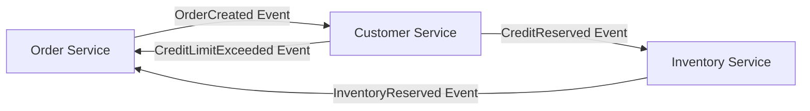
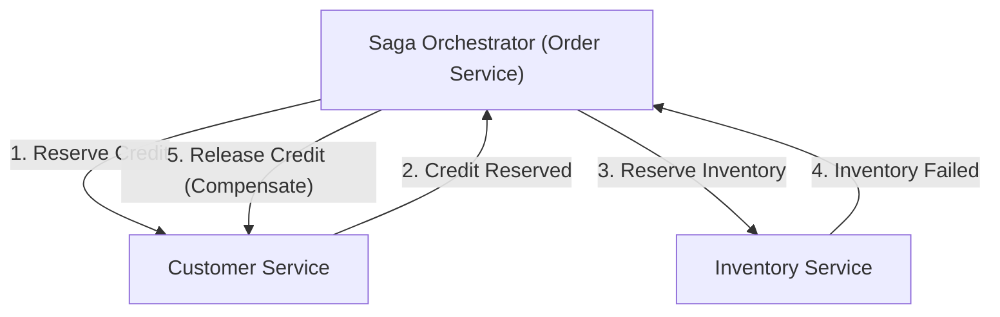

# Pengantar: Pergeseran Paradigma dari Monolitik ke Layanan Mikro

Dalam rekayasa perangkat lunak modern, seiring dengan meningkatnya skala dan kompleksitas sistem, transisi dari arsitektur monolitik ke arsitektur layanan mikro (microservices) telah menjadi jalur yang tak terhindarkan bagi banyak perusahaan. Layanan mikro membawa segudang manfaat, seperti skalabilitas, penerapan (deployment) independen, keragaman tumpukan teknologi (tech stack), dan ketangkasan organisasi. Namun, pergeseran paradigma ini sama sekali bukan peluru perak (silver bullet). Salah satu tantangan paling sulit yang dihadapi tim pengembang yang mengadopsi layanan mikro adalah "manajemen data terdistribusi" dan "transaksi terdistribusi".

Dalam artikel ini, kita akan menggali sangat dalam mengenai alasan mengapa kita dihadapkan pada kesulitan transaksi terdistribusi yang menyertai pemecahan layanan mikro—berubah drastis dari kenyamanan transaksi ACID di era monolitik. Kita juga akan membahas mengapa 2PC (Two-Phase Commit) konvensional dianggap sebagai anti-pola (anti-pattern) dalam lingkungan terdistribusi, dan menelusuri gambaran lengkap dari "Pola Saga", yang telah menjadi standar de facto dalam arsitektur layanan mikro modern, sembari menyertakan penerimaan konsistensi akhir (Eventual Consistency) dan kesulitan dalam merancang transaksi kompensasi.

## Pemandangan Pastoral Era Monolitik: Perangkap Manis Sifat ACID

Di dunia aplikasi monolitik, manajemen data sangatlah sederhana dan dapat diprediksi. Seluruh aplikasi terdiri dari satu basis kode raksasa, dan biasanya berbagi basis data relasional (RDBMS) tunggal. Berkat basis data tunggal ini, para pengembang dapat menikmati "sifat ACID" yang kuat yang disediakan oleh basis data sebagai sesuatu yang sudah semestinya.

ACID adalah singkatan dari empat sifat berikut:

1. **Atomicity (Atomisitas)**: Menjamin bahwa semua operasi dalam suatu transaksi akan "berhasil semua" atau "gagal semua (di-rollback)". Tidak ada keadaan menengah (intermediate state).
2. **Consistency (Konsistensi)**: Menjamin bahwa sebelum dan sesudah eksekusi transaksi, batasan basis data (constraints) dan aturan bisnis selalu terpenuhi.
3. **Isolation (Isolasi)**: Menjamin bahwa meskipun beberapa transaksi dieksekusi secara bersamaan, setiap transaksi tidak akan saling mengganggu.
4. **Durability (Daya Tahan)**: Menjamin bahwa setelah transaksi di-commit, hasilnya tidak akan hilang meskipun terjadi kegagalan sistem.

Sebagai contoh, mari kita pertimbangkan proses "pemesanan" di situs e-commerce. Ketika pelanggan memesan produk, tiga langkah berikut dieksekusi:
1. Membuat catatan pesanan di tabel `orders`.
2. Mengurangi batas kredit pelanggan di tabel `customers`.
3. Mengurangi stok produk di tabel `inventory`.

Pada arsitektur monolitik, Anda hanya perlu membungkus semua operasi ini dalam satu transaksi basis data (`BEGIN; ... COMMIT;`). Jika terjadi kesalahan pada langkah 3 karena stok tidak mencukupi, basis data secara otomatis membatalkan (rollback) langkah 1 dan 2, sehingga sistem tetap berada dalam keadaan konsisten. Pengembang tidak perlu terlalu khawatir tentang penanganan kesalahan yang kompleks atau inkonsistensi keadaan, karena konsistensi data sepenuhnya dijamin di tingkat infrastruktur. Kenyamanan transaksi ACID ini benar-benar bisa disebut sebagai "perangkap manis".

## Belantara Layanan Mikro: Mimpi Buruk Manajemen Data Terdistribusi

Ketika sistem berkembang dan mencapai batas skalabilitas dan kecepatan pengembangan, tim akan mengalihkan arah ke arsitektur layanan mikro yang memecah monolit menjadi beberapa layanan kecil. Salah satu praktik terbaik dalam layanan mikro adalah pola "Database per Service" (Satu Basis Data per Layanan). Ini adalah prinsip di mana setiap layanan mikro mengelola datanya sendiri dan secara tegas melarang layanan lain untuk mengakses basis datanya secara langsung.

Jika prinsip ini diterapkan pada situs e-commerce tadi, sistem akan dibagi sebagai berikut:
- **Order Service**: Memiliki basis data untuk mengelola data pesanan.
- **Customer Service**: Memiliki basis data untuk mengelola informasi pelanggan dan batas kredit.
- **Inventory Service**: Memiliki basis data untuk mengelola stok produk.

Meskipun konfigurasi ini meningkatkan independensi layanan, hal ini memicu "mimpi buruk manajemen data terdistribusi". Tidak mungkin lagi memperbarui beberapa tabel menggunakan transaksi basis data tunggal. "Pembuatan pesanan", "Pengamanan batas kredit", dan "Pengamanan stok" kini membutuhkan koordinasi antar beberapa layanan independen melalui jaringan.

Bagaimana jika, setelah pembuatan pesanan di Order Service dan pengamanan kredit di Customer Service berhasil, Inventory Service mati (down) dan gagal mengamankan stok?
Keajaiban transaksi basis data lokal tidak ada di sini. Terjadi "inkonsistensi data" yang fatal: kredit telah dikurangi, stok tidak berkurang, sementara pesanan dibiarkan dalam status tertunda atau gagal. Inilah inti dari masalah transaksi terdistribusi dalam layanan mikro.

## Godaan 2PC (Two-Phase Commit) dan Keterbatasan Fatalnya

Sebagai pendekatan klasik untuk mempertahankan konsistensi transaksi dalam sistem terdistribusi, terdapat protokol 2PC (Two-Phase Commit). Banyak pengembang mencoba mencari solusi pada implementasi 2PC, seperti transaksi XA yang disediakan oleh basis data terdistribusi atau broker pesan.

2PC terdiri dari manajer transaksi (koordinator) dan beberapa manajer sumber daya (partisipan), dan berjalan dalam dua fase berikut:

1. **Prepare Phase (Fase Persiapan)**: Koordinator bertanya kepada semua partisipan, "Apakah Anda siap untuk commit?". Setiap partisipan mengunci sumber daya (lock), menempatkannya dalam keadaan dapat di-commit, lalu mengembalikan "Yes" atau "No".
2. **Commit / Rollback Phase (Fase Commit / Rollback)**: Jika semua partisipan menjawab "Yes", koordinator menginstruksikan semua orang untuk "commit". Jika ada satu saja yang menjawab "No" atau tidak ada respons, koordinator menginstruksikan "rollback" kepada semuanya.

Sekilas, ini tampak seperti solusi yang sempurna. Namun, dalam lingkungan layanan mikro cloud-native modern, 2PC dianggap sebagai anti-pola yang serius. Alasannya adalah sebagai berikut:

- **Pemblokiran Sinkron dan Penurunan Performa**: Kelemahan terbesar 2PC adalah keseluruhan protokol bersifat sinkron dan partisipan terus menahan kunci sumber daya (lock). Jika terjadi latensi jaringan atau kegagalan sementara pada salah satu partisipan, semua layanan lain akan dipaksa menunggu kunci dilepaskan, yang menyebabkan penurunan throughput sistem secara drastis.
- **Titik Kegagalan Tunggal (Single Point of Failure / SPOF)**: Jika koordinator transaksi gagal, partisipan akan terjebak dalam kondisi siaga sambil tetap memegang kunci (status in-doubt), sehingga menimbulkan risiko sistem mengalami jalan buntu (deadlock).
- **Ketidakcocokan dengan NoSQL dan Message Broker**: Banyak basis data NoSQL modern dan broker pesan terbaru tidak mendukung transaksi XA (2PC) demi memprioritaskan skalabilitas. Hal ini sangat mempersempit pilihan teknologi.
- **Dampak Buruk pada Ketersediaan**: Layanan mikro harus dirancang dengan asumsi adanya "kegagalan parsial". Namun pada 2PC, jika satu layanan mati, keseluruhan transaksi akan gagal, sehingga ketersediaan sistem secara keseluruhan menjadi perkalian dari ketersediaan masing-masing layanan dan akan menurun secara tajam.

## Teorema CAP dan Penerimaan Konsistensi Akhir (Eventual Consistency)

Jika kita menyerah pada konsistensi kuat (Strong Consistency) seperti pada 2PC, apa yang harus kita lakukan? Di sinilah pemahaman tentang "Teorema CAP" dan "Sifat BASE", yang merupakan prinsip dasar sistem terdistribusi, menjadi penting.

Teorema CAP mendefinisikan bahwa dalam sistem terdistribusi, dari tiga jaminan berikut, maksimal hanya dua yang dapat dipenuhi secara bersamaan:
- **Consistency (Konsistensi)**: Semua node mengembalikan data yang sama.
- **Availability (Ketersediaan)**: Permintaan ke node yang tidak mengalami kegagalan akan selalu mengembalikan respons berhasil.
- **Partition tolerance (Toleransi Partisi Jaringan)**: Sistem terus beroperasi meskipun terjadi partisi (terputusnya) jaringan.

Karena partisi jaringan (P) tidak dapat dihindari dalam lingkungan cloud dunia nyata, kita selalu dihadapkan pada tarik-ulur (trade-off) antara "C" dan "A" (CP atau AP). Dalam arsitektur layanan mikro, merupakan hal yang umum untuk memilih "Sistem AP" yang memprioritaskan ketersediaan sistem (A) dan skalabilitas, sembari mengkompromikan konsistensi absolut (C).

Hasil kompromi ini adalah "Konsistensi Akhir" (Eventual Consistency). Konsistensi Akhir adalah gagasan bahwa "semua data mungkin tidak langsung cocok seketika, tetapi seiring berjalannya waktu (Eventually), pada akhirnya semua data akan cocok dan mencapai keadaan yang konsisten".

Alih-alih ACID, sistem terdistribusi menerapkan konsep yang disebut **BASE**:
- **Basically Available (Pada Dasarnya Tersedia)**: Meskipun bagian dari sistem mengalami kegagalan, sistem secara keseluruhan terus beroperasi.
- **Soft state (Keadaan Lunak)**: Konsistensi data tidak selalu dipertahankan, dan keadaan (state) dapat berubah seiring waktu.
- **Eventually consistent (Konsisten pada Akhirnya)**: Pada akhirnya, konsistensi data akan tercapai.

Desain transaksi dalam layanan mikro bergantung pada bagaimana merealisasikan konsistensi akhir ini dengan aman dan dapat diprediksi untuk sistem secara keseluruhan. Pola arsitektur konkret untuk mewujudkan hal ini adalah "Saga".

## Fajar Pola Saga: Standar Baru Transaksi Terdistribusi

Pola Saga adalah konsep untuk mengelola transaksi berdurasi panjang (Long-Lived Transaction: LLT), yang bermula dari sebuah makalah yang diterbitkan oleh Hector Garcia-Molina dan Kenneth Salem pada tahun 1987. Di era modern, pola ini telah bangkit kembali sebagai standar de facto untuk menyelesaikan masalah transaksi terdistribusi pada layanan mikro.

Gagasan dasar Saga adalah membagi transaksi terdistribusi berskala besar menjadi serangkaian "transaksi ACID lokal" yang independen di dalam masing-masing layanan mikro.

Untuk menyelesaikan Saga secara keseluruhan, setiap layanan menjalankan transaksi lokalnya dan menerbitkan "kejadian (event)" atau "pesan" yang menunjukkan penyelesaiannya. Layanan berikutnya menerima kejadian tersebut dan menjalankan transaksi lokalnya sendiri. Jika di tengah langkah-langkah tersebut terjadi pelanggaran aturan bisnis atau kesalahan (misalnya: stok tidak cukup, batas kredit terlampaui), Saga akan melacak mundur (backtrack) dari titik tersebut dan menjalankan operasi untuk "membatalkan" transaksi lokal yang telah dieksekusi sebelumnya. Ini disebut **Transaksi Kompensasi (Compensating Transaction)**.

Alur transaksi dalam Saga adalah sebagai berikut.
Misalkan serangkaian transaksi lokal adalah $T_1, T_2, \dots, T_n$. Transaksi kompensasi yang bersesuaian dengan masing-masing adalah $C_1, C_2, \dots, C_{n-1}$.

1. **Jalur Normal**: $T_1 \rightarrow T_2 \rightarrow \dots \rightarrow T_n$ semuanya berhasil, dan Saga selesai.
2. **Jalur Anomali** (jika gagal pada $T_k$): Berhasil hingga $T_1 \rightarrow T_2 \rightarrow \dots \rightarrow T_{k-1}$, lalu terjadi kesalahan pada $T_k$. Setelah itu, eksekusi dilakukan dalam urutan terbalik $C_{k-1} \rightarrow C_{k-2} \rightarrow \dots \rightarrow C_1$, sehingga seluruh sistem kembali ke keadaan konsisten semula (keadaan rollback secara semantik).

Dalam Pola Saga, terdapat dua pendekatan implementasi utama berdasarkan siapa yang berperan sebagai koordinator transaksi. Keduanya adalah "Koreografi (Choreography)" dan "Orkestrasi (Orchestration)".

### Koreografi (Choreography): Tarian Layanan Otonom

Dalam pendekatan Koreografi, tidak ada koordinator pusat yang mengawasi Saga. Setiap layanan mikro bertindak secara otonom dan meneruskan transaksi secara berantai dengan memublikasikan dan berlangganan (Pub/Sub) kejadian domain (domain events). Ini layaknya para penari yang menari secara otonom (koreografi) mengikuti musik dan gerakan di sekitar mereka, tanpa adanya dirigen pusat.

**Kelebihan Koreografi:**
- **Coupling yang Rendah (Loose Coupling)**: Karena tidak bergantung pada orkestrator pusat, tidak ada titik kegagalan tunggal, dan tingkat keterikatan antar layanan tetap rendah.
- **Implementasi Sederhana (Untuk Skala Kecil)**: Jika layanan yang berpartisipasi sedikit (sekitar 2 hingga 4), implementasinya mudah karena hanya perlu menerbitkan dan mendengarkan (listen) kejadian.

**Kekurangan Koreografi:**
- **Sulit Memahami Gambaran Keseluruhan**: Karena alur transaksi seluruh sistem tersebar di berbagai tempat pada basis kode, sangat sulit untuk melacak dan men-debug apa yang sedang terjadi secara keseluruhan (status Saga saat ini).
- **Risiko Ketergantungan Sirkuler**: Layanan saling mendengarkan kejadian satu sama lain meningkatkan risiko referensi sirkuler atau loop tak terbatas.
- **Rentan Terhadap Kompleksitas**: Seiring bertambahnya jumlah langkah atau diperlukannya kondisi percabangan yang rumit, seluruh arsitektur bisa berubah menjadi spageti dan tidak dapat dipelihara (unmaintainable).

### Orkestrasi (Orchestration): Dirigen Terpusat

Dalam pendekatan Orkestrasi, sebuah "Orkestrator Saga (Koordinator)" ditempatkan untuk mengontrol alur eksekusi Saga secara terpusat. Orkestrator ini, ibarat seorang dirigen dalam sebuah orkestra, menginstruksikan layanan mana yang selanjutnya harus menjalankan transaksi lokal, menerima hasilnya untuk memberikan instruksi berikutnya, dan menginstruksikan transaksi kompensasi yang sesuai bila terjadi kesalahan.

**Kelebihan Orkestrasi:**
- **Manajemen Terpusat dan Visibilitas**: Definisi alur kerja Saga terkonsentrasi di satu tempat (orkestrator), sehingga sangat mudah untuk memahami gambaran keseluruhan, memantau status, dan men-debug.
- **Menghilangkan Ketergantungan Sirkuler**: Layanan yang berpartisipasi hanya perlu menanggapi instruksi dari orkestrator dan tidak perlu saling mengetahui satu sama lain, sehingga ketergantungan menjadi satu arah.
- **Dukungan untuk Alur Kompleks**: Logika transaksi yang rumit seperti percabangan kondisi, eksekusi paralel, percobaan ulang (retry), dan batas waktu (timeout) dapat diimplementasikan secara fleksibel.

**Kekurangan Orkestrasi:**
- **Ketergantungan pada Orkestrator**: Jika terlalu banyak logika bisnis yang terpusat pada orkestrator, tempat tersebut bisa menjadi "monolit pintar", dan terdapat risiko bahwa layanan lain akan turun kasta menjadi sekadar layanan CRUD (Anemic Domain Model).
- **Kompleksitas Infrastruktur**: Untuk mengelola transisi keadaan, diperlukan biaya untuk memperkenalkan dan mengoperasikan mesin alur kerja (workflow engine) atau kerangka kerja mesin keadaan (state machine framework) seperti AWS Step Functions, Camunda, atau Temporal.

Secara umum, untuk sistem komersial di mana transaksi mencakup beberapa layanan dan melibatkan logika bisnis yang kompleks, **pendekatan Orkestrasi sangat direkomendasikan**.

## Darah dan Daging yang Menopang Pola Saga: Filosofi Desain Transaksi Kompensasi (Compensating Transaction)

Hambatan terbesar dalam benar-benar memahami dan mempraktikkan pola Saga adalah merancang "transaksi kompensasi". Dalam lingkungan terdistribusi, mengembalikan sistem "sepenuhnya ke keadaan masa lalu yang sama" seperti yang dilakukan oleh perintah `ROLLBACK` pada basis data adalah hal yang mustahil. Alasannya adalah, saat Anda mencoba me-rollback sebuah transaksi, transaksi lain mungkin saja sudah membaca atau mengubah data tersebut.

Oleh karena itu, transaksi kompensasi tidak boleh dirancang sebagai operasi untuk "memutar mundur sistem secara fisik", melainkan sebagai operasi untuk "membatalkannya secara makna bisnis".

Sebagai contoh, mari pertimbangkan Saga reservasi perjalanan yang melakukan pemesanan hotel dan pemesanan penerbangan.
1. Memesan hotel (Berhasil)
2. Memesan penerbangan (Gagal karena penuh)

Dalam kasus ini, Anda perlu membatalkan (mengkompensasi) reservasi hotel karena Anda tidak berhasil mendapatkan penerbangan. Namun, Anda tidak dapat sekadar menghapus data secara fisik (DELETE) dari sistem reservasi hotel. Di dunia nyata, Anda mungkin harus membayar biaya pembatalan berdasarkan kebijakan pembatalan reservasi hotel, dan Anda perlu menyimpan riwayat pembatalan tersebut.
Dengan kata lain, transaksi kompensasi untuk hotel menjadi "eksekusi logika bisnis baru yang disebut proses pembatalan (INSERT rekaman baru atau UPDATE status)".

**Prinsip-prinsip penting dalam mendesain transaksi kompensasi:**

1. **Memastikan Idempotensi (Idempotency)**:
   Dalam sistem terdistribusi, penundaan jaringan atau mekanisme percobaan ulang (retry) membuat pengiriman pesan "Setidaknya Sekali (At-Least-Once)", di mana pesan yang sama dapat tiba beberapa kali, menjadi dasar. Oleh karena itu, transaksi kompensasi (serta transaksi arah maju) harus memiliki "idempotensi", yaitu hasil yang tidak berubah tidak peduli berapa kali operasi tersebut dijalankan. Implementasi kunci idempotensi yang menggunakan ID transaksi unik untuk menentukan apakah proses sudah ditangani atau belum mutlak diperlukan.

2. **Jaminan Keberhasilan Mutlak**:
   Transaksi arah maju diperbolehkan untuk gagal karena aturan bisnis (misalnya: kehabisan stok). Namun, **transaksi kompensasi secara teknis dan bisnis sama sekali tidak boleh gagal**. Sekali kompensasi dimulai, sistem harus terus mencoba ulang (retry) sampai sistem mencapai konsistensi akhir. Jika terjadi kesalahan fatal yang membutuhkan intervensi manual, siapkan mekanisme yang mengirimkannya ke Dead Letter Queue (DLQ), membunyikan peringatan, dan memungkinkan operator untuk menangani masalah tersebut.

3. **Independensi Urutan (Commutativity)**:
   Dalam lingkungan perpesanan asinkron (asynchronous messaging), bisa terjadi anomali di mana permintaan untuk transaksi kompensasi tiba karena alasan tertentu mendahului permintaan eksekusi transaksi arah maju (Out of order). Agar sistem tidak rusak bahkan dalam kasus seperti ini, manajemen status transaksi harus dilakukan dengan ketat, membutuhkan pemrograman defensif seperti "jika permintaan kompensasi masuk untuk transaksi yang belum dimulai, tandai transaksi tersebut sebagai 'telah dibatalkan', dan abaikan jika permintaan arah maju datang belakangan."

4. **Penanggulangan terhadap Kurangnya Isolasi (Isolation)**:
   Karena setiap langkah dalam Saga di-commit ke basis data lokal, data "status menengah (intermediate state)" saat Saga sedang berlangsung dapat dilihat oleh transaksi lain (ini disebut Dirty Read). Untuk mencegah hal ini, disarankan agar data memiliki "Status (State)". Misalnya, daripada menjadikan status pesanan `APPROVED` sejak awal, buatlah sebagai `PENDING` (sedang diproses), dan perbarui ke `APPROVED` hanya ketika seluruh Saga berhasil. Jika gagal, perbarui ke `CANCELLED`. Layanan lain dapat mengenali dan memperlakukan data dengan status `PENDING` sebagai tidak pasti (Pola Semantic Lock).

## Tantangan Praktis dan Pola Desain dalam Implementasi Pola Saga

Saat mengimplementasikan Pola Saga, pengembang perlu melakukan penulisan ke basis data dan penerbitan pesan ke broker pesan secara atomik. Jika urutannya "perbarui basis data lalu kirim pesan", dan sistem mogok (crash) setelah memperbarui basis data, pesan tidak akan terkirim dan Saga akan terputus (Dual Write Problem).

Solusi yang diadopsi secara luas untuk masalah ini adalah **Outbox Pattern (Transactional Outbox Pattern)**.

Dalam pola Outbox, selain tabel "data bisnis", tabel "Outbox (Kotak Keluar)" disiapkan di dalam basis data layanan itu sendiri.
Di dalam transaksi lokal, bersamaan dengan pembaruan data bisnis, pesan yang harus dikirim juga di-INSERT ke dalam tabel Outbox. Karena hal ini dilakukan dalam transaksi basis data yang sama, atomisitas terpenuhi sepenuhnya.
Setelah itu, proses asinkron terpisah (Message Relay atau alat CDC seperti Debezium) memantau tabel Outbox, membaca rekaman, dan mengirimkannya dengan andal ke broker pesan (seperti Kafka atau RabbitMQ), lalu menghapus rekaman tersebut (atau menandainya sebagai terkirim) dari tabel Outbox setelah pengiriman selesai. Ini membangun fondasi perpesanan At-Least-Once yang dapat diandalkan, dan secara dramatis meningkatkan keandalan Saga.

## Kesimpulan: Untuk Menjadi Arsitek Sistem Terdistribusi Sejati

Beralih ke arsitektur layanan mikro bukan sekadar perubahan infrastruktur atau kerangka kerja. Ini adalah pergeseran paradigma tentang "konsistensi data" yang menuntut perubahan model pemikiran insinyur perangkat lunak.

Kita harus menyingkirkan ilusi sinkron seperti 2PC dan menerima kenyataan sistem terdistribusi—jaringan tidak stabil, kegagalan terjadi setiap hari, dan sinkronisasi data selalu sedikit tertunda. Menguasai konsistensi akhir dan Pola Saga adalah prasyarat mutlak untuk mengarungi lautan ganas layanan mikro dan membangun sistem yang benar-benar terukur (scalable) dan tangguh (resilient).

Memulai dengan kesederhanaan Koreografi adalah hal yang baik, tetapi Anda harus bersiap untuk beralih ke ketangguhan Orkestrasi seiring dengan pertumbuhan sistem. Lebih dari segalanya, keterampilan Desain Berbasis Domain (Domain-Driven Design / DDD) untuk secara akurat menerjemahkan perilaku domain ke dalam kode setelah berdiskusi mendalam dengan manajer produk dan tim bisnis mengenai implikasi bisnis dari transaksi kompensasi akan menjadi hal yang sangat penting.

Jalan menuju Pola Saga tidaklah mulus, tetapi di ujungnya terdapat arsitektur kuat yang mampu menahan beban dan kegagalan apa pun. Seorang arsitek yang memahami kebenaran tentang transaksi terdistribusi dan mampu merancang keseimbangan optimal antara konsistensi dan ketersediaanlah yang akan memimpin pengembangan sistem generasi berikutnya.
