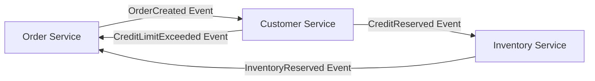
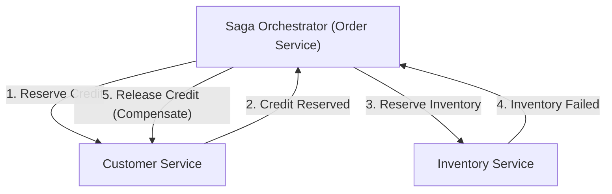

# 서론: 모놀리스에서 마이크로서비스로의 패러다임 전환

현대의 소프트웨어 엔지니어링에서 시스템의 규모와 복잡성이 증가함에 따라 모놀리식 아키텍처에서 마이크로서비스 아키텍처로의 전환은 많은 기업에게 피할 수 없는 길이 되었습니다. 마이크로서비스는 확장성, 독립적인 배포, 기술 스택의 다양성, 그리고 조직의 민첩성 등 헤아릴 수 없는 이점을 가져다줍니다. 그러나 이러한 패러다임 전환이 결코 은탄환은 아닙니다. 마이크로서비스를 도입한 개발 팀이 직면하는 가장 어려운 과제 중 하나가 바로 '분산 데이터 관리'와 '분산 트랜잭션'입니다.

이 글에서는 모놀리스 시대의 ACID 트랜잭션이 주던 편안함에서 벗어나 마이크로서비스 분할에 따른 분산 트랜잭션의 어려움에 직면하게 되는 이유, 기존의 2PC(Two-Phase Commit)가 분산 환경에서 왜 안티 패턴으로 간주되는지, 그리고 현대의 마이크로서비스 아키텍처에서 사실상의 표준(de facto standard)으로 자리 잡은 'Saga(사가) 패턴'의 전모에 대해 결과적 일관성(Eventual Consistency)의 수용과 보상 트랜잭션 설계의 어려움을 중심으로 매우 깊이 있게 파헤쳐 보겠습니다.

## 모놀리스 시대의 목가적인 풍경: ACID 특성의 달콤한 함정

모놀리식 애플리케이션의 세계에서 데이터 관리는 놀라울 정도로 단순하고 예측 가능했습니다. 애플리케이션 전체가 하나의 거대한 코드베이스로 구성되었고, 일반적으로 단일 관계형 데이터베이스(RDBMS)를 공유했습니다. 이 단일 데이터베이스의 혜택 덕분에 개발자는 데이터베이스가 제공하는 강력한 'ACID 특성'을 당연한 듯이 누릴 수 있었습니다.

ACID란 다음 4가지 특성의 머리글자를 딴 것입니다:

1. **Atomicity(원자성)**: 트랜잭션 내의 모든 연산이 '모두 성공'하거나 '모두 실패(롤백)' 중 하나가 됨을 보장합니다. 중간 상태는 존재하지 않습니다.
2. **Consistency(일관성)**: 트랜잭션의 실행 전후로 데이터베이스의 제약 조건이나 비즈니스 규칙이 항상 만족되는 상태를 보장합니다.
3. **Isolation(고립성 / 격리성)**: 여러 트랜잭션이 동시에 실행되더라도, 각각의 트랜잭션이 서로 간섭하지 않음을 보장합니다.
4. **Durability(지속성 / 영속성)**: 트랜잭션이 한 번 커밋되면, 시스템 장애가 발생하더라도 그 결과가 손실되지 않음을 보장합니다.

예를 들어, 이커머스(EC) 사이트의 '주문' 프로세스를 생각해 봅시다. 고객이 상품을 주문하면 다음 세 가지 단계가 실행됩니다.
1. `orders` 테이블에 주문 레코드를 생성한다.
2. `customers` 테이블에서 고객의 신용 한도를 차감한다.
3. `inventory` 테이블에서 상품의 재고를 차감한다.

모놀리스에서는 이 모든 연산을 단일 데이터베이스 트랜잭션(`BEGIN; ... COMMIT;`)으로 감싸기만 하면 되었습니다. 만약 재고가 부족하여 3단계에서 에러가 발생할 경우, 데이터베이스는 자동으로 1단계와 2단계를 롤백하고 시스템은 일관된 상태를 유지합니다. 개발자는 복잡한 에러 핸들링이나 상태 불일치에 대해 깊이 고민할 필요가 없었으며, 인프라스트럭처 수준에서 데이터의 일관성이 완벽하게 담보되었습니다. 이러한 ACID 트랜잭션의 편안함은 그야말로 '달콤한 함정'이었다고 할 수 있습니다.

## 마이크로서비스라는 황야: 분산 데이터 관리의 악몽

시스템이 성장하고 확장성이나 개발 속도의 한계에 다다르면, 팀은 모놀리스를 여러 개의 작은 서비스로 분할하는 마이크로서비스 아키텍처로 방향을 틉니다. 마이크로서비스의 베스트 프랙티스 중 하나로 'Database per Service(서비스당 데이터베이스)' 패턴이 있습니다. 이는 각 마이크로서비스가 자신의 데이터를 관리하고, 다른 서비스에서 직접 데이터베이스에 접근하는 것을 금지하는 원칙입니다.

이 원칙을 앞서 언급한 이커머스 사이트에 적용하면 시스템은 다음과 같이 분할됩니다.
- **Order Service**: 주문 데이터를 관리하는 데이터베이스를 갖는다.
- **Customer Service**: 고객 정보와 신용 한도를 관리하는 데이터베이스를 갖는다.
- **Inventory Service**: 상품의 재고를 관리하는 데이터베이스를 갖는다.

이러한 구성은 서비스의 독립성을 높이는 한편, '분산 데이터 관리의 악몽'을 초래합니다. 이제 더 이상 단일 데이터베이스 트랜잭션으로 여러 테이블을 업데이트하는 것은 불가능합니다. '주문 생성', '신용 한도 확보', '재고 확보'는 네트워크를 통한 여러 독립적인 서비스 간의 연동을 필요로 합니다.

만약 Order Service에서의 주문 생성과 Customer Service에서의 신용 한도 확보가 성공한 후, Inventory Service가 다운되어 재고 확보에 실패한다면 어떻게 될까요?
로컬 데이터베이스 트랜잭션의 마법은 이곳에 존재하지 않습니다. 신용 한도는 차감되었지만 재고는 줄어들지 않은 채 주문이 보류되거나 실패 상태가 되는 치명적인 '데이터 불일치'가 발생합니다. 이것이 바로 마이크로서비스에서 분산 트랜잭션 문제의 핵심입니다.

## 2PC(2단계 커밋)의 유혹과 치명적인 한계

분산 시스템에서 트랜잭션의 일관성을 유지하기 위한 고전적인 접근 방식으로 2PC(Two-Phase Commit) 프로토콜이 존재합니다. 많은 개발자들은 분산 데이터베이스나 메시지 큐가 제공하는 XA 트랜잭션과 같은 2PC 구현에서 해결책을 찾고자 합니다.

2PC는 트랜잭션 매니저(코디네이터)와 여러 리소스 매니저(참여자)로 구성되며, 다음 두 단계로 진행됩니다.

1. **Prepare Phase(준비 단계)**: 코디네이터가 모든 참여자에게 "커밋할 준비가 되었는지"를 묻습니다. 각 참여자는 리소스를 잠금(lock) 처리하고 커밋 가능한 상태로 만든 후 "Yes" 또는 "No"를 반환합니다.
2. **Commit / Rollback Phase(커밋/롤백 단계)**: 모든 참여자가 "Yes"라고 응답하면 코디네이터는 전원에게 "커밋"을 지시합니다. 단 한 명이라도 "No"라고 응답하거나 응답이 없는 경우, 전원에게 "롤백"을 지시합니다.

얼핏 보면 완벽한 해결책처럼 보이지만, 현대의 클라우드 네이티브 마이크로서비스 환경에서 2PC는 심각한 안티 패턴으로 여겨집니다. 그 이유는 다음과 같습니다.

- **동기적 차단(Blocking)과 성능 저하**: 2PC의 가장 큰 단점은 프로토콜 전체가 동기식이며, 참여자가 리소스의 잠금을 계속 유지한다는 점입니다. 네트워크 지연이나 참여자의 일시적인 장애가 발생하면 다른 모든 서비스가 잠금 해제를 기다려야 하므로, 시스템 전체의 처리량(throughput)이 현저히 저하됩니다.
- **단일 장애점(SPOF)**: 트랜잭션 코디네이터에 장애가 발생하면, 참여자는 잠금을 유지한 채 대기 상태(인다우트 상태, in-doubt)에 빠지게 되어 시스템이 교착 상태(deadlock)에 이를 위험이 있습니다.
- **NoSQL 및 메시지 브로커의 미지원**: 대다수의 최신 NoSQL 데이터베이스나 최신 메시지 브로커는 확장성을 우선시하기 때문에 XA 트랜잭션(2PC)을 지원하지 않습니다. 이로 인해 기술 선택의 폭이 크게 좁아집니다.
- **가용성에 미치는 악영향**: 마이크로서비스는 '부분적인 장애'를 전제로 설계되어야 합니다. 그러나 2PC에서는 하나의 서비스가 다운되면 트랜잭션 전체가 실패하므로, 시스템 전체의 가용성이 개별 서비스의 가용성을 곱한 값이 되어 급격히 저하됩니다.

## CAP 정리와 결과적 일관성(Eventual Consistency)의 수용

2PC와 같은 강력한 일관성(Strong Consistency)을 포기할 경우, 우리는 어떻게 해야 할까요? 여기서 중요해지는 것이 분산 시스템의 기본 원칙인 'CAP 정리'와 'BASE 특성'에 대한 이해입니다.

CAP 정리는 분산 시스템에서 다음 3가지 보장 중 동시에 충족할 수 있는 것은 최대 2개까지라고 정의하고 있습니다.
- **Consistency(일관성)**: 모든 노드가 동일한 데이터를 반환한다.
- **Availability(가용성)**: 장애가 없는 노드에 대한 요청은 항상 성공적인 응답을 반환한다.
- **Partition tolerance(네트워크 분할 허용성)**: 네트워크 분할이 발생하더라도 시스템은 계속 작동한다.

네트워크 분할(P)은 현실의 클라우드 환경에서 피할 수 없기 때문에, 우리는 항상 'C'와 'A'의 트레이드오프에 직면하게 됩니다(CP 또는 AP). 마이크로서비스 아키텍처에서는 시스템의 가용성(A)과 확장성을 우선시하고, 절대적인 일관성(C)을 타협하는 'AP 시스템'을 선택하는 것이 일반적입니다.

이러한 타협의 산물이 바로 '결과적 일관성(Eventual Consistency)'입니다. 결과적 일관성이란, "즉시 모든 데이터가 일치하지는 않을 수 있지만, 시간이 지나면(Eventually) 최종적으로는 모든 데이터가 일치하여 일관된 상태가 된다"는 개념입니다.

ACID 대신 분산 시스템에서는 **BASE**라는 개념이 적용됩니다.
- **Basically Available(기본적으로 가용함)**: 시스템의 일부에 장애가 발생하더라도 전체적으로는 계속 작동한다.
- **Soft state(유연한 상태)**: 데이터의 일관성이 항상 유지되는 것은 아니며, 상태는 시간에 따라 변화한다.
- **Eventually consistent(최종적 일관성)**: 최종적으로는 데이터의 일관성이 확보된다.

마이크로서비스에서의 트랜잭션 설계는 이 결과적 일관성을 시스템 전체적으로 얼마나 안전하고 예측 가능한 형태로 구현하느냐에 달려 있습니다. 이를 위한 구체적인 아키텍처 패턴이 바로 'Saga(사가)'입니다.

## Saga 패턴의 여명: 분산 트랜잭션의 새로운 표준

Saga 패턴은 1987년 Hector Garcia-Molina와 Kenneth Salem이 발표한 논문에서 비롯된 것으로, 장기 실행 트랜잭션(Long-Lived Transaction: LLT)을 관리하기 위한 개념입니다. 현대에 이르러 이것이 마이크로서비스의 분산 트랜잭션을 해결하는 사실상의 표준으로 부활했습니다.

Saga의 기본적인 개념은 대규모 분산 트랜잭션을 각 마이크로서비스 내에서 완결되는 여러 '로컬 ACID 트랜잭션'의 사슬로 분할하는 것입니다.

Saga 전체를 완료하기 위해 각 서비스는 로컬 트랜잭션을 실행하고, 그 완료를 나타내는 '이벤트'나 '메시지'를 발행합니다. 다음 서비스는 그 이벤트를 수신하여 자신의 로컬 트랜잭션을 실행합니다. 만약 중간 단계에서 비즈니스 규칙 위반이나 에러(예: 재고 부족, 신용 한도 초과)가 발생할 경우, Saga는 거기서부터 거슬러 올라가 지금까지 실행했던 로컬 트랜잭션을 '취소'하기 위한 연산을 실행합니다. 이를 **보상 트랜잭션(Compensating Transaction)**이라고 부릅니다.

Saga에서의 트랜잭션 흐름은 다음과 같습니다.
일련의 로컬 트랜잭션을 $T_1, T_2, \dots, T_n$이라고 합시다. 각각에 대응하는 보상 트랜잭션을 $C_1, C_2, \dots, C_{n-1}$이라고 합니다.

1. 정상 흐름: $T_1 \rightarrow T_2 \rightarrow \dots \rightarrow T_n$이 모두 성공하여 Saga가 완료됨.
2. 예외 흐름($T_k$에서 실패한 경우): $T_1 \rightarrow T_2 \rightarrow \dots \rightarrow T_{k-1}$까지 성공하고 $T_k$에서 에러 발생. 그 후 역순으로 $C_{k-1} \rightarrow C_{k-2} \rightarrow \dots \rightarrow C_1$이 실행되어, 시스템 전체가 원래의 정합성이 맞는 상태(의미론적 롤백 상태)로 돌아감.

Saga 패턴에는 트랜잭션의 조율을 누가 맡느냐에 따라 크게 두 가지 구현 접근 방식이 있습니다. 바로 '코레오그래피(Choreography)'와 '오케스트레이션(Orchestration)'입니다.

### 코레오그래피(Choreography): 자율적인 서비스의 무도

코레오그래피 접근 방식에서는 Saga를 총괄하는 중앙 코디네이터가 존재하지 않습니다. 각 마이크로서비스는 자율적으로 행동하며, 도메인 이벤트를 발행-구독(Pub/Sub)함으로써 연쇄적으로 트랜잭션을 진행시킵니다. 마치 무용수들이 중앙의 지휘자 없이 음악과 주변의 움직임에 맞춰 자율적으로 춤을 추는(코레오그래피) 것과 같습니다.

**코레오그래피의 장점:**
- **느슨한 결합(Loose Coupling)**: 중앙 오케스트레이터에 의존하지 않으므로 단일 장애점이 없으며, 서비스 간의 결합도가 낮게 유지됩니다.
- **단순한 구현(소규모의 경우)**: 참여하는 서비스가 적은(2~4개 정도) 경우, 이벤트의 발행과 수신만으로 구현할 수 있어 도입이 쉽습니다.

**코레오그래피의 단점:**
- **전체적인 흐름 파악의 어려움**: 시스템 전체의 트랜잭션 흐름이 코드베이스 곳곳에 분산되기 때문에, 전체적으로 무슨 일이 일어나고 있는지(Saga의 현재 상태) 추적하고 디버깅하기가 극히 어려워집니다.
- **순환 의존의 위험**: 서비스들이 서로의 이벤트를 수신함으로써 순환 참조나 무한 루프에 빠질 위험이 높아집니다.
- **복잡화에 대한 취약성**: 단계 수가 늘어나거나 복잡한 분기 조건이 필요해지면, 아키텍처 전체가 스파게티처럼 얽히게 되어 유지보수가 불가능해집니다.

### 오케스트레이션(Orchestration): 중앙집권적인 지휘자

오케스트레이션 접근 방식에서는 Saga의 실행 흐름을 중앙에서 제어하는 'Saga 오케스트레이터(코디네이터)'를 배치합니다. 오케스트레이터는 오케스트라의 지휘자처럼 다음에 어떤 서비스가 로컬 트랜잭션을 실행해야 할지 지시하고, 그 결과를 받아 다음 지시를 내리며, 에러 시에는 적절한 보상 트랜잭션을 지시합니다.

**오케스트레이션의 장점:**
- **중앙 집중 관리와 가시성**: Saga의 워크플로우 정의가 한 곳(오케스트레이터)에 집중되므로 전체 흐름 파악, 상태 모니터링, 디버깅이 매우 쉬워집니다.
- **순환 의존의 배제**: 참여하는 서비스는 오케스트레이터의 지시에 응답하기만 하면 되며 서로에 대해 알 필요가 없기 때문에, 의존 관계가 단방향이 됩니다.
- **복잡한 흐름 대응**: 조건 분기, 병렬 실행, 재시도, 타임아웃 등 복잡한 트랜잭션 로직을 유연하게 구현할 수 있습니다.

**오케스트레이션의 단점:**
- **오케스트레이터에 대한 의존성**: 오케스트레이터에 비즈니스 로직이 너무 집중되면, 그곳이 실질적인 '스마트 모놀리스'가 되어 다른 서비스들이 단순한 CRUD 서비스로 전락할 위험(빈약한 도메인 모델, Anemic Domain Model)이 있습니다.
- **인프라의 복잡성**: 상태 전이를 관리하기 위해 AWS Step Functions나 Camunda, Temporal과 같은 워크플로우 엔진이나 상태 머신 프레임워크를 도입하고 운영하는 비용이 듭니다.

일반적으로 트랜잭션이 여러 서비스에 걸쳐 있고 복잡한 비즈니스 로직을 수반하는 상용 시스템에서는 **오케스트레이션 접근 방식이 권장**됩니다.

## Saga 패턴을 지탱하는 피와 살: 보상 트랜잭션(Compensating Transaction)의 설계 철학

Saga 패턴을 진정으로 이해하고 실천하는 데 있어 가장 큰 장벽이 되는 것이 '보상 트랜잭션'의 설계입니다. 분산 환경에서는 데이터베이스의 `ROLLBACK` 명령어처럼 시스템을 '완전히 과거와 동일한 상태'로 되돌리는 것이 불가능합니다. 왜냐하면 당신이 트랜잭션을 롤백하려고 하는 동안, 이미 다른 트랜잭션이 그 데이터를 읽거나 변경했을 가능성이 있기 때문입니다.

따라서 보상 트랜잭션은 '시스템을 물리적으로 되감는' 것이 아니라, '비즈니스적인 의미에서 취소하는' 연산으로 설계되어야 합니다.

예를 들어, 호텔 예약과 항공편 예약을 진행하는 여행 예약 Saga를 생각해 봅시다.
1. 호텔을 예약한다 (성공)
2. 항공편을 예약한다 (만석으로 실패)

이 경우, 항공편을 구하지 못했기 때문에 호텔 예약을 취소(보상)해야 합니다. 하지만 호텔 예약 시스템에 대해 단순히 데이터를 물리적으로 삭제(DELETE)할 수는 없습니다. 현실 세계에서는 호텔 예약의 취소 정책에 따라 취소 수수료가 발생할 수도 있고, 취소했다는 이력을 남겨야 할 필요가 있습니다.
즉, 호텔의 보상 트랜잭션은 '취소 처리라는 새로운 비즈니스 로직의 실행(새로운 레코드의 INSERT나 상태의 UPDATE)'이 되는 것입니다.

**보상 트랜잭션 설계의 중요한 원칙:**

1. **멱등성(Idempotency) 확보**:
   분산 시스템에서는 네트워크 지연이나 재시도 메커니즘으로 인해 동일한 메시지가 여러 번 도달하는 'At-Least-Once(적어도 한 번)' 전송이 기본이 됩니다. 따라서 보상 트랜잭션(및 순방향 트랜잭션도)은 몇 번을 실행하더라도 결과가 변하지 않는 '멱등성'을 가져야 합니다. 고유한 트랜잭션 ID를 사용하여 이미 처리되었는지 판단하는 멱등성 키(idempotent key)의 구현이 필수적입니다.

2. **절대적인 성공 보장**:
   순방향 트랜잭션은 비즈니스 규칙에 의해 실패하는 것이 허용됩니다(예: 재고 부족). 그러나 **보상 트랜잭션은 기술적·비즈니스적으로 절대로 실패해서는 안 됩니다**. 한 번 시작된 보상은 시스템이 최종적 일관성에 도달할 때까지 계속 재시도되어야 합니다. 만에 하나 수동 개입이 필요한 치명적인 에러가 발생한 경우에는 데드 레터 큐(DLQ)로 보내어 알림을 울리고 운영자가 대응할 수 있는 시스템을 마련해야 합니다.

3. **순서 비의존성(Commutativity)**:
   비동기 메시징 환경에서는 어떤 이유로 인해 순방향 트랜잭션 실행 요청보다 먼저 보상 트랜잭션 요청이 도착해버리는 이상 상황(Out of order)이 발생할 수 있습니다. 이러한 경우에도 시스템이 망가지지 않도록 트랜잭션 상태 관리를 엄격하게 하여, "아직 시작되지 않은 트랜잭션의 보상 요청이 오면, 해당 트랜잭션을 '취소됨'으로 표시하고 나중에 순방향 요청이 오더라도 무시한다"와 같은 방어적 프로그래밍이 필요합니다.

4. **격리성(Isolation) 부족에 대한 대책**:
   Saga의 각 단계는 로컬 DB에 커밋되므로, Saga가 진행 중인 '중간 상태'의 데이터가 다른 트랜잭션에게 보이게 됩니다(이를 Dirty Read라고 합니다). 이를 방지하기 위해 데이터에 '상태(State)'를 부여하는 것이 권장됩니다. 예를 들어, 주문 상태를 처음부터 `APPROVED`로 하는 것이 아니라 `PENDING`(처리 중)으로 생성하고, Saga가 모두 성공한 시점에 비로소 `APPROVED`로 업데이트하며, 실패하면 `CANCELLED`로 업데이트합니다. 다른 서비스들은 `PENDING` 상태의 데이터는 불확실한 것으로 인식하고 처리할 수 있습니다(시맨틱 락 패턴, Semantic Lock Pattern).

## Saga 패턴 구현 시의 실천적 과제와 설계 패턴

Saga 패턴을 구현할 때, 개발자는 데이터베이스 쓰기와 메시지 브로커로의 메시지 발행을 원자적으로(atomically) 수행해야 합니다. '데이터베이스를 업데이트한 후 메시지를 전송한다'는 순서로 진행하면, 데이터베이스 업데이트 후 시스템이 다운되었을 때 메시지가 전송되지 않아 Saga가 끊어지게 됩니다(이중 쓰기 문제, Dual Write Problem).

이 문제를 해결하기 위해 널리 채택되는 것이 **아웃박스 패턴(Transactional Outbox Pattern)**입니다.

아웃박스 패턴에서는 서비스 자신의 데이터베이스 내에 '비즈니스 데이터' 테이블과 함께 'Outbox(보낼 편지함)' 테이블을 준비합니다.
로컬 트랜잭션 내에서 비즈니스 데이터의 업데이트와 동시에, 전송해야 할 메시지를 Outbox 테이블에 INSERT합니다. 이들은 동일한 데이터베이스 트랜잭션 내에서 수행되므로 완전한 원자성이 보장됩니다.
그 후 별도의 비동기 프로세스(Message Relay나 Debezium 같은 CDC 도구)가 Outbox 테이블을 모니터링하여, 레코드를 읽어 메시지 브로커(Kafka나 RabbitMQ 등)로 확실하게 전송하고, 전송이 완료된 후 Outbox 테이블에서 레코드를 삭제(또는 전송 완료 표시)합니다. 이를 통해 At-Least-Once의 확실한 메시징 기반이 구축되어 Saga의 신뢰성이 극적으로 향상됩니다.

## 결론: 진정한 분산 시스템 설계자가 되기 위하여

마이크로서비스 아키텍처로의 전환은 단순한 인프라나 프레임워크의 변경이 아닙니다. 그것은 '데이터의 일관성'에 대한 패러다임 전환이며, 소프트웨어 엔지니어의 사고 모델 전환을 요구합니다.

2PC라는 동기적인 환상을 버리고, 분산 시스템의 현실—네트워크는 불안정하고, 장애는 일상적으로 발생하며, 데이터는 항상 조금씩 늦게 동기화된다는 것—을 받아들일 필요가 있습니다. 결과적 일관성과 Saga 패턴을 마스터하는 것은 마이크로서비스라는 거친 파도를 헤쳐나가며 진정으로 확장 가능하고 회복 탄력적인(resilient) 시스템을 구축하기 위한 필수 조건입니다.

코레오그래피의 편리함으로 시작하는 것도 좋지만, 시스템이 성장함에 따라 오케스트레이션의 견고함으로 이행할 준비를 해 두어야 합니다. 무엇보다도 보상 트랜잭션이 가져오는 비즈니스적 의미에 대해 프로덕트 매니저나 비즈니스 팀과 깊이 논의하고, 도메인의 행위를 코드로 정확히 구현해내는 도메인 주도 설계(DDD) 기술이 필수적이게 됩니다.

Saga 패턴으로 가는 길은 결코 평탄하지 않지만, 그 끝에는 어떠한 부하나 장애에도 견딜 수 있는 강인한 아키텍처가 기다리고 있습니다. 분산 트랜잭션의 진리를 이해하고 일관성과 가용성의 최적의 균형을 설계할 수 있는 아키텍트야말로 차세대 시스템 개발을 견인해 나갈 것입니다.
