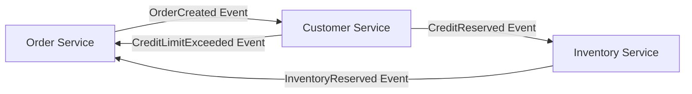
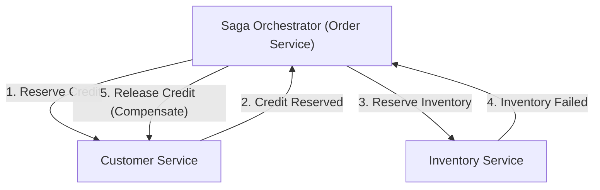

# はじめに：モノリスからマイクロサービスへのパラダイムシフト

現代のソフトウェアエンジニアリングにおいて、システムの規模と複雑性が増すにつれ、モノリシックなアーキテクチャからマイクロサービスアーキテクチャへの移行は、多くの企業にとって避けて通れない道となっています。マイクロサービスは、スケーラビリティ、独立したデプロイメント、技術スタックの多様性、そして組織の俊敏性など、数え切れないほどのメリットをもたらします。しかし、このパラダイムシフトは決して銀の弾丸ではありません。マイクロサービスを採用した開発チームが直面する最も困難な課題の一つが、「分散データ管理」と「分散トランザクション」です。

本記事では、モノリス時代のACIDトランザクションの快適さから一転してマイクロサービス分割に伴う分散トランザクションの困難さに直面する理由、従来の2PC（Two-Phase Commit）が分散環境においてなぜアンチパターンとみなされるのか、そして現代のマイクロサービスアーキテクチャにおけるデファクトスタンダードとなっている「Saga（サーガ）パターン」の全貌について、結果整合性（Eventual Consistency）の受容と補償トランザクションの設計の難しさを交えて、極めて深く掘り下げていきます。

## モノリス時代の牧歌的な風景：ACID特性の甘美な罠

モノリシックアプリケーションの世界では、データ管理は驚くほどシンプルで予測可能でした。アプリケーション全体が一つの巨大なコードベースで構成され、通常は単一のリレーショナルデータベース（RDBMS）を共有していました。この単一データベースの恩恵により、開発者はデータベースが提供する強力な「ACID特性」を当たり前のように享受することができました。

ACIDとは、以下の4つの特性の頭文字をとったものです：

1. **Atomicity（原子性）**: トランザクション内のすべての操作が「すべて成功する」か「すべて失敗する（ロールバックされる）」のどちらかであることを保証します。中間状態は存在しません。
2. **Consistency（一貫性）**: トランザクションの実行前後で、データベースの制約やビジネスルールが常に満たされている状態を保証します。
3. **Isolation（独立性 / 分離性）**: 複数のトランザクションが同時に実行された場合でも、それぞれのトランザクションが互いに干渉しないことを保証します。
4. **Durability（永続性）**: トランザクションが一度コミットされれば、システム障害が発生してもその結果が失われないことを保証します。

例えば、ECサイトにおける「注文」プロセスを考えてみましょう。顧客が商品を注文すると、以下の3つのステップが実行されます。
1. `orders` テーブルに注文レコードを作成する。
2. `customers` テーブルの顧客の与信枠を減らす。
3. `inventory` テーブルの商品の在庫を減らす。

モノリスでは、これらすべての操作を単一のデータベーストランザクション（`BEGIN; ... COMMIT;`）で囲むだけで済みました。もし在庫が足りずにステップ3でエラーが発生した場合、データベースは自動的にステップ1と2をロールバックし、システムは一貫した状態を保ちます。開発者は複雑なエラーハンドリングや状態の不整合について深く悩む必要はなく、インフラストラクチャレベルでデータの一貫性が完全に担保されていました。このACIDトランザクションの快適さは、まさに「甘美な罠」だったと言えます。

## マイクロサービスという荒野：分散データ管理の悪夢

システムが成長し、スケーラビリティや開発スピードの限界を迎えると、チームはモノリスを複数の小さなサービスに分割するマイクロサービスアーキテクチャへと舵を切ります。マイクロサービスのベストプラクティスの一つに「Database per Service（サービスごとのデータベース）」パターンがあります。これは、各マイクロサービスが自身のデータを管理し、他のサービスから直接データベースにアクセスすることを禁じるという原則です。

この原則を先ほどのECサイトに適用すると、システムは以下のように分割されます。
- **Order Service**: 注文データを管理するデータベースを持つ。
- **Customer Service**: 顧客情報と与信枠を管理するデータベースを持つ。
- **Inventory Service**: 商品の在庫を管理するデータベースを持つ。

この構成はサービスの独立性を高める一方で、「分散データ管理の悪夢」を引き起こします。もはや単一のデータベーストランザクションで複数のテーブルを更新することは不可能です。「注文の作成」「与信枠の確保」「在庫の確保」は、ネットワークを介した複数の独立したサービス間での連携を必要とします。

もし、Order Serviceでの注文作成とCustomer Serviceでの与信確保が成功した後、Inventory Serviceがダウンしていて在庫確保に失敗したらどうなるでしょうか？
ローカルデータベーストランザクションの魔法はここには存在しません。与信は減らされたまま、在庫は減っていないのに、注文は保留または失敗状態になるという、致命的な「データ不整合」が発生します。これが、マイクロサービスにおける分散トランザクション問題の核心です。

## 2PC（2フェーズコミット）の誘惑と致命的な限界

分散システムにおいてトランザクションの一貫性を保つための古典的なアプローチとして、2PC（Two-Phase Commit）プロトコルが存在します。多くの開発者は、分散データベースやメッセージキューが提供するXAトランザクションといった2PC実装に解決策を求めようとします。

2PCは、トランザクションマネージャー（コーディネーター）と複数のリソースマネージャー（参加者）で構成され、以下の2つのフェーズで進行します。

1. **Prepare Phase（準備フェーズ）**: コーディネーターがすべての参加者に対し、「コミットの準備ができているか」を問い合わせます。各参加者はリソースをロックし、コミット可能な状態にしてから「Yes」または「No」を返します。
2. **Commit / Rollback Phase（コミット/ロールバックフェーズ）**: すべての参加者が「Yes」と答えた場合、コーディネーターは全員に「コミット」を指示します。一人でも「No」と答えるか応答がなかった場合、全員に「ロールバック」を指示します。

一見すると完璧な解決策に見えますが、現代のクラウドネイティブなマイクロサービス環境において、2PCは深刻なアンチパターンとされています。その理由は以下の通りです。

- **同期的なブロッキングとパフォーマンスの劣化**: 2PCの最大の欠点は、プロトコル全体が同期的であり、参加者がリソースのロックを保持し続けることです。ネットワークの遅延や参加者の一時的な障害が発生すると、他のすべてのサービスがロックの解放を待たされることになり、システム全体のスループットが著しく低下します。
- **単一障害点（SPOF）**: トランザクションコーディネーターが障害を起こすと、参加者はロックを保持したまま待機状態（インダウト状態）に陥り、システムがデッドロックするリスクがあります。
- **NoSQLやメッセージブローカーの非対応**: 多くのモダンなNoSQLデータベースや最新のメッセージブローカーは、スケーラビリティを優先するためXAトランザクション（2PC）をサポートしていません。テクノロジーの選択肢を大きく狭めてしまいます。
- **可用性への悪影響**: マイクロサービスは「部分的な障害」を前提として設計されるべきです。しかし2PCでは、1つのサービスがダウンするとトランザクション全体が失敗するため、システム全体の可用性が個々のサービスの可用性の掛け算になり、急激に低下します。

## CAP定理と結果整合性（Eventual Consistency）の受容

2PCのような強い一貫性（Strong Consistency）を諦めた場合、私たちはどうすればよいのでしょうか。ここで重要になるのが分散システムの基本原則である「CAP定理」と、「BASE特性」の理解です。

CAP定理は、分散システムにおいて以下の3つの保証のうち、同時に満たせるのは最大2つまでであると定義しています。
- **Consistency（一貫性）**: すべてのノードが同じデータを返す。
- **Availability（可用性）**: 障害のないノードへのリクエストは常に成功の応答を返す。
- **Partition tolerance（ネットワーク分断への耐性）**: ネットワークの分断が発生してもシステムは稼働し続ける。

ネットワーク分断（P）は現実のクラウド環境では避けられないため、私たちは常に「C」と「A」のトレードオフを迫られます（CP or AP）。マイクロサービスアーキテクチャでは、システムの可用性（A）とスケーラビリティを優先し、絶対的な一貫性（C）を妥協する「APシステム」を選択することが一般的です。

この妥協の産物が「結果整合性（Eventual Consistency）」です。結果整合性とは、「すぐにはすべてのデータが一致しないかもしれないが、時間が経てば（Eventually）最終的にはすべてのデータが一致し、一貫した状態になる」という考え方です。

ACIDの代わりに、分散システムでは**BASE**という概念が適用されます。
- **Basically Available（基本的には可用である）**: システムの一部が故障しても、全体としては稼働し続ける。
- **Soft state（柔らかい状態）**: データの一貫性が常に保たれているわけではなく、状態は時間とともに変化する。
- **Eventually consistent（最終的な一貫性）**: 最終的にはデータの一貫性が確保される。

マイクロサービスにおけるトランザクション設計は、この結果整合性をシステム全体としていかに安全に、かつ予測可能な形で実現するかにかかっています。そのための具体的なアーキテクチャパターンが「Saga（サーガ）」なのです。

## Sagaパターンの夜明け：分散トランザクションの新たな標準

Sagaパターンは、1987年にHector Garcia-MolinaとKenneth Salemによって発表された論文に端を発する、長時間実行されるトランザクション（Long-Lived Transaction: LLT）を管理するための概念です。現代において、これがマイクロサービスの分散トランザクションを解決するデファクトスタンダードとして蘇りました。

Sagaの基本的な考え方は、大規模な分散トランザクションを、各マイクロサービス内で完結する複数の「ローカルなACIDトランザクション」の連鎖に分割することです。

Saga全体を完了させるために、各サービスはローカルトランザクションを実行し、その完了を示す「イベント」や「メッセージ」を発行します。次のサービスはそのイベントを受け取り、自身のローカルトランザクションを実行します。もし途中のステップでビジネスルールの違反やエラー（例：在庫不足、与信限度額超過）が発生した場合、Sagaはそこから遡って、これまで実行したローカルトランザクションを「打ち消す」ための操作を実行します。これを**補償トランザクション（Compensating Transaction）**と呼びます。

Sagaにおけるトランザクションの流れは以下のようになります。
一連のローカルトランザクションを $T_1, T_2, \dots, T_n$ とします。それぞれに対応する補償トランザクションを $C_1, C_2, \dots, C_{n-1}$ とします。

1. 正常系：$T_1 \rightarrow T_2 \rightarrow \dots \rightarrow T_n$ がすべて成功し、Sagaが完了。
2. 異常系（$T_k$で失敗した場合）：$T_1 \rightarrow T_2 \rightarrow \dots \rightarrow T_{k-1}$ まで成功し、$T_k$ でエラー発生。その後、逆順で $C_{k-1} \rightarrow C_{k-2} \rightarrow \dots \rightarrow C_1$ が実行され、システム全体が元の整合性の取れた状態（意味的なロールバック状態）に戻る。

Sagaパターンには、トランザクションの調整役を誰が担うかによって、大きく2つの実装アプローチがあります。それが「Choreography（コレオグラフィ）」と「Orchestration（オーケストレーション）」です。

### Choreography（コレオグラフィ）：自律的なサービスの舞踏

Choreographyアプローチでは、Sagaを統括する中央のコーディネーターが存在しません。各マイクロサービスは自律的に行動し、ドメインイベントをパブリッシュ・サブスクライブ（Pub/Sub）することで連鎖的にトランザクションを進めます。まるで、ダンサーたちが中央の指揮者なしに、音楽と周囲の動きに合わせて自律的に踊る（コレオグラフィ）ようなものです。

**Choreographyのメリット:**
- **疎結合性**: 中央のオーケストレーターに依存しないため、単一障害点がなく、サービス間の結合度が低く保たれます。
- **シンプルな実装（小規模な場合）**: 参加するサービスが少ない（2〜4つ程度）場合、イベントの発行とリッスンだけで実装できるため、導入が容易です。

**Choreographyのデメリット:**
- **全体像の把握が困難**: システム全体のトランザクションのフローがコードベースのあちこちに分散するため、全体で何が起きているのか（Sagaの現在の状態）を追跡・デバッグするのが極めて困難になります。
- **循環依存のリスク**: サービス同士がお互いのイベントをリッスンし合うことで、循環参照や無限ループに陥るリスクが高まります。
- **複雑化への脆弱性**: ステップ数が増えたり、複雑な分岐条件が必要になると、アーキテクチャ全体がスパゲッティ化し、保守不能になります。

### Orchestration（オーケストレーション）：中央集権的な指揮者

Orchestrationアプローチでは、Sagaの実行フローを中央で制御する「Sagaオーケストレーター（コーディネーター）」を配置します。オーケストレーターは、オーケストラにおける指揮者のように、次にどのサービスがローカルトランザクションを実行すべきかを指示し、その結果を受け取って次の指示を出し、エラー時には適切な補償トランザクションを指示します。

**Orchestrationのメリット:**
- **集中管理と可視性**: Sagaのワークフロー定義が一箇所（オーケストレーター）に集約されるため、全体像の把握、状態の監視、デバッグが非常に容易になります。
- **循環依存の排除**: 参加するサービスはオーケストレーターからの指示に応答するだけであり、互いについて知る必要がないため、依存関係が単方向になります。
- **複雑なフローへの対応**: 条件分岐、並行実行、リトライ、タイムアウトなど、複雑なトランザクションロジックを柔軟に実装できます。

**Orchestrationのデメリット:**
- **オーケストレーターへの依存**: オーケストレーターにビジネスロジックが集中しすぎると、そこが実質的な「スマートなモノリス」となり、他のサービスが単なるCRUDサービスに成り下がるリスク（アネミックドメインモデル）があります。
- **インフラの複雑さ**: 状態遷移を管理するため、AWS Step FunctionsやCamunda、Temporalなどのワークフローエンジンやステートマシンフレームワークを導入・運用するコストがかかります。

一般的に、トランザクションが複数のサービスにまたがり、複雑なビジネスロジックを伴う商用システムにおいては、**Orchestrationアプローチが推奨**されます。

## Sagaパターンを支える血肉：補償トランザクション（Compensating Transaction）の設計哲学

Sagaパターンを真に理解し、実践する上で最大の障壁となるのが「補償トランザクション」の設計です。分散環境では、データベースの `ROLLBACK` コマンドのようにシステムを「完全に過去の同じ状態」に戻すことは不可能です。なぜなら、あなたがトランザクションをロールバックしようとしている間に、すでに別のトランザクションがそのデータを読み取ったり、変更したりしている可能性があるからです。

したがって、補償トランザクションは「システムを物理的に巻き戻す」のではなく、「ビジネス的な意味で打ち消す」操作として設計されなければなりません。

例えば、ホテルの予約とフライトの予約を行う旅行予約Sagaを考えます。
1. ホテルを予約する（成功）
2. フライトを予約する（満席で失敗）

この場合、フライトが取れなかったためホテルの予約を取り消す（補償する）必要があります。しかし、ホテルの予約システムに対して単純にデータを物理削除（DELETE）するわけにはいきません。現実世界では、ホテル予約のキャンセルポリシーに基づきキャンセル料が発生するかもしれませんし、キャンセルしたという履歴を残す必要があります。
つまり、ホテルの補償トランザクションは「キャンセル処理という新たなビジネスロジックの実行（新たなレコードのINSERTやステータスのUPDATE）」となるのです。

**補償トランザクション設計の重要な原則：**

1. **冪等性（Idempotency）の確保**:
   分散システムでは、ネットワークの遅延やリトライ機構により、同じメッセージが複数回到達する「At-Least-Once（少なくとも1回）」の配信が基本となります。したがって、補償トランザクション（および順方向のトランザクションも）は、何度実行されても結果が変わらない「冪等性」を持たなければなりません。一意なトランザクションIDを用いて、処理済みかどうかを判定する冪等キーの実装が不可欠です。

2. **絶対的な成功の保証**:
   順方向のトランザクションはビジネスルールにより失敗することが許されます（例：在庫切れ）。しかし、**補償トランザクションは技術的・ビジネス的に絶対に失敗してはなりません**。一度開始された補償は、システムが最終的な一貫性に到達するまで、リトライされ続ける必要があります。万が一、手動介入が必要な致命的エラーが発生した場合は、デッドレターキュー（DLQ）に送ってアラートを鳴らし、オペレーターが対応できる仕組みを用意します。

3. **順序性の非依存（Commutativity）**:
   非同期メッセージング環境では、順方向のトランザクション実行要求よりも先に、何らかの理由で補償トランザクションの要求が届いてしまうという異常事態（Out of order）が発生し得ます。このような場合でもシステムが破綻しないよう、トランザクションの状態管理を厳密に行い、「まだ開始されていないトランザクションの補償要求が来たら、そのトランザクションを"キャンセル済み"としてマークし、後から順方向の要求が来ても無視する」といった防御的プログラミングが必要です。

4. **分離性（Isolation）の欠如への対策**:
   Sagaの各ステップはローカルDBにコミットされるため、Sagaが進行中の「中間状態」のデータが他のトランザクションから見えてしまいます（これをDirty Readと呼びます）。これを防ぐため、データに「状態（State）」を持たせることが推奨されます。例えば、注文ステータスを最初から `APPROVED` にするのではなく、`PENDING`（処理中）として作成し、Sagaがすべて成功した時点で初めて `APPROVED` に更新し、失敗したら `CANCELLED` に更新します。他のサービスは、`PENDING` 状態のデータは不確定であると認識して扱うことができます（Semantic Lock パターン）。

## Sagaパターン実装における実践的課題と設計パターン

Sagaパターンを実装する際、開発者はデータベースへの書き込みとメッセージブローカーへのメッセージ発行をアトミックに行う必要があります。「データベースを更新してからメッセージを送信する」という順序では、データベース更新後にシステムがクラッシュした場合、メッセージが送信されずSagaが途切れてしまいます（Dual Write Problem）。

この問題を解決するために広く採用されているのが**Outboxパターン（Transactional Outbox Pattern）**です。

Outboxパターンでは、サービス自身のデータベース内に「ビジネスデータ」のテーブルと並んで「Outbox（送信トレイ）」テーブルを用意します。
ローカルトランザクション内で、ビジネスデータの更新と同時に、送信すべきメッセージをOutboxテーブルにINSERTします。これらは同じデータベーストランザクション内で行われるため、完全な原子性が保証されます。
その後、別の非同期プロセス（Message RelayやDebeziumなどのCDCツール）がOutboxテーブルを監視し、レコードを読み取ってメッセージブローカー（KafkaやRabbitMQなど）に確実に送信し、送信完了後にOutboxテーブルからレコードを削除（または送信済みマーク）します。これにより、At-Least-Onceの確実なメッセージング基盤が構築され、Sagaの信頼性が劇的に向上します。

## 結論：真の分散システム設計者になるために

マイクロサービスアーキテクチャへの移行は、単なるインフラやフレームワークの変更ではありません。それは「データの一貫性」に対するパラダイムシフトであり、ソフトウェアエンジニアの思考モデルの転換を要求します。

2PCという同期的な幻想を捨て去り、分散システムの現実—ネットワークは不安定であり、障害は日常的に発生し、データは常に少しずつ遅れて同期される—を受け入れる必要があります。結果整合性とSagaパターンをマスターすることは、マイクロサービスという荒波を乗りこなし、真にスケーラブルでレジリエントなシステムを構築するための必須条件です。

Choreographyの手軽さから始めるのも良いですが、システムが成長するにつれてOrchestrationの堅牢さへと移行する準備をしておくべきです。そして何より、補償トランザクションがもたらすビジネス上の意味合いについて、プロダクトマネージャーやビジネスチームと深く議論し、ドメインの振る舞いを正確にコードに落とし込むドメイン駆動設計（DDD）のスキルが不可欠になります。

Sagaパターンの道は決して平坦ではありませんが、その先には、どんな負荷や障害にも耐えうる強靭なアーキテクチャが待っています。分散トランザクションの真理を理解し、一貫性と可用性の最適なバランスを設計できるアーキテクトこそが、次世代のシステム開発を牽引していくことでしょう。
