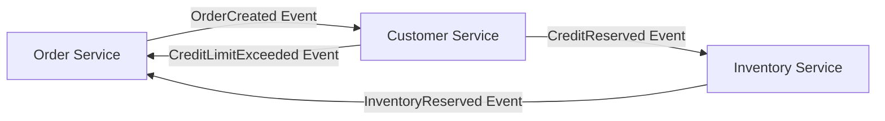
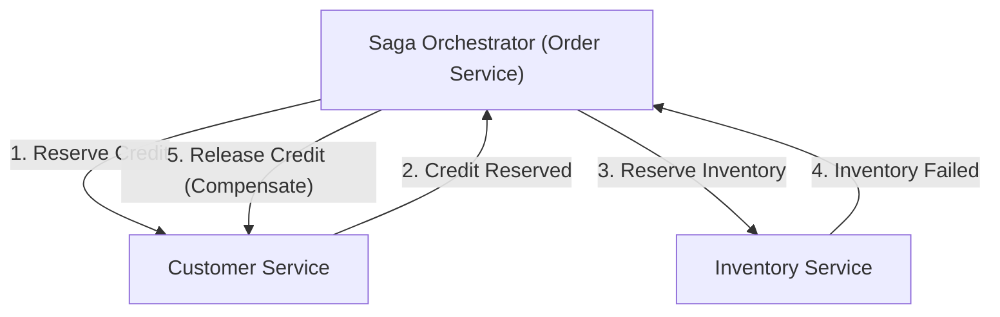

# Introdução: A Mudança de Paradigma do Monólito para Microsserviços

Na engenharia de software moderna, à medida que a escala e a complexidade dos sistemas aumentam, a transição de uma arquitetura monolítica para uma arquitetura de microsserviços tornou-se um caminho inevitável para muitas empresas. Os microsserviços trazem inúmeros benefícios, como escalabilidade, implantação independente, diversidade de stack tecnológico e agilidade organizacional. No entanto, essa mudança de paradigma não é de forma alguma uma bala de prata. Um dos desafios mais difíceis enfrentados pelas equipes de desenvolvimento que adotam microsserviços é a "gestão de dados distribuídos" e as "transações distribuídas".

Neste artigo, exploraremos profundamente por que passamos do conforto das transações ACID da era monolítica para a dificuldade das transações distribuídas associadas à divisão em microsserviços. Discutiremos por que o tradicional 2PC (Two-Phase Commit) é considerado um antipadrão em ambientes distribuídos, e detalharemos todo o panorama do "Padrão Saga", que se tornou o padrão de fato nas arquiteturas modernas de microsserviços. Tudo isso permeado pela aceitação da consistência eventual (Eventual Consistency) e pelas dificuldades no design de transações de compensação.

## O Cenário Bucólico da Era Monolítica: A Doce Armadilha das Propriedades ACID

No mundo das aplicações monolíticas, a gestão de dados era incrivelmente simples e previsível. Toda a aplicação consistia em uma única e gigantesca base de código e, geralmente, compartilhava um único banco de dados relacional (RDBMS). Graças a esse banco de dados único, os desenvolvedores podiam usufruir naturalmente das poderosas "propriedades ACID" que ele oferecia.

ACID é um acrônimo para as seguintes quatro propriedades:

1. **Atomicity (Atomicidade)**: Garante que todas as operações dentro de uma transação "sejam todas concluídas com sucesso" ou "todas falhem (sofram rollback)". Não existem estados intermediários.
2. **Consistency (Consistência)**: Garante que, antes e depois da execução da transação, as restrições do banco de dados e as regras de negócios sejam sempre atendidas.
3. **Isolation (Isolamento)**: Garante que, mesmo quando várias transações são executadas simultaneamente, elas não interfiram umas nas outras.
4. **Durability (Durabilidade)**: Garante que, uma vez que uma transação seja confirmada (commit), seus resultados não serão perdidos mesmo em caso de falha no sistema.

Por exemplo, considere o processo de "pedido" em um site de e-commerce. Quando um cliente faz um pedido de um produto, os seguintes três passos são executados:
1. Criar um registro de pedido na tabela `orders`.
2. Reduzir o limite de crédito do cliente na tabela `customers`.
3. Reduzir o estoque do produto na tabela `inventory`.

No monólito, bastava envolver todas essas operações em uma única transação de banco de dados (`BEGIN; ... COMMIT;`). Se não houvesse estoque suficiente e ocorresse um erro no passo 3, o banco de dados revertia automaticamente os passos 1 e 2, mantendo o sistema em um estado consistente. Os desenvolvedores não precisavam se preocupar profundamente com tratamentos de erros complexos ou inconsistências de estado; a consistência dos dados era totalmente garantida em nível de infraestrutura. Pode-se dizer que esse conforto das transações ACID era verdadeiramente uma "doce armadilha".

## O Deserto dos Microsserviços: O Pesadelo da Gestão de Dados Distribuídos

Quando o sistema cresce e atinge os limites de escalabilidade ou velocidade de desenvolvimento, a equipe muda de rumo para uma arquitetura de microsserviços, dividindo o monólito em vários serviços menores. Uma das melhores práticas dos microsserviços é o padrão "Database per Service" (Banco de Dados por Serviço). Esse princípio estipula que cada microsserviço gerencia seus próprios dados e proíbe o acesso direto ao seu banco de dados por outros serviços.

Se aplicarmos esse princípio ao site de e-commerce mencionado anteriormente, o sistema será dividido da seguinte forma:
- **Order Service**: Possui um banco de dados para gerenciar os dados dos pedidos.
- **Customer Service**: Possui um banco de dados para gerenciar as informações dos clientes e limites de crédito.
- **Inventory Service**: Possui um banco de dados para gerenciar o estoque dos produtos.

Embora essa configuração aumente a independência dos serviços, ela desencadeia o "pesadelo da gestão de dados distribuídos". Já não é possível atualizar várias tabelas com uma única transação de banco de dados. "Criar o pedido", "reservar o limite de crédito" e "reservar o estoque" exigem a coordenação entre vários serviços independentes através da rede.

O que aconteceria se, após o sucesso da criação do pedido no Order Service e da reserva de crédito no Customer Service, o Inventory Service estivesse inativo e falhasse na reserva do estoque?
A mágica da transação de banco de dados local não existe aqui. O crédito permanece reduzido, o estoque não é reduzido, mas o pedido fica pendente ou em estado de falha, gerando uma "inconsistência de dados" fatal. Essa é a essência do problema das transações distribuídas em microsserviços.

## A Tentação do 2PC (Two-Phase Commit) e Suas Limitações Fatais

Como uma abordagem clássica para manter a consistência de transações em sistemas distribuídos, existe o protocolo 2PC (Two-Phase Commit). Muitos desenvolvedores tentam buscar uma solução nas implementações 2PC, como as transações XA fornecidas por bancos de dados distribuídos e filas de mensagens.

O 2PC é composto por um gerenciador de transações (coordenador) e vários gerenciadores de recursos (participantes), e prossegue em duas fases:

1. **Prepare Phase (Fase de Preparação)**: O coordenador pergunta a todos os participantes se eles "estão prontos para confirmar". Cada participante bloqueia os recursos, deixando-os prontos para o commit, e retorna um "Sim" ou "Não".
2. **Commit / Rollback Phase (Fase de Commit/Rollback)**: Se todos os participantes responderem "Sim", o coordenador instrui todos a "confirmar". Se apenas um responder "Não" ou não houver resposta, o coordenador instrui todos a executar o "rollback".

À primeira vista, parece uma solução perfeita, mas em ambientes modernos de microsserviços cloud-native, o 2PC é considerado um sério antipadrão. As razões são as seguintes:

- **Bloqueio Síncrono e Degradação de Desempenho**: A maior desvantagem do 2PC é que o protocolo inteiro é síncrono e os participantes mantêm os recursos bloqueados continuamente. Atrasos na rede ou falhas temporárias dos participantes farão com que todos os outros serviços tenham que esperar a liberação do bloqueio, reduzindo drasticamente o throughput de todo o sistema.
- **Ponto Único de Falha (SPOF)**: Se o coordenador de transações falhar, os participantes ficarão em estado de espera (estado in-doubt) mantendo seus bloqueios, criando o risco de deadlock no sistema.
- **Incompatibilidade com NoSQL e Message Brokers**: Muitos bancos de dados NoSQL modernos e message brokers recentes não suportam transações XA (2PC) para priorizar a escalabilidade. Isso estreita significativamente as opções de tecnologia.
- **Impacto Negativo na Disponibilidade**: Microsserviços devem ser projetados assumindo "falhas parciais". Contudo, no 2PC, se um serviço cair, a transação inteira falha, fazendo com que a disponibilidade geral do sistema se torne o produto da disponibilidade dos serviços individuais, sofrendo uma queda abrupta.

## O Teorema CAP e a Aceitação da Consistência Eventual (Eventual Consistency)

Se desistirmos da consistência forte (Strong Consistency) como a do 2PC, o que devemos fazer? É aqui que a compreensão do "Teorema CAP", o princípio fundamental dos sistemas distribuídos, e das "Propriedades BASE" se torna importante.

O Teorema CAP define que, em um sistema distribuído, no máximo duas das três garantias a seguir podem ser alcançadas simultaneamente:
- **Consistency (Consistência)**: Todos os nós retornam os mesmos dados.
- **Availability (Disponibilidade)**: Requisições a nós sem falhas sempre retornam uma resposta de sucesso.
- **Partition tolerance (Tolerância a Partições de Rede)**: O sistema continua operando mesmo se ocorrer uma partição na rede.

Como a partição de rede (P) é inevitável em ambientes de nuvem do mundo real, somos constantemente forçados a fazer um trade-off entre "C" e "A" (CP ou AP). Na arquitetura de microsserviços, é comum escolher "Sistemas AP", priorizando a disponibilidade (A) e a escalabilidade do sistema, comprometendo a consistência absoluta (C).

O produto desse compromisso é a "Consistência Eventual (Eventual Consistency)". A consistência eventual é a ideia de que "os dados podem não coincidir imediatamente, mas com o passar do tempo (eventually), todos os dados acabarão por coincidir e chegarão a um estado consistente".

Em vez de ACID, o conceito de **BASE** é aplicado em sistemas distribuídos:
- **Basically Available (Basicamente Disponível)**: Mesmo que partes do sistema falhem, o sistema como um todo continua a operar.
- **Soft state (Estado Flexível/Brando)**: A consistência dos dados não é mantida o tempo todo; o estado muda com o tempo.
- **Eventually consistent (Consistência Eventual)**: A consistência dos dados será finalmente garantida.

O design de transações em microsserviços depende de como concretizar essa consistência eventual de maneira segura e previsível em todo o sistema. O padrão de arquitetura específico para isso é o "Saga".

## O Amanhecer do Padrão Saga: O Novo Padrão para Transações Distribuídas

O Padrão Saga é um conceito para gerenciar transações de longa duração (Long-Lived Transactions: LLT), que tem origem em um artigo publicado em 1987 por Hector Garcia-Molina e Kenneth Salem. Nos tempos modernos, ele renasceu como o padrão de fato para resolver transações distribuídas em microsserviços.

A ideia básica do Saga é dividir uma grande transação distribuída em uma cadeia de várias "transações ACID locais" que são completadas dentro de cada microsserviço.

Para concluir toda a Saga, cada serviço executa sua transação local e emite um "evento" ou "mensagem" indicando sua conclusão. O próximo serviço recebe o evento e executa sua própria transação local. Se durante os passos intermediários ocorrer uma violação de regra de negócio ou erro (ex: falta de estoque, limite de crédito excedido), o Saga retrocede a partir desse ponto e executa operações para "desfazer" as transações locais executadas até o momento. Isso é chamado de **Transação de Compensação (Compensating Transaction)**.

O fluxo de transações no Saga é o seguinte:
Considere uma série de transações locais $T_1, T_2, \dots, T_n$. Sejam as transações de compensação correspondentes $C_1, C_2, \dots, C_{n-1}$.

1. Fluxo normal: $T_1 \rightarrow T_2 \rightarrow \dots \rightarrow T_n$ são todos bem-sucedidos, e a Saga é concluída.
2. Fluxo de erro (falha em $T_k$): Há sucesso até $T_1 \rightarrow T_2 \rightarrow \dots \rightarrow T_{k-1}$, mas ocorre um erro em $T_k$. Em seguida, é executado na ordem inversa $C_{k-1} \rightarrow C_{k-2} \rightarrow \dots \rightarrow C_1$, e todo o sistema retorna ao seu estado original consistente (estado de rollback semântico).

O Padrão Saga possui principalmente duas abordagens de implementação, dependendo de quem assume o papel de coordenar as transações: "Choreography (Coreografia)" e "Orchestration (Orquestração)".

### Choreography (Coreografia): A Dança dos Serviços Autônomos

Na abordagem de Choreography, não existe um coordenador central controlando a Saga. Cada microsserviço atua de forma autônoma, avançando a transação em cadeia através de publicação e assinatura (Pub/Sub) de eventos de domínio. É como se dançarinos estivessem dançando de forma autônoma ao ritmo da música e dos movimentos ao seu redor (coreografia), sem um maestro central.

**Vantagens da Choreography:**
- **Baixo Acoplamento**: Por não depender de um orquestrador central, não há um ponto único de falha, e o grau de acoplamento entre os serviços é mantido baixo.
- **Implementação Simples (para casos pequenos)**: Quando poucos serviços participam (cerca de 2 a 4), pode ser implementado apenas emitindo e escutando eventos, tornando a adoção fácil.

**Desvantagens da Choreography:**
- **Dificuldade de Compreender o Todo**: Como o fluxo da transação de todo o sistema está disperso por todo o código base, torna-se extremamente difícil rastrear e depurar o que está acontecendo globalmente (o estado atual da Saga).
- **Risco de Dependência Circular**: Com serviços escutando os eventos uns dos outros, aumenta o risco de cair em referências circulares ou loops infinitos.
- **Vulnerabilidade à Complexidade**: À medida que o número de etapas aumenta ou condições de ramificação complexas se tornam necessárias, a arquitetura inteira vira um "espaguete" e se torna inmanutenível.

### Orchestration (Orquestração): O Maestro Centralizado

Na abordagem de Orchestration, é posicionado um "Saga Orchestrator (Coordenador)" que controla centralmente o fluxo de execução da Saga. O orquestrador, como o maestro em uma orquestra, instrui qual serviço deve executar a transação local a seguir, recebe os resultados, emite a próxima instrução e, em caso de erro, instrui as transações de compensação adequadas.

**Vantagens da Orchestration:**
- **Gestão Centralizada e Visibilidade**: Como a definição do fluxo de trabalho da Saga é centralizada em um único local (orquestrador), compreender o todo, monitorar o estado e realizar a depuração torna-se muito fácil.
- **Eliminação de Dependência Circular**: Os serviços participantes só precisam responder às instruções do orquestrador e não precisam se conhecer, tornando as dependências unidirecionais.
- **Suporte a Fluxos Complexos**: Lógicas de transação complexas, como ramificações condicionais, execuções paralelas, repetições (retries) e limites de tempo (timeouts), podem ser implementadas com flexibilidade.

**Desvantagens da Orchestration:**
- **Dependência do Orquestrador**: Se a lógica de negócios se concentrar demais no orquestrador, existe o risco dele se tornar um "monólito inteligente" prático, enquanto outros serviços são rebaixados a meros serviços CRUD (Modelo de Domínio Anêmico).
- **Complexidade da Infraestrutura**: Para gerenciar as transições de estado, há um custo associado à introdução e operação de mecanismos de workflow ou frameworks de máquinas de estado, como AWS Step Functions, Camunda, Temporal, etc.

Geralmente, em sistemas comerciais onde as transações abrangem vários serviços e envolvem lógica de negócios complexa, a **abordagem de Orchestration é recomendada**.

## O Sangue e a Carne que Sustentam o Padrão Saga: Filosofia de Design das Transações de Compensação (Compensating Transactions)

A maior barreira para compreender verdadeiramente e praticar o Padrão Saga é o design das "Transações de Compensação". Em um ambiente distribuído, é impossível reverter o sistema para o "exato mesmo estado do passado" fisicamente, como o comando `ROLLBACK` de um banco de dados faz. Isso ocorre porque, enquanto você tenta desfazer a transação, outra transação já pode ter lido ou modificado esses dados.

Portanto, as transações de compensação devem ser projetadas não como uma forma de "retroceder o sistema fisicamente", mas sim como operações para "desfazer o significado de negócios".

Por exemplo, considere uma Saga de reserva de viagens que faz a reserva de um hotel e de um voo.
1. Reservar o hotel (Sucesso)
2. Reservar o voo (Falha por lotação)

Neste caso, como o voo não pôde ser reservado, a reserva do hotel deve ser cancelada (compensada). No entanto, não podemos simplesmente excluir fisicamente (DELETE) os dados no sistema de reservas do hotel. No mundo real, podem incorrer taxas de cancelamento com base nas políticas do hotel, e é necessário manter um histórico de que foi cancelado.
Ou seja, a transação de compensação do hotel passa a ser "a execução de uma nova lógica de negócios de processamento de cancelamento (como um INSERT de um novo registro ou um UPDATE de status)".

**Princípios Importantes para o Design de Transações de Compensação:**

1. **Garantia de Idempotência (Idempotency)**:
   Em sistemas distribuídos, devido à latência da rede e mecanismos de repetição, a entrega "At-Least-Once" (pelo menos uma vez), onde a mesma mensagem pode chegar várias vezes, é o padrão. Portanto, transações de compensação (e também transações normais/para frente) devem ter "idempotência", onde o resultado não muda independentemente de quantas vezes sejam executadas. O uso de IDs de transação exclusivos e a implementação de chaves de idempotência para determinar se já foi processado são essenciais.

2. **Garantia Absoluta de Sucesso**:
   As transações para frente podem falhar devido a regras de negócios (ex: falta de estoque). No entanto, **as transações de compensação não devem absolutamente falhar, técnica ou comercialmente**. Uma vez iniciada, a compensação deve continuar a ser repetida até que o sistema atinja a consistência eventual. No caso improvável de um erro fatal que exija intervenção manual, devem ser previstos mecanismos para enviar para uma Dead Letter Queue (DLQ), disparar alertas e permitir que um operador atue.

3. **Independência de Ordem (Commutativity)**:
   Em ambientes de mensageria assíncrona, pode ocorrer a situação anômala (Out of order) de uma solicitação de transação de compensação chegar antes do pedido de execução da transação para frente. Para que o sistema não falhe mesmo nesses casos, é necessário um gerenciamento rigoroso do estado da transação e o uso de programação defensiva. Por exemplo, "se chegar um pedido de compensação para uma transação que ainda não começou, marcar essa transação como 'cancelada' e ignorar solicitações subsequentes para a frente".

4. **Tratamento da Falta de Isolamento (Isolation)**:
   Como cada passo da Saga é consolidado (committed) no banco de dados local, dados em "estados intermediários" enquanto a Saga está em andamento são visíveis para outras transações (isso é chamado de Dirty Read). Para evitar isso, recomenda-se que os dados tenham um "estado (State)". Por exemplo, o status de um pedido não deve ser `APPROVED` desde o início, mas criado como `PENDING` (em processamento), atualizado para `APPROVED` apenas quando a Saga for totalmente bem-sucedida, e para `CANCELLED` em caso de falha. Outros serviços podem tratar dados no estado `PENDING` com o entendimento de que ainda estão indeterminados (Padrão Semantic Lock).

## Desafios Práticos e Padrões de Design na Implementação do Padrão Saga

Ao implementar o padrão Saga, os desenvolvedores precisam gravar no banco de dados e publicar mensagens para o message broker atomicamente. Na ordem "atualizar o banco de dados e depois enviar a mensagem", se o sistema falhar após a atualização do banco de dados, a mensagem não será enviada e a Saga será interrompida (Problema de Escrita Dupla - Dual Write Problem).

Uma solução amplamente adotada para esse problema é o **Padrão Outbox (Transactional Outbox Pattern)**.

No padrão Outbox, juntamente com a tabela de "dados de negócios", é preparada uma tabela "Outbox" (caixa de saída) dentro do banco de dados do próprio serviço.
Dentro de uma transação local, simultaneamente com a atualização dos dados de negócios, as mensagens a serem enviadas são inseridas (INSERT) na tabela Outbox. Como tudo ocorre dentro da mesma transação de banco de dados, a atomicidade completa é garantida.
Posteriormente, outro processo assíncrono (ferramentas de CDC, como Message Relay ou Debezium) monitora a tabela Outbox, lê os registros, envia as mensagens confiavelmente ao message broker (Kafka, RabbitMQ, etc.) e, após a confirmação do envio, exclui (ou marca como enviado) o registro da tabela Outbox. Isso constrói uma base de mensagens confiável At-Least-Once, melhorando drasticamente a confiabilidade da Saga.

## Conclusão: Para se Tornar um Verdadeiro Arquiteto de Sistemas Distribuídos

A migração para a arquitetura de microsserviços não é uma simples mudança de infraestrutura ou framework. Trata-se de uma mudança de paradigma em relação à "consistência de dados", exigindo uma transformação no modelo de pensamento dos engenheiros de software.

É necessário abandonar a ilusão síncrona do 2PC e aceitar a realidade dos sistemas distribuídos: a rede é instável, falhas ocorrem rotineiramente e os dados são sempre sincronizados com um pequeno atraso. Dominar a consistência eventual e o padrão Saga é um pré-requisito para navegar pelas águas turbulentas dos microsserviços e construir sistemas verdadeiramente escaláveis e resilientes.

Começar com a facilidade da Choreography pode ser bom, mas deve-se estar preparado para migrar para a robustez da Orchestration à medida que o sistema cresce. Acima de tudo, habilidades em Domain-Driven Design (DDD) tornam-se essenciais para discutir profundamente o significado de negócios que as transações de compensação trazem, juntamente com gerentes de produto e a equipe de negócios, e refletir com precisão o comportamento do domínio no código.

O caminho do Padrão Saga não é de forma alguma plano, mas além dele reside uma arquitetura resiliente capaz de suportar qualquer carga ou falha. Os arquitetos que compreendem a verdade das transações distribuídas e são capazes de projetar o equilíbrio ideal entre consistência e disponibilidade certamente liderarão o desenvolvimento de sistemas da próxima geração.
