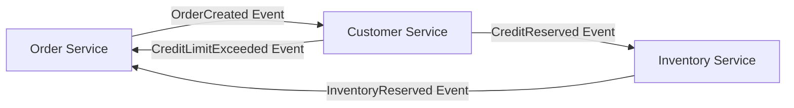
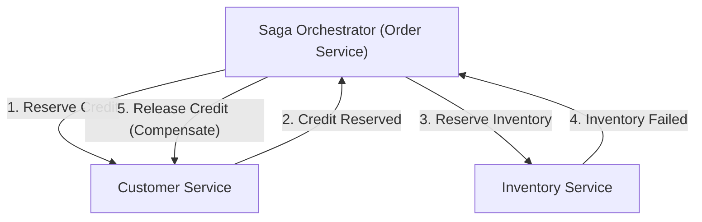

# Введение: Смена парадигмы от монолита к микросервисам

В современной программной инженерии по мере роста масштабов и сложности систем переход от монолитной архитектуры к микросервисной становится неизбежным путем для многих компаний. Микросервисы приносят бесчисленные преимущества, такие как масштабируемость, независимое развертывание, разнообразие технологического стека и организационная гибкость. Однако эта смена парадигмы отнюдь не является серебряной пулей. Одной из самых сложных проблем, с которой сталкиваются команды разработчиков, переходящие на микросервисы, является «распределенное управление данными» и «распределенные транзакции».

В этой статье мы глубоко погрузимся в причины, по которым мы сталкиваемся с трудностями распределенных транзакций, возникающими при разделении на микросервисы, после комфорта ACID-транзакций эпохи монолитов. Мы разберем, почему традиционный двухфазный коммит (2PC - Two-Phase Commit) считается антипаттерном в распределенных средах, и раскроем всю суть «паттерна Saga», ставшего стандартом де-факто в современных микросервисных архитектурах, затрагивая при этом сложность принятия согласованности в конечном счете (Eventual Consistency) и проектирования компенсирующих транзакций.

## Идиллический пейзаж эпохи монолитов: Сладкая ловушка свойств ACID

В мире монолитных приложений управление данными было удивительно простым и предсказуемым. Все приложение состояло из единой огромной кодовой базы и, как правило, использовало одну общую реляционную базу данных (RDBMS). Благодаря этой единой базе данных разработчики могли воспринимать мощные «свойства ACID», предоставляемые базой данных, как нечто само собой разумеющееся.

ACID — это аббревиатура, состоящая из первых букв следующих четырех свойств:

1. **Atomicity (Атомарность)**: Гарантирует, что все операции в рамках транзакции либо «все успешно завершаются», либо «все завершаются ошибкой (откатываются)». Промежуточных состояний не существует.
2. **Consistency (Согласованность)**: Гарантирует, что до и после выполнения транзакции база данных всегда удовлетворяет заданным ограничениям и бизнес-правилам.
3. **Isolation (Изолированность)**: Гарантирует, что даже при одновременном выполнении нескольких транзакций они не мешают друг другу.
4. **Durability (Долговечность)**: Гарантирует, что если транзакция была зафиксирована, ее результаты не будут потеряны даже в случае сбоя системы.

Давайте рассмотрим процесс «заказа» на сайте электронной коммерции. Когда клиент заказывает товар, выполняются следующие три шага:
1. Создание записи о заказе в таблице `orders`.
2. Уменьшение кредитного лимита клиента в таблице `customers`.
3. Уменьшение количества товара в таблице `inventory`.

В монолите достаточно было обернуть все эти операции в единую транзакцию базы данных (`BEGIN; ... COMMIT;`). Если бы на шаге 3 произошла ошибка из-за нехватки товара, база данных автоматически откатила бы шаги 1 и 2, и система сохранила бы согласованное состояние. Разработчикам не нужно было глубоко задумываться о сложной обработке ошибок или несогласованности состояний — согласованность данных полностью гарантировалась на уровне инфраструктуры. Можно сказать, что этот комфорт ACID-транзакций был поистине «сладкой ловушкой».

## Пустошь микросервисов: Кошмар распределенного управления данными

Когда система разрастается и достигает пределов масштабируемости и скорости разработки, команда берет курс на микросервисную архитектуру, разделяя монолит на множество небольших сервисов. Одной из лучших практик микросервисов является паттерн «Database per Service (База данных на каждый сервис)». Этот принцип гласит, что каждый микросервис управляет своими собственными данными и прямой доступ к его базе данных из других сервисов запрещен.

Если применить этот принцип к упомянутому ранее сайту электронной коммерции, система разделится следующим образом:
- **Order Service**: Имеет базу данных для управления данными заказов.
- **Customer Service**: Имеет базу данных для управления информацией о клиентах и их кредитными лимитами.
- **Inventory Service**: Имеет базу данных для управления остатками товаров.

Эта конфигурация повышает независимость сервисов, но в то же время вызывает «кошмар распределенного управления данными». Больше невозможно обновить несколько таблиц в рамках одной транзакции базы данных. «Создание заказа», «резервирование кредитного лимита» и «резервирование товара» теперь требуют координации между несколькими независимыми сервисами через сеть.

Что произойдет, если после успешного создания заказа в Order Service и резервирования кредита в Customer Service произойдет сбой при резервировании товара, потому что Inventory Service недоступен?
Магия локальных транзакций базы данных здесь не работает. Кредитный лимит останется уменьшенным, остатки товаров не изменятся, а заказ перейдет в статус ожидания или ошибки — возникнет фатальная «несогласованность данных». Именно в этом заключается суть проблемы распределенных транзакций в микросервисах.

## Соблазн 2PC (Двухфазного коммита) и его фатальные ограничения

Классическим подходом для поддержания согласованности транзакций в распределенных системах является протокол 2PC (Two-Phase Commit). Многие разработчики пытаются найти решение в реализациях 2PC, таких как XA-транзакции, предоставляемых распределенными базами данных или брокерами сообщений.

2PC состоит из менеджера транзакций (координатора) и нескольких менеджеров ресурсов (участников) и протекает в две фазы:

1. **Prepare Phase (Фаза подготовки)**: Координатор опрашивает всех участников: «Готовы ли вы к коммиту?». Каждый участник блокирует ресурсы, переходит в состояние, готовое к коммиту, а затем отвечает «Yes» или «No».
2. **Commit / Rollback Phase (Фаза коммита / отката)**: Если все участники ответили «Yes», координатор инструктирует всех «зафиксировать (commit)» транзакцию. Если хотя бы один ответил «No» или не ответил, всем отдается команда на «откат (rollback)».

На первый взгляд это кажется идеальным решением, но в современных облачных микросервисных средах 2PC считается серьезным антипаттерном. Причины этого следующие:

- **Синхронная блокировка и падение производительности**: Главный недостаток 2PC заключается в том, что весь протокол является синхронным, а участники продолжают удерживать блокировки ресурсов. При задержках в сети или временных сбоях у одного из участников все остальные сервисы будут вынуждены ждать снятия блокировок, что приводит к значительному падению пропускной способности всей системы.
- **Единая точка отказа (SPOF)**: При сбое координатора транзакций участники оказываются в состоянии ожидания с удерживаемыми блокировками (состояние сомнения), что создает риск взаимной блокировки (deadlock) всей системы.
- **Отсутствие поддержки в NoSQL и брокерах сообщений**: Многие современные базы данных NoSQL и новейшие брокеры сообщений не поддерживают XA-транзакции (2PC) в угоду масштабируемости. Это сильно сужает выбор технологий.
- **Негативное влияние на доступность**: Микросервисы должны проектироваться с расчетом на «частичные сбои». Однако в 2PC при падении одного сервиса проваливается вся транзакция, поэтому общая доступность системы становится произведением доступностей отдельных сервисов, резко снижаясь.

## Теорема CAP и принятие согласованности в конечном счете (Eventual Consistency)

Что же нам делать, если мы отказываемся от строгой согласованности (Strong Consistency), такой как в 2PC? Здесь на первый план выходит понимание «теоремы CAP» — фундаментального принципа распределенных систем — и свойств «BASE».

Теорема CAP гласит, что в распределенной системе из следующих трех гарантий одновременно можно обеспечить не более двух:
- **Consistency (Согласованность)**: Все узлы возвращают одни и те же данные.
- **Availability (Доступность)**: Любой запрос к функционирующему узлу всегда возвращает успешный ответ.
- **Partition tolerance (Устойчивость к разделению сети)**: Система продолжает работать даже в случае разделения сети.

Поскольку разделение сети (P) неизбежно в реальных облачных средах, мы всегда вынуждены выбирать между «C» и «A» (компромисс CP или AP). В микросервисной архитектуре обычно отдается приоритет доступности (A) и масштабируемости системы, а абсолютной согласованностью (C) жертвуют, выбирая «AP-систему».

Результатом этого компромисса является «согласованность в конечном счете (Eventual Consistency)». Согласованность в конечном счете — это концепция, означающая, что «не все данные могут совпадать сразу, но с течением времени (Eventually) все данные в конечном итоге станут идентичными и система придет в согласованное состояние».

Вместо ACID в распределенных системах применяется концепция **BASE**:
- **Basically Available (Базовая доступность)**: Даже если часть системы выходит из строя, в целом она продолжает работать.
- **Soft state (Гибкое состояние)**: Согласованность данных не поддерживается постоянно, состояние меняется со временем.
- **Eventually consistent (Согласованность в конечном счете)**: В конечном итоге согласованность данных будет обеспечена.

Проектирование транзакций в микросервисах сводится к тому, как безопасно и предсказуемо реализовать эту согласованность в конечном счете для системы в целом. Конкретным архитектурным паттерном для этой цели является «Saga (Сага)».

## Рассвет паттерна Saga: Новый стандарт распределенных транзакций

Паттерн Saga берет свое начало из статьи Гектора Гарсиа-Молины и Кеннета Салема, опубликованной в 1987 году, как концепция управления долгоживущими транзакциями (Long-Lived Transaction: LLT). В наше время он возродился в качестве стандарта де-факто для решения проблем распределенных транзакций в микросервисах.

Основная идея Saga заключается в том, чтобы разделить крупную распределенную транзакцию на цепочку множества «локальных ACID-транзакций», каждая из которых завершается в рамках своего микросервиса.

Для того чтобы завершить Saga целиком, каждый сервис выполняет свою локальную транзакцию и публикует «событие» или «сообщение», сигнализирующее о ее завершении. Следующий сервис принимает это событие и выполняет свою собственную локальную транзакцию. Если на каком-то промежуточном шаге происходит нарушение бизнес-правил или возникает ошибка (например, нехватка товара, превышение кредитного лимита), Saga запускает процесс в обратном направлении, выполняя операции для «отмены» уже выполненных локальных транзакций. Это называется **компенсирующей транзакцией (Compensating Transaction)**.

Поток транзакций в Saga выглядит следующим образом.
Пусть серия локальных транзакций будет $T_1, T_2, \dots, T_n$. Соответствующие им компенсирующие транзакции обозначим как $C_1, C_2, \dots, C_{n-1}$.

1. Успешный сценарий: $T_1 \rightarrow T_2 \rightarrow \dots \rightarrow T_n$ — все шаги успешны, и Saga завершается.
2. Сценарий с ошибкой (в случае сбоя на $T_k$): Транзакции успешно выполняются до $T_1 \rightarrow T_2 \rightarrow \dots \rightarrow T_{k-1}$, после чего на $T_k$ возникает ошибка. Затем в обратном порядке выполняются $C_{k-1} \rightarrow C_{k-2} \rightarrow \dots \rightarrow C_1$, возвращая всю систему к исходному согласованному состоянию (состоянию семантического отката).

В паттерне Saga существует два основных подхода к реализации, в зависимости от того, кто берет на себя роль координатора транзакции. Это «Хореография (Choreography)» и «Оркестрация (Orchestration)».

### Хореография (Choreography): Автономный танец сервисов

При подходе хореографии центрального координатора, управляющего Saga, не существует. Каждый микросервис действует автономно, цепочечно продвигая транзакцию путем публикации и подписки (Pub/Sub) на доменные события. Это похоже на то, как танцоры без центрального дирижера автономно танцуют в такт музыке и движениям окружающих (хореография).

**Преимущества хореографии:**
- **Слабая связанность (Loose Coupling)**: Поскольку нет зависимости от центрального оркестратора, отсутствует единая точка отказа, и уровень связанности между сервисами остается низким.
- **Простота реализации (для небольших систем)**: Если участвует мало сервисов (около 2-4), реализация сводится лишь к публикации и прослушиванию событий, что упрощает внедрение.

**Недостатки хореографии:**
- **Трудности в понимании общей картины**: Поскольку поток транзакций всей системы распределен по разным частям кодовой базы, отслеживать и отлаживать, что происходит в целом (текущее состояние Saga), становится крайне сложно.
- **Риск циклических зависимостей**: Когда сервисы слушают события друг друга, возрастает риск попасть в циклическую зависимость или бесконечный цикл.
- **Уязвимость к усложнению**: По мере увеличения числа шагов или необходимости в сложных условиях ветвления вся архитектура превращается в "спагетти" и становится не поддерживаемой.

### Оркестрация (Orchestration): Централизованный дирижер

При подходе оркестрации внедряется «Saga-оркестратор (координатор)», который централизованно управляет потоком выполнения Saga. Оркестратор, подобно дирижеру в оркестре, дает указания о том, какой сервис должен выполнить локальную транзакцию следующим, получает результаты, выдает следующие инструкции, а в случае ошибки инициирует соответствующие компенсирующие транзакции.

**Преимущества оркестрации:**
- **Централизованное управление и прозрачность**: Поскольку определение рабочего процесса Saga сосредоточено в одном месте (у оркестратора), понимание общей картины, мониторинг состояния и отладка становятся намного проще.
- **Устранение циклических зависимостей**: Участвующие сервисы лишь отвечают на запросы оркестратора и не должны знать друг о друге, поэтому зависимости становятся однонаправленными.
- **Поддержка сложных потоков**: Можно гибко реализовывать сложную логику транзакций, включая условные ветвления, параллельное выполнение, повторные попытки (retry) и тайм-ауты.

**Недостатки оркестрации:**
- **Зависимость от оркестратора**: Если в оркестраторе сосредотачивается слишком много бизнес-логики, он рискует превратиться в "умный монолит", а остальные сервисы деградируют до простых CRUD-сервисов (анемичная модель домена - Anemic Domain Model).
- **Сложность инфраструктуры**: Для управления переходами состояний требуется внедрение и поддержка механизмов рабочих процессов (workflow engines) или фреймворков конечных автоматов (state machines), таких как AWS Step Functions, Camunda или Temporal, что влечет за собой дополнительные расходы.

В целом, для коммерческих систем, где транзакции охватывают несколько сервисов и включают сложную бизнес-логику, **рекомендуется подход оркестрации**.

## Плоть и кровь паттерна Saga: Философия проектирования компенсирующих транзакций (Compensating Transaction)

Главным барьером на пути к истинному пониманию и применению паттерна Saga на практике является проектирование «компенсирующих транзакций». В распределенной среде невозможно вернуть систему «ровно в то же прошлое состояние», как это делает команда `ROLLBACK` в базе данных. Это связано с тем, что, пока вы пытаетесь откатить транзакцию, другая транзакция уже могла прочитать или изменить эти данные.

Следовательно, компенсирующая транзакция должна проектироваться не как «физическая перемотка системы назад», а как операция, которая «отменяет действие в бизнес-смысле».

Например, рассмотрим сагу бронирования путешествия, которая включает в себя бронирование гостиницы и рейса.
1. Бронирование гостиницы (Успех)
2. Бронирование рейса (Ошибка: нет мест)

В этом случае необходимо отменить (компенсировать) бронирование гостиницы, так как рейс забронировать не удалось. Однако мы не можем просто физически удалить данные (DELETE) из системы бронирования гостиниц. В реальном мире, согласно политике отмены бронирования, может взиматься плата за отмену, и необходимо оставить историю о том, что бронирование было отменено.
Иными словами, компенсирующая транзакция для гостиницы представляет собой «выполнение новой бизнес-логики под названием 'обработка отмены' (INSERT новой записи или UPDATE статуса)».

**Ключевые принципы проектирования компенсирующих транзакций:**

1. **Обеспечение идемпотентности (Idempotency)**:
   В распределенных системах из-за сетевых задержек и механизмов повторных попыток (retry) базовым правилом является доставка «Хотя бы один раз (At-Least-Once)», при которой одно и то же сообщение может быть доставлено несколько раз. Поэтому компенсирующие транзакции (а также и прямые транзакции) должны быть «идемпотентными», то есть их результат не должен меняться при многократном выполнении. Необходима реализация ключей идемпотентности, использующих уникальный идентификатор транзакции, чтобы определять, была ли она уже обработана.

2. **Абсолютная гарантия успеха**:
   Прямым транзакциям позволено завершаться неудачей по бизнес-правилам (например, нет товара на складе). Однако **компенсирующие транзакции ни в коем случае не должны падать — ни по техническим, ни по бизнес-причинам**. Едва начавшись, компенсация должна повторяться (retry) до тех пор, пока система не достигнет согласованности в конечном счете. На случай возникновения фатальных ошибок, требующих ручного вмешательства, следует предусмотреть механизм отправки сообщений в очередь недоставленных сообщений (Dead Letter Queue - DLQ) с активацией оповещений, чтобы оператор мог принять меры.

3. **Независимость от порядка (Commutativity / Коммутативность)**:
   В среде асинхронного обмена сообщениями может возникнуть нештатная ситуация (Out of order), когда запрос на компенсирующую транзакцию приходит раньше, чем запрос на прямую транзакцию. Чтобы система не рухнула в таких случаях, необходимо строго управлять состояниями транзакций и применять защитное программирование: «Если поступает запрос на компенсацию для еще не начатой транзакции, эта транзакция помечается как 'отмененная', и если позже придет запрос на прямое выполнение, он должен быть проигнорирован».

4. **Противодействие отсутствию изолированности (Isolation)**:
   Поскольку каждый шаг Saga фиксируется в локальной БД, данные в «промежуточном состоянии» незавершенной Saga становятся видимыми для других транзакций (это называется Dirty Read - грязное чтение). Для предотвращения этого рекомендуется наделять данные «Состоянием (State)». Например, статус заказа при создании устанавливается не сразу в `APPROVED`, а в `PENDING` (в обработке), и обновляется до `APPROVED` только тогда, когда вся Saga успешно завершится, или до `CANCELLED` в случае неудачи. Другие сервисы могут понимать, что данные в состоянии `PENDING` являются неокончательными, и соответствующим образом с ними обращаться (паттерн Semantic Lock - Семантическая блокировка).

## Практические проблемы и паттерны проектирования при реализации Saga

При реализации паттерна Saga разработчикам необходимо атомарно выполнять запись в базу данных и публикацию сообщений в брокер сообщений. Если использовать порядок «сначала обновить базу данных, а затем отправить сообщение», и система даст сбой после обновления БД, то сообщение не будет отправлено, и Saga прервется (проблема двойной записи - Dual Write Problem).

Широко используемым решением этой проблемы является **паттерн Outbox (Transactional Outbox Pattern - Транзакционный исходящий ящик)**.

В паттерне Outbox внутри базы данных самого сервиса наряду с таблицами «бизнес-данных» создается таблица «Outbox (Исходящие)».
В рамках локальной транзакции одновременно с обновлением бизнес-данных в таблицу Outbox вставляется (INSERT) сообщение, которое необходимо отправить. Поскольку это происходит в одной и той же транзакции базы данных, гарантируется полная атомарность.
После этого отдельный асинхронный процесс (например, Message Relay или CDC-инструмент вроде Debezium) отслеживает таблицу Outbox, считывает записи и надежно отправляет их в брокер сообщений (например, Kafka или RabbitMQ). После успешной отправки записи из таблицы Outbox удаляются (или помечаются как отправленные). Это создает надежную инфраструктуру обмена сообщениями с гарантией At-Least-Once, что радикально повышает надежность паттерна Saga.

## Заключение: Как стать настоящим архитектором распределенных систем

Переход к микросервисной архитектуре — это не просто смена инфраструктуры или фреймворка. Это смена парадигмы в отношении к «согласованности данных», которая требует изменения модели мышления инженеров-программистов.

Необходимо отказаться от синхронной иллюзии 2PC и принять реалии распределенных систем: сети нестабильны, сбои случаются каждый день, а данные всегда синхронизируются с небольшой задержкой. Овладение концепцией согласованности в конечном счете и паттерном Saga — это необходимое условие для того, чтобы оседлать бурные волны микросервисов и создавать по-настоящему масштабируемые и отказоустойчивые (resilient) системы.

Начать с простоты хореографии — это хороший шаг, но по мере роста системы вы должны быть готовы к переходу на надежность оркестрации. И, самое главное, чтобы точно переносить поведение предметной области в код, абсолютно необходимы навыки предметно-ориентированного проектирования (DDD) и глубокие дискуссии с продакт-менеджерами и бизнес-командой о бизнес-смысле компенсирующих транзакций.

Путь внедрения паттерна Saga отнюдь не гладок, но в его конце вас ждет надежная архитектура, способная выдержать любые нагрузки и сбои. Именно те архитекторы, которые постигнут истину распределенных транзакций и смогут спроектировать оптимальный баланс между согласованностью и доступностью, будут вести за собой разработку систем следующего поколения.
