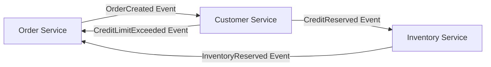
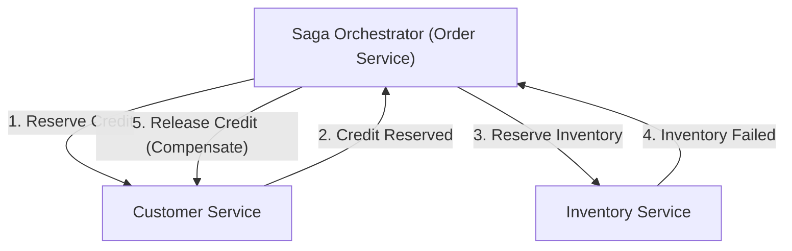

# 引言：从单体应用到微服务的范式转变

在现代软件工程中，随着系统规模和复杂性的增加，从单体架构向微服务架构的迁移已成为许多企业不可避免的道路。微服务带来了无数的好处，如可扩展性、独立部署、技术栈的多样性以及组织的敏捷性等。然而，这种范式转变绝不是银弹。采用微服务的开发团队面临的最艰巨挑战之一便是“分布式数据管理”和“分布式事务”。

本文将极其深入地探讨，为何我们在习惯了单体时代ACID事务的便利后，会面临微服务拆分带来的分布式事务困境；为何传统的2PC（两阶段提交）在分布式环境中被视为反模式；以及作为现代微服务架构中事实标准的“Saga模式”的全貌。此外，我们还将穿插讨论接受最终一致性（Eventual Consistency）以及设计补偿事务的困难所在。

## 单体时代田园诗般的风景：ACID特性的甜蜜陷阱

在单体应用的世界里，数据管理出奇地简单且可预测。整个应用程序由一个庞大的代码库组成，通常共享单一的关系型数据库（RDBMS）。得益于这个单一数据库，开发者能够理所当然地享受数据库提供的强大“ACID特性”。

ACID是以下四个特性首字母的缩写：

1. **Atomicity（原子性）**: 保证事务内的所有操作要么“全部成功”，要么“全部失败（回滚）”。不存在中间状态。
2. **Consistency（一致性）**: 保证在事务执行前后，始终满足数据库约束和业务规则的状态。
3. **Isolation（隔离性）**: 保证即使多个事务同时执行，各个事务之间也不会相互干扰。
4. **Durability（持久性）**: 保证事务一旦提交，即使发生系统故障，其结果也不会丢失。

例如，考虑一个电商网站的“订单”流程。当客户订购商品时，会执行以下三个步骤：
1. 在 `orders` 表中创建订单记录。
2. 减少 `customers` 表中客户的信用额度。
3. 减少 `inventory` 表中的商品库存。

在单体应用中，只需将所有这些操作包裹在单一的数据库事务（`BEGIN; ... COMMIT;`）中即可。如果因为库存不足在第3步发生错误，数据库会自动回滚第1步和第2步，系统保持一致的状态。开发者无需为复杂的错误处理或状态不一致而深感烦恼，基础设施层面已经完全保证了数据的一致性。这种ACID事务的便利性，可以说正是一个“甜蜜的陷阱”。

## 微服务这片荒野：分布式数据管理的噩梦

当系统不断增长，触及可扩展性和开发速度的极限时，团队会转向微服务架构，将单体拆分为多个小服务。微服务的最佳实践之一是“Database per Service（每个服务一个数据库）”模式。这是一项原则，规定每个微服务管理自身的数据，并禁止其他服务直接访问其数据库。

如果将这一原则应用于上述电商网站，系统将被划分为如下形式：
- **Order Service**: 拥有管理订单数据的数据库。
- **Customer Service**: 拥有管理客户信息和信用额度的数据库。
- **Inventory Service**: 拥有管理商品库存的数据库。

这种配置在提高服务独立性的同时，也引发了“分布式数据管理的噩梦”。再也不可能通过单一数据库事务来更新多个表了。“创建订单”、“预留信用”和“预留库存”需要通过网络在多个独立服务之间进行协调。

如果在Order Service中成功创建了订单，并且在Customer Service中成功预留了信用，但由于Inventory Service宕机导致预留库存失败，会发生什么呢？
这里不再有本地数据库事务的魔法。信用已被扣减，而库存并未减少，订单却处于挂起或失败状态，从而发生了致命的“数据不一致”。这就是微服务中分布式事务问题的核心。

## 2PC（两阶段提交）的诱惑与致命局限

作为保持分布式系统事务一致性的经典方法，存在着2PC（两阶段提交）协议。许多开发者试图在分布式数据库或消息队列提供的XA事务等2PC实现中寻找解决方案。

2PC由一个事务管理器（协调者）和多个资源管理器（参与者）组成，分以下两个阶段进行：

1. **Prepare Phase（准备阶段）**: 协调者询问所有参与者“是否准备好提交”。各参与者锁定资源，在进入可提交状态后返回“Yes”或“No”。
2. **Commit / Rollback Phase（提交/回滚阶段）**: 如果所有参与者都回答“Yes”，协调者将指示所有人“提交”。如果哪怕有一个回答“No”或未响应，便会指示所有人“回滚”。

乍一看似乎是完美的解决方案，但在现代云原生的微服务环境中，2PC被认为是严重的反模式。其原因如下：

- **同步阻塞与性能劣化**: 2PC最大的缺点是整个协议是同步的，参与者需要持续保持对资源的锁定。如果发生网络延迟或参与者暂时性故障，所有其他服务都不得不等待锁被释放，从而导致整个系统的吞吐量显著下降。
- **单点故障（SPOF）**: 如果事务协调者发生故障，参与者将在保持锁定的情况下陷入等待状态（存疑状态，Indoubt State），系统有发生死锁的风险。
- **不支持NoSQL与消息代理**: 许多现代的NoSQL数据库和最新的消息代理为了优先保证可扩展性，并不支持XA事务（2PC）。这极大地限制了技术的选择范围。
- **对可用性的负面影响**: 微服务在设计上应假设“局部故障”。但在2PC中，只要有一个服务宕机，整个事务就会失败，因此整个系统的可用性变成了各个服务可用性的乘积，急剧下降。

## CAP定理与接受最终一致性（Eventual Consistency）

如果我们放弃像2PC这样的强一致性（Strong Consistency），我们该怎么办呢？这里重要的是理解分布式系统的基本原则“CAP定理”和“BASE特性”。

CAP定理指出，在分布式系统中的以下三个保证中，最多只能同时满足两个：
- **Consistency（一致性）**: 所有节点返回相同的数据。
- **Availability（可用性）**: 对无故障节点的请求始终返回成功的响应。
- **Partition tolerance（分区容错性）**: 即使发生网络分区，系统仍能继续运行。

由于在现实的云环境中网络分区（P）是不可避免的，我们总是被迫在“C”和“A”之间进行权衡（CP 或 AP）。在微服务架构中，通常会选择优先考虑系统的可用性（A）和可扩展性，并在绝对的一致性（C）上做出妥协的“AP系统”。

这种妥协的产物就是“最终一致性（Eventual Consistency）”。最终一致性是指，“虽然所有数据可能无法立即一致，但随着时间的推移（Eventually），最终所有数据都会一致，系统将达到一致的状态”这一理念。

在分布式系统中，取代ACID的是**BASE**概念：
- **Basically Available（基本可用）**: 即使系统的一部分发生故障，整体上仍能继续运行。
- **Soft state（软状态）**: 数据的一致性并非时刻保持，状态会随时间发生变化。
- **Eventually consistent（最终一致性）**: 最终会确保数据的一致性。

微服务中的事务设计，取决于如何在系统层面上安全且以可预测的方式实现这种最终一致性。而为此提供具体架构模式的正是“Saga”。

## Saga模式的黎明：分布式事务的新标准

Saga模式起源于Hector Garcia-Molina和Kenneth Salem在1987年发表的论文，是一个用于管理长时间运行事务（Long-Lived Transaction: LLT）的概念。在现代，它作为解决微服务分布式事务的事实标准而复苏。

Saga的基本思想是，将一个大型的分布式事务分解为一系列在各个微服务内部完成的“本地ACID事务”的链条。

为了完成整个Saga，每个服务执行本地事务，并发布表示其完成的“事件”或“消息”。下一个服务接收到该事件，并执行自己的本地事务。如果在中间步骤中发生违反业务规则或错误（例如：库存不足、超出信用限额），Saga将从那里回溯，执行用于“抵消”此前已执行的本地事务的操作。这被称为**补偿事务（Compensating Transaction）**。

Saga中的事务流程如下所示：
假设一系列本地事务为 $T_1, T_2, \dots, T_n$。假设与之对应的补偿事务为 $C_1, C_2, \dots, C_{n-1}$。

1. 正常情况：$T_1 \rightarrow T_2 \rightarrow \dots \rightarrow T_n$ 全部成功，Saga完成。
2. 异常情况（在 $T_k$ 处失败时）：直到 $T_1 \rightarrow T_2 \rightarrow \dots \rightarrow T_{k-1}$ 都成功，而在 $T_k$ 发生错误。随后，逆序执行 $C_{k-1} \rightarrow C_{k-2} \rightarrow \dots \rightarrow C_1$，整个系统恢复到原来的状态（语义上的回滚状态）。

根据由谁来担任事务的协调者，Saga模式主要有两种实现方法。那就是“编排（Choreography）”和“协同（Orchestration，有时也译为控制或协调）”。

### 编排（Choreography）：自主服务的舞蹈

在Choreography方法中，不存在统管Saga的中央协调者。各个微服务自主行动，通过发布/订阅（Pub/Sub）领域事件来连锁推进事务。这就像舞者们没有中央的指挥，而是配合音乐和周围的动作自主地跳舞（编排）一样。

**Choreography的优点:**
- **松耦合**: 由于不依赖中央编排器，没有单点故障，服务之间的耦合度保持在较低水平。
- **实现简单（小规模时）**: 当参与的服务较少（约2到4个）时，只需通过发布和监听事件即可实现，因此易于引入。

**Choreography的缺点:**
- **难以把握全貌**: 由于系统整体的事务流程分散在代码库的各处，追踪和调试整体上发生了什么（Saga的当前状态）将变得极其困难。
- **循环依赖风险**: 服务之间相互监听彼此的事件，容易导致陷入循环引用或无限循环的风险。
- **应对复杂性的脆弱**: 当步骤增加或需要复杂的条件分支时，整个架构会变得如同意大利面条般混乱，难以维护。

### 协同（Orchestration）：中央集权的指挥家

在Orchestration方法中，配置一个在中央控制Saga执行流程的“Saga编排器（Orchestrator/Coordinator）”。编排器就像管弦乐队中的指挥家一样，指示下一个应该由哪个服务执行本地事务，接收其结果并发出下一个指示，在发生错误时指示执行适当的补偿事务。

**Orchestration的优点:**
- **集中管理与可视性**: 由于Saga的工作流定义集中在一处（编排器），把握全貌、监控状态和进行调试变得非常容易。
- **消除循环依赖**: 参与的服务只需响应来自编排器的指示，无需了解彼此，因此依赖关系变为单向。
- **应对复杂的流程**: 能够灵活实现条件分支、并行执行、重试、超时等复杂的事务逻辑。

**Orchestration的缺点:**
- **对编排器的依赖**: 如果业务逻辑过度集中在编排器上，它将成为实质上的“智能单体”，而其他服务有沦为单纯的CRUD服务的风险（贫血领域模型）。
- **基础设施的复杂性**: 为了管理状态转换，引入和运维如AWS Step Functions、Camunda、Temporal等工作流引擎或状态机框架需要花费成本。

一般而言，在跨越多个服务并伴随复杂业务逻辑的商业系统中，**推荐使用Orchestration方法**。

## 支撑Saga模式的血肉：补偿事务（Compensating Transaction）的设计哲学

真正理解并实践Saga模式的最大障碍在于“补偿事务”的设计。在分布式环境中，像数据库的 `ROLLBACK` 命令那样将系统“完全恢复到过去相同的状态”是不可能的。因为在你试图回滚事务的期间，可能已经有其他事务读取或修改了该数据。

因此，补偿事务不应被设计为“在物理上倒转系统”，而必须设计为“在业务意义上进行抵消”的操作。

例如，考虑一个包含预订酒店和预订航班的旅行预订Saga。
1. 预订酒店（成功）
2. 预订航班（因满员而失败）

在这种情况下，由于未能预订到航班，需要取消（补偿）酒店预订。然而，我们不能简单地对酒店预订系统进行物理删除（DELETE）数据。在现实世界中，基于酒店预订的取消政策可能会产生取消费用，并且需要保留已取消的历史记录。
换言之，酒店的补偿事务变成了“执行名为取消处理的新业务逻辑（插入新记录或更新状态）”。

**补偿事务设计的重要原则：**

1. **确保幂等性（Idempotency）**:
   在分布式系统中，由于网络延迟或重试机制，同一个消息可能多次到达，基于“At-Least-Once（至少一次）”的交付是基本设定。因此，补偿事务（以及正向事务）必须具有无论执行多少次结果都不变的“幂等性”。利用唯一的事务ID来实现判断是否已处理的幂等键是不可或缺的。

2. **绝对成功的保证**:
   正向事务允许因业务规则而失败（例如：库存售罄）。但是，**补偿事务在技术上和业务上绝不允许失败**。一旦开始补偿，系统必须不断重试，直到达到最终一致性。万一发生需要人工干预的致命错误，应将其发送到死信队列（DLQ）并触发警报，准备好由操作员处理的机制。

3. **顺序独立性（Commutativity）**:
   在异步消息环境中，由于某种原因，补偿事务的请求可能会先于正向事务的执行请求到达，这种异常情况（Out of order）是可能发生的。为了防止系统在这种情况下崩溃，必须严格进行事务的状态管理，进行防御性编程，例如：“如果收到尚未开始的事务的补偿请求，则将该事务标记为‘已取消’，即使之后收到正向请求也会忽略”。

4. **针对隔离性（Isolation）缺失的对策**:
   由于Saga的每一步都会提交到本地数据库，Saga进行中的“中间状态”数据对其他事务是可见的（这被称为脏读，Dirty Read）。为了防止这种情况，建议为数据赋予“状态（State）”。例如，订单状态不要一开始就设为 `APPROVED`，而是作为 `PENDING`（处理中）创建，当Saga全部成功时才更新为 `APPROVED`，失败则更新为 `CANCELLED`。其他服务在识别到 `PENDING` 状态的数据时，会将其视为未确定状态来处理（Semantic Lock / 语义锁模式）。

## Saga模式实现中的实践挑战与设计模式

在实现Saga模式时，开发者必须原子性地执行向数据库的写入和向消息代理的发布。如果在“更新数据库后发送消息”的顺序下，系统在更新数据库后崩溃，消息将不会被发送，从而导致Saga中断（双写问题，Dual Write Problem）。

为了解决这一问题，被广泛采用的是**发件箱模式（Transactional Outbox Pattern）**。

在Outbox模式中，在服务自身的数据库内，除了“业务数据”表之外，还准备一个“Outbox（发件箱）”表。
在本地事务内，在更新业务数据的同时，将需要发送的消息INSERT到Outbox表中。因为这些操作在同一个数据库事务内进行，所以保证了完全的原子性。
随后，另一个异步进程（如Message Relay或Debezium等CDC工具）会监控Outbox表，读取记录并可靠地将其发送到消息代理（如Kafka或RabbitMQ），在发送完成后从Outbox表中删除记录（或标记为已发送）。由此构建了At-Least-Once的可靠消息传递基础设施，极大地提高了Saga的可靠性。

## 结论：为了成为真正的分布式系统设计者

向微服务架构的迁移不仅是基础设施或框架的变更，更是对“数据一致性”的范式转变，要求软件工程师转变思维模式。

必须抛弃2PC这种同步的幻想，接受分布式系统的现实——网络是不稳定的，故障是日常发生的，数据总是稍有延迟地进行同步。掌握最终一致性和Saga模式，是驾驭微服务这股巨浪、构建真正可扩展且具备弹性的系统的必要条件。

从简单易用的Choreography开始是不错的选择，但也应该随着系统的成长，为向更加坚固的Orchestration迁移做好准备。更重要的是，必须与产品经理和业务团队就补偿事务带来的业务含义进行深入讨论，能够将领域行为准确地转化为代码的领域驱动设计（DDD）技能变得不可或缺。

Saga模式的道路绝不平坦，但在其前方，等待着的是能够承受任何负载和故障的强韧架构。唯有理解分布式事务的真理，并能设计出一致性与可用性之间最佳平衡的架构师，才能引领下一代系统开发的未来。
