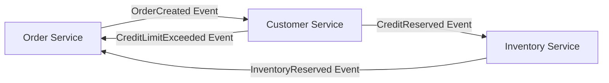
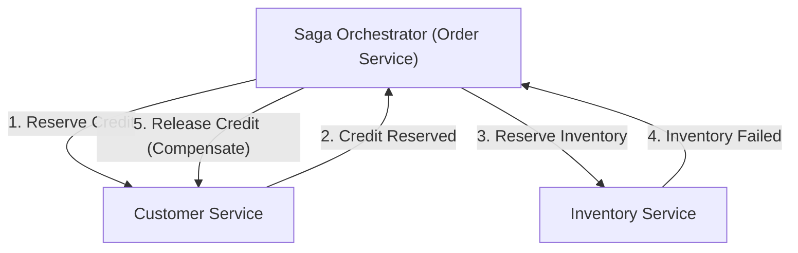

# 前言：從單體架構到微服務的典範轉移

在現代軟體工程中，隨著系統規模與複雜度的增加，從單體架構（Monolithic Architecture）轉型為微服務架構（Microservices Architecture）已成為許多企業不可避免的必經之路。微服務帶來了無數的好處，包括擴展性、獨立部署、技術堆疊的多樣性以及組織的敏捷性。然而，這種典範轉移絕非銀彈。採用微服務的開發團隊所面臨最艱難的挑戰之一，便是「分散式資料管理」與「分散式交易」。

本文將深入探討為何我們會從單體時代 ACID 交易的舒適圈，轉而面對拆分微服務後伴隨而來的分散式交易難題；探討為何傳統的 2PC（Two-Phase Commit，二階段提交）在分散式環境中被視為反模式（Anti-pattern）；並全面解析當今微服務架構中作為業界標準的「Saga 模式」全貌，同時帶入對最終一致性（Eventual Consistency）的接受度與補償交易（Compensating Transaction）設計的複雜性，進行極具深度的剖析。

## 單體時代的田園風光：ACID 特性的甜蜜陷阱

在單體應用程式的世界裡，資料管理出奇地簡單且可預測。整個應用程式由一個巨大的程式碼庫組成，通常共享單一關聯式資料庫（RDBMS）。受惠於單一資料庫，開發者將資料庫所提供的強大「ACID 特性」視為理所當然。

ACID 是以下四個特性英文字首的縮寫：

1. **Atomicity（原子性）**: 保證交易內的所有操作要嘛「全部成功」，要嘛「全部失敗（回滾）」，不存在中間狀態。
2. **Consistency（一致性）**: 保證交易執行前後，資料庫的約束或商業規則始終處於被滿足的狀態。
3. **Isolation（隔離性）**: 即使多個交易同時執行，也能保證各個交易之間互不干擾。
4. **Durability（持久性）**: 保證交易一旦提交（Commit），即使發生系統故障，其結果也不會遺失。

舉例來說，考慮電商網站中的「訂購」流程。當顧客訂購商品時，會執行以下三個步驟：
1. 在 `orders` 資料表建立訂單紀錄。
2. 減少 `customers` 資料表中顧客的信用額度。
3. 減少 `inventory` 資料表中的商品庫存。

在單體架構中，只需將所有這些操作包裝在單一資料庫交易（`BEGIN; ... COMMIT;`）中即可。如果庫存不足導致步驟 3 發生錯誤，資料庫會自動回滾步驟 1 和 2，系統便能保持一致的狀態。開發者不需要深入煩惱複雜的錯誤處理或狀態不一致的問題，資料的一致性在基礎設施層面得到了完全的保證。這般 ACID 交易的舒適度，可以說正是「甜蜜的陷阱」。

## 微服務的荒野：分散式資料管理的惡夢

當系統成長並達到擴展性與開發速度的極限時，團隊會轉向將單體拆分為多個小型服務的微服務架構。微服務的最佳實踐之一是「Database per Service（每個服務專屬資料庫）」模式。這是一項原則，規定每個微服務管理自己的資料，並禁止其他服務直接存取其資料庫。

將此原則套用到先前的電商網站，系統將被拆分如下：
- **Order Service (訂單服務)**: 擁有管理訂單資料的資料庫。
- **Customer Service (顧客服務)**: 擁有管理顧客資訊與信用額度的資料庫。
- **Inventory Service (庫存服務)**: 擁有管理商品庫存的資料庫。

這種架構在提高服務獨立性的同時，卻引發了「分散式資料管理的惡夢」。如今已無法透過單一資料庫交易來更新多個資料表。「建立訂單」、「扣除信用額度」與「扣除庫存」需要透過網路在多個獨立的服務之間進行協作。

如果 Order Service 成功建立訂單且 Customer Service 成功扣除額度後，Inventory Service 卻因停機而導致扣除庫存失敗，會發生什麼事？
本地資料庫交易的魔法在這裡並不存在。信用額度被扣除了，庫存卻沒有減少，而訂單則處於保留或失敗狀態，這引發了致命的「資料不一致」。這正是微服務中分散式交易問題的核心。

## 2PC（二階段提交）的誘惑與致命侷限

在分散式系統中，為了保持交易一致性的傳統方法是 2PC（Two-Phase Commit）協定。許多開發者試圖在分散式資料庫或訊息佇列（Message Queue）所提供的 XA 交易等 2PC 實作中尋找解決方案。

2PC 由交易管理者（協調者 Coordinator）和多個資源管理者（參與者 Participant）組成，並分為以下兩個階段進行：

1. **Prepare Phase（準備階段）**: 協調者向所有參與者詢問「是否準備好提交」。每個參與者鎖定資源，進入可提交狀態，然後回覆「Yes」或「No」。
2. **Commit / Rollback Phase（提交 / 回滾階段）**: 如果所有參與者都回覆「Yes」，協調者便指示所有人「提交」。只要有一人回覆「No」或沒有回應，則指示所有人「回滾」。

乍看之下似乎是個完美的解決方案，但在現代雲端原生（Cloud Native）的微服務環境中，2PC 被視為嚴重的反模式。原因如下：

- **同步阻塞與效能劣化**: 2PC 最大的缺點在於整個協定是同步的，參與者必須持續持有資源的鎖。一旦發生網路延遲或參與者短暫故障，所有其他服務都會被迫等待鎖的釋放，導致系統整體的吞吐量顯著下降。
- **單點故障（SPOF）**: 如果交易協調者發生故障，參與者將持有鎖並陷入等待狀態（In-doubt 狀態），系統面臨死結（Deadlock）的風險。
- **不支援 NoSQL 或 Message Broker**: 許多現代的 NoSQL 資料庫或最新的訊息代理（Message Broker）為了優先考量擴展性，並不支援 XA 交易（2PC）。這大幅縮小了技術選擇的範圍。
- **對可用性的負面影響**: 微服務應該在假設「部分故障」的前提下進行設計。然而在 2PC 中，只要一個服務停機，整個交易就會失敗，導致系統整體的可用性變成各個服務可用性的乘積，進而急遽下降。

## CAP 定理與接受最終一致性（Eventual Consistency）

如果我們放棄了像 2PC 這樣的強一致性（Strong Consistency），那我們該怎麼做呢？這裡重要的是理解分散式系統的基本原則：「CAP 定理」與「BASE 特性」。

CAP 定理定義了在分散式系統中，以下三個保證最多只能同時滿足兩個：
- **Consistency（一致性）**: 所有節點回傳相同的資料。
- **Availability（可用性）**: 對沒有故障的節點發出請求，永遠都會回傳成功的響應。
- **Partition tolerance（分區容錯性）**: 即使發生網路分區（斷線），系統仍能持續運作。

由於在現實的雲端環境中網路分區（P）是無可避免的，因此我們經常被迫在「C」與「A」之間做出權衡（CP 或 AP）。在微服務架構中，通常會優先考量系統的可用性（A）與擴展性，而選擇妥協絕對一致性（C）的「AP 系統」。

這種妥協的產物便是「最終一致性（Eventual Consistency）」。最終一致性是指「雖然所有資料可能不會立即一致，但經過一段時間後（Eventually），最終所有資料都會達成一致，進入一致的狀態」的概念。

取代 ACID，在分散式系統中適用的是 **BASE** 概念：
- **Basically Available（基本可用）**: 即使系統的一部分發生故障，整體而言仍能持續運作。
- **Soft state（軟狀態）**: 資料的一致性不會始終保持，狀態會隨著時間而改變。
- **Eventually consistent（最終一致性）**: 最終能確保資料的一致性。

微服務中的交易設計，取決於如何在整個系統中以安全且可預測的方式實現這種最終一致性。為此而生的具體架構模式就是「Saga」。

## Saga 模式的黎明：分散式交易的新標準

Saga 模式的概念起源於 Hector Garcia-Molina 與 Kenneth Salem 於 1987 年發表的一篇論文，旨在管理長時間執行的交易（Long-Lived Transaction, LLT）。在現代，它重新復甦並成為解決微服務分散式交易的業界標準。

Saga 的基本理念是將大規模的分散式交易，拆解為多個在各微服務內部完成的「本地 ACID 交易」的連鎖反應。

為了完成整個 Saga，每個服務執行本地交易，並發佈表示其完成的「事件」或「訊息」。下一個服務接收該事件，並執行自身的本地交易。如果在中途步驟發生違反商業規則或錯誤（例如：庫存不足、超出信用額度），Saga 將從該點回溯，執行操作來「抵消」先前已執行的本地交易。這被稱為**補償交易（Compensating Transaction）**。

Saga 中的交易流程如下所示。
假設一系列的本地交易為 $T_1, T_2, \dots, T_n$。對應的補償交易為 $C_1, C_2, \dots, C_{n-1}$。

1. 正常情況：$T_1 \rightarrow T_2 \rightarrow \dots \rightarrow T_n$ 全部成功，Saga 完成。
2. 異常情況（在 $T_k$ 發生失敗）：到 $T_1 \rightarrow T_2 \rightarrow \dots \rightarrow T_{k-1}$ 為止皆成功，但在 $T_k$ 發生錯誤。隨後，以反向順序執行 $C_{k-1} \rightarrow C_{k-2} \rightarrow \dots \rightarrow C_1$，使整個系統回到原本一致的狀態（語意上的回滾狀態）。

根據由誰來擔任交易協調者的角色，Saga 模式的實作主要可分為兩種方法：也就是「編排（Choreography）」與「協調（Orchestration）」。

### 編排（Choreography）：自主服務的舞蹈

在編排方法中，不存在統籌 Saga 的中央協調者。各微服務自主行動，透過發佈與訂閱（Pub/Sub）領域事件來連鎖推進交易。這就像舞者們在沒有中央指揮者的情況下，配合音樂與周圍的動作自主地跳舞（編排）一樣。

**編排（Choreography）的優點:**
- **鬆散耦合**: 由於不依賴中央協調者，沒有單點故障，且服務間的耦合度保持在較低的水準。
- **實作簡單（小規模時）**: 如果參與的服務很少（約 2 到 4 個），只需透過發佈和監聽事件即可實作，因此導入容易。

**編排（Choreography）的缺點:**
- **難以掌握全局**: 由於整個系統的交易流程散布在程式碼庫的各處，追蹤與除錯整體究竟發生了什麼事（Saga 的當前狀態）變得極其困難。
- **循環依賴的風險**: 服務之間互相監聽彼此的事件，容易陷入循環參考或無限迴圈的風險中。
- **面對複雜化的脆弱性**: 當步驟數量增加，或需要複雜的分支條件時，整體架構很容易變成義大利麵條般的混亂程式碼，導致無法維護。

### 協調（Orchestration）：中央集權的指揮家

在協調方法中，會配置一個集中控制 Saga 執行流程的「Saga 協調者（Orchestrator/Coordinator）」。協調者就像管弦樂團中的指揮家，指示接下來應該由哪個服務執行本地交易，接收其結果後發出下一個指示，並在發生錯誤時指示適當的補償交易。

**協調（Orchestration）的優點:**
- **集中管理與可視性**: 由於 Saga 的工作流程定義集中在一處（協調者），掌握全局、監控狀態與除錯變得非常容易。
- **消除循環依賴**: 參與的服務只需回應協調者的指示，不需要了解彼此，因此依賴關係變成單向。
- **應對複雜的流程**: 可以彈性地實作條件分支、平行執行、重試、超時等複雜的交易邏輯。

**協調（Orchestration）的缺點:**
- **對協調者的依賴**: 如果協調者集中了過多的商業邏輯，它實質上會變成一個「聰明的單體（Smart Monolith）」，而其他服務則面臨淪為單純 CRUD 服務的風險（貧血領域模型 Anemic Domain Model）。
- **基礎設施的複雜性**: 為了管理狀態轉換，需要導入並維運如 AWS Step Functions、Camunda 或 Temporal 等工作流引擎或狀態機框架，這會增加成本。

通常，在跨越多個服務且伴隨複雜商業邏輯的商業系統中，**推薦使用協調（Orchestration）方法**。

## 支撐 Saga 模式的血肉：補償交易（Compensating Transaction）的設計哲學

真正理解並實踐 Saga 模式的最大障礙，在於「補償交易」的設計。在分散式環境中，不可能像資料庫的 `ROLLBACK` 指令那樣，將系統「完全還原到過去相同的狀態」。因為就在你準備回滾交易的同時，已經有其他交易可能讀取或修改了該資料。

因此，補償交易不應設計為「在物理上倒轉系統」，而必須設計為「在商業語意上抵消」的操作。

例如，考慮一個包含預訂飯店與預訂航班的旅遊預訂 Saga：
1. 預訂飯店（成功）
2. 預訂航班（客滿導致失敗）

在這種情況下，由於航班無法預訂，因此必須取消（補償）飯店的預訂。然而，我們不能對飯店預訂系統簡單地進行物理刪除（DELETE）資料。在現實世界中，可能會根據飯店的取消政策產生手續費，或者必須保留已取消的歷史紀錄。
換句話說，飯店的補償交易將會是「執行取消處理這項新的商業邏輯（新增記錄（INSERT）或更新狀態（UPDATE））」。

**補償交易設計的重要原則：**

1. **確保冪等性（Idempotency）**:
   在分散式系統中，由於網路延遲或重試機制，相同訊息到達多次的「At-Least-Once（至少一次）」傳遞是基本常態。因此，補償交易（以及正向交易）必須具備「冪等性」，即無論執行多少次，結果都不會改變。必須使用唯一的交易 ID 來實作冪等鍵（Idempotency Key），以判斷處理是否已完成。

2. **保證絕對成功**:
   正向交易允許因為商業規則而失敗（例如：庫存不足）。然而，**補償交易在技術與商業上絕對不能失敗**。一旦啟動了補償，系統必須持續重試，直到達到最終一致性為止。萬一發生需要人工介入的致命錯誤，必須準備好將訊息送往死信佇列（Dead Letter Queue, DLQ）並觸發警報，以便操作人員能夠介入處理的機制。

3. **順序無關性（Commutativity）**:
   在非同步訊息環境中，可能會發生補償交易的請求因某種原因比正向交易的執行請求更早到達的異常狀況（Out of order）。為了避免系統在這種情況下崩潰，必須嚴格管理交易狀態，進行防禦性程式設計，例如：「如果收到了尚未開始的交易的補償請求，則將該交易標記為『已取消』，即使之後正向請求到達也予以忽略」。

4. **應對隔離性（Isolation）的缺失**:
   由於 Saga 的每個步驟都會提交到本地資料庫，因此正在進行的 Saga 其「中間狀態」資料對其他交易是可見的（這稱為髒讀 Dirty Read）。為了防止這種情況，建議讓資料具備「狀態（State）」。例如，不要從一開始就將訂單狀態設為 `APPROVED`，而是先建立為 `PENDING`（處理中），等到 Saga 全部成功時才將其更新為 `APPROVED`，若失敗則更新為 `CANCELLED`。其他服務則可將處於 `PENDING` 狀態的資料視為不確定資料來處理（語意鎖 Semantic Lock 模式）。

## Saga 模式實作中的實務課題與設計模式

在實作 Saga 模式時，開發者必須原子地（Atomically）執行寫入資料庫與向 Message Broker 發佈訊息。如果是「先更新資料庫再發送訊息」的順序，若在資料庫更新後系統崩潰，訊息將不會被發送，Saga 就會中斷（雙寫問題 Dual Write Problem）。

為了解決這個問題，廣泛被採用的就是**發件匣模式（Transactional Outbox Pattern）**。

在發件匣模式中，在服務自身的資料庫內，除了「商業資料」的資料表外，還會準備一個「Outbox（發件匣）」資料表。
在本地交易內，更新商業資料的同時，將應該發送的訊息 INSERT 到 Outbox 資料表中。由於這些操作在同一個資料庫交易中進行，因此能保證完全的原子性。
之後，由另一個非同步程序（如 Message Relay 或 Debezium 等 CDC 工具）監控 Outbox 資料表，讀取記錄並確實發送到 Message Broker（如 Kafka 或 RabbitMQ），發送完成後從 Outbox 資料表中刪除該記錄（或標記為已發送）。這樣就能建構出基於 At-Least-Once 的可靠訊息基礎設施，大幅提升 Saga 的可靠性。

## 結論：成為真正的分散式系統架構師

轉向微服務架構不僅僅是基礎設施或框架的變更。它是對「資料一致性」的典範轉移，需要軟體工程師轉變其思考模式。

我們必須拋棄 2PC 這種同步的幻想，並接受分散式系統的現實——網路是不穩定的、故障是家常便飯、資料總是會稍有延遲地同步。掌握最終一致性與 Saga 模式，是駕馭微服務這片驚濤駭浪，並建構出真正可擴展且具備韌性（Resilient）系統的必備條件。

從編排（Choreography）的簡便性開始固然不錯，但隨著系統的成長，應該要做好轉向協調（Orchestration）穩健性的準備。更重要的是，必須與產品經理或商業團隊深入探討補償交易帶來的商業涵義，並具備將領域行為準確落實到程式碼中的領域驅動設計（DDD）技能。

Saga 模式之路絕不平坦，但在其盡頭，等待著的是能夠承受任何負載與故障的強韌架構。能理解分散式交易的真理，並設計出一致性與可用性最佳平衡的架構師，必將引領次世代的系統開發。
