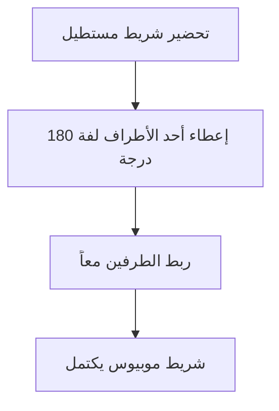
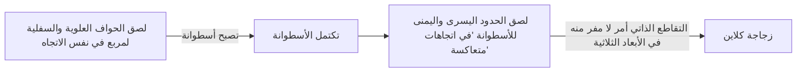

العديد من الأشياء من حولنا لها "داخل وخارج" أو "أمام وخلف". على سبيل المثال، ورقة لها وجه وظهر، والكرة لها داخل وخارج. ومع ذلك، في مجال الرياضيات المعروف باسم **الطوبولوجيا**، توجد أشكال غامضة حيث لا ينطبق هذا الحدس. تُعرف هذه بالأسطح "غير القابلة للتوجيه".

في هذا المقال، سنشرح بالتفصيل التعريفات الرياضية، والتمثيلات الوسيطية، وخصائص مثالين تمثيليين: **شريط موبيوس** و **زجاجة كلاين**.

## 1. ما هي قابلية التوجيه؟

في الهندسة والطوبولوجيا، يكون السطح "قابلاً للتوجيه" إذا كان بإمكانك تحديد مفاهيم مثل "الأمام والخلف" أو "في اتجاه عقارب الساعة وعكس اتجاه عقارب الساعة" بشكل متسق عبر السطح بأكمله.

على سبيل المثال، الكرة والطارة (شكل الدونات) هي أسطح قابلة للتوجيه. تخيل نملة تمشي على هذه الأسطح. بغض النظر عن كيفية تحرك النملة وعودتها إلى نقطة بدايتها، فإن "الأعلى" و "الأسفل" الخاص بها لن ينعكس أبداً.

من ناحية أخرى، على سطح غير قابل للتوجيه، إذا أكملت دورة على طول مسار معين وعدت إلى نقطة البداية، **تنعكس "اليسار واليمين" أو "الأمام والخلف"**. شريط موبيوس وزجاجة كلاين اللذان سنقدمهما أدناه يمتلكان بالضبط هذه الخاصية.

## 2. شريط موبيوس

اكتشف شريط موبيوس بشكل مستقل في عام 1858 من قبل عالمي الرياضيات الألمانيين أوغست فرديناند موبيوس ويوهان بنديكت ليستينج.

### 2.1 طريقة البناء

يمكنك بسهولة إنشاء شريط موبيوس عن طريق أخذ شريط مستطيل من الورق، وإعطائه نصف لفة واحدة (180 درجة)، وربط الطرفين معاً.

### 2.2 التمثيل الرياضي (المعلمات)

التمثيل الوسيطي لشريط موبيوس في الفضاء الإقليدي ثلاثي الأبعاد $\mathbb{R}^3$ هو كما يلي. يتم التعبير عنه باستخدام المتغيرات $u$ و $v$.

$$
\begin{aligned}
x(u, v) &= \left( R + v \cos\left(\frac{u}{2}\right) \right) \cos(u) \\
y(u, v) &= \left( R + v \cos\left(\frac{u}{2}\right) \right) \sin(u) \\
z(u, v) &= v \sin\left(\frac{u}{2}\right)
\end{aligned}
$$

هنا،
- $R$ هو نصف قطر الدائرة المركزية
- $u \in [0, 2\pi)$ هي الزاوية حول الشريط
- $v \in [-w, w]$ هو نطاق نصف عرض الشريط ($w$ هو نصف العرض)

كما ترى من المعادلة، عندما ينتقل $u$ من $0$ إلى $2\pi$ (دوران كامل واحد)، يصبح $u/2$ مساوياً لـ $\pi$. نظراً لأن $\cos(\pi) = -1$ و $\sin(\pi) = 0$، تنعكس إشارة $v$. هذا يوفر الدعم الرياضي لحقيقة أن إكمال دورة واحدة حول شريط موبيوس يقلبه من الداخل إلى الخارج.

### 2.3 خصائص مثيرة للاهتمام

1. **حدود واحدة فقط**: يحتوي الشريط العادي (جانب الأسطوانة) على حدين (حافتين)، أحدهما علوي والآخر سفلي. ومع ذلك، إذا تتبعت حافة شريط موبيوس بإصبعك، فسوف تعبر الحافة بأكملها وتعود إلى نقطة بدايتك. هذا يعني أن لديه حداً واحداً فقط، منحنى مغلق واحد.
2. **نتيجة القطع**: إذا قمت بقطع شريط موبيوس إلى نصفين على طول خط المركز الخاص به باستخدام المقص، فلن يصبح شريطين منفصلين؛ بدلاً من ذلك، يصبح حلقة واحدة أكبر ملتوية مرتين.

## 3. زجاجة كلاين

بينما شريط موبيوس هو سطح له حدود (حافة)، فإن **زجاجة كلاين** هي "سطح مغلق غير قابل للتوجيه وبلا حدود". تم ابتكارها في عام 1882 من قبل عالم الرياضيات الألماني فيليكس كلاين.

### 3.1 البناء المفاهيمي لزجاجة كلاين

يتم تعريف زجاجة كلاين عن طريق لصق الحواف المتقابلة لمربع في اتجاهات محددة.

في لغة الطوبولوجيا، يتم وصفها باستخدام مضلع أساسي على النحو التالي:

$$
\text{مربع بحواف } a, b, a, b^{-1}
$$

هذا يعني أنه يتم ضم الحافة $a$ في نفس الاتجاه، ويتم ضم الحافة $b$ في الاتجاه المعاكس.

### 3.2 التقاطع الذاتي في الفضاء ثلاثي الأبعاد

زجاجة كلاين هي في الأساس شكل مضمن في **فضاء رباعي الأبعاد** ($\mathbb{R}^4$). ضمن الفضاء رباعي الأبعاد، يمكن بناؤها دون أن تتقاطع مع نفسها.

ومع ذلك، عندما نحاول فرض تمثيل لزجاجة كلاين في الفضاء ثلاثي الأبعاد الذي نعيش فيه، يجب أن يمر "عنق" الزجاجة عبر "جدارها" الخاص ليدخل ويتصل بالقاعدة. هذا **التقاطع الذاتي** أمر لا مفر منه.

### 3.3 مثال على التمثيل الرياضي (إسقاط ثلاثي الأبعاد)

فيما يلي مثال على المعادلات الوسيطية لزجاجة كلاين على شكل رقم 8 مسقطة في الفضاء ثلاثي الأبعاد.

$$
\begin{aligned}
x(u, v) &= \left( r + \cos\left(\frac{u}{2}\right) \sin(v) - \sin\left(\frac{u}{2}\right) \sin(2v) \right) \cos(u) \\
y(u, v) &= \left( r + \cos\left(\frac{u}{2}\right) \sin(v) - \sin\left(\frac{u}{2}\right) \sin(2v) \right) \sin(u) \\
z(u, v) &= \sin\left(\frac{u}{2}\right) \sin(v) + \cos\left(\frac{u}{2}\right) \sin(2v)
\end{aligned}
$$
($0 \le u < 2\pi$, $0 \le v < 2\pi$)

### 3.4 العلاقة مع شريط موبيوس

بشكل مدهش، إذا قمت بقطع زجاجة كلاين من المنتصف بالضبط على طول مستوى معين، فإنها تنقسم إلى **شريطي موبيوس** (شريط موبيوس أيمن وشريط موبيوس أيسر).
وعلى العكس من ذلك، إذا قمت بلصق حدود شريطي موبيوس معاً، فإنك تكمل زجاجة كلاين.

## 4. التطبيقات والملخص

شريط موبيوس وزجاجة كلاين ليسا مجرد ألغاز رياضية.

- **التطبيقات الصناعية**: أحزمة النقل المصممة على شكل شريط موبيوس تتآكل بشكل متساوٍ على كلا الجانبين، مما يضاعف عمرها الافتراضي بشكل فعال. تم استخدام نفس المفهوم في أشرطة الكاسيت ذات الحلقة المستمرة.
- **الكيمياء والفيزياء**: تم تخليق جزيئات بهيكل شريط موبيوس (عطرية موبيوس).
- **الفن والثقافة**: كانت هذه الأشكال زخارف في العديد من الأعمال الفنية، مثل النقش الخشبي لـ إم. سي. إيشر "شريط موبيوس 2".

الخاصية غير البديهية المتمثلة في "عدم وجود تمييز بين الداخل والخارج" توسع وعينا المكاني وتوفر فرصة للتفكير بعمق في شكل الكون وهندسة الأبعاد العليا. هذه الأسطح الغامضة التي كشفت عنها الطوبولوجيا ترمز حقاً إلى جمال وعمق الرياضيات.
