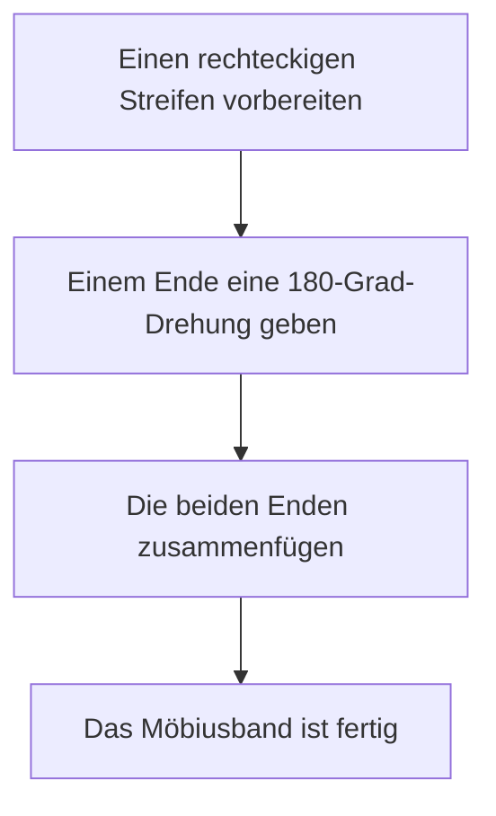

Viele Objekte um uns herum haben ein "Innen und Außen" oder ein "Vorne und Hinten". Zum Beispiel hat ein Blatt Papier eine Vorder- und eine Rückseite, und ein Ball hat eine Innen- und eine Außenseite. Im Bereich der Mathematik, der als **Topologie** bekannt ist, gibt es jedoch mysteriöse Formen, bei denen diese Intuition nicht zutrifft. Diese werden als "nicht-orientierbare" Flächen bezeichnet.

In diesem Artikel werden wir die mathematischen Definitionen, die parametrischen Darstellungen und die Eigenschaften zweier repräsentativer Beispiele im Detail erklären: das **Möbiusband** und die **Kleinsche Flasche**.

## 1. Was ist Orientierbarkeit?

In der Geometrie und Topologie ist eine Fläche "orientierbar", wenn man Konzepte wie "Vorder- und Rückseite" oder "im Uhrzeigersinn und gegen den Uhrzeigersinn" durchgängig über die gesamte Fläche definieren kann.

Zum Beispiel sind eine Kugel und ein Torus (Donutform) orientierbare Flächen. Stellen Sie sich eine Ameise vor, die auf diesen Flächen läuft. Egal wie sich die Ameise bewegt und zu ihrem Ausgangspunkt zurückkehrt, ihr eigenes "Oben" und "Unten" wird sich niemals umkehren.

Auf einer nicht-orientierbaren Fläche hingegen, wenn man einen Rundgang entlang eines bestimmten Weges beendet und zum Ausgangspunkt zurückkehrt, **kehren sich "Links und Rechts" oder "Vorne und Hinten" um**. [Das Möbiusband und die Kleinsche Flasche](https://kenji.blog/de/p/mobius-strip-and-klein-bottle/), die unten vorgestellt werden, besitzen genau diese Eigenschaft.

## 2. Das Möbiusband

Das Möbiusband wurde 1858 unabhängig voneinander von den deutschen Mathematikern August Ferdinand Möbius und Johann Benedict Listing entdeckt.

### 2.1 Konstruktionsmethode

Sie können leicht ein Möbiusband herstellen, indem Sie einen rechteckigen Papierstreifen nehmen, ihn um eine halbe Drehung (180 Grad) verdrillen und die beiden Enden zusammenfügen.

### 2.2 Mathematische Darstellung (Parametrisierung)

Die parametrische Darstellung eines Möbiusbandes im 3-dimensionalen euklidischen Raum $\mathbb{R}^3$ lautet wie folgt. Sie wird unter Verwendung der Parameter $u$ und $v$ ausgedrückt.

$$
\begin{aligned}
x(u, v) &= \left( R + v \cos\left(\frac{u}{2}\right) \right) \cos(u) \\
y(u, v) &= \left( R + v \cos\left(\frac{u}{2}\right) \right) \sin(u) \\
z(u, v) &= v \sin\left(\frac{u}{2}\right)
\end{aligned}
$$

Hierbei ist,
- $R$ der Radius des zentralen Kreises
- $u \in [0, 2\pi)$ der Winkel um das Band
- $v \in [-w, w]$ der Bereich der halben Breite des Bandes ($w$ ist die halbe Breite)

Wie Sie an der Gleichung sehen können, wird $u/2$ zu $\pi$, wenn $u$ von $0$ auf $2\pi$ geht (eine volle Drehung). Da $\cos(\pi) = -1$ und $\sin(\pi) = 0$, kehrt sich das Vorzeichen von $v$ um. Dies liefert die mathematische Grundlage dafür, dass sich das Möbiusband bei einem vollständigen Rundgang von innen nach außen stülpt.

### 2.3 Interessante Eigenschaften

1. **Nur Eine Begrenzung**: Ein normaler Streifen (die Seite eines Zylinders) hat zwei Begrenzungen (Kanten), eine obere und eine untere. Wenn Sie jedoch die Kante eines Möbiusbandes mit Ihrem Finger nachfahren, werden Sie die gesamte Kante durchlaufen und zu Ihrem Ausgangspunkt zurückkehren. Das bedeutet, dass es nur eine Begrenzung, eine einzige geschlossene Kurve, hat.
2. **Ergebnis des Schneidens**: Wenn Sie ein Möbiusband entlang seiner Mittellinie mit einer Schere in der Mitte durchschneiden, wird es nicht zu zwei separaten Streifen; stattdessen wird es zu einer größeren, doppelt verdrehten Schleife.

## 3. Die Kleinsche Flasche

Während das Möbiusband eine Fläche mit einer Begrenzung (Kante) ist, ist die **Kleinsche Flasche** eine "geschlossene, nicht-orientierbare Fläche ohne Begrenzung". Sie wurde 1882 vom deutschen Mathematiker Felix Klein erdacht.

### 3.1 Konzeptuelle Konstruktion der Kleinschen Flasche

Die Kleinsche Flasche wird definiert, indem man die gegenüberliegenden Kanten eines Quadrats in bestimmten Orientierungen verklebt.

In der Sprache der Topologie wird sie mithilfe eines Fundamentalpolygons wie folgt beschrieben:

$$
\text{Quadrat mit Kanten } a, b, a, b^{-1}
$$

Das bedeutet, dass Kante $a$ in der gleichen Richtung und Kante $b$ in der entgegengesetzten Richtung zusammengefügt wird.

### 3.2 Selbstdurchdringung im Dreidimensionalen Raum

Die Kleinsche Flasche ist im Grunde eine Figur, die in einen **4-dimensionalen Raum** ($\mathbb{R}^4$) eingebettet ist. Innerhalb eines 4D-Raumes kann sie konstruiert werden, ohne sich selbst zu schneiden.

Wenn wir jedoch versuchen, eine Darstellung der Kleinschen Flasche in dem 3-dimensionalen Raum, in dem wir leben, zu erzwingen, muss der "Hals" der Flasche durch ihre eigene "Wand" gehen, um hineinzugelangen und sich mit der Basis zu verbinden. Diese **Selbstdurchdringung** ist unvermeidlich.

### 3.3 Beispiel für eine Parametrische Darstellung (3D-Projektion)

Hier ist ein Beispiel für die parametrischen Gleichungen einer achtförmigen Kleinschen Flasche, projiziert in den dreidimensionalen Raum.

$$
\begin{aligned}
x(u, v) &= \left( r + \cos\left(\frac{u}{2}\right) \sin(v) - \sin\left(\frac{u}{2}\right) \sin(2v) \right) \cos(u) \\
y(u, v) &= \left( r + \cos\left(\frac{u}{2}\right) \sin(v) - \sin\left(\frac{u}{2}\right) \sin(2v) \right) \sin(u) \\
z(u, v) &= \sin\left(\frac{u}{2}\right) \sin(v) + \cos\left(\frac{u}{2}\right) \sin(2v)
\end{aligned}
$$
($0 \le u < 2\pi$, $0 \le v < 2\pi$)

### 3.4 Beziehung zum Möbiusband

Erstaunlicherweise teilt sich eine Kleinsche Flasche, wenn Sie sie exakt in der Mitte entlang einer bestimmten Ebene durchschneiden, in **zwei Möbiusbänder** (ein rechtshändiges Möbiusband und ein linkshändiges Möbiusband).
Umgekehrt, wenn Sie die Begrenzungen zweier Möbiusbänder zusammenkleben, vervollständigen Sie eine Kleinsche Flasche.

## 4. Anwendungen und Zusammenfassung

[Das Möbiusband und die Kleinsche Flasche](https://kenji.blog/de/p/mobius-strip-and-klein-bottle/) sind nicht nur mathematische Rätsel.

- **Industrielle Anwendungen**: Förderbänder, die wie ein Möbiusband geformt sind, verschleißen gleichmäßig auf beiden Seiten, was ihre Lebensdauer effektiv verdoppelt. Dasselbe Konzept wurde bei Endlos-Kassetten verwendet.
- **Chemie und Physik**: Moleküle mit der Struktur eines Möbiusbandes (Möbius-Aromatizität) wurden synthetisiert.
- **Kunst und Kultur**: Sie waren Motive in vielen Kunstwerken, wie etwa M.C. Eschers Holzschnitt "Möbiusband II".

Die kontraintuitive Eigenschaft, dass es "keine Unterscheidung zwischen Innen und Außen" gibt, erweitert unser räumliches Bewusstsein und bietet die Gelegenheit, tiefgreifend über die Form des Universums und höherdimensionale Geometrie nachzudenken. Diese mysteriösen Flächen, die durch die Topologie enthüllt wurden, symbolisieren wahrlich die Schönheit und Tiefe der Mathematik.
