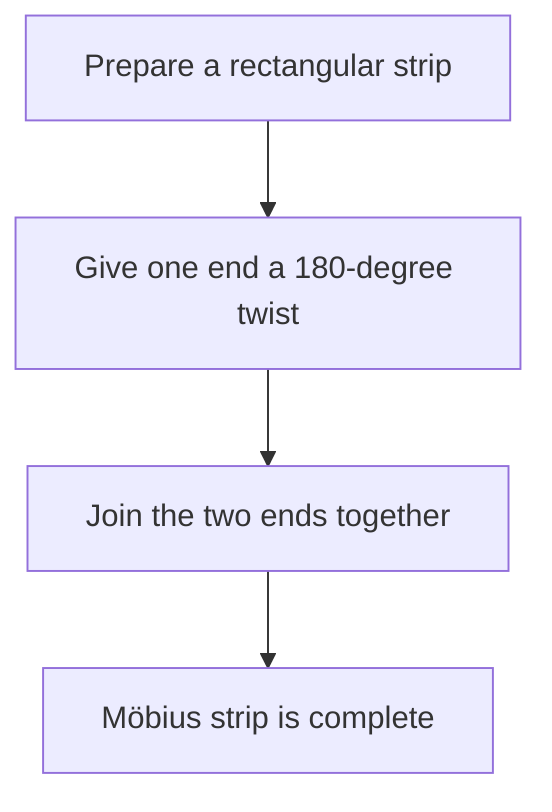
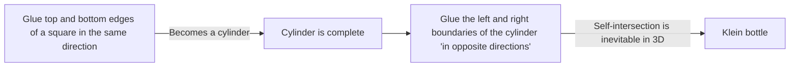

Many objects around us have an "inside and outside" or a "front and back". For example, a piece of paper has a front and a back, and a ball has an inside and an outside. However, in the field of mathematics known as **topology**, there are mysterious shapes where this intuition does not apply. These are known as "non-orientable" surfaces.

In this article, we will explain in detail the mathematical definitions, parametric representations, and properties of two representative examples: the **Möbius strip** and the **Klein bottle**.

## 1. What is Orientability?

In geometry and topology, a surface is "orientable" if you can consistently define concepts like "front and back" or "clockwise and counterclockwise" across the entire surface.

For example, a sphere and a torus (donut shape) are orientable surfaces. Imagine an ant walking on these surfaces. No matter how the ant moves and returns to its starting point, its own "up" and "down" will never be reversed.

On the other hand, on a non-orientable surface, if you complete a circuit along a certain path and return to the starting point, **"left and right" or "front and back" become reversed**. The Möbius strip and Klein bottle introduced below possess exactly this property.

## 2. The Möbius Strip

The Möbius strip was discovered independently in 1858 by German mathematicians August Ferdinand Möbius and Johann Benedict Listing.

### 2.1 Construction Method

You can easily create a Möbius strip by taking a rectangular strip of paper, giving it a single half-twist (180 degrees), and joining the two ends together.

### 2.2 Mathematical Representation (Parameterization)

The parametric representation of a Möbius strip in 3-dimensional [[Euclid](https://kenji.blog/en/p/euclid/)e](https://kenji.blog/p/euclid/)an space $\mathbb{R}^3$ is as follows. It is expressed using parameters $u$ and $v$.

$$
\begin{aligned}
x(u, v) &= \left( R + v \cos\left(\frac{u}{2}\right) \right) \cos(u) \\
y(u, v) &= \left( R + v \cos\left(\frac{u}{2}\right) \right) \sin(u) \\
z(u, v) &= v \sin\left(\frac{u}{2}\right)
\end{aligned}
$$

Here,
- $R$ is the radius of the central circle
- $u \in [0, 2\pi)$ is the angle around the strip
- $v \in [-w, w]$ is the range of half the width of the strip ($w$ is the half-width)

As you can see from the equation, when $u$ goes from $0$ to $2\pi$ (one full rotation), $u/2$ becomes $\pi$. Since $\cos(\pi) = -1$ and $\sin(\pi) = 0$, the sign of $v$ is inverted. This provides the mathematical backing for the fact that completing one circuit around the Möbius strip flips it inside out.

### 2.3 Interesting Properties

1. **Only One Boundary**: A normal strip (the side of a cylinder) has two boundaries (edges), an upper and a lower one. However, if you trace the edge of a Möbius strip with your finger, you will traverse the entire edge and return to your starting point. This means it has only one boundary, a single closed curve.
2. **Result of Cutting**: If you cut a Möbius strip in half along its center line with scissors, it does not become two separate strips; instead, it becomes one larger, doubly-twisted loop.

## 3. The Klein Bottle

While the Möbius strip is a surface with a boundary (edge), the **Klein bottle** is a "closed, non-orientable surface with no boundary". It was devised in 1882 by the German mathematician Felix Klein.

### 3.1 Conceptual Construction of the Klein Bottle

The Klein bottle is defined by gluing the opposite edges of a square in specific orientations.

In the language of topology, it is described using a fundamental polygon as follows:

$$
\text{Square with edges } a, b, a, b^{-1}
$$

This means edge $a$ is joined in the same direction, and edge $b$ is joined in the reverse direction.

### 3.2 Self-Intersection in 3-Dimensional Space

The Klein bottle is essentially a shape embedded in **4-dimensional space** ($\mathbb{R}^4$). Within a 4D space, it can be constructed without intersecting itself.

However, when we try to force a representation of the Klein bottle in the 3-dimensional space we live in, the "neck" of the bottle must pass through its own "wall" to go inside and connect to the base. This **self-intersection** is unavoidable.

### 3.3 Example of Parametric Representation (3D Projection)

Here is an example of the parametric equations for a figure-8 Klein bottle projected into 3-dimensional space.

$$
\begin{aligned}
x(u, v) &= \left( r + \cos\left(\frac{u}{2}\right) \sin(v) - \sin\left(\frac{u}{2}\right) \sin(2v) \right) \cos(u) \\
y(u, v) &= \left( r + \cos\left(\frac{u}{2}\right) \sin(v) - \sin\left(\frac{u}{2}\right) \sin(2v) \right) \sin(u) \\
z(u, v) &= \sin\left(\frac{u}{2}\right) \sin(v) + \cos\left(\frac{u}{2}\right) \sin(2v)
\end{aligned}
$$
($0 \le u < 2\pi$, $0 \le v < 2\pi$)

### 3.4 Relationship with the Möbius Strip

Surprisingly, if you cut a Klein bottle exactly in half along a specific plane, it splits into **two Möbius strips** (one right-handed Möbius strip and one left-handed Möbius strip).
Conversely, if you glue the boundaries of two Möbius strips together, you complete a Klein bottle.

## 4. Applications and Summary

The Möbius strip and the Klein bottle are not just mathematical puzzles.

- **Industrial Applications**: Conveyor belts shaped like a Möbius strip wear evenly on both sides, effectively doubling their lifespan. The same concept was used in continuous-loop cassette tapes.
- **Chemistry and Physics**: Molecules with the structure of a Möbius strip (Möbius aromaticity) have been synthesized.
- **Art and Culture**: They have been motifs in many works of art, such as M.C. Escher's woodcut "Möbius Strip II".

The counterintuitive property of having "no distinction between inside and outside" expands our spatial awareness and provides an opportunity to think deeply about the shape of the universe and higher-dimensional geometry. These mysterious surfaces revealed by topology truly symbolize the beauty and profundity of mathematics.
