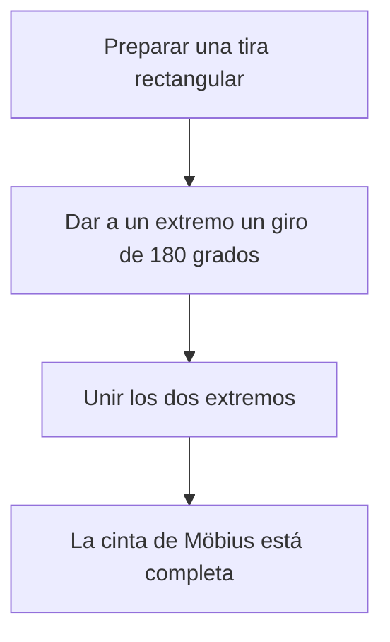
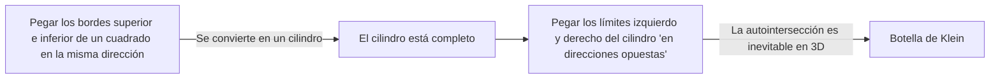

Muchos objetos a nuestro alrededor tienen un "adentro y afuera" o un "frente y revés". Por ejemplo, una hoja de papel tiene anverso y reverso, y una pelota tiene interior y exterior. Sin embargo, en la rama de las matemáticas conocida como **topología**, existen figuras misteriosas donde esta intuición no se aplica. Estas son conocidas como superficies "no orientables".

En este artículo, explicaremos detalladamente las definiciones matemáticas, representaciones paramétricas y propiedades de dos ejemplos representativos: la **cinta de Möbius** y la **botella de Klein**.

## 1. ¿Qué es la Orientabilidad?

En geometría y topología, una superficie es "orientable" si se pueden definir consistentemente conceptos como "frente y revés" o "sentido horario y antihorario" en toda la superficie.

Por ejemplo, una esfera y un toro (forma de rosquilla) son superficies orientables. Imagina una hormiga caminando sobre estas superficies. No importa cómo se mueva la hormiga y regrese a su punto de partida, su propio "arriba" y "abajo" nunca se invertirán.

Por otro lado, en una superficie no orientable, si completas un circuito a lo largo de un cierto camino y regresas al punto de partida, **"izquierda y derecha" o "frente y revés" se invierten**. La cinta de Möbius y la botella de Klein que presentamos a continuación poseen exactamente esta propiedad.

## 2. La Cinta de Möbius

La cinta de Möbius fue descubierta de forma independiente en 1858 por los matemáticos alemanes August Ferdinand Möbius y Johann Benedict Listing.

### 2.1 Método de Construcción

Puedes crear fácilmente una cinta de Möbius tomando una tira rectangular de papel, dándole media vuelta (180 grados) y uniendo los dos extremos.

### 2.2 Representación Matemática (Parametrización)

La representación paramétrica de una cinta de Möbius en un espacio euclidiano tridimensional $\mathbb{R}^3$ es la siguiente. Se expresa usando los parámetros $u$ y $v$.

$$
\begin{aligned}
x(u, v) &= \left( R + v \cos\left(\frac{u}{2}\right) \right) \cos(u) \\
y(u, v) &= \left( R + v \cos\left(\frac{u}{2}\right) \right) \sin(u) \\
z(u, v) &= v \sin\left(\frac{u}{2}\right)
\end{aligned}
$$

Aquí,
- $R$ es el radio del círculo central
- $u \in [0, 2\pi)$ es el ángulo alrededor de la cinta
- $v \in [-w, w]$ es el rango de la mitad del ancho de la cinta ($w$ es el semi-ancho)

Como puedes ver en la ecuación, cuando $u$ va de $0$ a $2\pi$ (una rotación completa), $u/2$ se convierte en $\pi$. Puesto que $\cos(\pi) = -1$ y $\sin(\pi) = 0$, el signo de $v$ se invierte. Esto proporciona el respaldo matemático para el hecho de que dar una vuelta completa alrededor de la cinta de Möbius la pone de adentro hacia afuera.

### 2.3 Propiedades Interesantes

1. **Un Solo Borde**: Una tira normal (el lado de un cilindro) tiene dos bordes (límites), uno superior y otro inferior. Sin embargo, si trazas el borde de una cinta de Möbius con tu dedo, recorrerás todo el borde y volverás a tu punto de partida. Esto significa que tiene solo un límite, una única curva cerrada.
2. **Resultado de Cortarla**: Si cortas una cinta de Möbius por la mitad a lo largo de su línea central con unas tijeras, no se convierte en dos tiras separadas; en su lugar, se convierte en un bucle más grande, torcido dos veces.

## 3. La Botella de Klein

Mientras que la cinta de Möbius es una superficie con un límite (borde), la **botella de Klein** es una "superficie cerrada, no orientable y sin límite". Fue ideada en 1882 por el matemático alemán Felix Klein.

### 3.1 Construcción Conceptual de la Botella de Klein

La botella de Klein se define pegando los bordes opuestos de un cuadrado en orientaciones específicas.

En el lenguaje de la topología, se describe utilizando un polígono fundamental de la siguiente manera:

$$
\text{Cuadrado con bordes } a, b, a, b^{-1}
$$

Esto significa que el borde $a$ se une en la misma dirección, y el borde $b$ se une en la dirección inversa.

### 3.2 Autointersección en el Espacio Tridimensional

La botella de Klein es esencialmente una figura incrustada en un **espacio de 4 dimensiones** ($\mathbb{R}^4$). Dentro de un espacio 4D, puede construirse sin cruzarse consigo misma.

Sin embargo, cuando intentamos forzar una representación de la botella de Klein en el espacio tridimensional en el que vivimos, el "cuello" de la botella debe atravesar su propia "pared" para entrar y conectarse a la base. Esta **autointersección** es inevitable.

### 3.3 Ejemplo de Representación Paramétrica (Proyección 3D)

Aquí hay un ejemplo de las ecuaciones paramétricas para una botella de Klein en forma de 8 proyectada en el espacio tridimensional.

$$
\begin{aligned}
x(u, v) &= \left( r + \cos\left(\frac{u}{2}\right) \sin(v) - \sin\left(\frac{u}{2}\right) \sin(2v) \right) \cos(u) \\
y(u, v) &= \left( r + \cos\left(\frac{u}{2}\right) \sin(v) - \sin\left(\frac{u}{2}\right) \sin(2v) \right) \sin(u) \\
z(u, v) &= \sin\left(\frac{u}{2}\right) \sin(v) + \cos\left(\frac{u}{2}\right) \sin(2v)
\end{aligned}
$$
($0 \le u < 2\pi$, $0 \le v < 2\pi$)

### 3.4 Relación con la Cinta de Möbius

Sorprendentemente, si cortas una botella de Klein exactamente por la mitad a lo largo de un plano específico, se divide en **dos cintas de Möbius** (una cinta de Möbius orientada a la derecha y otra orientada a la izquierda).
Por el contrario, si pegas los bordes de dos cintas de Möbius, completas una botella de Klein.

## 4. Aplicaciones y Resumen

La cinta de Möbius y la botella de Klein no son solo rompecabezas matemáticos.

- **Aplicaciones Industriales**: Las cintas transportadoras con forma de cinta de Möbius se desgastan uniformemente en ambos lados, duplicando efectivamente su vida útil. El mismo concepto se utilizaba en las cintas de casete de bucle continuo.
- **Química y Física**: Se han sintetizado moléculas con la estructura de una cinta de Möbius (aromaticidad de Möbius).
- **Arte y Cultura**: Han sido motivos en muchas obras de arte, como el grabado en madera de M.C. Escher "Cinta de Möbius II".

La propiedad contraintuitiva de "no tener distinción entre el interior y el exterior" amplía nuestra conciencia espacial y proporciona una oportunidad para pensar profundamente sobre la forma del universo y la geometría de dimensiones superiores. Estas misteriosas superficies reveladas por la topología simbolizan verdaderamente la belleza y la profundidad de las matemáticas.
