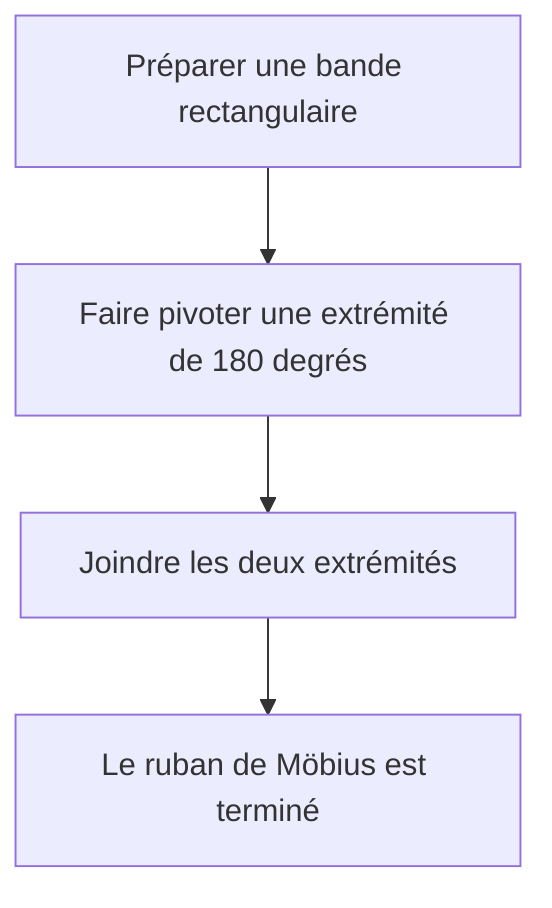
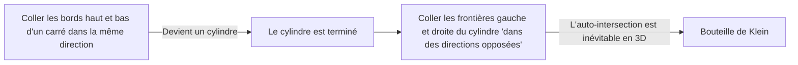

De nombreux objets qui nous entourent ont un "intérieur et un extérieur" ou un "endroit et un envers". Par exemple, une feuille de papier a un endroit et un envers, et une balle a un intérieur et un extérieur. Cependant, dans le domaine des mathématiques connu sous le nom de **topologie**, il existe des figures mystérieuses où cette intuition ne s'applique pas. Ce sont les surfaces dites "non orientables".

Dans cet article, nous expliquerons en détail les définitions mathématiques, les représentations paramétriques et les propriétés de deux exemples représentatifs : le **ruban de Möbius** et la **bouteille de Klein**.

## 1. Qu'est-ce que l'Orientabilité ?

En géométrie et en topologie, une surface est "orientable" si l'on peut définir de manière cohérente des concepts tels que "l'endroit et l'envers" ou "le sens des aiguilles d'une montre et le sens inverse" sur l'ensemble de la surface.

Par exemple, une sphère et un tore (forme de beignet) sont des surfaces orientables. Imaginez une fourmi marchant sur ces surfaces. Peu importe comment la fourmi se déplace et revient à son point de départ, son propre "haut" et "bas" ne seront jamais inversés.

En revanche, sur une surface non orientable, si vous effectuez un circuit le long d'un certain chemin et revenez au point de départ, **"la gauche et la droite" ou "l'endroit et l'envers" s'inversent**. Le ruban de Möbius et la bouteille de Klein présentés ci-dessous possèdent exactement cette propriété.

## 2. Le Ruban de Möbius

Le ruban de Möbius a été découvert indépendamment en 1858 par les mathématiciens allemands August Ferdinand Möbius et Johann Benedict Listing.

### 2.1 Méthode de Construction

Vous pouvez facilement créer un ruban de Möbius en prenant une bande de papier rectangulaire, en lui donnant un demi-tour (180 degrés) et en joignant les deux extrémités.

### 2.2 Représentation Mathématique (Paramétrisation)

La représentation paramétrique d'un ruban de Möbius dans un espace euclidien tridimensionnel $\mathbb{R}^3$ est la suivante. Elle est exprimée à l'aide des paramètres $u$ et $v$.

$$
\begin{aligned}
x(u, v) &= \left( R + v \cos\left(\frac{u}{2}\right) \right) \cos(u) \\
y(u, v) &= \left( R + v \cos\left(\frac{u}{2}\right) \right) \sin(u) \\
z(u, v) &= v \sin\left(\frac{u}{2}\right)
\end{aligned}
$$

Ici,
- $R$ est le rayon du cercle central
- $u \in [0, 2\pi)$ est l'angle autour du ruban
- $v \in [-w, w]$ est la plage de la moitié de la largeur du ruban ($w$ est la demi-largeur)

Comme vous pouvez le voir d'après l'équation, lorsque $u$ va de $0$ à $2\pi$ (une rotation complète), $u/2$ devient $\pi$. Puisque $\cos(\pi) = -1$ et $\sin(\pi) = 0$, le signe de $v$ est inversé. Cela fournit la base mathématique au fait que faire un tour complet autour du ruban de Möbius le retourne.

### 2.3 Propriétés Intéressantes

1. **Une Seule Frontière** : Une bande normale (le côté d'un cylindre) a deux frontières (bords), un bord supérieur et un bord inférieur. Cependant, si vous tracez le bord d'un ruban de Möbius avec votre doigt, vous parcourrez la totalité du bord et reviendrez à votre point de départ. Cela signifie qu'il n'a qu'une seule frontière, une courbe fermée unique.
2. **Résultat d'une Découpe** : Si vous coupez un ruban de Möbius en deux le long de sa ligne centrale avec des ciseaux, il ne devient pas deux bandes séparées ; au lieu de cela, il devient une boucle plus grande, doublement torsadée.

## 3. La Bouteille de Klein

Alors que le ruban de Möbius est une surface avec une frontière (un bord), la **bouteille de Klein** est une "surface fermée, non orientable et sans frontière". Elle a été conçue en 1882 par le mathématicien allemand Felix Klein.

### 3.1 Construction Conceptuelle de la Bouteille de Klein

La bouteille de Klein est définie en collant les bords opposés d'un carré dans des orientations spécifiques.

Dans le langage de la topologie, elle est décrite à l'aide d'un polygone fondamental comme suit :

$$
\text{Carré avec les bords } a, b, a, b^{-1}
$$

Cela signifie que le bord $a$ est joint dans la même direction, et le bord $b$ est joint dans la direction inverse.

### 3.2 Auto-Intersection dans l'Espace Tridimensionnel

La bouteille de Klein est fondamentalement une figure plongée dans un **espace à 4 dimensions** ($\mathbb{R}^4$). Dans un espace 4D, elle peut être construite sans s'intersecter elle-même.

Cependant, lorsque nous essayons de forcer une représentation de la bouteille de Klein dans l'espace tridimensionnel dans lequel nous vivons, le "cou" de la bouteille doit traverser sa propre "paroi" pour aller à l'intérieur et se connecter à la base. Cette **auto-intersection** est inévitable.

### 3.3 Exemple de Représentation Paramétrique (Projection 3D)

Voici un exemple des équations paramétriques pour une bouteille de Klein en forme de 8 projetée dans l'espace tridimensionnel.

$$
\begin{aligned}
x(u, v) &= \left( r + \cos\left(\frac{u}{2}\right) \sin(v) - \sin\left(\frac{u}{2}\right) \sin(2v) \right) \cos(u) \\
y(u, v) &= \left( r + \cos\left(\frac{u}{2}\right) \sin(v) - \sin\left(\frac{u}{2}\right) \sin(2v) \right) \sin(u) \\
z(u, v) &= \sin\left(\frac{u}{2}\right) \sin(v) + \cos\left(\frac{u}{2}\right) \sin(2v)
\end{aligned}
$$
($0 \le u < 2\pi$, $0 \le v < 2\pi$)

### 3.4 Relation avec le Ruban de Möbius

Étonnamment, si vous coupez une bouteille de Klein exactement en deux le long d'un plan spécifique, elle se divise en **deux rubans de Möbius** (un ruban de Möbius orienté à droite et un ruban orienté à gauche).
Inversement, si vous collez ensemble les frontières de deux rubans de Möbius, vous achevez une bouteille de Klein.

## 4. Applications et Résumé

Le ruban de Möbius et la bouteille de Klein ne sont pas que des puzzles mathématiques.

- **Applications Industrielles** : Les bandes transporteuses ayant la forme d'un ruban de Möbius s'usent uniformément des deux côtés, ce qui double effectivement leur durée de vie. Le même concept était utilisé dans les cassettes audio à boucle continue.
- **Chimie et Physique** : Des molécules ayant la structure d'un ruban de Möbius (aromaticité de Möbius) ont été synthétisées.
- **Art et Culture** : Ils ont été des motifs dans de nombreuses œuvres d'art, comme la gravure sur bois "Ruban de Möbius II" de M.C. Escher.

La propriété contre-intuitive de "ne pas avoir de distinction entre l'intérieur et l'extérieur" élargit notre conscience spatiale et offre une occasion de réfléchir profondément à la forme de l'univers et à la géométrie des dimensions supérieures. Ces surfaces mystérieuses révélées par la topologie symbolisent véritablement la beauté et la profondeur des mathématiques.
