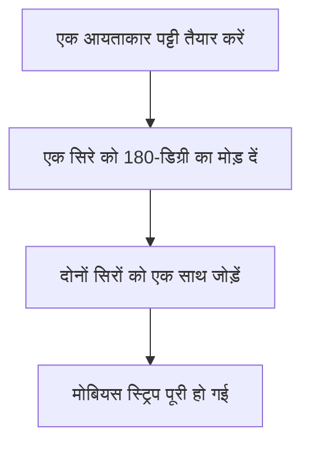
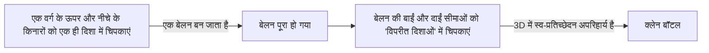

हमारे चारों ओर की कई वस्तुओं में "अंदर और बाहर" या "आगे और पीछे" होता है। उदाहरण के लिए, एक कागज के टुकड़े में आगे और पीछे होता है, और एक गेंद में अंदर और बाहर होता है। हालाँकि, गणित के उस क्षेत्र में जिसे **टोपोलॉजी** के रूप में जाना जाता है, रहस्यमय आकार होते हैं जहाँ यह अंतर्ज्ञान लागू नहीं होता है। इन्हें "गैर-अभिविन्यास" (non-orientable) सतहों के रूप में जाना जाता है।

इस लेख में, हम गणितीय परिभाषाओं, पैरामीट्रिक प्रतिनिधित्व और दो प्रतिनिधि उदाहरणों के गुणों को विस्तार से समझाएंगे: **मोबियस स्ट्रिप** और **क्लेन बॉटल**।

## 1. अभिविन्यास (Orientability) क्या है?

ज्यामिति और टोपोलॉजी में, एक सतह "अभिविन्यास" (orientable) होती है यदि आप पूरी सतह पर "आगे और पीछे" या "दक्षिणावर्त और वामावर्त" जैसी अवधारणाओं को लगातार परिभाषित कर सकते हैं।

उदाहरण के लिए, एक गोला और एक टोरस (डोनट आकार) अभिविन्यास सतहें हैं। इन सतहों पर चलने वाली एक चींटी की कल्पना करें। चींटी चाहे कैसे भी चले और अपने शुरुआती बिंदु पर वापस आ जाए, उसका अपना "ऊपर" और "नीचे" कभी उल्टा नहीं होगा।

दूसरी ओर, एक गैर-अभिविन्यास सतह पर, यदि आप एक निश्चित पथ के साथ एक चक्कर पूरा करते हैं और शुरुआती बिंदु पर वापस आते हैं, तो **"बाएं और दाएं" या "आगे और पीछे" उलट जाते हैं**। नीचे प्रस्तुत [मोबियस स्ट्रिप और क्लेन बॉटल](https://kenji.blog/hi/p/mobius-strip-and-klein-bottle/) में ठीक यही गुण है।

## 2. मोबियस स्ट्रिप

मोबियस स्ट्रिप की खोज 1858 में स्वतंत्र रूप से जर्मन गणितज्ञों अगस्त फर्डिनेंड मोबियस और जोहान बेनेडिक्ट लिस्टिंग ने की थी।

### 2.1 निर्माण विधि

आप कागज की एक आयताकार पट्टी लेकर, उसे एक आधा मोड़ (180 डिग्री) देकर, और दोनों सिरों को एक साथ जोड़कर आसानी से एक मोबियस स्ट्रिप बना सकते हैं।

### 2.2 गणितीय प्रतिनिधित्व (पैरामीटराइजेशन)

3-आयामी [यूक्लिड](https://kenji.blog/hi/p/euclid/)ियन अंतरिक्ष $\mathbb{R}^3$ में मोबियस स्ट्रिप का पैरामीट्रिक प्रतिनिधित्व इस प्रकार है। इसे पैरामीटर $u$ और $v$ का उपयोग करके व्यक्त किया जाता है।

$$
\begin{aligned}
x(u, v) &= \left( R + v \cos\left(\frac{u}{2}\right) \right) \cos(u) \\
y(u, v) &= \left( R + v \cos\left(\frac{u}{2}\right) \right) \sin(u) \\
z(u, v) &= v \sin\left(\frac{u}{2}\right)
\end{aligned}
$$

यहाँ,
- $R$ केंद्रीय वृत्त की त्रिज्या है
- $u \in [0, 2\pi)$ पट्टी के चारों ओर का कोण है
- $v \in [-w, w]$ पट्टी की आधी चौड़ाई की सीमा है ($w$ आधी चौड़ाई है)

जैसा कि आप समीकरण से देख सकते हैं, जब $u$, $0$ से $2\pi$ तक जाता है (एक पूर्ण घूर्णन), $u/2$, $\pi$ बन जाता है। चूंकि $\cos(\pi) = -1$ और $\sin(\pi) = 0$ है, इसलिए $v$ का चिह्न उलट जाता है। यह इस तथ्य के लिए गणितीय समर्थन प्रदान करता है कि मोबियस स्ट्रिप के चारों ओर एक चक्कर पूरा करने पर यह अंदर से बाहर की ओर पलट जाती है।

### 2.3 रोचक गुण

1. **केवल एक सीमा**: एक सामान्य पट्टी (एक बेलन का किनारा) की दो सीमाएं (किनारे) होती हैं, एक ऊपर और एक नीचे। हालाँकि, यदि आप अपनी उंगली से मोबियस स्ट्रिप के किनारे का पता लगाते हैं, तो आप पूरे किनारे को पार कर लेंगे और अपने शुरुआती बिंदु पर वापस आ जाएंगे। इसका मतलब है कि इसकी केवल एक सीमा है, एक एकल बंद वक्र।
2. **काटने का परिणाम**: यदि आप मोबियस स्ट्रिप को कैंची से उसकी केंद्र रेखा के साथ आधा काटते हैं, तो यह दो अलग-अलग पट्टियाँ नहीं बनती है; इसके बजाय, यह एक बड़ा, दो बार मुड़ा हुआ लूप बन जाता है।

## 3. क्लेन बॉटल

जबकि मोबियस स्ट्रिप एक सीमा (किनारे) वाली सतह है, **क्लेन बॉटल** एक "बिना सीमा वाली बंद, गैर-अभिविन्यास सतह" है। इसे 1882 में जर्मन गणितज्ञ फेलिक्स क्लेन द्वारा तैयार किया गया था।

### 3.1 क्लेन बॉटल का वैचारिक निर्माण

क्लेन बॉटल को एक वर्ग के विपरीत किनारों को विशिष्ट दिशाओं में चिपकाकर परिभाषित किया गया है।

टोपोलॉजी की भाषा में, इसे मूलभूत बहुभुज का उपयोग करके निम्नानुसार वर्णित किया गया है:

$$
\text{किनारों वाला वर्ग } a, b, a, b^{-1}
$$

इसका मतलब है कि किनारा $a$ उसी दिशा में जुड़ा हुआ है, और किनारा $b$ विपरीत दिशा में जुड़ा हुआ है।

### 3.2 3-आयामी अंतरिक्ष में स्व-प्रतिच्छेदन

क्लेन बॉटल अनिवार्य रूप से **4-आयामी अंतरिक्ष** ($\mathbb{R}^4$) में एम्बेडेड एक आकार है। 4D अंतरिक्ष के भीतर, इसका निर्माण बिना स्वयं को प्रतिच्छेद किए किया जा सकता है।

हालाँकि, जब हम 3-आयामी अंतरिक्ष में क्लेन बॉटल के प्रतिनिधित्व को मजबूर करने का प्रयास करते हैं जिसमें हम रहते हैं, तो बॉटल की "गर्दन" को आधार से जुड़ने के लिए अंदर जाने हेतु अपनी "दीवार" से गुजरना पड़ता है। यह **स्व-प्रतिच्छेदन** (self-intersection) अपरिहार्य है।

### 3.3 पैरामीट्रिक प्रतिनिधित्व का उदाहरण (3D प्रक्षेप)

यहाँ 3-आयामी अंतरिक्ष में प्रक्षेपित फिगर-8 क्लेन बॉटल के लिए पैरामीट्रिक समीकरणों का एक उदाहरण दिया गया है।

$$
\begin{aligned}
x(u, v) &= \left( r + \cos\left(\frac{u}{2}\right) \sin(v) - \sin\left(\frac{u}{2}\right) \sin(2v) \right) \cos(u) \\
y(u, v) &= \left( r + \cos\left(\frac{u}{2}\right) \sin(v) - \sin\left(\frac{u}{2}\right) \sin(2v) \right) \sin(u) \\
z(u, v) &= \sin\left(\frac{u}{2}\right) \sin(v) + \cos\left(\frac{u}{2}\right) \sin(2v)
\end{aligned}
$$
($0 \le u < 2\pi$, $0 \le v < 2\pi$)

### 3.4 मोबियस स्ट्रिप के साथ संबंध

आश्चर्यजनक रूप से, यदि आप क्लेन बॉटल को एक विशिष्ट तल के साथ बिल्कुल आधा काटते हैं, तो यह **दो मोबियस स्ट्रिप्स** (एक दाएं हाथ की मोबियस स्ट्रिप और एक बाएं हाथ की मोबियस स्ट्रिप) में विभाजित हो जाती है।
इसके विपरीत, यदि आप दो मोबियस स्ट्रिप्स की सीमाओं को एक साथ चिपकाते हैं, तो आप एक क्लेन बॉटल पूरी करते हैं।

## 4. अनुप्रयोग और सारांश

[मोबियस स्ट्रिप और क्लेन बॉटल](https://kenji.blog/hi/p/mobius-strip-and-klein-bottle/) केवल गणितीय पहेलियाँ नहीं हैं।

- **औद्योगिक अनुप्रयोग**: मोबियस स्ट्रिप के आकार के कन्वेयर बेल्ट दोनों तरफ समान रूप से घिसते हैं, जो प्रभावी रूप से उनके जीवनकाल को दोगुना कर देता है। निरंतर-लूप कैसेट टेप में भी इसी अवधारणा का उपयोग किया गया था।
- **रसायन विज्ञान और भौतिकी**: मोबियस स्ट्रिप (मोबियस एरोमेटिसिटी) की संरचना वाले अणुओं को संश्लेषित किया गया है।
- **कला और संस्कृति**: वे कई कलाकृतियों में रूपांकन रहे हैं, जैसे कि एम.सी. एस्चर का वुडकट "मोबियस स्ट्रिप II"।

"अंदर और बाहर के बीच कोई भेद न होने" का प्रति-सहज गुण हमारी स्थानिक जागरूकता का विस्तार करता है और ब्रह्मांड के आकार और उच्च-आयामी ज्यामिति के बारे में गहराई से सोचने का अवसर प्रदान करता है। टोपोलॉजी द्वारा प्रकट की गई ये रहस्यमय सतहें वास्तव में गणित की सुंदरता और गहराई का प्रतीक हैं।
