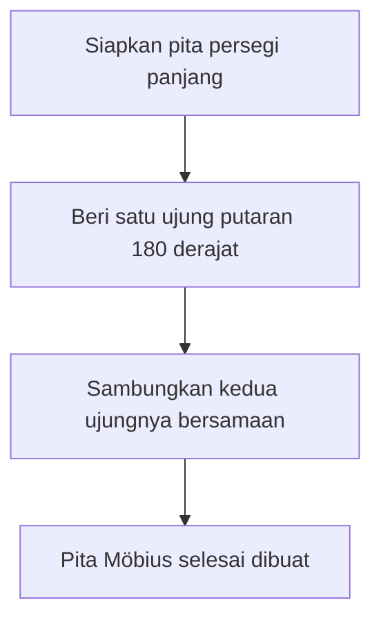
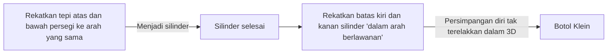

Banyak benda di sekitar kita memiliki "bagian dalam dan luar" atau "bagian depan dan belakang". Misalnya, selembar kertas memiliki bagian depan dan belakang, dan bola memiliki bagian dalam dan luar. Namun, dalam bidang matematika yang dikenal sebagai **topologi**, ada bentuk-bentuk misterius di mana intuisi ini tidak berlaku. Ini dikenal sebagai permukaan "tak terorientasi".

Dalam artikel ini, kita akan menjelaskan secara rinci definisi matematika, representasi parametrik, dan sifat dari dua contoh yang representatif: **pita Möbius** dan **botol Klein**.

## 1. Apa itu Orientabilitas?

Dalam geometri dan topologi, sebuah permukaan bersifat "dapat diorientasikan" jika Anda dapat secara konsisten mendefinisikan konsep seperti "depan dan belakang" atau "searah jarum jam dan berlawanan arah jarum jam" di seluruh permukaan.

Misalnya, bola dan torus (bentuk donat) adalah permukaan yang dapat diorientasikan. Bayangkan seekor semut berjalan di permukaan ini. Tidak peduli bagaimana semut itu bergerak dan kembali ke titik awalnya, orientasi "atas" dan "bawah" dirinya sendiri tidak akan pernah terbalik.

Di sisi lain, pada permukaan yang tak terorientasi, jika Anda menyelesaikan suatu sirkuit di sepanjang jalur tertentu dan kembali ke titik awal, **"kiri dan kanan" atau "depan dan belakang" menjadi terbalik**. Pita Möbius dan botol Klein yang diperkenalkan di bawah ini memiliki sifat yang persis seperti ini.

## 2. Pita Möbius

Pita Möbius ditemukan secara independen pada tahun 1858 oleh ahli matematika Jerman August Ferdinand Möbius dan Johann Benedict Listing.

### 2.1 Metode Konstruksi

Anda dapat dengan mudah membuat pita Möbius dengan mengambil secarik kertas persegi panjang, memutarnya setengah putaran (180 derajat), dan menyambungkan kedua ujungnya.

### 2.2 Representasi Matematika (Parameterisasi)

Representasi parametrik pita Möbius dalam ruang [[Euclid](https://kenji.blog/id/p/euclid/)e](https://kenji.blog/p/euclid/)an 3 dimensi $\mathbb{R}^3$ adalah sebagai berikut. Ia dinyatakan menggunakan parameter $u$ dan $v$.

$$
\begin{aligned}
x(u, v) &= \left( R + v \cos\left(\frac{u}{2}\right) \right) \cos(u) \\
y(u, v) &= \left( R + v \cos\left(\frac{u}{2}\right) \right) \sin(u) \\
z(u, v) &= v \sin\left(\frac{u}{2}\right)
\end{aligned}
$$

Di sini,
- $R$ adalah jari-jari lingkaran tengah
- $u \in [0, 2\pi)$ adalah sudut di sekitar pita
- $v \in [-w, w]$ adalah rentang setengah lebar pita ($w$ adalah setengah lebar)

Seperti yang bisa Anda lihat dari persamaan tersebut, ketika $u$ bergerak dari $0$ hingga $2\pi$ (satu putaran penuh), $u/2$ menjadi $\pi$. Karena $\cos(\pi) = -1$ dan $\sin(\pi) = 0$, tanda dari $v$ dibalik. Ini memberikan dukungan matematika untuk fakta bahwa menyelesaikan satu putaran di sekitar pita Möbius akan membaliknya dari dalam ke luar.

### 2.3 Sifat-Sifat Menarik

1. **Hanya Satu Batas**: Pita normal (sisi silinder) memiliki dua batas (tepi), bagian atas dan bawah. Namun, jika Anda menelusuri tepi pita Möbius dengan jari Anda, Anda akan melintasi seluruh tepi dan kembali ke titik awal Anda. Ini berarti ia hanya memiliki satu batas, sebuah kurva tertutup tunggal.
2. **Hasil Pemotongan**: Jika Anda memotong pita Möbius menjadi dua di sepanjang garis tengahnya dengan gunting, ia tidak menjadi dua pita terpisah; sebaliknya, ia menjadi satu putaran yang lebih besar dan terpelintir dua kali.

## 4. Botol Klein

Sementara pita Möbius adalah permukaan dengan batas (tepi), **botol Klein** adalah "permukaan tertutup, tak terorientasi tanpa batas". Ia dirancang pada tahun 1882 oleh ahli matematika Jerman Felix Klein.

### 3.1 Konstruksi Konseptual Botol Klein

Botol Klein didefinisikan dengan merekatkan tepi-tepi persegi yang berlawanan dalam orientasi tertentu.

Dalam bahasa topologi, ia dijelaskan menggunakan poligon fundamental sebagai berikut:

$$
\text{Persegi dengan tepi } a, b, a, b^{-1}
$$

Ini berarti tepi $a$ disambungkan dalam arah yang sama, dan tepi $b$ disambungkan dalam arah sebaliknya.

### 3.2 Persimpangan Diri dalam Ruang 3 Dimensi

Botol Klein pada dasarnya adalah bentuk yang tertanam dalam **ruang 4 dimensi** ($\mathbb{R}^4$). Di dalam ruang 4D, ia dapat dikonstruksi tanpa berpotongan dengan dirinya sendiri.

Namun, ketika kita mencoba memaksakan representasi botol Klein di ruang 3 dimensi tempat kita tinggal, "leher" botol itu harus menembus "dinding"-nya sendiri untuk masuk ke dalam dan terhubung ke alasnya. **Persimpangan diri** ini tak terelakkan.

### 3.3 Contoh Representasi Parametrik (Proyeksi 3D)

Berikut adalah contoh persamaan parametrik untuk botol Klein angka-8 yang diproyeksikan ke ruang tiga dimensi.

$$
\begin{aligned}
x(u, v) &= \left( r + \cos\left(\frac{u}{2}\right) \sin(v) - \sin\left(\frac{u}{2}\right) \sin(2v) \right) \cos(u) \\
y(u, v) &= \left( r + \cos\left(\frac{u}{2}\right) \sin(v) - \sin\left(\frac{u}{2}\right) \sin(2v) \right) \sin(u) \\
z(u, v) &= \sin\left(\frac{u}{2}\right) \sin(v) + \cos\left(\frac{u}{2}\right) \sin(2v)
\end{aligned}
$$
($0 \le u < 2\pi$, $0 \le v < 2\pi$)

### 3.4 Hubungan dengan Pita Möbius

Hebatnya, jika Anda memotong botol Klein tepat di tengah sepanjang bidang tertentu, ia membelah menjadi **dua pita Möbius** (satu pita Möbius kidal dan satu pita Möbius kanan).
Sebaliknya, jika Anda merekatkan batas dua pita Möbius bersama-sama, Anda melengkapi botol Klein.

## 4. Aplikasi dan Ringkasan

Pita Möbius dan botol Klein bukan sekadar teka-teki matematika.

- **Aplikasi Industri**: Sabuk konveyor yang berbentuk pita Möbius aus secara merata di kedua sisinya, secara efektif menggandakan umurnya. Konsep yang sama digunakan pada kaset pita loop kontinu.
- **Kimia dan Fisika**: Molekul dengan struktur pita Möbius (aromatisitas Möbius) telah disintesis.
- **Seni dan Budaya**: Mereka telah menjadi motif dalam banyak karya seni, seperti ukiran kayu M.C. Escher "Möbius Strip II".

Sifat berlawanan dengan intuisi yaitu "tidak memiliki perbedaan antara dalam dan luar" memperluas kesadaran spasial kita dan memberikan kesempatan untuk berpikir secara mendalam tentang bentuk alam semesta dan geometri dimensi yang lebih tinggi. Permukaan misterius ini yang diungkapkan oleh topologi benar-benar melambangkan keindahan dan kedalaman matematika.
