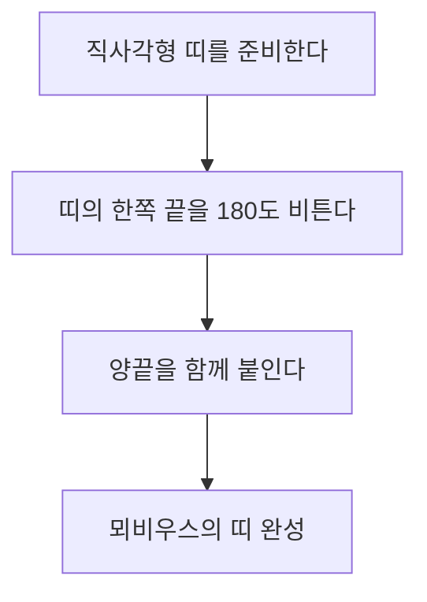

우리의 주변에 있는 많은 물체에는 "안쪽과 바깥쪽" 또는 "앞면과 뒷면"이 존재합니다. 예를 들어, 종이에는 앞면과 뒷면이 있고 공에는 안쪽과 바깥쪽이 있습니다. 하지만 수학의 한 분야인 **위상수학**(토폴로지)의 세계에는 이러한 직관이 통하지 않는 신비한 도형이 존재합니다. 그것이 바로 '방향을 정할 수 없는(non-orientable)' 곡면입니다.

본 기사에서는 그 대표적인 예인 **뫼비우스의 띠**(Möbius strip)와 **클라인의 병**(Klein bottle)에 대하여 수학적 정의, 매개변수 표현, 그리고 그 성질을 자세히 해설합니다.

## 1. 방향성(Orientability)이란 무엇인가?

기하학과 위상수학에서 '방향을 정할 수 있다'는 것은 곡면 전체에 걸쳐 '앞면과 뒷면' 또는 '시계 방향과 반시계 방향'이라는 개념을 일관되게 정의할 수 있음을 의미합니다.

예를 들어 구면이나 토러스(도넛 모양)는 방향을 정할 수 있는 곡면입니다. 이 표면 위를 걷는 개미를 상상해 보십시오. 개미가 표면을 어떻게 이동하여 원래의 위치로 돌아오더라도 개미 자신의 '위'와 '아래'가 역전되는 일은 결코 없습니다.

반면에 방향을 정할 수 없는 곡면에서는 어떤 경로를 한 바퀴 돌아 원래의 위치로 돌아오면 **'왼쪽과 오른쪽'이나 '앞면과 뒷면'이 반전**되어 버립니다. 앞으로 소개할 [뫼비우스의 띠와 클라인의 병](https://kenji.blog/ko/p/mobius-strip-and-klein-bottle/)은 바로 이러한 성질을 가지고 있습니다.

## 2. 뫼비우스의 띠 (Möbius Strip)

뫼비우스의 띠는 1858년에 독일의 수학자 아우구스트 페르디난트 뫼비우스와 요한 베네딕트 리스팅이 각각 독립적으로 발견했습니다.

### 2.1 구성 방법

뫼비우스의 띠는 직사각형의 종이 띠를 한 번(180도) 비틀어서 양끝을 붙임으로써 쉽게 만들 수 있습니다.

### 2.2 수학적 표현 (매개변수 표시)

3차원 [유클리드](https://kenji.blog/ko/p/euclid/) 공간 $\mathbb{R}^3$에서 뫼비우스의 띠의 매개변수 표시는 다음과 같습니다. 매개변수 $u$와 $v$를 사용하여 나타냅니다.

$$
\begin{aligned}
x(u, v) &= \left( R + v \cos\left(\frac{u}{2}\right) \right) \cos(u) \\
y(u, v) &= \left( R + v \cos\left(\frac{u}{2}\right) \right) \sin(u) \\
z(u, v) &= v \sin\left(\frac{u}{2}\right)
\end{aligned}
$$

여기서,
- $R$은 중심이 되는 원의 반지름
- $u \in [0, 2\pi)$는 띠를 한 바퀴 도는 각도
- $v \in [-w, w]$는 띠의 폭의 절반 범위($w$는 반폭)

수식을 보면 알 수 있듯이, $u$가 $0$에서 $2\pi$까지 변하면(한 바퀴 돌면) $u/2$는 $\pi$가 됩니다. $\cos(\pi) = -1, \sin(\pi) = 0$이 되므로 $v$의 부호가 반전됩니다. 이것이 뫼비우스의 띠를 한 바퀴 돌면 뒤집힌다는 수학적 뒷받침입니다.

### 2.3 흥미로운 성질

1. **경계가 하나뿐이다**: 일반적인 띠(원기둥의 옆면)는 위와 아래라는 2개의 경계(가장자리)를 가지지만, 뫼비우스의 띠의 가장자리를 손가락으로 따라가 보면 가장자리 전체를 돌아 원래 위치로 되돌아옵니다. 즉, 경계는 단 하나의 폐곡선뿐입니다.
2. **잘랐을 때의 결과**: 뫼비우스의 띠를 가운데 선을 따라 가위로 자르면 2개의 띠가 되지 않고, 2번 비틀어진 하나의 큰 고리가 됩니다.

## 3. 클라인의 병 (Klein Bottle)

뫼비우스의 띠는 경계(가장자리)를 가지는 곡면이었지만, **클라인의 병**은 '경계를 가지지 않는(닫힌) 단방향 곡면'입니다. 1882년에 독일의 수학자 펠릭스 클라인에 의해 고안되었습니다.

### 3.1 클라인의 병의 개념적 구성

클라인의 병은 사각형의 마주 보는 변을 특정 방향으로 붙임으로써 정의됩니다.

위상수학의 용어로 말하자면 기본 다각형을 이용하여 다음과 같이 나타납니다.

$$
\text{모서리가 } a, b, a, b^{-1} \text{인 정사각형}
$$

즉, 변 $a$는 같은 방향으로, 변 $b$는 반대 방향으로 붙입니다.

### 3.2 3차원 공간에서의 자기 교차

클라인의 병은 본래 **4차원 공간**($\mathbb{R}^4$)에 매립되는 도형입니다. 4차원 공간 안이라면 자기 자신과 교차하지 않고 구성할 수 있습니다.

하지만 우리가 살고 있는 3차원 공간에 클라인의 병을 무리하게 표현하려고 하면 병의 '목' 부분이 자기 자신의 '벽'을 뚫고 안쪽으로 들어가 바닥면과 연결된다는 **자기 교차**(self-intersection)를 피할 수 없습니다.

### 3.3 매개변수 표시의 예 (3차원 투영)

3차원 공간에 투영된 클라인의 병(Figure-8 Klein bottle)의 매개변수 표시의 한 가지 예를 제시합니다.

$$
\begin{aligned}
x(u, v) &= \left( r + \cos\left(\frac{u}{2}\right) \sin(v) - \sin\left(\frac{u}{2}\right) \sin(2v) \right) \cos(u) \\
y(u, v) &= \left( r + \cos\left(\frac{u}{2}\right) \sin(v) - \sin\left(\frac{u}{2}\right) \sin(2v) \right) \sin(u) \\
z(u, v) &= \sin\left(\frac{u}{2}\right) \sin(v) + \cos\left(\frac{u}{2}\right) \sin(2v)
\end{aligned}
$$
($0 \le u < 2\pi$, $0 \le v < 2\pi$)

### 3.4 뫼비우스의 띠와의 관계

사실 클라인의 병을 특정 평면으로 정확히 반으로 자르면 **두 개의 뫼비우스의 띠**로 나뉩니다(오른쪽으로 꼬인 뫼비우스의 띠와 왼쪽으로 꼬인 뫼비우스의 띠가 하나씩 생깁니다).
역으로 말하면, 두 개의 뫼비우스의 띠의 경계끼리 붙이면 클라인의 병이 완성됩니다.

## 4. 응용 및 요약

뫼비우스의 띠나 클라인의 병은 단순한 수학적 퍼즐이 아닙니다.

- **공업적 응용**: 뫼비우스의 띠 모양을 한 컨베이어 벨트는 양면이 균등하게 마모되기 때문에 수명이 두 배가 됩니다. 카세트 테이프의 엔드리스 루프에도 사용되었습니다.
- **화학・물리학**: 뫼비우스의 띠 구조를 가지는 분자(뫼비우스 방향족성)가 합성되었습니다.
- **예술과 문화**: M.C. 에셔의 판화 '뫼비우스의 띠 II' 등 많은 예술 작품의 모티프가 되었습니다.

'안과 밖의 구별이 없다'는 직관에 반하는 성질은 우리의 공간 인식을 확장시키고 우주의 형태나 고차원의 기하학에 대하여 깊이 생각할 수 있는 계기를 마련해 줍니다. 위상수학이 밝혀내는 이러한 신비한 곡면들은 수학의 아름다움과 심오함을 상징한다고 할 수 있을 것입니다.
