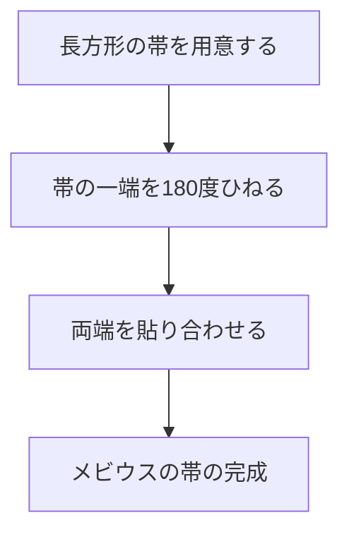

私たちの身の回りにある多くの物体には、「内側と外側」や「表と裏」が存在します。例えば、紙には表と裏があり、ボールには内側と外側があります。しかし、数学の分野の一つである **位相幾何学** （トポロジー）の世界には、このような直感が通用しない不思議な図形が存在します。それが「非向き付け可能（non-orientable）」な曲面です。

本記事では、その代表例である **メビウスの帯** （Möbius strip）と **クラインの壺** （Klein bottle）について、数学的な定義、パラメータ表示、そしてその性質について詳しく解説します。

## 1. 向き付け可能性（Orientability）とは何か？

幾何学やトポロジーにおいて、「向き付け可能」であるとは、曲面上で一貫した「表と裏」や「時計回りと反時計回り」の概念を定義できることを意味します。

例えば、球面やトーラス（ドーナツ型）は向き付け可能な曲面です。これらの表面を歩くアリを想像してください。アリが表面をどのように移動して元の場所に戻ってきても、アリ自身の「上」と「下」が逆転することはありません。

一方、非向き付け可能な曲面では、ある経路を一周して元の場所に戻ってくると、**「左と右」や「表と裏」が反転** してしまいます。これから紹介するメビウスの帯とクラインの壺は、まさにこの性質を持っています。

## 2. メビウスの帯（Möbius Strip）

メビウスの帯は、1858年にドイツの数学者アウグスト・フェルディナント・メビウス（August Ferdinand Möbius）とヨハン・ベネディクト・リスティング（Johann Benedict Listing）によって独立に発見されました。

### 2.1 構成方法

メビウスの帯は、長方形の紙の帯を1回（180度）ひねって、両端を貼り合わせることで簡単に作ることができます。

### 2.2 数学的表現（パラメータ表示）

3次元ユークリッド空間 $\mathbb{R}^3$ におけるメビウスの帯のパラメータ表示は、以下のようになります。パラメータ $u$ と $v$ を用いて表します。

$$
\begin{aligned}
x(u, v) &= \left( R + v \cos\left(\frac{u}{2}\right) \right) \cos(u) \\
y(u, v) &= \left( R + v \cos\left(\frac{u}{2}\right) \right) \sin(u) \\
z(u, v) &= v \sin\left(\frac{u}{2}\right)
\end{aligned}
$$

ここで、
- $R$ は中心となる円の半径
- $u \in [0, 2\pi)$ は帯を一周する角度
- $v \in [-w, w]$ は帯の幅の半分の範囲（$w$ は帯の半幅）

式を見るとわかるように、$u$ が $0$ から $2\pi$ まで変化する（一周する）と、$u/2$ は $\pi$ になります。$\cos(\pi) = -1, \sin(\pi) = 0$ となり、$v$ の符号が反転します。これが、メビウスの帯を一周すると裏返るという数学的な裏付けです。

### 2.3 興味深い性質

1. **境界が1つしかない**：通常の帯（円柱の側面）は上と下の2つの境界（縁）を持ちますが、メビウスの帯の縁を指でなぞっていくと、縁全体を一周して元の位置に戻ります。つまり、境界は1つの閉曲線のみです。
2. **切断したときの結果**：メビウスの帯を中央の線に沿ってハサミで切ると、2つの帯にはならず、2回ひねられた1つの大きな輪になります。

## 3. クラインの壺（Klein Bottle）

メビウスの帯は境界（縁）を持つ曲面でしたが、**クラインの壺** は「境界を持たない（閉じた）非向き付け可能曲面」です。1882年にドイツの数学者フェリックス・クライン（Felix Klein）によって考案されました。

### 3.1 クラインの壺の概念的構成

クラインの壺は、四角形の向かい合う辺を特定の向きで貼り合わせることで定義されます。

トポロジーの言葉で言えば、基本多角形（fundamental polygon）を用いて以下のように表されます。

$$
\text{Square with edges } a, b, a, b^{-1}
$$

つまり、辺 $a$ は同じ向きに、辺 $b$ は逆向きに貼り合わせます。

### 3.2 3次元空間における自己交差

クラインの壺は本来 **4次元空間**（$\mathbb{R}^4$）に埋め込まれる図形です。4次元空間内であれば、自分自身と交差することなく構成できます。

しかし、私たちが生きている3次元空間にクラインの壺を無理やり表現しようとすると、壺の「首」の部分が自分自身の「壁」を突き抜けて内側に入り込み、底面と繋がるという **自己交差** （self-intersection）が避けられません。

### 3.3 パラメータ表示の一例（3次元投影）

3次元空間に投影されたクラインの壺（Figure-8 Klein bottle）のパラメータ表示の一例を挙げます。

$$
\begin{aligned}
x(u, v) &= \left( r + \cos\left(\frac{u}{2}\right) \sin(v) - \sin\left(\frac{u}{2}\right) \sin(2v) \right) \cos(u) \\
y(u, v) &= \left( r + \cos\left(\frac{u}{2}\right) \sin(v) - \sin\left(\frac{u}{2}\right) \sin(2v) \right) \sin(u) \\
z(u, v) &= \sin\left(\frac{u}{2}\right) \sin(v) + \cos\left(\frac{u}{2}\right) \sin(2v)
\end{aligned}
$$
($0 \le u < 2\pi$, $0 \le v < 2\pi$)

### 3.4 メビウスの帯との関係

実は、クラインの壺を特定の平面でスパッと半分に切断すると、**2つのメビウスの帯** に分かれます（右巻きのメビウスの帯と左巻きのメビウスの帯が1つずつできます）。
逆に言えば、2つのメビウスの帯の境界同士を貼り合わせると、クラインの壺が完成します。

## 4. 応用とまとめ

メビウスの帯やクラインの壺は、単なる数学的パズルではありません。

- **工業的応用**：メビウスの帯の形状を持つコンベアベルトは、両面が均等に摩耗するため、寿命が2倍になります。カセットテープのエンドレスループにも使われていました。
- **化学・物理学**：メビウスの帯の構造を持つ分子（メビウス芳香族性）が合成されています。
- **芸術と文化**：M.C.エッシャーの版画「メビウスの帯」など、多くの芸術作品のモチーフとなっています。

「表と裏の区別がない」という非直感的な性質は、私たちの空間認識を拡張し、宇宙の形状や高次元の幾何学について深く考えるきっかけを与えてくれます。位相幾何学が解き明かすこれらの不思議な曲面は、数学の美しさと深遠さを象徴していると言えるでしょう。
