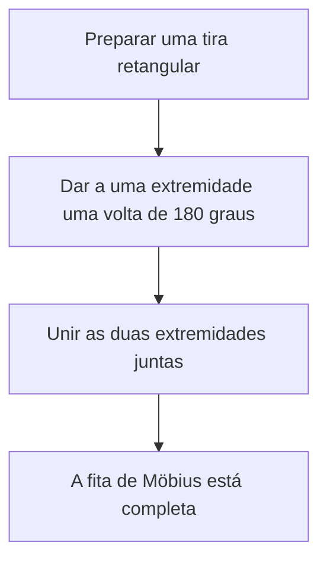
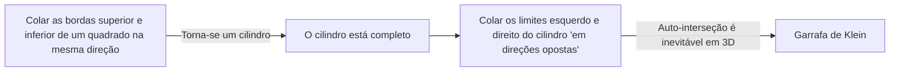

Muitos objetos ao nosso redor têm um "dentro e fora" ou uma "frente e verso". Por exemplo, um pedaço de papel tem frente e verso, e uma bola tem um interior e um exterior. No entanto, no campo da matemática conhecido como **topologia**, existem formas misteriosas onde essa intuição não se aplica. Estas são conhecidas como superfícies "não orientáveis".

Neste artigo, explicaremos em detalhes as definições matemáticas, representações paramétricas e propriedades de dois exemplos representativos: a **fita de Möbius** e a **garrafa de Klein**.

## 1. O que é Orientabilidade?

Em geometria e topologia, uma superfície é "orientável" se você puder definir consistentemente conceitos como "frente e verso" ou "sentido horário e anti-horário" em toda a superfície.

Por exemplo, uma esfera e um toro (forma de rosca) são superfícies orientáveis. Imagine uma formiga andando nessas superfícies. Não importa como a formiga se mova e retorne ao seu ponto de partida, o seu próprio "em cima" e "embaixo" nunca serão invertidos.

Por outro lado, em uma superfície não orientável, se você completar um circuito ao longo de um determinado caminho e retornar ao ponto de partida, **"esquerda e direita" ou "frente e verso" se invertem**. A fita de Möbius e a garrafa de Klein introduzidas abaixo possuem exatamente essa propriedade.

## 2. A Fita de Möbius

A fita de Möbius foi descoberta independentemente em 1858 pelos matemáticos alemães August Ferdinand Möbius e Johann Benedict Listing.

### 2.1 Método de Construção

Você pode criar facilmente uma fita de Möbius pegando uma tira retangular de papel, dando a ela uma meia volta (180 graus) e unindo as duas extremidades.

### 2.2 Representação Matemática (Parametrização)

A representação paramétrica de uma fita de Möbius no espaço euclidiano tridimensional $\mathbb{R}^3$ é a seguinte. É expressa usando parâmetros $u$ e $v$.

$$
\begin{aligned}
x(u, v) &= \left( R + v \cos\left(\frac{u}{2}\right) \right) \cos(u) \\
y(u, v) &= \left( R + v \cos\left(\frac{u}{2}\right) \right) \sin(u) \\
z(u, v) &= v \sin\left(\frac{u}{2}\right)
\end{aligned}
$$

Aqui,
- $R$ é o raio do círculo central
- $u \in [0, 2\pi)$ é o ângulo ao redor da fita
- $v \in [-w, w]$ é a faixa da metade da largura da fita ($w$ é a meia-largura)

Como você pode ver pela equação, quando $u$ vai de $0$ a $2\pi$ (uma rotação completa), $u/2$ se torna $\pi$. Como $\cos(\pi) = -1$ e $\sin(\pi) = 0$, o sinal de $v$ é invertido. Isso fornece o respaldo matemático para o fato de que completar um circuito ao redor da fita de Möbius a vira do avesso.

### 2.3 Propriedades Interessantes

1. **Apenas Um Limite**: Uma tira normal (o lado de um cilindro) tem dois limites (bordas), um superior e um inferior. No entanto, se você traçar a borda de uma fita de Möbius com o dedo, percorrerá toda a borda e retornará ao seu ponto de partida. Isso significa que ela tem apenas um limite, uma única curva fechada.
2. **Resultado do Corte**: Se você cortar uma fita de Möbius ao meio ao longo de sua linha central com uma tesoura, ela não se tornará duas tiras separadas; em vez disso, ela se torna um loop maior, duplamente torcido.

## 3. A Garrafa de Klein

Enquanto a fita de Möbius é uma superfície com um limite (borda), a **garrafa de Klein** é uma "superfície fechada, não orientável e sem limite". Foi idealizada em 1882 pelo matemático alemão Felix Klein.

### 3.1 Construção Conceitual da Garrafa de Klein

A garrafa de Klein é definida colando as bordas opostas de um quadrado em orientações específicas.

Na linguagem da topologia, é descrita usando um polígono fundamental da seguinte forma:

$$
\text{Quadrado com bordas } a, b, a, b^{-1}
$$

Isso significa que a borda $a$ é unida na mesma direção, e a borda $b$ é unida na direção inversa.

### 3.2 Auto-interseção no Espaço Tridimensional

A garrafa de Klein é essencialmente uma forma incorporada em um **espaço de 4 dimensões** ($\mathbb{R}^4$). Dentro de um espaço 4D, ela pode ser construída sem cruzar a si mesma.

No entanto, quando tentamos forçar uma representação da garrafa de Klein no espaço tridimensional em que vivemos, o "pescoço" da garrafa deve passar por sua própria "parede" para ir para dentro e se conectar à base. Essa **auto-interseção** é inevitável.

### 3.3 Exemplo de Representação Paramétrica (Projeção 3D)

Aqui está um exemplo das equações paramétricas para uma garrafa de Klein em forma de 8 projetada no espaço tridimensional.

$$
\begin{aligned}
x(u, v) &= \left( r + \cos\left(\frac{u}{2}\right) \sin(v) - \sin\left(\frac{u}{2}\right) \sin(2v) \right) \cos(u) \\
y(u, v) &= \left( r + \cos\left(\frac{u}{2}\right) \sin(v) - \sin\left(\frac{u}{2}\right) \sin(2v) \right) \sin(u) \\
z(u, v) &= \sin\left(\frac{u}{2}\right) \sin(v) + \cos\left(\frac{u}{2}\right) \sin(2v)
\end{aligned}
$$
($0 \le u < 2\pi$, $0 \le v < 2\pi$)

### 3.4 Relação com a Fita de Möbius

Surpreendentemente, se você cortar uma garrafa de Klein exatamente ao meio ao longo de um plano específico, ela se divide em **duas fitas de Möbius** (uma fita de Möbius destra e uma fita de Möbius canhota).
Por outro lado, se você colar os limites de duas fitas de Möbius, você completa uma garrafa de Klein.

## 4. Aplicações e Resumo

A fita de Möbius e a garrafa de Klein não são apenas quebra-cabeças matemáticos.

- **Aplicações Industriais**: Correias transportadoras com formato de fita de Möbius se desgastam uniformemente em ambos os lados, efetivamente dobrando sua vida útil. O mesmo conceito foi usado em fitas cassete de loop contínuo.
- **Química e Física**: Moléculas com a estrutura de uma fita de Möbius (aromaticidade de Möbius) foram sintetizadas.
- **Arte e Cultura**: Eles têm sido motivos em muitas obras de arte, como a xilogravura de M.C. Escher "Fita de Möbius II".

A propriedade contraintuitiva de "não haver distinção entre dentro e fora" expande nossa consciência espacial e oferece uma oportunidade de pensar profundamente sobre a forma do universo e a geometria de dimensões superiores. Essas misteriosas superfícies reveladas pela topologia simbolizam verdadeiramente a beleza e a profundidade da matemática.
