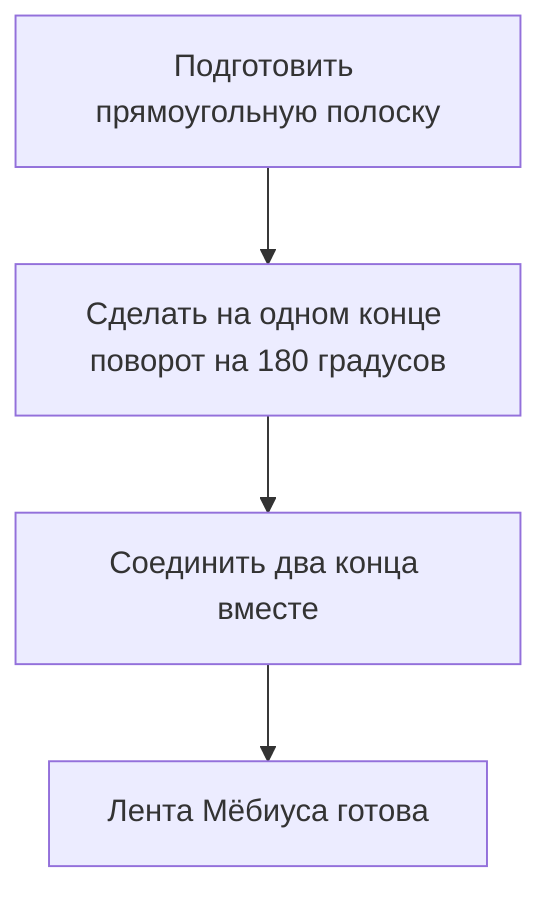
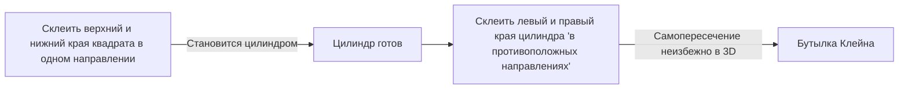

Многие объекты вокруг нас имеют «внутри и снаружи» или «спереди и сзади». Например, у листа бумаги есть лицевая и обратная сторона, а у мяча — внутренняя и внешняя. Однако в области математики, известной как **топология**, существуют загадочные фигуры, к которым эта интуиция неприменима. Они известны как «неориентируемые» поверхности.

В этой статье мы подробно объясним математические определения, параметрические представления и свойства двух репрезентативных примеров: **ленты Мёбиуса** и **бутылки Клейна**.

## 1. Что такое ориентируемость?

В геометрии и топологии поверхность считается «ориентируемой», если на всей ее протяженности можно последовательно определить такие понятия, как «перед и зад» или «по часовой стрелке и против часовой стрелки».

Например, сфера и тор (форма пончика) являются ориентируемыми поверхностями. Представьте себе муравья, идущего по этим поверхностям. Независимо от того, как муравей движется и возвращается в исходную точку, его собственные «верх» и «низ» никогда не поменяются местами.

С другой стороны, на неориентируемой поверхности, если вы совершите полный круг по определенному пути и вернетесь в исходную точку, **«лево и право» или «перед и зад» поменяются местами**. Лента Мёбиуса и бутылка Клейна, представленные ниже, обладают именно этим свойством.

## 2. Лента Мёбиуса

Лента Мёбиуса была открыта независимо друг от друга в 1858 году немецкими математиками Августом Фердинандом Мёбиусом и Иоганном Бенедиктом Листингом.

### 2.1 Метод построения

Вы можете легко создать ленту Мёбиуса, взяв прямоугольную полоску бумаги, перекрутив ее на пол-оборота (180 градусов) и соединив два конца.

### 2.2 Математическое представление (параметризация)

Параметрическое представление ленты Мёбиуса в 3-мерном евклидовом пространстве $\mathbb{R}^3$ выглядит следующим образом. Оно выражается через параметры $u$ и $v$.

$$
\begin{aligned}
x(u, v) &= \left( R + v \cos\left(\frac{u}{2}\right) \right) \cos(u) \\
y(u, v) &= \left( R + v \cos\left(\frac{u}{2}\right) \right) \sin(u) \\
z(u, v) &= v \sin\left(\frac{u}{2}\right)
\end{aligned}
$$

Где,
- $R$ — радиус центральной окружности
- $u \in [0, 2\pi)$ — угол вдоль ленты
- $v \in [-w, w]$ — диапазон половины ширины ленты ($w$ — половина ширины)

Как видно из уравнения, когда $u$ изменяется от $0$ до $2\pi$ (один полный оборот), $u/2$ становится равным $\pi$. Поскольку $\cos(\pi) = -1$ и $\sin(\pi) = 0$, знак $v$ меняется на противоположный. Это обеспечивает математическое обоснование того факта, что завершение одного круга по ленте Мёбиуса выворачивает ее наизнанку.

### 2.3 Интересные свойства

1. **Только один край**: Обычная полоска (поверхность цилиндра) имеет два края (границы), верхний и нижний. Однако, если вы проведете пальцем по краю ленты Мёбиуса, вы пройдете весь край и вернетесь в исходную точку. Это означает, что у нее только одна граница, единственная замкнутая кривая.
2. **Результат разрезания**: Если разрезать ленту Мёбиуса вдоль центральной линии ножницами, она не распадется на две отдельные ленты; вместо этого она станет одним большим кольцом, перекрученным дважды.

## 3. Бутылка Клейна

В то время как лента Мёбиуса является поверхностью с краем, **бутылка Клейна** — это «замкнутая, неориентируемая поверхность без края». Она была придумана в 1882 году немецким математиком Феликсом Клейном.

### 3.1 Концептуальное построение бутылки Клейна

Бутылка Клейна определяется путем склеивания противоположных краев квадрата в определенных направлениях.

На языке топологии это описывается с использованием фундаментального многоугольника следующим образом:

$$
\text{Квадрат с краями } a, b, a, b^{-1}
$$

Это означает, что край $a$ соединяется в том же направлении, а край $b$ соединяется в обратном направлении.

### 3.2 Самопересечение в трехмерном пространстве

Бутылка Клейна, по сути, представляет собой фигуру, вложенную в **4-мерное пространство** ($\mathbb{R}^4$). Внутри 4D пространства она может быть построена без самопересечений.

Однако, когда мы пытаемся представить бутылку Клейна в трехмерном пространстве, в котором мы живем, «горлышко» бутылки должно пройти через собственную «стенку», чтобы попасть внутрь и соединиться с основанием. Это **самопересечение** неизбежно.

### 3.3 Пример параметрического представления (3D-проекция)

Вот пример параметрических уравнений для бутылки Клейна в форме восьмерки, спроецированной в трехмерное пространство.

$$
\begin{aligned}
x(u, v) &= \left( r + \cos\left(\frac{u}{2}\right) \sin(v) - \sin\left(\frac{u}{2}\right) \sin(2v) \right) \cos(u) \\
y(u, v) &= \left( r + \cos\left(\frac{u}{2}\right) \sin(v) - \sin\left(\frac{u}{2}\right) \sin(2v) \right) \sin(u) \\
z(u, v) &= \sin\left(\frac{u}{2}\right) \sin(v) + \cos\left(\frac{u}{2}\right) \sin(2v)
\end{aligned}
$$
($0 \le u < 2\pi$, $0 \le v < 2\pi$)

### 3.4 Связь с лентой Мёбиуса

Удивительно, но если разрезать бутылку Клейна ровно пополам вдоль определенной плоскости, она распадется на **две ленты Мёбиуса** (одну правую и одну левую).
И наоборот, если склеить края двух лент Мёбиуса, получится бутылка Клейна.

## 4. Применения и заключение

Лента Мёбиуса и бутылка Клейна — это не просто математические головоломки.

- **Промышленное применение**: Конвейерные ленты в форме ленты Мёбиуса изнашиваются равномерно с обеих сторон, что фактически удваивает срок их службы. Эта же концепция использовалась в аудиокассетах с непрерывным циклом.
- **Химия и физика**: Были синтезированы молекулы со структурой ленты Мёбиуса (ароматичность Мёбиуса).
- **Искусство и культура**: Они служили мотивами во многих произведениях искусства, таких как ксилография М. К. Эшера «Лента Мёбиуса II».

Парадоксальное свойство «отсутствия различия между внутренним и внешним» расширяет наше пространственное восприятие и дает возможность глубоко задуматься о форме Вселенной и многомерной геометрии. Эти загадочные поверхности, открытые топологией, воистину символизируют красоту и глубину математики.
