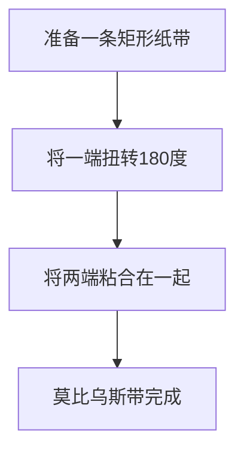

我们周围的许多物体都有“内和外”或“正和反”。例如，一张纸有正面和反面，一个球有内部和外部。然而，在被称为 **拓扑学** 的数学领域中，存在着这种直觉无法适用的神秘图形。这些被称为“不可定向”曲面。

在本文中，我们将详细解释两个代表性例子：**莫比乌斯带**（Möbius strip）和 **克莱因瓶**（Klein bottle）的数学定义、参数表示及其性质。

## 1. 什么是可定向性？

在几何学和拓扑学中，一个曲面是“可定向的”，如果你能在整个曲面上一致地定义诸如“正面和反面”或“顺时针和逆时针”的概念。

例如，球面和环面（甜甜圈形状）是可定向曲面。想象一只蚂蚁在这些曲面上行走。无论蚂蚁如何移动并返回其起点，它自身的“上”和“下”永远不会颠倒。

另一方面，在不可定向曲面上，如果你沿着某条路径完成一个循环并返回起点，**“左和右”或“正和反”会发生颠倒**。下面介绍的莫比乌斯带和克莱因瓶正好具有这种性质。

## 2. 莫比乌斯带

莫比乌斯带于1858年由德国数学家奥古斯特·费迪南德·莫比乌斯和约翰·本尼迪克特·李斯廷分别独立发现。

### 2.1 构造方法

你可以很容易地制作一个莫比乌斯带，只需将一条矩形纸带扭转半圈（180度），然后将两端粘合在一起。

### 2.2 数学表示（参数化）

在三维[欧几里得](https://kenji.blog/zh-tw/p/euclid/)空间 $\mathbb{R}^3$ 中，莫比乌斯带的参数表示如下。它使用参数 $u$ 和 $v$ 来表示。

$$
\begin{aligned}
x(u, v) &= \left( R + v \cos\left(\frac{u}{2}\right) \right) \cos(u) \\
y(u, v) &= \left( R + v \cos\left(\frac{u}{2}\right) \right) \sin(u) \\
z(u, v) &= v \sin\left(\frac{u}{2}\right)
\end{aligned}
$$

这里，
- $R$ 是中心圆的半径
- $u \in [0, 2\pi)$ 是绕带子的角度
- $v \in [-w, w]$ 是带子一半宽度的范围（$w$ 是半宽）

从方程式可以看出，当 $u$ 从 $0$ 变到 $2\pi$（一整圈）时，$u/2$ 变成 $\pi$。因为 $\cos(\pi) = -1$ 且 $\sin(\pi) = 0$，$v$ 的符号会反转。这为沿着莫比乌斯带走一圈会翻转内外的现象提供了数学支持。

### 2.3 有趣的性质

1. **只有一个边界**：普通的带子（圆柱体的侧面）有两个边界（边缘），一个在上，一个在下。然而，如果你用手指沿着莫比乌斯带的边缘滑动，你将滑过整个边缘并回到你的起点。这意味着它只有一个边界，一条单一的闭合曲线。
2. **剪开的结果**：如果你用剪刀沿着中心线将莫比乌斯带剪成两半，它不会变成两个独立的带子；相反，它会变成一个更大的、扭转两次的环。

## 3. 克莱因瓶

虽然莫比乌斯带是具有边界（边缘）的曲面，但 **克莱因瓶** 是一个“无边界的闭合不可定向曲面”。它由德国数学家费利克斯·克莱因于1882年提出。

### 3.1 克莱因瓶的概念构造

克莱因瓶是通过以特定方向粘合正方形的对边来定义的。

用拓扑学的语言来说，它使用基本多边形描述如下：

$$
\text{边为 } a, b, a, b^{-1} \text{ 的正方形}
$$

这意味着边 $a$ 按相同方向连接，而边 $b$ 按相反方向连接。

### 3.2 三维空间中的自我相交

克莱因瓶本质上是嵌入在 **四维空间**（$\mathbb{R}^4$）中的图形。在四维空间内，它可以在不与自身相交的情况下构造出来。

然而，当我们试图在我们生活的三维空间中强行表示克莱因瓶时，瓶子的“颈部”必须穿过自身的“瓶壁”进入内部并连接到底部。这种 **自我相交** 是不可避免的。

### 3.3 参数表示示例（3D投影）

以下是投影在三维空间中的“8字形”克莱因瓶的参数方程式示例。

$$
\begin{aligned}
x(u, v) &= \left( r + \cos\left(\frac{u}{2}\right) \sin(v) - \sin\left(\frac{u}{2}\right) \sin(2v) \right) \cos(u) \\
y(u, v) &= \left( r + \cos\left(\frac{u}{2}\right) \sin(v) - \sin\left(\frac{u}{2}\right) \sin(2v) \right) \sin(u) \\
z(u, v) &= \sin\left(\frac{u}{2}\right) \sin(v) + \cos\left(\frac{u}{2}\right) \sin(2v)
\end{aligned}
$$
($0 \le u < 2\pi$, $0 \le v < 2\pi$)

### 3.4 与莫比乌斯带的关系

令人惊讶的是，如果你沿着特定平面将克莱因瓶精确地切成两半，它会分裂成 **两个莫比乌斯带**（一个右旋莫比乌斯带和一个左旋莫比乌斯带）。
反过来说，如果你把两个莫比乌斯带的边界粘合在一起，就会形成一个克莱因瓶。

## 4. 应用与总结

莫比乌斯带和克莱因瓶不仅仅是数学谜题。

- **工业应用**：形似莫比乌斯带的传送带两侧都会均匀磨损，从而使其使用寿命翻倍。循环播放的盒式磁带也使用了同样的概念。
- **化学与物理学**：具有莫比乌斯带结构的分子（莫比乌斯芳香性）已被合成。
- **艺术与文化**：它们成为许多艺术作品的主题，例如 M.C. 埃舍尔的木刻画《莫比乌斯带 II》。

“没有内外之分”这种违背直觉的特性扩展了我们的空间意识，并为了解宇宙形状和高维几何提供了深入思考的机会。拓扑学揭示的这些神秘曲面真正象征了数学之美与深邃。
