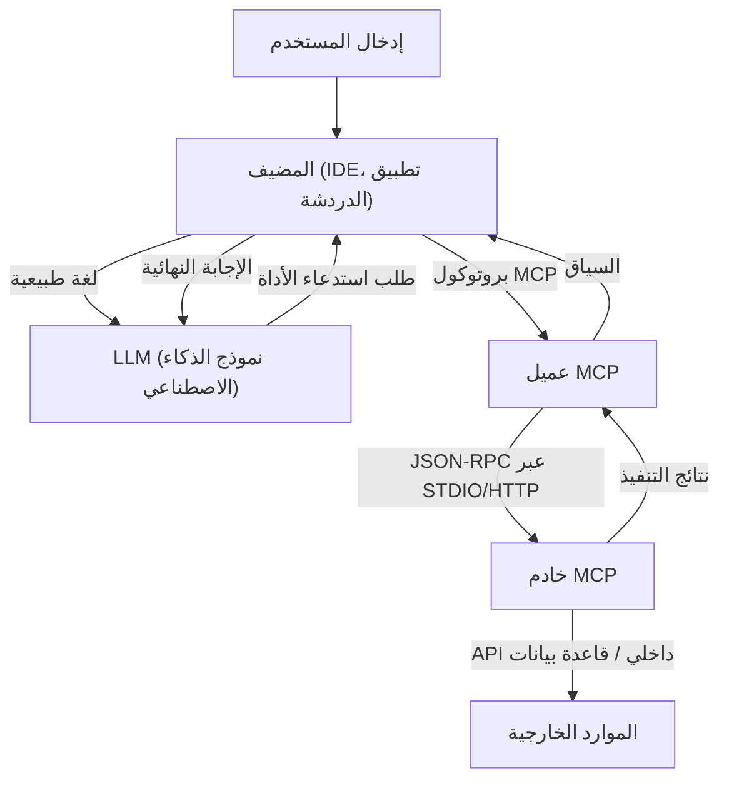

# نظرة شاملة على بروتوكول سياق النموذج (MCP): بنية الجيل القادم لربط الذكاء الاصطناعي بالأنظمة

في السنوات الأخيرة، كان تطور النماذج اللغوية الكبيرة (LLMs) ملحوظًا، متجاوزًا مجال معالجة اللغة الطبيعية ليحدث ثورة في جميع الصناعات مثل تطوير البرمجيات، تحليل البيانات، وأتمتة الأعمال. ومع ذلك، لكي تظهر LLMs قيمتها الحقيقية، فإن ذكاء النموذج وحده ليس كافيًا. من الضروري وجود "واجهة" تسمح للنموذج بالتفاعل بأمان وكفاءة مع العالم الخارجي - قواعد البيانات، واجهات برمجة التطبيقات الداخلية، أنظمة الملفات، وخدمات الويب.

لحل هذه المشكلة، ظهر **بروتوكول سياق النموذج (Model Context Protocol أو MCP)**. MCP هو بروتوكول موحد لربط نماذج الذكاء الاصطناعي بالأدوات ومصادر البيانات الخارجية، مما يتيح للمطورين توسيع قدرات وكلاء الذكاء الاصطناعي بطريقة موحدة.

في هذه المقالة، سنشرح بالتفصيل من منظور تقني خلفية ظهور MCP، والمشكلات التي يحلها، وأعماق بنيته، ومخططات التنفيذ المحددة، ونموذج الأمان.

---

## 1. تحديات توفير السياق لـ LLM وظهور MCP

### 1.1 جدار السياق
تحتفظ نماذج LLM بكمية هائلة من المعرفة ضمن معلماتها المدربة مسبقًا، ولكنها لا تستطيع الوصول إلى أحدث المعلومات أو البيانات الخاصة داخل منظمة معينة. لمنع هذه "الهلوسة" وتوليد إجابات دقيقة، من الضروري توفير السياق المناسب في وقت التشغيل باستخدام التوليد المعزز بالاسترجاع (RAG) أو استدعاء الأدوات (Function Calling).

ومع ذلك، كان هناك التحديات التالية في طرق توفير السياق التقليدية:
- **تجزئة الواجهة**: نظرًا لأن كل مزود لـ LLM (مثل OpenAI وAnthropic وGoogle وما إلى ذلك) يحدد تنسيق استدعاء الأداة الخاص به، اضطر المطورون إلى الحفاظ على تطبيقات مختلفة لكل نموذج.
- **تعقيد إدارة الحالة**: عند تنفيذ المهام التي تتضمن خطوات متعددة، كان هناك عبء كبير على التطبيق لإدارة أي الأدوات تم استدعاؤها وبأي ترتيب وما هي البيانات التي تم إرجاعها بدقة.
- **الأمان والحوكمة**: عند منح نماذج الذكاء الاصطناعي حق الوصول إلى الأنظمة الداخلية، كان كيفية تطبيق مبدأ الامتياز الأقل وكيفية الإدارة المركزية للمصادقة والتفويض مصدر قلق كبير.

### 1.2 فلسفة تصميم بروتوكول سياق النموذج
لمعالجة هذه التحديات، تم بناء MCP بناءً على فلسفات التصميم التالية:
1. **التوحيد القياسي (Standardization)**: تحديد بروتوكول موحد ومستقل عن المزود يجعل الأدوات التي تم تطويرها مرة واحدة قابلة لإعادة الاستخدام عبر أي نموذج أو عميل.
2. **الاقتران الفضفاض (Loose Coupling)**: فصل الخادم الذي يوفر الأدوات عن العميل الذي يستخدم LLM، مما يسمح لهما بالتوسع والتحديث بشكل مستقل.
3. **الحدود الآمنة (Secure Boundaries)**: تطبيق ضوابط وصول واضحة عند حدود الشبكة لتوفير سياق لنماذج الذكاء الاصطناعي داخل بيئة معزولة (sandbox) آمنة.

---

## 2. بنية MCP ثلاثية الطبقات: العميل، الخادم، والمضيف

يعتمد MCP بنية تقسم النظام بأكمله إلى ثلاثة مكونات رئيسية: **المضيف (Host)** و**العميل (Client)** و**الخادم (Server)**. يسهل هذا الفصل بناء تطبيقات الذكاء الاصطناعي المعقدة.



### 2.1 المضيف (تطبيق المضيف)
المضيف (Host) هو الواجهة التي تتفاعل مباشرة مع المستخدمين (على سبيل المثال، بيئات التطوير المتكاملة مثل VS Code، روبوتات الدردشة الداخلية، أدوات سطر الأوامر، وما إلى ذلك). يتلقى المضيف مدخلات المستخدم ويرسلها إلى LLM. أيضًا، عندما يتلقى طلبًا من LLM يفيد بـ "أريد تشغيل هذه الأداة"، فإنه يفسرها ويفوض المعالجة إلى العميل (Client).

### 2.2 عميل MCP (Client)
يعمل العميل داخل المضيف أو بجواره ويدير الاتصال مع الخادم (Server) وفقًا لبروتوكول MCP. الأدوار الرئيسية للعميل هي كما يلي:
- اكتشاف الخوادم المتاحة وإدارة الاتصال بها
- تحويل طلبات استدعاء الأدوات المجردة من LLM إلى طلبات JSON-RPC محددة لـ MCP
- التحقق من صحة الاستجابات من الخادم، وتنسيقها في شكل يمكن لـ LLM فهمه، وإرجاعها إلى المضيف

### 2.3 خادم MCP (Server)
الخادم هو المكون الذي يتفاعل مباشرة مع الأنظمة الخارجية الفعلية (قواعد البيانات، واجهات برمجة التطبيقات، أنظمة الملفات). من خلال تنفيذ خادم، يربط المطورون أنظمتهم بنظام MCP البيئي.
يُعلم الخادم العميل بالبيانات الوصفية للأدوات (الوظائف) والموارد التي يوفرها، ويعالج طلبات التنفيذ من العميل، ويعيد النتائج.

---

## 3. مخطط تعريف الأداة المحدد وبروتوكول JSON-RPC

يعتمد MCP **JSON-RPC 2.0** كبروتوكول اتصال الخاص به. بالنسبة لطبقة النقل، يستخدم `stdio` للاتصال بين العمليات المحلية، أو `HTTP/SSE (أحداث مرسلة من الخادم)` للاتصال عبر الشبكة.

### 3.1 الإشعار بالبيانات الوصفية للأداة
عندما يتصل العميل بالخادم، فإنه يرسل أولاً طلب `tools/list` لاسترداد قائمة بالأدوات المتاحة.

**الطلب (العميل -> الخادم):**
```json
{
  "jsonrpc": "2.0",
  "id": 1,
  "method": "tools/list",
  "params": {}
}
```

**الاستجابة (الخادم -> العميل):**
```json
{
  "jsonrpc": "2.0",
  "id": 1,
  "result": {
    "tools": [
      {
        "name": "query_database",
        "description": "استرداد المعلومات من قاعدة البيانات الداخلية باستخدام SQL.",
        "inputSchema": {
          "type": "object",
          "properties": {
            "sql_query": {
              "type": "string",
              "description": "عبارة SELECT المراد تنفيذها"
            },
            "limit": {
              "type": "integer",
              "default": 10
            }
          },
          "required": ["sql_query"]
        }
      }
    ]
  }
}
```

النقطة المهمة هنا هي `inputSchema`. باستخدام مخطط JSON لتعريف أنواع الوسائط والحقول المطلوبة بدقة، فإنه يدعم بقوة LLM في استدعاء الأداة بالتنسيق الصحيح. يتم تعيين هذا المخطط مباشرة إلى موجه LLM (تعريف استدعاء الوظيفة) من خلال المضيف.

### 3.2 تنفيذ الأداة
عندما يقرر LLM تنفيذ `query_database`، يرسل العميل طلب `tools/call` إلى الخادم.

**الطلب (العميل -> الخادم):**
```json
{
  "jsonrpc": "2.0",
  "id": 2,
  "method": "tools/call",
  "params": {
    "name": "query_database",
    "arguments": {
      "sql_query": "SELECT name, email FROM users WHERE status = 'active'",
      "limit": 5
    }
  }
}
```

**الاستجابة (الخادم -> العميل):**
```json
{
  "jsonrpc": "2.0",
  "id": 2,
  "result": {
    "content": [
      {
        "type": "text",
        "text": "name: Alice, email: alice@example.com\nname: Bob, email: bob@example.com"
      }
    ]
  }
}
```

---

## 4. ربط الموجهات والأدوات: إدارة السياق المتقدمة

MCP ليس مجرد بروتوكول استدعاء الإجراء البعيد (RPC) للوظائف. كما يتضمن ميزات لإدارة "قوالب الموجهات (Prompt Templates)" و"الموارد (Resources)".

### 4.1 الموارد (Resources)
بينما تقوم الأدوات بإجراءات ديناميكية (كتابة أو البحث عن البيانات)، توفر الموارد سياقًا ثابتًا (ملفات السجل، صفحات الويكي، وثائق API، إلخ). يمكن للخوادم عرض السياق المستند إلى URI والذي يجب على LLM قراءته من خلال طريقتي `resources/list` و `resources/read`.
يسمح هذا للمضيف بأتمتة مهام مثل "تضمين النص في هذا URI كمعرفة أساسية" في موجه LLM.

### 4.2 الموجهات (Prompts)
هذه ميزة حيث يوفر الخادم قوالب موجهات محددة مسبقًا للعميل. على سبيل المثال، قد يوفر الخادم نموذجًا يسمى "موجه لإصلاح الأخطاء"، ويمرر العميل وسيطات (مثل رسائل الخطأ) للحصول على سلسلة الموجه المكتملة.
هذا يفصل هندسة الموجهات عن العميل (التطبيق) ويسمح بالتحكم المركزي في الإصدار والتحسين على الواجهة الخلفية (الخادم).

---

## 5. الأمان والتحكم في الوصول

عند السماح لوكلاء الذكاء الاصطناعي باتخاذ إجراءات مستقلة، فإن الأمان هو الاعتبار الأكثر أهمية. يوفر MCP العديد من حدود الأمان القوية على مستوى البنية.

### 5.1 عزل الشبكة واختيار النقل
لا تحتاج خوادم MCP التي تصل إلى الأنظمة الداخلية الحساسة إلى العرض على الإنترنت العام. يمكن تشغيلها على جهاز المطور المحلي أو داخل شبكة خاصة في VPC الشركة، والتواصل مع العميل عبر `stdio` أو الشبكة الداخلية. على الرغم من أن واجهة برمجة تطبيقات LLM نفسها قد تكون في السحابة، فإن استرداد البيانات مكتمل بين العميل والخادم المحليين، ويتم إرسال المعلومات الضرورية فقط إلى LLM.

### 5.2 إشراك الإنسان (Human-in-the-loop)
توصي مواصفات بروتوكول MCP بأن ينفذ التطبيق المضيف سير عمل يطلب فيه موافقة المستخدم الصريحة قبل تنفيذ أدوات مهمة تتضمن تعديل البيانات (تحديث قاعدة البيانات، إرسال رسائل البريد الإلكتروني، وما إلى ذلك). يمكن للخادم إضافة علامات مثل `require_approval: true` إلى البيانات الوصفية للأداة (كمواصفات ممتدة)، ويمكن تصميمه لمطالبة العميل بالتأكيد الموثوق.

### 5.3 المصادقة ونشر السياق
عندما يستدعي الخادم واجهة برمجة تطبيقات خارجية، فمن المهم معرفة الصلاحيات التي يتم تنفيذها بموجبها. في MCP، يمكن إنشاء آلية لنشر رموز OAuth ومعلومات الجلسة التي تم الحصول عليها بأمان على جانب المضيف إلى الخادم من خلال رؤوس الطلبات أو متغيرات البيئة. هذا يمنع الذكاء الاصطناعي من الوصول إلى البيانات بما يتجاوز امتيازات المستخدم.

---

## 6. تطوير البرمجيات المستقبلي الذي يجلبه MCP

مع انتشار بروتوكول سياق النموذج، سينتقل النظام البيئي للذكاء الاصطناعي من عصر "التكاملات الفردية" إلى عصر "التوصيل والتشغيل (Plug and Play)".

- **تقليل العبء على المطورين**: من خلال تغليف واجهات برمجة التطبيقات الخاصة بهم مرة واحدة كخوادم MCP، يمكن للشركات إتاحتها عبر LLM من أي عميل متوافق مع MCP، مثل VS Code، وروبوتات Slack، والأدوات الداخلية المخصصة.
- **تحسين استقلالية وكلاء الذكاء الاصطناعي**: من خلال مخططات موحدة ومعالجة واضحة للأخطاء، ستتحسن قدرة LLMs بشكل كبير على فهم فشل استدعاء الأداة، وتصحيح المعلمات بشكل مستقل، وإعادة المحاولة.
- **تكوين نظام بيئي مفتوح**: سيتم إصدار مجموعة واسعة من خوادم MCP (لوصول GitHub، وتكامل Jira، وإدارة AWS، وما إلى ذلك) كمفتوحة المصدر مدفوعة بالمجتمع، مما يسهل على أي شخص إنشاء مساعدين أقوياء للذكاء الاصطناعي.

### خاتمة
MCP هو جسر قوي ومرن لربط الذكاء الاصطناعي بالأنظمة الخارجية. من خلال توحيد إدارة الموجهات، الأدوات، والموارد وفصل اهتمامات العميل والخادم، يمكن للمطورين بناء تطبيقات ذكاء اصطناعي أكثر أمانًا وقابلية للتوسع من الجيل التالي. كأساس لإطلاق الإمكانات الحقيقية للذكاء الاصطناعي، علينا أن نراقب عن كثب التطور المستقبلي لـ MCP.
