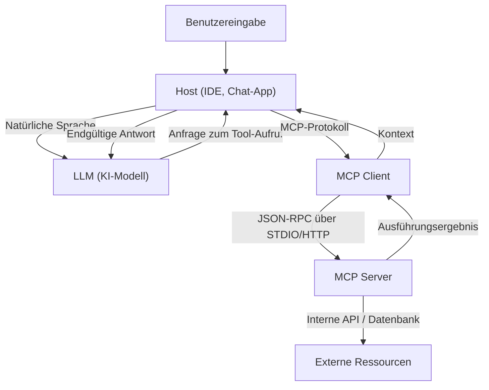

# Das gesamte Bild des Model Context Protocol (MCP): Eine Architektur der nächsten Generation, die KI und Systeme verbindet

In den letzten Jahren war die Entwicklung von Large Language Models (LLMs) bemerkenswert und hat branchenübergreifend Revolutionen ausgelöst, über die Verarbeitung natürlicher Sprache hinaus, hin zu Softwareentwicklung, Datenanalyse und Geschäftsautomatisierung. Damit LLMs jedoch ihren wahren Wert entfalten können, reicht die Intelligenz des Modells allein nicht aus. Eine "Schnittstelle" ist unerlässlich, damit das Modell sicher und effizient mit der Außenwelt – Datenbanken, internen APIs, Dateisystemen, Webservices – interagieren kann.

Um dieses Problem zu lösen, wurde das **Model Context Protocol (MCP)** eingeführt. MCP ist ein standardisiertes Protokoll zur Verbindung von KI-Modellen mit externen Tools und Datenquellen, das es Entwicklern ermöglicht, die Fähigkeiten von KI-Agenten auf einheitliche Weise zu erweitern.

In diesem Artikel werden wir den Hintergrund der Entstehung von MCP, die gelösten Probleme, die Tiefen der Architektur, spezifische Implementierungsschemata und das Sicherheitsmodell aus technischer Sicht im Detail erläutern.

---

## 1. Die Herausforderung der Kontextbereitstellung für LLMs und die Entstehung von MCP

### 1.1 Die Kontextbarriere
LLMs besitzen in ihren vortrainierten Parametern ein enormes Wissen, haben jedoch keinen Zugriff auf aktuelle Informationen oder private Daten innerhalb einer bestimmten Organisation. Um "Halluzinationen" zu verhindern und genaue Antworten zu generieren, ist es notwendig, zur Laufzeit den richtigen Kontext bereitzustellen, indem RAG (Retrieval-Augmented Generation) oder Funktionsaufrufe (Function Calling) verwendet werden.

Die herkömmliche Kontextbereitstellung hatte jedoch die folgenden Probleme:
- **Zersplitterung der Schnittstellen**: Da jeder LLM-Anbieter (OpenAI, Anthropic, Google usw.) sein eigenes Format für den Aufruf von Tools definiert hat, mussten Entwickler für jedes Modell unterschiedliche Implementierungen pflegen.
- **Komplexität des Zustandsmanagements**: Bei der Ausführung von Aufgaben, die sich über mehrere Schritte erstrecken, war es für die Anwendungsseite eine große Belastung, genau zu verwalten, welches Tool in welcher Reihenfolge aufgerufen wurde und welche Daten zurückgegeben wurden.
- **Sicherheit und Governance**: Wenn man KI-Modellen Zugriff auf interne Systeme gewährte, war es ein großes Anliegen, wie das Prinzip der geringsten Privilegien angewendet und Authentifizierung/Autorisierung zentral verwaltet werden konnten.

### 1.2 Die Designphilosophie des Model Context Protocol
Um diese Herausforderungen zu bewältigen, wurde MCP auf Basis der folgenden Designphilosophie entwickelt:
1. **Standardisierung (Standardization)**: Definition eines einheitlichen, anbieterunabhängigen Protokolls, das es ermöglicht, ein einmal entwickeltes Tool über alle Modelle und Clients hinweg wiederzuverwenden.
2. **Lose Kopplung (Loose Coupling)**: Trennung des Servers, der das Tool bereitstellt, vom Client, der das LLM nutzt, sodass sie unabhängig voneinander skaliert und aktualisiert werden können.
3. **Sichere Grenzen (Secure Boundaries)**: Klare Zugriffskontrolle an den Netzwerkgrenzen, um dem KI-Modell den Kontext in einer sicheren Sandbox-Umgebung bereitzustellen.

---

## 2. Die 3-Schichten-Architektur von MCP: Client, Server, Host

MCP verwendet eine Architektur, die das gesamte System in drei Hauptkomponenten unterteilt: **Host**, **Client** und **Server**. Diese Trennung erleichtert den Aufbau komplexer KI-Anwendungen.



### 2.1 Host (Host-Anwendung)
Der Host ist die Schnittstelle, die direkt mit dem Benutzer interagiert (z. B. eine IDE wie VS Code, ein interner Chatbot, ein CLI-Tool usw.). Der Host empfängt die Eingaben des Benutzers und sendet sie an das LLM. Wenn er vom LLM die Anfrage "Ich möchte dieses Tool ausführen" erhält, interpretiert er sie und delegiert die Verarbeitung an den Client.

### 2.2 MCP Client (Client)
Der Client arbeitet innerhalb oder neben dem Host und verwaltet die Kommunikation mit dem Server gemäß dem MCP-Protokoll. Die Hauptaufgaben des Clients sind:
- Erkennung und Verbindungsmanagement der verfügbaren Server
- Konvertierung abstrakter Tool-Aufrufanforderungen vom LLM in konkrete MCP JSON-RPC-Anfragen
- Validierung der Antworten vom Server und Formatierung in ein Format, das das LLM versteht, um sie an den Host zurückzugeben

### 2.3 MCP Server (Server)
Der Server ist die Komponente, die direkt mit den tatsächlichen externen Systemen (Datenbanken, APIs, Dateisysteme) interagiert. Durch die Implementierung des Servers verbinden Entwickler ihre eigenen Systeme mit dem MCP-Ökosystem.
Der Server teilt dem Client als Metadaten mit, welche Tools (Funktionen) und Ressourcen er bereitstellt, verarbeitet Ausführungsanfragen vom Client und gibt die Ergebnisse zurück.

---

## 3. Konkretes Tool-Definitions-Schema und JSON-RPC-Protokoll

MCP verwendet **JSON-RPC 2.0** als Kommunikationsprotokoll. Die Transportschicht verwendet `stdio` für die lokale Interprozesskommunikation oder `HTTP/SSE (Server-Sent Events)` für die Kommunikation über ein Netzwerk.

### 3.1 Benachrichtigung über Tool-Metadaten
Wenn sich der Client mit dem Server verbindet, sendet er zunächst eine `tools/list`-Anfrage, um eine Liste der verfügbaren Tools zu erhalten.

**Anfrage (Client -> Server):**
```json
{
  "jsonrpc": "2.0",
  "id": 1,
  "method": "tools/list",
  "params": {}
}
```

**Antwort (Server -> Client):**
```json
{
  "jsonrpc": "2.0",
  "id": 1,
  "result": {
    "tools": [
      {
        "name": "query_database",
        "description": "Ruft Informationen aus der internen Datenbank mittels SQL ab.",
        "inputSchema": {
          "type": "object",
          "properties": {
            "sql_query": {
              "type": "string",
              "description": "Die auszuführende SELECT-Anweisung"
            },
            "limit": {
              "type": "integer",
              "default": 10
            }
          },
          "required": ["sql_query"]
        }
      }
    ]
  }
}
```

Wichtig ist hier das `inputSchema`. Durch die strikte Definition von Argumenttypen und Pflichtfeldern mithilfe von JSON Schema wird das LLM stark dabei unterstützt, Tools im richtigen Format aufzurufen. Dieses Schema wird über den Host direkt den LLM-Prompts (Function Calling-Definitionen) zugeordnet.

### 3.2 Ausführung des Tools
Wenn das LLM entscheidet, `query_database` auszuführen, sendet der Client eine `tools/call`-Anfrage an den Server.

**Anfrage (Client -> Server):**
```json
{
  "jsonrpc": "2.0",
  "id": 2,
  "method": "tools/call",
  "params": {
    "name": "query_database",
    "arguments": {
      "sql_query": "SELECT name, email FROM users WHERE status = 'active'",
      "limit": 5
    }
  }
}
```

**Antwort (Server -> Client):**
```json
{
  "jsonrpc": "2.0",
  "id": 2,
  "result": {
    "content": [
      {
        "type": "text",
        "text": "name: Alice, email: alice@example.com\nname: Bob, email: bob@example.com"
      }
    ]
  }
}
```

---

## 4. Verbindung von Prompts und Tools: Erweitertes Kontextmanagement

MCP ist nicht nur ein Remote Procedure Call (RPC)-Protokoll für Funktionen. Es bietet auch Verwaltungsfunktionen für "Prompt-Templates" und "Ressourcen".

### 4.1 Ressourcen (Resources)
Während Tools dynamische Aktionen (Schreiben von Daten oder Suchen) ausführen, stellen Ressourcen statischen Kontext bereit (Protokolldateien, Wiki-Seiten, API-Dokumentationen usw.). Der Server kann den Kontext, den das LLM lesen soll, über die Methoden `resources/list` und `resources/read` auf URI-Basis freigeben.
Dadurch kann der Host Prozesse automatisieren, wie z. B. "den Text dieser URI als Hintergrundwissen in den LLM-Prompt aufnehmen".

### 4.2 Prompts (Prompts)
Dies ist eine Funktion, um dem Client Prompt-Templates bereitzustellen, die im Voraus auf der Serverseite definiert wurden. Beispielsweise stellt der Server ein Template wie "Prompt zur Fehlerbehebung" bereit, und der Client übergibt Argumente (wie Fehlermeldungen), um einen fertigen Prompt-String zu erhalten.
Dadurch wird das Prompt-Engineering vom Client (der Anwendungsseite) getrennt, und es wird möglich, Versionierung und Optimierung zentral auf der Backend-Serverseite zu verwalten.

---

## 5. Sicherheit und Zugriffskontrolle

Wenn man KI-Agenten autonome Aktionen erlaubt, ist Sicherheit das Wichtigste. MCP bietet mehrere starke Sicherheitsgrenzen auf Architekturebene.

### 5.1 Netzwerkisolation und Wahl des Transports
Ein MCP-Server, der auf hochsensible interne Systeme zugreift, muss nicht im öffentlichen Internet ausgestellt werden. Er kann auf dem lokalen Computer des Entwicklers oder in einem privaten Netzwerk innerhalb der Unternehmens-VPC ausgeführt werden und mit dem Client über `stdio` oder das interne Netzwerk kommunizieren. Selbst wenn sich die LLM-API in der Cloud befindet, wird der Datenabruf lokal zwischen Client und Server abgeschlossen, und nur die notwendigen Informationen werden an das LLM gesendet.

### 5.2 Human-in-the-Loop
Die MCP-Protokollspezifikation empfiehlt, dass die Host-Anwendung einen Ablauf implementiert, bei dem der Benutzer um explizite Genehmigung gebeten wird, bevor kritische Tool-Ausführungen erfolgen, die Datenänderungen mit sich bringen (Datenbankaktualisierungen, E-Mail-Versand usw.). Der Server kann den Tool-Metadaten Flags wie `require_approval: true` (als Erweiterungsspezifikation) hinzufügen, und das Design kann sicherstellen, dass auf der Clientseite eine Bestätigung angefordert wird.

### 5.3 Authentifizierung und Weitergabe von Kontext
Wenn ein Server eine externe API aufruft, ist es wichtig, unter wessen Autorität er dies tut. In MCP kann ein Mechanismus eingerichtet werden, um die vom Host erhaltenen OAuth-Tokens und Sitzungsinformationen des Benutzers über Anforderungsheader oder Umgebungsvariablen sicher an den Server weiterzugeben. Dies verhindert, dass die KI über die Berechtigungen des Benutzers hinaus auf Daten zugreift.

---

## 6. Die Zukunft der Softwareentwicklung, die MCP mit sich bringt

Mit der Verbreitung des Model Context Protocol wird das KI-Ökosystem von einer Ära der "individuellen Integration" zu "Plug and Play" übergehen.

- **Verringerung der Belastung für Entwickler**: Unternehmen müssen ihre eigene API nur einmal als MCP-Server verpacken, und sie ist dann über das LLM von jedem MCP-kompatiblen Client aus zugänglich, einschließlich VS Code, Slack-Bots und proprietären internen Tools.
- **Verbesserte Autonomie von KI-Agenten**: Mit einem einheitlichen Schema und einer klaren Fehlerbehandlung wird die Fähigkeit des LLMs, Fehler bei Tool-Aufrufen zu verstehen und Parameter autonom zu korrigieren und es erneut zu versuchen, dramatisch verbessert.
- **Bildung eines offenen Ökosystems**: Eine Vielzahl von MCP-Servern (GitHub-Zugriff, Jira-Integration, AWS-Management usw.) wird von der Community als Open Source veröffentlicht, sodass jeder ganz einfach leistungsstarke KI-Assistenten erstellen kann.

### Fazit
MCP ist eine starke und flexible Brücke, die KI mit externen Systemen verbindet. Durch die Standardisierung der Verwaltung von Prompts, Tools und Ressourcen und die Trennung der Belange von Client und Server können Entwickler sicherere und skalierbarere KI-Anwendungen der nächsten Generation erstellen. Als Grundlage, um das wahre Potenzial von KI auszuschöpfen, dürfen wir die zukünftige Entwicklung von MCP nicht aus den Augen verlieren.
