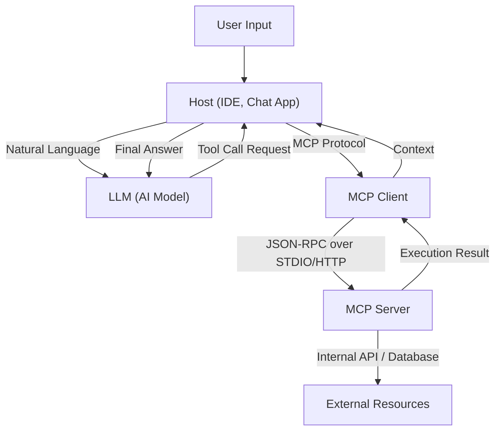

# The Full Picture of Model Context Protocol (MCP): Next-Generation Architecture Connecting AI and Systems

In recent years, the evolution of Large Language Models (LLMs) has been remarkable, revolutionizing not only natural language processing but every industry, including software development, data analysis, and business automation. However, for LLMs to demonstrate their true value, the intelligence of the model alone is not enough. An "interface" that allows the model to interact safely and efficiently with the outside world—databases, internal APIs, file systems, web services—is indispensable.

To solve this challenge, the **Model Context Protocol (MCP)** was born. MCP is a standardized protocol for connecting AI models with external tools and data sources, enabling developers to expand the capabilities of AI agents in a unified way.

This article provides a detailed technical explanation of the background of MCP's creation, the challenges it solves, the depths of its architecture, concrete implementation schemas, and its security model.

---

## 1. Challenges of Providing Context to LLMs and the Birth of MCP

### 1.1 The Wall of Context
LLMs hold vast amounts of knowledge within their pre-trained parameters, but they cannot access the latest information or private data within a specific organization. To prevent these "hallucinations" and generate accurate answers, it is necessary to provide appropriate context at runtime using RAG (Retrieval-Augmented Generation) or Function Calling (tool calling).

However, traditional context provision faced the following challenges:
- **Fragmented Interfaces**: Since each LLM provider (OpenAI, Anthropic, Google, etc.) defined its own tool calling format, developers had to maintain different implementations for each model.
- **Complexity of State Management**: When executing multi-step tasks, the burden on the application side to accurately manage which tool was called in what order and what data was returned was significant.
- **Security and Governance**: When granting AI models access to internal systems, how to apply the principle of least privilege and how to centrally manage authentication and authorization were major concerns.

### 1.2 Design Philosophy of the Model Context Protocol
To address these challenges, MCP was built based on the following design philosophies:
1. **Standardization**: Define a unified, provider-independent protocol, making tools developed once reusable across any model or client.
2. **Loose Coupling**: Separate the server providing tools from the client utilizing the LLM, allowing them to scale and update independently.
3. **Secure Boundaries**: Implement clear access control at network boundaries, providing context to AI models within a secure sandbox.

---

## 2. The 3-Tier Architecture of MCP: Client, Server, Host

MCP adopts an architecture that divides the entire system into three main components: **Host**, **Client**, and **Server**. This separation facilitates the construction of complex AI applications.



### 2.1 Host (Host Application)
The Host is the interface that directly interacts with the user (e.g., an IDE like VS Code, an internal chatbot, a CLI tool, etc.). The Host receives user input and sends it to the LLM. Also, when it receives a request from the LLM saying "I want to execute this tool," it interprets it and delegates the processing to the Client.

### 2.2 MCP Client
The Client runs inside or adjacent to the Host and manages communication with the Server according to the MCP protocol. The main roles of the Client are as follows:
- Discovery and connection management of available Servers
- Converting abstract tool call requests from the LLM into concrete MCP JSON-RPC requests
- Validating responses from the Server, formatting them into a form the LLM can understand, and returning them to the Host

### 2.3 MCP Server
The Server is the component that interacts directly with actual external systems (databases, APIs, file systems). By implementing a Server, developers connect their own systems to the MCP ecosystem.
The Server notifies the Client of what tools (functions) and resources it provides as metadata, processes execution requests from the Client, and returns the results.

---

## 3. Concrete Tool Definition Schema and JSON-RPC Protocol

MCP adopts **JSON-RPC 2.0** as its communication protocol. For the transport layer, it uses `stdio` for local inter-process communication, or `HTTP/SSE (Server-Sent Events)` for communication over a network.

### 3.1 Tool Metadata Notification
When a Client connects to a Server, it first sends a `tools/list` request to retrieve a list of available tools.

**Request (Client -> Server):**
```json
{
  "jsonrpc": "2.0",
  "id": 1,
  "method": "tools/list",
  "params": {}
}
```

**Response (Server -> Client):**
```json
{
  "jsonrpc": "2.0",
  "id": 1,
  "result": {
    "tools": [
      {
        "name": "query_database",
        "description": "Retrieves information from the internal database using SQL.",
        "inputSchema": {
          "type": "object",
          "properties": {
            "sql_query": {
              "type": "string",
              "description": "The SELECT statement to execute"
            },
            "limit": {
              "type": "integer",
              "default": 10
            }
          },
          "required": ["sql_query"]
        }
      }
    ]
  }
}
```

What's important here is the `inputSchema`. By strictly defining argument types and required fields using JSON Schema, it strongly supports the LLM in calling the tool in the correct format. This schema is directly mapped to the LLM's prompt (Function Calling definition) via the Host.

### 3.2 Tool Execution
When the LLM decides to execute `query_database`, the Client sends a `tools/call` request to the Server.

**Request (Client -> Server):**
```json
{
  "jsonrpc": "2.0",
  "id": 2,
  "method": "tools/call",
  "params": {
    "name": "query_database",
    "arguments": {
      "sql_query": "SELECT name, email FROM users WHERE status = 'active'",
      "limit": 5
    }
  }
}
```

**Response (Server -> Client):**
```json
{
  "jsonrpc": "2.0",
  "id": 2,
  "result": {
    "content": [
      {
        "type": "text",
        "text": "name: Alice, email: alice@example.com\nname: Bob, email: bob@example.com"
      }
    ]
  }
}
```

---

## 4. Connecting Prompts and Tools: Advanced Context Management

MCP is not just a remote procedure call (RPC) protocol for functions. It also features management capabilities for "Prompt Templates" and "Resources."

### 4.1 Resources
While tools perform dynamic actions (writing or searching data), resources provide static context (log files, Wiki pages, API documents, etc.). The Server can expose the context it wants the LLM to read on a URI basis through methods like `resources/list` and `resources/read`.
This allows the Host to automate processes like telling the LLM's prompt to "include the text at this URI as prerequisite knowledge."

### 4.2 Prompts
This is a feature where the Server provides pre-defined prompt templates to the Client. For example, the Server might provide a template called "Bug Fix Prompt," and the Client passes arguments (like an error message) to retrieve the completed prompt string.
This makes it possible to separate prompt engineering from the Client (application side) and centrally manage versions and optimizations on the backend Server side.

---

## 5. Security and Access Control

When granting autonomous actions to AI agents, security is the most critical factor. MCP provides several strong security boundaries at the architecture level.

### 5.1 Network Isolation and Transport Selection
An MCP Server accessing highly sensitive internal systems does not need to be exposed to the public internet. It can be run on a developer's local machine or a private network within a corporate VPC, communicating with the Client via `stdio` or internal networks. Even if the LLM's API itself is on the cloud, data retrieval is completed locally between the Client and Server, and only the necessary information is sent to the LLM.

### 5.2 Human-in-the-loop
The MCP protocol specification recommends that Host applications implement a flow requiring explicit user approval before executing critical tools that involve data modification (database updates, sending emails, etc.). Servers can attach flags like `require_approval: true` (an extended specification) to a tool's metadata, allowing for a design where the client side reliably prompts for confirmation.

### 5.3 Authentication and Context Propagation
When a Server calls an external API, whose authority it is executing under becomes important. In MCP, you can build a mechanism to securely propagate the user's OAuth tokens or session information acquired on the Host side to the Server through request headers or environment variables. This prevents AI from accessing data beyond the user's privileges.

---

## 6. The Future of Software Development Brought by MCP

With the spread of the Model Context Protocol, the AI ecosystem will shift from an era of "individual integration" to "plug-and-play."

- **Reduced Developer Burden**: Companies only need to wrap their own APIs once as an MCP Server to make them accessible via LLMs from any MCP-compatible client, such as VS Code, Slack bots, or proprietary internal tools.
- **Improved AI Agent Autonomy**: Thanks to a unified schema and clear error handling, the LLM's ability to understand tool call failures, autonomously modify parameters, and retry will dramatically improve.
- **Formation of an Open Ecosystem**: Diverse MCP Servers (GitHub access, Jira integration, AWS management, etc.) will be released as open source, led by the community, allowing anyone to easily build powerful AI assistants.

### Conclusion
MCP is a robust and flexible bridge connecting AI with external systems. By standardizing the management of prompts, tools, and resources, and separating the concerns of clients and servers, developers can build safer and more scalable next-generation AI applications. As a foundation that unlocks the true potential of AI, we must keep a close eye on the future development of MCP.
