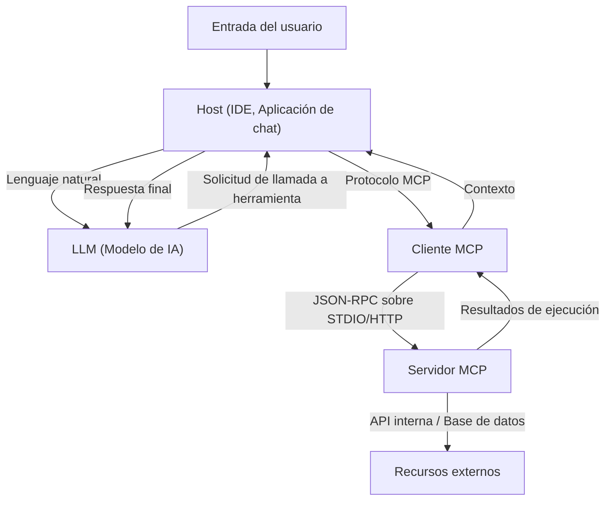

# El panorama completo de Model Context Protocol (MCP): La arquitectura de próxima generación que conecta la IA con los sistemas

En los últimos años, la evolución de los grandes modelos de lenguaje (LLM) ha sido notable, revolucionando industrias más allá del procesamiento de lenguaje natural, incluyendo el desarrollo de software, análisis de datos y automatización de negocios. Sin embargo, para que los LLMs liberen su verdadero valor, la inteligencia del modelo por sí sola no es suficiente. Una "interfaz" que permita al modelo interactuar de forma segura y eficiente con el mundo exterior—bases de datos, APIs internas, sistemas de archivos, servicios web—es absolutamente necesaria.

Para resolver este desafío ha surgido el **Model Context Protocol (MCP)**. MCP es un protocolo estandarizado para conectar modelos de IA con herramientas y fuentes de datos externas, permitiendo a los desarrolladores extender las capacidades de los agentes de IA de una manera unificada.

En este artículo, explicaremos en detalle desde una perspectiva técnica los antecedentes del nacimiento de MCP, los problemas que resuelve, la profundidad de su arquitectura, esquemas de implementación específicos y su modelo de seguridad.

---

## 1. Desafíos de proporcionar contexto a los LLMs y el nacimiento de MCP

### 1.1 El muro del contexto
Los LLMs retienen una gran cantidad de conocimiento dentro de sus parámetros preentrenados, pero no tienen acceso a la información más reciente o a datos privados dentro de organizaciones específicas. Para prevenir las "alucinaciones" y generar respuestas precisas, es necesario proporcionar el contexto adecuado en tiempo de ejecución utilizando RAG (Retrieval-Augmented Generation) o llamadas a herramientas (Function Calling).

Sin embargo, proporcionar contexto de la manera tradicional ha tenido los siguientes desafíos:
- **Interfaces fragmentadas**: Dado que cada proveedor de LLM (OpenAI, Anthropic, Google, etc.) define su propio formato de llamada a herramientas, los desarrolladores tenían que mantener diferentes implementaciones para cada modelo.
- **Complejidad de la gestión de estados**: Al ejecutar tareas de múltiples pasos, era una gran carga para la aplicación gestionar con precisión qué herramientas se llamaban, en qué orden y qué datos se devolviendo.
- **Seguridad y gobernanza**: Al permitir el acceso de los modelos de IA a los sistemas internos, cómo aplicar el principio de mínimo privilegio y cómo gestionar de forma centralizada la autenticación y autorización eran grandes preocupaciones.

### 1.2 Filosofía de diseño de Model Context Protocol
Para abordar estos desafíos, MCP se construyó en base a la siguiente filosofía de diseño:
1. **Estandarización**: Definir un protocolo unificado independiente del proveedor, de modo que las herramientas desarrolladas una vez se puedan reutilizar en cualquier modelo o cliente.
2. **Bajo acoplamiento (Loose Coupling)**: Separar los servidores que proporcionan herramientas y los clientes que utilizan LLMs para que puedan escalar y actualizarse de forma independiente.
3. **Límites seguros (Secure Boundaries)**: Realizar un control de acceso claro en el límite de la red, y proporcionar el contexto al modelo de IA dentro de un entorno aislado (sandbox) seguro.

---

## 2. La arquitectura de 3 capas de MCP: Cliente, Servidor y Host

MCP adopta una arquitectura que divide todo el sistema en tres componentes principales: **Host**, **Cliente (Client)** y **Servidor (Server)**. Esta separación facilita la construcción de aplicaciones complejas de IA.



### 2.1 Host (Aplicación Host)
El Host es la interfaz que interactúa directamente con el usuario (por ejemplo, IDEs como VS Code, chatbots internos, herramientas CLI, etc.). El Host recibe la entrada del usuario y la envía al LLM. Además, cuando recibe una solicitud del LLM diciendo "quiero ejecutar esta herramienta", la interpreta y delega el procesamiento al Cliente.

### 2.2 Cliente MCP (Client)
El Cliente funciona dentro o junto al Host, y gestiona la comunicación con el Servidor según el protocolo MCP. Los roles principales del Cliente son:
- Descubrimiento de Servidores disponibles y gestión de conexiones.
- Conversión de solicitudes abstractas de llamadas a herramientas desde el LLM en solicitudes JSON-RPC específicas de MCP.
- Verificación de la respuesta del Servidor, dándole un formato que el LLM pueda entender, y devolviéndola al Host.

### 2.3 Servidor MCP (Server)
El Servidor es el componente que interactúa directamente con los sistemas externos reales (bases de datos, APIs, sistemas de archivos). Al implementar un Servidor, los desarrolladores conectan sus propios sistemas al ecosistema MCP.
El Servidor notifica al Cliente qué tipo de herramientas (funciones) y recursos proporciona en forma de metadatos, y procesa las solicitudes de ejecución del Cliente, devolviendo los resultados.

---

## 3. Esquema específico de definición de herramientas y protocolo JSON-RPC

MCP adopta **JSON-RPC 2.0** como protocolo de comunicación. En la capa de transporte, utiliza `stdio` para la comunicación entre procesos locales, o `HTTP/SSE (Server-Sent Events)` para la comunicación a través de la red.

### 3.1 Notificación de metadatos de herramientas
Cuando el Cliente se conecta al Servidor, primero envía una solicitud `tools/list` y obtiene una lista de las herramientas disponibles.

**Solicitud (Cliente -> Servidor):**
```json
{
  "jsonrpc": "2.0",
  "id": 1,
  "method": "tools/list",
  "params": {}
}
```

**Respuesta (Servidor -> Cliente):**
```json
{
  "jsonrpc": "2.0",
  "id": 1,
  "result": {
    "tools": [
      {
        "name": "query_database",
        "description": "Obtiene información de la base de datos interna usando SQL.",
        "inputSchema": {
          "type": "object",
          "properties": {
            "sql_query": {
              "type": "string",
              "description": "Sentencia SELECT a ejecutar"
            },
            "limit": {
              "type": "integer",
              "default": 10
            }
          },
          "required": ["sql_query"]
        }
      }
    ]
  }
}
```

Lo importante aquí es `inputSchema`. Al utilizar JSON Schema para definir estrictamente los tipos de argumentos y los elementos obligatorios, se respalda fuertemente que el LLM llame a la herramienta en el formato correcto. Este esquema se mapea directamente al prompt del LLM (la definición de Function Calling) a través del Host.

### 3.2 Ejecución de la herramienta
Cuando el LLM decide ejecutar `query_database`, el Cliente envía una solicitud `tools/call` al Servidor.

**Solicitud (Cliente -> Servidor):**
```json
{
  "jsonrpc": "2.0",
  "id": 2,
  "method": "tools/call",
  "params": {
    "name": "query_database",
    "arguments": {
      "sql_query": "SELECT name, email FROM users WHERE status = 'active'",
      "limit": 5
    }
  }
}
```

**Respuesta (Servidor -> Cliente):**
```json
{
  "jsonrpc": "2.0",
  "id": 2,
  "result": {
    "content": [
      {
        "type": "text",
        "text": "name: Alice, email: alice@example.com\nname: Bob, email: bob@example.com"
      }
    ]
  }
}
```

---

## 4. Vinculación de prompts y herramientas: Gestión avanzada de contexto

MCP no es solo un protocolo de llamada a procedimiento remoto (RPC) para funciones. También cuenta con funciones de gestión de "plantillas de prompts" y "recursos".

### 4.1 Recursos (Resources)
Mientras que las herramientas realizan acciones dinámicas (escritura de datos y búsquedas), los recursos proporcionan contexto estático (archivos de registro, páginas Wiki, documentación de API, etc.). El Servidor puede exponer el contexto que quiere que el LLM lea a través de una base URI, usando los métodos `resources/list` o `resources/read`.
Esto permite al Host automatizar el proceso de incluir, por ejemplo, "el texto en este URI como conocimiento previo" en el prompt del LLM.

### 4.2 Prompts
Es una función que permite al Servidor proporcionar plantillas de prompts predefinidas al Cliente. Por ejemplo, el Servidor puede ofrecer una plantilla llamada "prompt para la corrección de errores", y el Cliente puede pasar argumentos (como mensajes de error) para obtener la cadena del prompt completada.
De esta manera, la ingeniería de prompts se separa del Cliente (lado de la aplicación), permitiendo una gestión de versiones y optimización centralizada en el lado del Servidor (backend).

---

## 5. Seguridad y control de acceso

Al permitir el comportamiento autónomo de los agentes de IA, lo más importante es la seguridad. MCP proporciona varios límites de seguridad sólidos a nivel de arquitectura.

### 5.1 Aislamiento de red y elección de transporte
No es necesario exponer un Servidor MCP que accede a sistemas internos altamente confidenciales a la internet pública. Puede operarse en la máquina local del desarrollador o en una red privada dentro de una VPC corporativa, comunicándose con el Cliente a través de `stdio` o la red interna. Incluso si la API del LLM en sí está en la nube, la obtención de datos se completa localmente entre el Cliente y el Servidor, y solo se envía al LLM la información necesaria.

### 5.2 Human-in-the-loop (Humano en el bucle)
En la especificación del protocolo de MCP, se recomienda implementar un flujo donde la aplicación Host solicite aprobación explícita al usuario antes de ejecuciones de herramientas importantes que impliquen cambios en los datos (actualizaciones en bases de datos, envío de correos electrónicos, etc.). El servidor puede añadir un flag como `require_approval: true` (especificación de extensión) a los metadatos de la herramienta, permitiendo un diseño que asegure la confirmación en el lado del cliente.

### 5.3 Autenticación y propagación de contexto
Cuando un Servidor llama a una API externa, es importante saber con qué permisos se está ejecutando. En MCP, se puede construir un mecanismo para propagar de manera segura el token OAuth o la información de sesión del usuario, obtenidos en el lado del Host, hacia el Servidor, ya sea a través de los encabezados de la solicitud o variables de entorno. Esto evita que la IA acceda a los datos superando los permisos del usuario.

---

## 6. El desarrollo de software del futuro que trae MCP

Con la popularización de Model Context Protocol, el ecosistema de IA pasará de una era de "integraciones individuales" a una era "plug-and-play" (conectar y usar).

- **Reducción de la carga de los desarrolladores**: Al envolver sus propias APIs como un Servidor MCP una sola vez, las empresas podrán hacerlas accesibles a través de un LLM desde cualquier cliente compatible con MCP, como VS Code, bots de Slack o herramientas internas personalizadas.
- **Mejora en la autonomía de los agentes de IA**: A través de esquemas unificados y un manejo de errores claro, los LLMs mejorarán drásticamente su capacidad para comprender los fallos en las llamadas a herramientas y corregir parámetros de manera autónoma para volver a intentarlo.
- **Formación de un ecosistema abierto**: Impulsado por la comunidad, se publicarán como código abierto diversos Servidores MCP (para acceso a GitHub, integración con Jira, gestión de AWS, etc.), permitiendo que cualquier persona pueda construir fácilmente potentes asistentes de IA.

### Conclusión
MCP es un puente robusto y flexible para conectar la IA con los sistemas externos. Al estandarizar la gestión de prompts, herramientas y recursos, y al separar las preocupaciones del cliente y el servidor, los desarrolladores pueden construir aplicaciones de IA de próxima generación que sean más seguras y escalables. Como base para liberar el verdadero potencial de la IA, el futuro desarrollo de MCP es digno de ser seguido de cerca.
