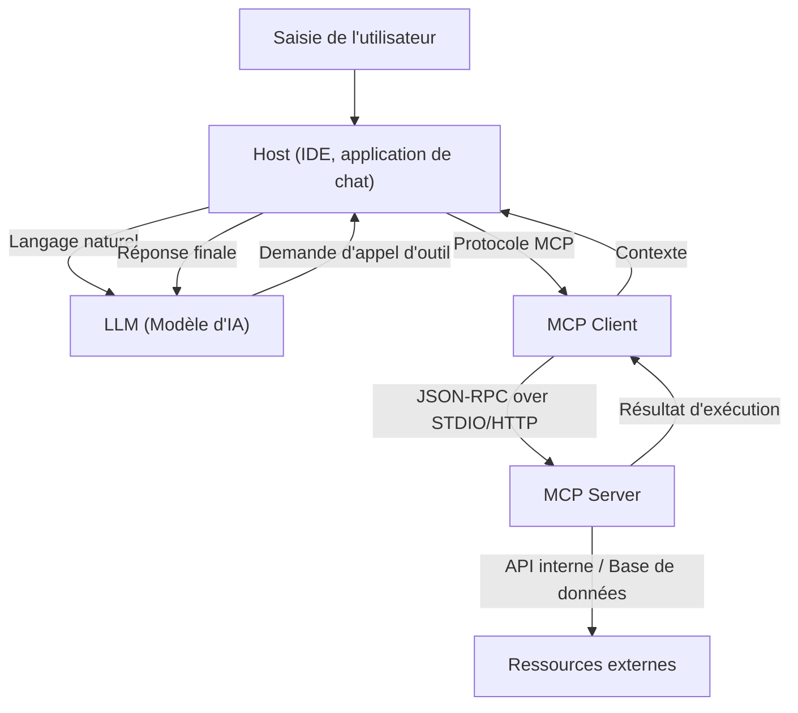

# Vue d'ensemble du Model Context Protocol (MCP) : L'architecture de nouvelle génération reliant l'IA et les systèmes

Ces dernières années, l'évolution des grands modèles de langage (LLM) a été remarquable, dépassant le domaine du traitement du langage naturel pour révolutionner toutes les industries, telles que le développement de logiciels, l'analyse de données et l'automatisation des tâches. Cependant, pour que les LLM déploient leur véritable valeur, l'intelligence du modèle seul est insuffisante. Il est essentiel de disposer d'une "interface" permettant au modèle de dialoguer de manière sûre et efficace avec le monde extérieur : bases de données, API internes, systèmes de fichiers et services web.

C'est pour résoudre ce problème qu'est apparu le **Model Context Protocol (MCP)**. Le MCP est un protocole standardisé pour connecter les modèles d'IA aux outils et sources de données externes, permettant aux développeurs d'étendre les capacités des agents IA de manière unifiée.

Cet article explique en détail, d'un point de vue technique, le contexte de la naissance du MCP, les problèmes qu'il résout, la profondeur de son architecture, ses schémas d'implémentation concrets et son modèle de sécurité.

---

## 1. Les défis de la fourniture de contexte aux LLM et la naissance du MCP

### 1.1 Le mur du contexte
Les LLM conservent de vastes connaissances dans leurs paramètres pré-entraînés, mais ils n'ont pas accès aux informations récentes ni aux données privées au sein de certaines organisations. Pour prévenir ces "hallucinations" et générer des réponses précises, il est nécessaire de fournir un contexte approprié au moment de l'exécution en utilisant le RAG (Retrieval-Augmented Generation) ou l'appel d'outils (Function Calling).

Cependant, la fourniture de contexte traditionnelle présentait les défis suivants :
- **Fragmentation des interfaces** : Chaque fournisseur de LLM (OpenAI, Anthropic, Google, etc.) définissant son propre format d'appel d'outils, les développeurs devaient maintenir des implémentations différentes pour chaque modèle.
- **Complexité de la gestion de l'état** : Lors de l'exécution de tâches comprenant plusieurs étapes, il incombait à l'application de gérer précisément quels outils étaient appelés, dans quel ordre et quelles données étaient renvoyées, ce qui représentait une lourde charge.
- **Sécurité et gouvernance** : Lors de l'octroi de l'accès aux systèmes internes aux modèles d'IA, la manière d'appliquer le principe du moindre privilège et de centraliser l'authentification et l'autorisation était une préoccupation majeure.

### 1.2 Philosophie de conception du Model Context Protocol
Pour relever ces défis, le MCP a été construit sur la base de la philosophie de conception suivante :
1. **Standardisation** : Définir un protocole unifié indépendant du fournisseur, rendant un outil développé une fois réutilisable avec n'importe quel modèle ou client.
2. **Couplage lâche (Loose Coupling)** : Séparer le serveur fournissant l'outil du client utilisant le LLM, permettant de les faire évoluer et de les mettre à jour indépendamment.
3. **Limites sécurisées (Secure Boundaries)** : Implémenter un contrôle d'accès clair aux limites du réseau et fournir un contexte au modèle d'IA dans un bac à sable sécurisé.

---

## 2. L'architecture à 3 niveaux du MCP : Client, Serveur, Hôte

Le MCP adopte une architecture divisant l'ensemble du système en trois composants principaux : **Host (Hôte)**, **Client (Client)** et **Server (Serveur)**. Cette séparation facilite la création d'applications d'IA complexes.



### 2.1 Host (Application hôte)
L'Hôte est l'interface qui interagit directement avec l'utilisateur (par exemple, un IDE comme VS Code, un chatbot interne, un outil CLI, etc.). L'Hôte reçoit les entrées de l'utilisateur et les envoie au LLM. De plus, lorsqu'il reçoit une demande "Je veux exécuter cet outil" de la part du LLM, il l'interprète et délègue le traitement au Client.

### 2.2 MCP Client (Client)
Le Client fonctionne à l'intérieur ou à côté de l'Hôte et gère la communication avec le Serveur selon le protocole MCP. Les rôles principaux du Client sont les suivants :
- Découverte des Serveurs disponibles et gestion des connexions
- Conversion des requêtes abstraites d'appel d'outils du LLM en requêtes concrètes JSON-RPC du MCP
- Validation des réponses du Serveur, formatage dans un format compréhensible par le LLM et renvoi à l'Hôte

### 2.3 MCP Server (Serveur)
Le Serveur est le composant qui interagit directement avec les systèmes externes réels (bases de données, API, systèmes de fichiers). En implémentant un Serveur, les développeurs connectent leurs systèmes à l'écosystème MCP.
Le Serveur notifie au Client sous forme de métadonnées quels outils (fonctions) et ressources il fournit, traite les demandes d'exécution du Client et renvoie les résultats.

---

## 3. Schéma de définition d'outil concret et protocole JSON-RPC

Le MCP adopte **JSON-RPC 2.0** comme protocole de communication. Au niveau de la couche de transport, il utilise `stdio` pour la communication inter-processus locale, ou `HTTP/SSE (Server-Sent Events)` pour la communication via le réseau.

### 3.1 Notification des métadonnées des outils
Lorsque le Client se connecte au Serveur, il envoie d'abord une requête `tools/list` pour obtenir une liste des outils disponibles.

**Requête (Client -> Serveur) :**
```json
{
  "jsonrpc": "2.0",
  "id": 1,
  "method": "tools/list",
  "params": {}
}
```

**Réponse (Serveur -> Client) :**
```json
{
  "jsonrpc": "2.0",
  "id": 1,
  "result": {
    "tools": [
      {
        "name": "query_database",
        "description": "Récupère des informations de la base de données interne à l'aide de SQL.",
        "inputSchema": {
          "type": "object",
          "properties": {
            "sql_query": {
              "type": "string",
              "description": "La requête SELECT à exécuter"
            },
            "limit": {
              "type": "integer",
              "default": 10
            }
          },
          "required": ["sql_query"]
        }
      }
    ]
  }
}
```

Ce qui est important ici, c'est `inputSchema`. En utilisant JSON Schema pour définir strictement les types d'arguments et les éléments requis, il aide fortement le LLM à appeler l'outil dans le format correct. Ce schéma est directement mappé au prompt du LLM (définition du Function Calling) via l'Hôte.

### 3.2 Exécution de l'outil
Lorsque le LLM décide d'exécuter `query_database`, le Client envoie une requête `tools/call` au Serveur.

**Requête (Client -> Serveur) :**
```json
{
  "jsonrpc": "2.0",
  "id": 2,
  "method": "tools/call",
  "params": {
    "name": "query_database",
    "arguments": {
      "sql_query": "SELECT name, email FROM users WHERE status = 'active'",
      "limit": 5
    }
  }
}
```

**Réponse (Serveur -> Client) :**
```json
{
  "jsonrpc": "2.0",
  "id": 2,
  "result": {
    "content": [
      {
        "type": "text",
        "text": "name: Alice, email: alice@example.com\nname: Bob, email: bob@example.com"
      }
    ]
  }
}
```

---

## 4. Lier les prompts et les outils : Gestion avancée du contexte

Le MCP n'est pas simplement un protocole d'appel de procédure à distance (RPC) pour les fonctions. Il dispose également de fonctionnalités de gestion pour les "modèles de prompt" et les "ressources".

### 4.1 Ressources (Resources)
Alors que les outils effectuent des actions dynamiques (écriture ou recherche de données), les ressources fournissent un contexte statique (fichiers journaux, pages wiki, documentation API, etc.). Le Serveur peut exposer le contexte qu'il souhaite que le LLM lise sous forme d'URI via les méthodes `resources/list` et `resources/read`.
Cela permet à l'Hôte d'automatiser des processus tels que "inclure le texte de cet URI en tant que connaissance préalable" dans le prompt du LLM.

### 4.2 Prompts
Il s'agit d'une fonctionnalité qui fournit au Client des modèles de prompt prédéfinis côté Serveur. Par exemple, le Serveur fournit un modèle appelé "Prompt pour la correction de bogues", et le Client transmet des arguments (tels que des messages d'erreur) pour obtenir une chaîne de prompt complète.
Cela permet de séparer l'ingénierie des prompts du Client (côté application) et de centraliser le contrôle de version et l'optimisation côté Serveur en arrière-plan.

---

## 5. Sécurité et contrôle d'accès

Lorsqu'on autorise un agent d'IA à agir de manière autonome, la sécurité est la chose la plus importante. Le MCP offre plusieurs frontières de sécurité puissantes au niveau de l'architecture.

### 5.1 Isolation du réseau et choix du transport
Un Serveur MCP accédant à des systèmes internes hautement confidentiels n'a pas besoin d'être exposé sur l'Internet public. Il peut être exécuté sur la machine locale d'un développeur ou sur un réseau privé au sein d'un VPC d'entreprise, communiquant avec le Client via `stdio` ou un réseau interne. Même si l'API du LLM elle-même se trouve dans le cloud, la récupération des données s'effectue localement entre le Client et le Serveur, et seules les informations nécessaires sont envoyées au LLM.

### 5.2 L'humain dans la boucle (Human-in-the-loop)
La spécification du protocole MCP recommande que l'application Hôte implémente un flux demandant l'approbation explicite de l'utilisateur avant toute exécution d'outil critique impliquant une modification des données (mise à jour de la base de données, envoi d'e-mails, etc.). Le serveur peut être conçu pour attribuer un indicateur tel que `require_approval: true` (spécification étendue) aux métadonnées de l'outil, incitant de manière fiable à la confirmation côté client.

### 5.3 Authentification et propagation du contexte
Lorsque le Serveur appelle une API externe, l'autorité sous laquelle il s'exécute est importante. Dans le MCP, un mécanisme peut être mis en place pour propager en toute sécurité les jetons OAuth et les informations de session de l'utilisateur obtenus côté Hôte vers le Serveur via les en-têtes de requête ou les variables d'environnement. Cela empêche l'IA d'accéder aux données au-delà des privilèges de l'utilisateur.

---

## 6. L'avenir du développement logiciel apporté par le MCP

Avec la démocratisation du Model Context Protocol, l'écosystème de l'IA passera de l'ère de "l'intégration individuelle" à celle du "plug-and-play".

- **Réduction de la charge pour les développeurs** : En enveloppant simplement leurs propres API en tant que Serveurs MCP une seule fois, les entreprises peuvent les rendre accessibles via des LLM à partir de n'importe quel client compatible MCP, tel que VS Code, les bots Slack ou des outils internes propriétaires.
- **Amélioration de l'autonomie des agents d'IA** : Avec un schéma unifié et une gestion claire des erreurs, la capacité du LLM à comprendre les échecs d'appel d'outils et à modifier de manière autonome les paramètres pour réessayer sera considérablement améliorée.
- **Formation d'un écosystème ouvert** : Piloté par la communauté, divers Serveurs MCP (accès GitHub, intégration Jira, gestion AWS, etc.) seront publiés en open source, permettant à quiconque de créer facilement de puissants assistants d'IA.

### Conclusion
Le MCP est un pont solide et flexible pour connecter l'IA aux systèmes externes. En standardisant la gestion des prompts, des outils et des ressources, et en séparant les préoccupations du client et du serveur, les développeurs peuvent créer des applications d'IA de nouvelle génération plus sûres et plus évolutives. En tant que base permettant de libérer le véritable potentiel de l'IA, le développement futur du MCP est à suivre de près.
