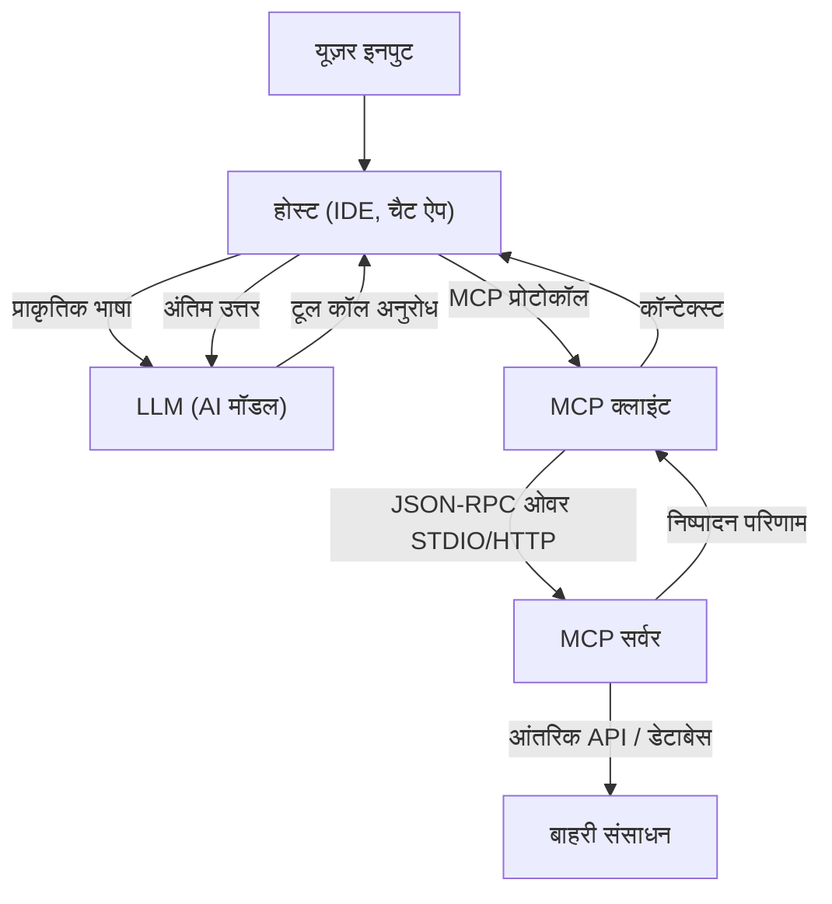

# मॉडल कॉन्टेक्स्ट प्रोटोकॉल (MCP) का पूरा अवलोकन: AI और सिस्टम को जोड़ने वाला नेक्स्ट-जेनरेशन आर्किटेक्चर

हाल के वर्षों में, लार्ज लैंग्वेज मॉडल्स (LLM) का विकास उल्लेखनीय रहा है, और यह प्राकृतिक भाषा प्रसंस्करण (Natural Language Processing) के क्षेत्र से आगे बढ़कर सॉफ्टवेयर विकास, डेटा विश्लेषण और व्यवसाय स्वचालन (Business Automation) जैसे हर उद्योग में क्रांति ला रहा है। हालाँकि, LLM को अपने वास्तविक मूल्य को प्राप्त करने के लिए, अकेले मॉडल की बुद्धिमत्ता पर्याप्त नहीं है। एक "इंटरफ़ेस" नितांत आवश्यक है, जिससे मॉडल बाहरी दुनिया—डेटाबेस, आंतरिक API, फ़ाइल सिस्टम, वेब सेवाओं—के साथ सुरक्षित और कुशलतापूर्वक बातचीत कर सके।

इस समस्या को हल करने के लिए **मॉडल कॉन्टेक्स्ट प्रोटोकॉल (MCP)** सामने आया है। MCP AI मॉडल और बाहरी टूल्स या डेटा स्रोतों को जोड़ने के लिए एक मानकीकृत प्रोटोकॉल है, जो डेवलपर्स को एक एकीकृत तरीके से AI एजेंटों की क्षमताओं का विस्तार करने की अनुमति देता है।

इस लेख में, हम MCP के जन्म की पृष्ठभूमि, इसके द्वारा हल की जाने वाली समस्याओं, इसके आर्किटेक्चर की गहराई, विशिष्ट कार्यान्वयन स्कीमा (Implementation Schema), और इसके सुरक्षा मॉडल (Security Model) के बारे में तकनीकी दृष्टिकोण से विस्तार से बताएंगे।

---

## 1. LLM को कॉन्टेक्स्ट प्रदान करने की चुनौतियाँ और MCP का जन्म

### 1.1 कॉन्टेक्स्ट की दीवार
LLM अपने प्री-ट्रेंड (pre-trained) मापदंडों के भीतर भारी मात्रा में ज्ञान रखते हैं, लेकिन वे नवीनतम जानकारी या विशिष्ट संगठनों के भीतर निजी डेटा तक नहीं पहुँच सकते। "हेलुसिनेशन (Hallucination)" को रोकने और सटीक उत्तर उत्पन्न करने के लिए, RAG (Retrieval-Augmented Generation) या टूल कॉलिंग (Function Calling) का उपयोग करके रनटाइम पर उचित कॉन्टेक्स्ट प्रदान करना आवश्यक है।

हालाँकि, पारंपरिक रूप से कॉन्टेक्स्ट प्रदान करने में निम्नलिखित चुनौतियाँ थीं:
- **इंटरफेस का विखंडन**: चूँकि प्रत्येक LLM प्रदाता (OpenAI, Anthropic, Google, आदि) अपने स्वयं के टूल कॉलिंग प्रारूपों को परिभाषित करता है, डेवलपर्स को प्रत्येक मॉडल के लिए अलग-अलग कार्यान्वयन बनाए रखना पड़ता था।
- **स्टेट मैनेजमेंट (State Management) की जटिलता**: बहु-चरणीय (multi-step) कार्यों को निष्पादित करते समय, यह ट्रैक करने का बोझ कि कौन सा टूल किस क्रम में बुलाया गया था और कौन सा डेटा वापस आया था, एप्लिकेशन की तरफ बहुत अधिक था।
- **सुरक्षा और प्रशासन (Governance)**: AI मॉडल को आंतरिक प्रणालियों तक पहुँच प्रदान करते समय, न्यूनतम विशेषाधिकार (least privilege) के सिद्धांत को कैसे लागू किया जाए और प्रमाणीकरण (authentication)/प्राधिकरण (authorization) को केंद्रीय रूप से कैसे प्रबंधित किया जाए, यह एक बड़ी चिंता का विषय था।

### 1.2 मॉडल कॉन्टेक्स्ट प्रोटोकॉल की डिज़ाइन फिलॉसफी
इन चुनौतियों का समाधान करने के लिए, MCP को निम्नलिखित डिज़ाइन सिद्धांतों के आधार पर बनाया गया था:
1. **मानकीकरण (Standardization)**: एक प्रदाता-स्वतंत्र, एकीकृत प्रोटोकॉल को परिभाषित करें, जिससे एक बार विकसित किए गए टूल का किसी भी मॉडल या क्लाइंट पर पुन: उपयोग किया जा सके।
2. **लूज़ कपलिंग (Loose Coupling)**: टूल्स प्रदान करने वाले सर्वर और LLM का उपयोग करने वाले क्लाइंट को अलग करें, जिससे वे स्वतंत्र रूप से स्केल और अपडेट हो सकें।
3. **सुरक्षित सीमाएँ (Secure Boundaries)**: नेटवर्क सीमाओं पर स्पष्ट एक्सेस कंट्रोल (Access Control) लागू करें और AI मॉडल को कॉन्टेक्स्ट सुरक्षित सैंडबॉक्स (Sandbox) के भीतर प्रदान करें।

---

## 2. MCP का 3-टियर आर्किटेक्चर: क्लाइंट, सर्वर, होस्ट

MCP एक ऐसे आर्किटेक्चर को अपनाता है जो संपूर्ण सिस्टम को तीन मुख्य घटकों में विभाजित करता है: **होस्ट (Host)**, **क्लाइंट (Client)**, और **सर्वर (Server)**। यह पृथक्करण जटिल AI एप्लिकेशनों के निर्माण को आसान बनाता है।



### 2.1 होस्ट (होस्ट एप्लिकेशन)
होस्ट वह इंटरफ़ेस है जो सीधे उपयोगकर्ता (जैसे, VS Code जैसे IDE, आंतरिक चैटबॉट, CLI टूल आदि) के साथ बातचीत करता है। होस्ट उपयोगकर्ता के इनपुट को प्राप्त करता है और उसे LLM को भेजता है। साथ ही, जब उसे LLM से "मैं इस टूल को निष्पादित करना चाहता हूँ" का अनुरोध मिलता है, तो यह इसकी व्याख्या करता है और प्रसंस्करण (processing) को क्लाइंट को सौंप देता है।

### 2.2 MCP क्लाइंट (Client)
क्लाइंट होस्ट के भीतर या उसके साथ काम करता है, और MCP प्रोटोकॉल के अनुसार सर्वर के साथ संचार का प्रबंधन करता है। क्लाइंट की मुख्य भूमिकाएँ इस प्रकार हैं:
- उपलब्ध सर्वरों की खोज (Discovery) और कनेक्शन प्रबंधन
- LLM के अमूर्त (abstract) टूल कॉलिंग अनुरोधों को विशिष्ट MCP JSON-RPC अनुरोधों में परिवर्तित करना
- सर्वर से मिली प्रतिक्रिया को सत्यापित (validate) करना और इसे ऐसे प्रारूप (format) में ढालना जिसे LLM समझ सके, और इसे होस्ट को वापस करना

### 2.3 MCP सर्वर (Server)
सर्वर वह घटक है जो वास्तविक बाहरी प्रणालियों (डेटाबेस, API, फ़ाइल सिस्टम) के साथ सीधे बातचीत करता है। सर्वर को लागू (implement) करके, डेवलपर्स अपने स्वयं के सिस्टम को MCP इकोसिस्टम से जोड़ते हैं।
सर्वर क्लाइंट को मेटाडेटा (Metadata) के रूप में सूचित करता है कि वह कौन से टूल (फ़ंक्शन) या संसाधन प्रदान करता है, क्लाइंट के निष्पादन अनुरोधों (Execution requests) को संसाधित करता है, और परिणाम लौटाता है।

---

## 3. विशिष्ट टूल परिभाषा स्कीमा और JSON-RPC प्रोटोकॉल

MCP संचार प्रोटोकॉल के रूप में **JSON-RPC 2.0** को अपनाता है। ट्रांसपोर्ट परत (Transport layer) में, यह स्थानीय प्रक्रिया-से-प्रक्रिया संचार (inter-process communication) के लिए `stdio` का उपयोग करता है, या नेटवर्क पर संचार के लिए `HTTP/SSE (Server-Sent Events)` का उपयोग करता है।

### 3.1 टूल मेटाडेटा अधिसूचना (Notification)
जब क्लाइंट सर्वर से कनेक्ट होता है, तो वह सबसे पहले `tools/list` अनुरोध भेजता है ताकि उपलब्ध टूल्स की सूची प्राप्त की जा सके।

**अनुरोध (Client -> Server):**
```json
{
  "jsonrpc": "2.0",
  "id": 1,
  "method": "tools/list",
  "params": {}
}
```

**प्रतिक्रिया (Server -> Client):**
```json
{
  "jsonrpc": "2.0",
  "id": 1,
  "result": {
    "tools": [
      {
        "name": "query_database",
        "description": "SQL का उपयोग करके आंतरिक डेटाबेस से जानकारी प्राप्त करता है।",
        "inputSchema": {
          "type": "object",
          "properties": {
            "sql_query": {
              "type": "string",
              "description": "निष्पादित करने के लिए SELECT स्टेटमेंट"
            },
            "limit": {
              "type": "integer",
              "default": 10
            }
          },
          "required": ["sql_query"]
        }
      }
    ]
  }
}
```

यहाँ जो महत्वपूर्ण है वह `inputSchema` है। JSON Schema का उपयोग करके तर्कों (arguments) के प्रकार (type) और आवश्यक (required) फ़ील्ड्स को सख्ती से परिभाषित करके, यह दृढ़ता से समर्थन करता है कि LLM सही प्रारूप में टूल को कॉल करता है। यह स्कीमा होस्ट के माध्यम से सीधे LLM के प्रॉम्प्ट (Function Calling परिभाषा) में मैप किया जाता है।

### 3.2 टूल का निष्पादन
जब LLM `query_database` को निष्पादित करने का निर्णय लेता है, तो क्लाइंट सर्वर को `tools/call` अनुरोध भेजता है।

**अनुरोध (Client -> Server):**
```json
{
  "jsonrpc": "2.0",
  "id": 2,
  "method": "tools/call",
  "params": {
    "name": "query_database",
    "arguments": {
      "sql_query": "SELECT name, email FROM users WHERE status = 'active'",
      "limit": 5
    }
  }
}
```

**प्रतिक्रिया (Server -> Client):**
```json
{
  "jsonrpc": "2.0",
  "id": 2,
  "result": {
    "content": [
      {
        "type": "text",
        "text": "name: Alice, email: alice@example.com\nname: Bob, email: bob@example.com"
      }
    ]
  }
}
```

---

## 4. प्रॉम्प्ट और टूल को जोड़ना: उन्नत कॉन्टेक्स्ट प्रबंधन

MCP केवल एक रिमोट प्रोसीजर कॉल (RPC) प्रोटोकॉल नहीं है। यह "प्रॉम्प्ट टेम्प्लेट (Prompt Templates)" और "संसाधन (Resources)" के प्रबंधन की सुविधाएँ भी प्रदान करता है।

### 4.1 संसाधन (Resources)
जहाँ उपकरण गतिशील क्रियाएँ (डायनामिक एक्शन्स) करते हैं (जैसे डेटा लिखना या खोजना), संसाधन स्थिर कॉन्टेक्स्ट (लॉग फ़ाइलें, विकी पेज, API दस्तावेज़ आदि) प्रदान करते हैं। सर्वर `resources/list` और `resources/read` विधियों (methods) के माध्यम से URI के आधार पर उन कॉन्टेक्स्ट को उजागर कर सकता है जिन्हें वह LLM को पढ़ाना चाहता है।
यह होस्ट को LLM प्रॉम्प्ट में "इस URI के पाठ को पूर्व-ज्ञान के रूप में शामिल करें" जैसी प्रक्रियाओं को स्वचालित करने की अनुमति देता है।

### 4.2 प्रॉम्प्ट (Prompts)
यह सर्वर साइड पर पहले से परिभाषित प्रॉम्प्ट टेम्प्लेट क्लाइंट को प्रदान करने का एक कार्य है। उदाहरण के लिए, सर्वर "बग फिक्सिंग के लिए प्रॉम्प्ट" टेम्प्लेट प्रदान कर सकता है, और क्लाइंट पूर्ण प्रॉम्प्ट स्ट्रिंग प्राप्त करने के लिए तर्क (arguments जैसे कि एरर मैसेज) पास कर सकता है।
यह क्लाइंट (एप्लिकेशन पक्ष) से प्रॉम्प्ट इंजीनियरिंग को अलग करने की अनुमति देता है, जिससे बैकएंड सर्वर साइड पर केंद्रीकृत संस्करण नियंत्रण (Version Control) और अनुकूलन (Optimization) संभव हो जाता है।

---

## 5. सुरक्षा और एक्सेस कंट्रोल

जब AI एजेंटों को स्वायत्तता (Autonomy) से कार्य करने की अनुमति दी जाती है, तो सुरक्षा सबसे महत्वपूर्ण हो जाती है। MCP आर्किटेक्चर के स्तर पर कई शक्तिशाली सुरक्षा सीमाएँ (Security Boundaries) प्रदान करता है।

### 5.1 नेटवर्क आइसोलेशन और ट्रांसपोर्ट का विकल्प
अत्यधिक संवेदनशील आंतरिक प्रणालियों तक पहुँचने वाले MCP सर्वरों को सार्वजनिक इंटरनेट पर उजागर करने की आवश्यकता नहीं है। उन्हें डेवलपर की स्थानीय मशीन या आंतरिक VPC के भीतर एक निजी नेटवर्क पर चलाया जा सकता है, और वे `stdio` या आंतरिक नेटवर्क के माध्यम से क्लाइंट के साथ संवाद कर सकते हैं। भले ही LLM का API क्लाउड में हो, डेटा पुनर्प्राप्ति (Retrieval) स्थानीय क्लाइंट और सर्वर के बीच पूरी हो जाती है, और केवल आवश्यक जानकारी ही LLM को भेजी जाती है।

### 5.2 ह्यूमन-इन-द-लूप (Human-in-the-loop)
MCP प्रोटोकॉल विनिर्देशों (Specifications) में यह अनुशंसा की जाती है कि होस्ट एप्लिकेशन महत्वपूर्ण टूल निष्पादन (जैसे डेटाबेस अपडेट करना, ईमेल भेजना आदि) से पहले स्पष्ट रूप से उपयोगकर्ता की स्वीकृति माँगने वाला प्रवाह (Flow) लागू करे। सर्वर टूल के मेटाडेटा में `require_approval: true` जैसे फ्लैग जोड़ सकता है (एक्सटेंशन के रूप में), ताकि क्लाइंट साइड पर उपयोगकर्ता से पुष्टिकरण सुनिश्चित किया जा सके।

### 5.3 प्रमाणीकरण (Authentication) और कॉन्टेक्स्ट प्रोपेगेशन
जब सर्वर किसी बाहरी API को कॉल करता है, तो यह जानना महत्वपूर्ण होता है कि यह किसके विशेषाधिकार (Privileges) के तहत निष्पादित हो रहा है। MCP में, आप अनुरोध के हेडर या पर्यावरण चर (Environment Variables) के माध्यम से होस्ट साइड पर प्राप्त उपयोगकर्ता के OAuth टोकन या सत्र (Session) की जानकारी को सुरक्षित रूप से सर्वर तक पहुँचाने के लिए एक तंत्र बना सकते हैं। यह AI को उपयोगकर्ता के अधिकारों को पार करने और डेटा तक पहुँचने से रोकता है।

---

## 6. MCP द्वारा लाया जाने वाला सॉफ्टवेयर विकास का भविष्य

मॉडल कॉन्टेक्स्ट प्रोटोकॉल के व्यापक प्रसार के साथ, AI इकोसिस्टम "व्यक्तिगत एकीकरण (Individual Integration)" के युग से "प्लग-एंड-प्ले (Plug-and-play)" के युग में प्रवेश कर रहा है।

- **डेवलपर्स के बोझ में कमी**: कंपनियाँ अपने API को एक बार MCP सर्वर के रूप में रैप (wrap) कर सकती हैं, और यह VS Code, Slack बॉट्स, या उनके अपने कस्टम आंतरिक टूल जैसे किसी भी MCP-संगत क्लाइंट से LLM के माध्यम से एक्सेस किया जा सकेगा।
- **AI एजेंटों की स्वायत्तता (Autonomy) में सुधार**: एक एकीकृत स्कीमा और स्पष्ट त्रुटि हैंडलिंग (Error Handling) के साथ, LLM की टूल कॉलिंग में विफलता को समझने और पैरामीटर्स को स्वायत्त रूप से सही करने और पुनः प्रयास करने की क्षमता में नाटकीय रूप से सुधार होगा।
- **एक खुले इकोसिस्टम का निर्माण**: समुदाय-संचालित तरीके से, ओपन सोर्स के रूप में विभिन्न MCP सर्वर (GitHub एक्सेस, Jira इंटीग्रेशन, AWS मैनेजमेंट आदि) जारी किए जाएंगे, जिससे किसी के लिए भी शक्तिशाली AI सहायक बनाना आसान हो जाएगा।

### निष्कर्ष
MCP AI और बाहरी प्रणालियों को जोड़ने के लिए एक मजबूत और लचीला पुल है। प्रॉम्प्ट, टूल और संसाधनों के प्रबंधन को मानकीकृत करके, और क्लाइंट व सर्वर की चिंताओं को अलग करके, डेवलपर्स सुरक्षित और अधिक स्केलेबल नेक्स्ट-जेनरेशन AI एप्लिकेशन्स का निर्माण कर सकते हैं। AI की वास्तविक क्षमता को अनलॉक करने के लिए एक आधार के रूप में, MCP का भविष्य का विकास देखने लायक है。
