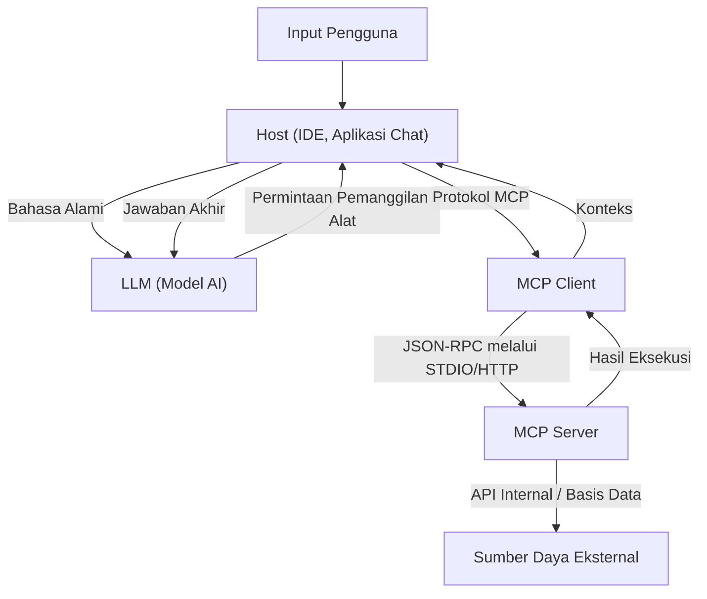

# Gambaran Lengkap Model Context Protocol (MCP): Arsitektur Generasi Berikutnya yang Menghubungkan AI dan Sistem

Dalam beberapa tahun terakhir, evolusi Large Language Models (LLM) sangat luar biasa, melampaui bidang pemrosesan bahasa alami dan membawa revolusi pada setiap industri seperti pengembangan perangkat lunak, analisis data, dan otomatisasi bisnis. Namun, agar LLM dapat menunjukkan nilai aslinya, kecerdasan model itu sendiri tidaklah cukup. Sebuah "antarmuka" mutlak diperlukan bagi model tersebut agar dapat berinteraksi dengan aman dan efisien dengan dunia luar—basis data, API internal, sistem berkas, dan layanan web.

Untuk memecahkan masalah ini, **Model Context Protocol (MCP)** hadir. MCP adalah protokol standar untuk menghubungkan model AI dengan alat eksternal dan sumber data, memungkinkan pengembang untuk memperluas kemampuan agen AI dengan cara yang terpadu.

Artikel ini akan menjelaskan secara mendetail dari sudut pandang teknis mengenai latar belakang lahirnya MCP, tantangan yang diselesaikannya, kedalaman arsitekturnya, skema implementasi spesifik, serta model keamanannya.

---

## 1. Tantangan Memberikan Konteks kepada LLM dan Lahirnya MCP

### 1.1 Kendala Konteks
LLM memiliki pengetahuan yang sangat luas dalam parameter yang telah dilatih sebelumnya, tetapi mereka tidak dapat mengakses informasi terbaru atau data pribadi dalam organisasi tertentu. Untuk mencegah "halusinasi" ini dan menghasilkan jawaban yang akurat, perlu memberikan konteks yang tepat saat runtime menggunakan RAG (Retrieval-Augmented Generation) atau pemanggilan alat (Function Calling).

Namun, pemberian konteks konvensional memiliki tantangan berikut:
- **Fragmentasi Antarmuka**: Karena masing-masing penyedia LLM (OpenAI, Anthropic, Google, dll.) mendefinisikan format pemanggilan alat mereka sendiri, pengembang harus mempertahankan implementasi yang berbeda untuk setiap model.
- **Kompleksitas Manajemen Status (State Management)**: Ketika menjalankan tugas yang mencakup banyak langkah, merupakan beban besar bagi sisi aplikasi untuk mengelola dengan akurat alat mana yang dipanggil dalam urutan apa dan data apa yang dikembalikan.
- **Keamanan dan Tata Kelola**: Saat memberikan izin kepada model AI untuk mengakses sistem internal, bagaimana menerapkan prinsip hak istimewa paling rendah (least privilege) dan bagaimana mengelola autentikasi serta otorisasi secara terpusat menjadi perhatian utama.

### 1.2 Filosofi Desain Model Context Protocol
Untuk mengatasi tantangan-tantangan ini, MCP dibangun berdasarkan filosofi desain berikut:
1. **Standardisasi (Standardization)**: Mendefinisikan protokol terpadu yang independen dari penyedia, sehingga alat yang telah dikembangkan dapat digunakan kembali di setiap model atau klien.
2. **Kopling Longgar (Loose Coupling)**: Memisahkan server yang menyediakan alat dan klien yang menggunakan LLM, sehingga keduanya dapat diskalakan dan diperbarui secara independen.
3. **Batas Aman (Secure Boundaries)**: Melakukan kontrol akses yang jelas pada batas jaringan, serta memberikan konteks kepada model AI dalam lingkungan sandbox yang aman.

---

## 2. Arsitektur 3 Lapis MCP: Klien, Server, Host

MCP mengadopsi arsitektur yang membagi keseluruhan sistem ke dalam tiga komponen utama: **Host**, **Klien (Client)**, dan **Server**. Pemisahan ini mempermudah pembuatan aplikasi AI yang kompleks.



### 2.1 Host (Aplikasi Host)
Host adalah antarmuka yang berinteraksi langsung dengan pengguna (misalnya IDE seperti VS Code, chatbot internal, alat CLI, dll.). Host menerima input dari pengguna dan mengirimkannya ke LLM. Selain itu, ketika menerima permintaan "Saya ingin menjalankan alat ini" dari LLM, Host akan menafsirkannya dan mendelegasikan pemrosesan kepada Klien.

### 2.2 Klien MCP (MCP Client)
Klien berjalan di dalam Host atau berdekatan dengannya, serta mengelola komunikasi dengan Server berdasarkan protokol MCP. Peran utama Klien adalah sebagai berikut:
- Menemukan Server yang tersedia dan mengelola koneksi (Discovery and connection management)
- Mengonversi permintaan pemanggilan alat abstrak dari LLM menjadi permintaan JSON-RPC spesifik dari MCP
- Memvalidasi respons dari Server, memformatnya ke dalam format yang dapat dipahami oleh LLM, lalu mengembalikannya ke Host

### 2.3 Server MCP (MCP Server)
Server adalah komponen yang berinteraksi langsung dengan sistem eksternal aktual (basis data, API, sistem berkas). Pengembang mengimplementasikan Server untuk menghubungkan sistem internal mereka ke dalam ekosistem MCP.
Server memberi tahu Klien tentang alat (fungsi) dan sumber daya apa yang ia sediakan melalui metadata, memproses permintaan eksekusi dari Klien, dan mengembalikan hasilnya.

---

## 3. Skema Definisi Alat Spesifik dan Protokol JSON-RPC

MCP mengadopsi **JSON-RPC 2.0** sebagai protokol komunikasinya. Lapisan transportasi menggunakan `stdio` untuk komunikasi antarproses lokal, atau `HTTP/SSE (Server-Sent Events)` untuk komunikasi melalui jaringan.

### 3.1 Notifikasi Metadata Alat
Ketika Klien terhubung ke Server, ia pertama-tama mengirimkan permintaan `tools/list` untuk mendapatkan daftar alat yang tersedia.

**Permintaan (Klien -> Server):**
```json
{
  "jsonrpc": "2.0",
  "id": 1,
  "method": "tools/list",
  "params": {}
}
```

**Respons (Server -> Klien):**
```json
{
  "jsonrpc": "2.0",
  "id": 1,
  "result": {
    "tools": [
      {
        "name": "query_database",
        "description": "Mengambil informasi dari basis data internal menggunakan SQL.",
        "inputSchema": {
          "type": "object",
          "properties": {
            "sql_query": {
              "type": "string",
              "description": "Pernyataan SELECT yang akan dieksekusi"
            },
            "limit": {
              "type": "integer",
              "default": 10
            }
          },
          "required": ["sql_query"]
        }
      }
    ]
  }
}
```

Hal terpenting di sini adalah `inputSchema`. Dengan menggunakan JSON Schema untuk menentukan tipe argumen dan item yang diperlukan secara ketat, Klien sangat mendukung LLM agar memanggil alat dalam format yang benar. Skema ini dipetakan secara langsung ke prompt LLM (definisi Function Calling) melalui Host.

### 3.2 Eksekusi Alat
Ketika LLM memutuskan untuk menjalankan `query_database`, Klien akan mengirimkan permintaan `tools/call` ke Server.

**Permintaan (Klien -> Server):**
```json
{
  "jsonrpc": "2.0",
  "id": 2,
  "method": "tools/call",
  "params": {
    "name": "query_database",
    "arguments": {
      "sql_query": "SELECT name, email FROM users WHERE status = 'active'",
      "limit": 5
    }
  }
}
```

**Respons (Server -> Klien):**
```json
{
  "jsonrpc": "2.0",
  "id": 2,
  "result": {
    "content": [
      {
        "type": "text",
        "text": "name: Alice, email: alice@example.com\nname: Bob, email: bob@example.com"
      }
    ]
  }
}
```

---

## 4. Menghubungkan Prompt dan Alat: Manajemen Konteks Tingkat Lanjut

MCP bukanlah sekadar protokol pemanggilan fungsi jarak jauh (RPC). MCP juga menyediakan fungsionalitas manajemen untuk "templat prompt" dan "sumber daya".

### 4.1 Sumber Daya (Resources)
Sementara alat melakukan tindakan dinamis (seperti menulis atau mencari data), sumber daya memberikan konteks statis (berkas log, halaman Wiki, dokumentasi API, dll.). Melalui metode `resources/list` dan `resources/read`, Server dapat mengekspos konteks yang ingin dibaca oleh LLM menggunakan URI.
Ini memungkinkan Host untuk mengotomatisasi pemrosesan seperti "Sertakan teks dari URI ini sebagai pengetahuan dasar" ke dalam prompt LLM.

### 4.2 Prompt (Prompts)
Ini adalah fungsi untuk menyediakan templat prompt yang telah ditentukan sebelumnya di sisi Server ke Klien. Misalnya, Server dapat menyediakan templat bernama "Prompt untuk perbaikan bug", kemudian Klien memberikan argumen (seperti pesan kesalahan) dan mendapatkan string prompt yang lengkap.
Hal ini memungkinkan proses rekayasa prompt dipisahkan dari sisi Klien (sisi aplikasi), dan memungkinkan pengelolaan versi serta pengoptimalan yang terpusat di sisi Server backend.

---

## 5. Keamanan dan Kontrol Akses

Saat mengizinkan agen AI untuk bertindak secara mandiri, keamanan adalah hal yang paling penting. MCP memberikan beberapa batasan keamanan yang kuat pada tingkat arsitektur.

### 5.1 Isolasi Jaringan dan Pilihan Transportasi
Server MCP yang mengakses sistem internal yang sangat rahasia tidak perlu diekspos ke internet publik. Mereka dapat dijalankan di mesin lokal pengembang atau di jaringan privat di dalam VPC internal perusahaan, dan berkomunikasi dengan Klien melalui `stdio` atau jaringan internal. Meskipun API LLM itu sendiri berada di cloud, pengambilan data diselesaikan antara Klien dan Server lokal, dan hanya informasi yang diperlukan saja yang dikirimkan ke LLM.

### 5.2 Human-in-the-loop (Manusia dalam Lingkaran)
Dalam spesifikasi protokol MCP, sangat direkomendasikan bahwa aplikasi Host mengimplementasikan alur yang meminta persetujuan eksplisit dari pengguna sebelum mengeksekusi alat penting yang melibatkan perubahan data (misalnya memperbarui basis data, mengirim email, dll.). Server dapat menambahkan bendera seperti `require_approval: true` ke metadata alat (spesifikasi yang diperluas), memungkinkan desain yang mendorong konfirmasi di sisi klien.

### 5.3 Autentikasi dan Propagasi Konteks
Ketika Server memanggil API eksternal, sangat penting untuk mengetahui hak istimewa (otoritas) siapa yang digunakan. Dalam MCP, sistem dapat dibangun untuk dengan aman mentransmisikan token OAuth atau informasi sesi pengguna yang diperoleh di sisi Host ke Server melalui header permintaan atau variabel lingkungan. Ini mencegah AI mengakses data di luar wewenang pengguna.

---

## 6. Pengembangan Perangkat Lunak Masa Depan yang Dibawa oleh MCP

Dengan penyebaran Model Context Protocol, ekosistem AI akan bertransisi dari era "integrasi individual" ke era "plug and play".

- **Mengurangi Beban Pengembang**: Hanya dengan membungkus API perusahaan mereka sekali saja sebagai Server MCP, perusahaan dapat membuatnya dapat diakses melalui LLM dari semua klien yang kompatibel dengan MCP seperti VS Code, bot Slack, atau alat internal berpemilik.
- **Meningkatkan Otonomi Agen AI**: Berkat skema terpadu dan penanganan kesalahan yang jelas, kemampuan LLM untuk memahami kegagalan panggilan alat dan secara mandiri memperbaiki parameter serta mencoba kembali meningkat secara dramatis.
- **Membentuk Ekosistem Terbuka**: Didorong oleh komunitas, berbagai Server MCP (akses GitHub, integrasi Jira, manajemen AWS, dll.) akan dirilis sebagai open-source, memungkinkan siapa saja untuk dengan mudah membangun asisten AI yang kuat.

### Kesimpulan
MCP adalah jembatan yang kuat namun fleksibel untuk menghubungkan AI dengan sistem eksternal. Dengan menstandarkan pengelolaan prompt, alat, dan sumber daya, serta memisahkan fokus klien dan server, pengembang dapat membangun aplikasi AI generasi berikutnya yang lebih aman dan skalabel. Sebagai fondasi yang dapat mengeluarkan potensi sejati AI, kita tidak boleh melepaskan pandangan dari perkembangan MCP di masa depan.
