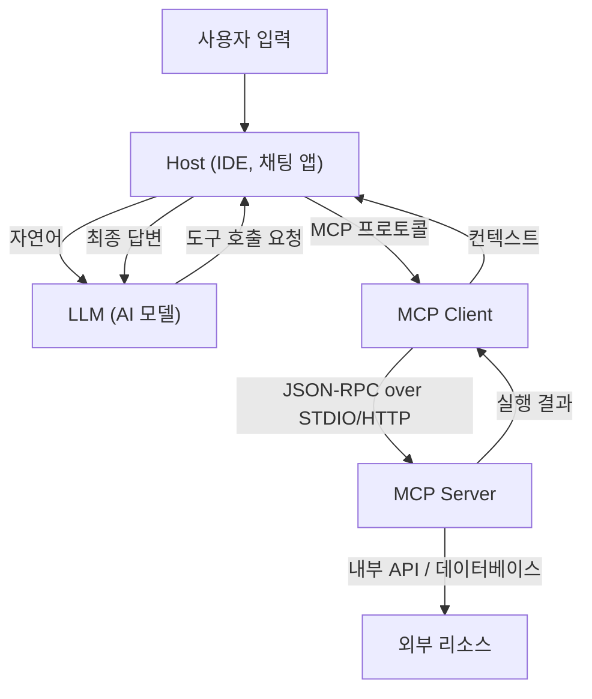

# Model Context Protocol (MCP)의 전모: AI와 시스템을 연결하는 차세대 아키텍처

최근 대규모 언어 모델(LLM)의 진화는 눈부시며, 자연어 처리 영역을 넘어 소프트웨어 개발, 데이터 분석, 업무 자동화 등 모든 산업에 혁명을 가져오고 있습니다. 하지만 LLM이 진정한 가치를 발휘하기 위해서는 모델 자체의 지능만으로는 불충분합니다. 모델이 외부 세계—데이터베이스, 사내 API, 파일 시스템, 웹 서비스—와 안전하고 효율적으로 대화하기 위한 '인터페이스'가 필수적입니다.

이 과제를 해결하기 위해 등장한 것이 **Model Context Protocol (MCP)** 입니다. MCP는 AI 모델과 외부 도구 및 데이터 소스를 연결하기 위한 표준화된 프로토콜로, 개발자가 통합된 방법으로 AI 에이전트의 능력을 확장할 수 있게 해줍니다.

본 기사에서는 MCP가 탄생한 배경, 해결하는 과제, 아키텍처의 심층, 구체적인 구현 스키마, 그리고 보안 모델에 대해 기술적인 관점에서 상세히 해설합니다.

---

## 1. LLM에 대한 컨텍스트 제공의 과제와 MCP의 탄생

### 1.1 컨텍스트의 벽
LLM은 사전 학습된 매개변수 내에 방대한 지식을 보유하고 있지만, 최신 정보나 특정 조직 내의 프라이빗 데이터에는 접근할 수 없습니다. 이러한 '환각(할루시네이션)'을 방지하고 정확한 답변을 생성하기 위해서는 RAG(Retrieval-Augmented Generation)나 도구 호출(Function Calling)을 사용하여 실행 시점에 적절한 컨텍스트를 제공해야 합니다.

하지만 기존의 컨텍스트 제공에는 다음과 같은 과제가 있었습니다.
- **인터페이스의 분절**: 각 LLM 제공자(OpenAI, Anthropic, Google 등)가 독자적인 도구 호출 형식을 정의하고 있기 때문에, 개발자는 모델마다 다른 구현을 유지해야 했습니다.
- **상태 관리의 복잡성**: 여러 단계에 걸친 작업을 실행할 때, 어떤 도구가 어떤 순서로 호출되고 어떤 데이터가 반환되었는지를 애플리케이션 측에서 정확히 관리하는 부담이 컸습니다.
- **보안과 거버넌스**: AI 모델에 사내 시스템에 대한 접근을 허용할 경우, 최소 권한의 원칙을 어떻게 적용하고 인증 및 인가를 어떻게 일원화하여 관리할지가 큰 우려 사항이었습니다.

### 1.2 Model Context Protocol의 설계 사상
이러한 과제에 대처하기 위해 MCP는 다음과 같은 설계 사상을 바탕으로 구축되었습니다.
1. **표준화 (Standardization)**: 제공자에 의존하지 않는 통합된 프로토콜을 정의하여, 한 번 개발한 도구를 모든 모델이나 클라이언트에서 재사용 가능하게 합니다.
2. **느슨한 결합 (Loose Coupling)**: 도구를 제공하는 서버와 LLM을 이용하는 클라이언트를 분리하여, 독립적으로 확장 및 업데이트할 수 있게 합니다.
3. **안전한 경계 (Secure Boundaries)**: 네트워크 경계에서 명확한 접근 제어를 수행하여, AI 모델에 대한 컨텍스트 제공을 안전한 샌드박스 내에서 수행합니다.

---

## 2. MCP의 3계층 아키텍처: 클라이언트, 서버, 호스트

MCP는 시스템 전체를 **Host(호스트)**, **Client(클라이언트)**, **Server(서버)**의 3가지 주요 구성 요소로 분할하는 아키텍처를 채택하고 있습니다. 이러한 분리를 통해 복잡한 AI 애플리케이션의 구축이 용이해집니다.



### 2.1 Host (호스트 애플리케이션)
Host는 사용자와 직접 대화하는 인터페이스(예: VS Code 등의 IDE, 사내 챗봇, CLI 도구 등)입니다. Host는 사용자의 입력을 받아 LLM에 전송합니다. 또한 LLM으로부터 '이 도구를 실행하고 싶다'는 요청을 받은 경우, 이를 해석하여 Client에 처리를 위임합니다.

### 2.2 MCP Client (클라이언트)
Client는 Host의 내부 또는 인접하여 동작하며, MCP 프로토콜에 따라 Server와의 통신을 관리합니다. Client의 주요 역할은 다음과 같습니다.
- 사용 가능한 Server의 디스커버리 및 연결 관리
- LLM으로부터의 추상적인 도구 호출 요청을 구체적인 MCP의 JSON-RPC 요청으로 변환
- Server로부터의 응답을 검증하고, LLM이 이해할 수 있는 형식으로 포맷하여 Host에 반환

### 2.3 MCP Server (서버)
Server는 실제 외부 시스템(데이터베이스, API, 파일 시스템)과 직접 대화하는 구성 요소입니다. 개발자는 Server를 구현함으로써 자사의 시스템을 MCP 생태계에 연결합니다.
Server는 자신이 어떤 도구(함수)나 리소스를 제공하고 있는지를 Client에 메타데이터로 알리고, Client로부터의 실행 요청을 처리하여 결과를 반환합니다.

---

## 3. 구체적인 도구 정의 스키마와 JSON-RPC 프로토콜

MCP는 통신 프로토콜로서 **JSON-RPC 2.0**을 채택하고 있습니다. 전송 계층에는 로컬 프로세스 간 통신을 위한 `stdio`, 또는 네트워크를 통한 통신을 위한 `HTTP/SSE (Server-Sent Events)`를 사용합니다.

### 3.1 도구 메타데이터 알림
Client가 Server에 연결하면, 먼저 `tools/list` 요청을 전송하여 사용 가능한 도구 목록을 가져옵니다.

**요청 (Client -> Server):**
```json
{
  "jsonrpc": "2.0",
  "id": 1,
  "method": "tools/list",
  "params": {}
}
```

**응답 (Server -> Client):**
```json
{
  "jsonrpc": "2.0",
  "id": 1,
  "result": {
    "tools": [
      {
        "name": "query_database",
        "description": "사내 데이터베이스에서 SQL을 사용하여 정보를 가져옵니다.",
        "inputSchema": {
          "type": "object",
          "properties": {
            "sql_query": {
              "type": "string",
              "description": "실행할 SELECT 문"
            },
            "limit": {
              "type": "integer",
              "default": 10
            }
          },
          "required": ["sql_query"]
        }
      }
    ]
  }
}
```

여기서 중요한 것은 `inputSchema`입니다. JSON Schema를 사용하여 인수의 타입이나 필수 항목을 엄격하게 정의함으로써, LLM이 올바른 형식으로 도구를 호출하도록 강력하게 지원합니다. 이 스키마는 Host를 통해 LLM의 프롬프트(Function Calling 정의)에 직접 매핑됩니다.

### 3.2 도구 실행
LLM이 `query_database`의 실행을 결정하면, Client는 `tools/call` 요청을 Server에 전송합니다.

**요청 (Client -> Server):**
```json
{
  "jsonrpc": "2.0",
  "id": 2,
  "method": "tools/call",
  "params": {
    "name": "query_database",
    "arguments": {
      "sql_query": "SELECT name, email FROM users WHERE status = 'active'",
      "limit": 5
    }
  }
}
```

**응답 (Server -> Client):**
```json
{
  "jsonrpc": "2.0",
  "id": 2,
  "result": {
    "content": [
      {
        "type": "text",
        "text": "name: Alice, email: alice@example.com\nname: Bob, email: bob@example.com"
      }
    ]
  }
}
```

---

## 4. 프롬프트와 도구의 결합: 고도화된 컨텍스트 관리

MCP는 단순한 함수 원격 호출(RPC) 프로토콜이 아닙니다. '프롬프트 템플릿'이나 '리소스' 관리 기능도 갖추고 있습니다.

### 4.1 리소스 (Resources)
도구가 동적인 액션(데이터 쓰기나 검색)을 수행하는 반면, 리소스는 정적인 컨텍스트(로그 파일, 위키 페이지, API 문서 등)를 제공합니다. Server는 `resources/list`나 `resources/read` 메서드를 통해 LLM에 읽게 하고 싶은 컨텍스트를 URI 기반으로 공개할 수 있습니다.
이를 통해 Host는 LLM의 프롬프트에 '이 URI의 텍스트를 사전 지식으로 포함한다'와 같은 처리를 자동화할 수 있습니다.

### 4.2 프롬프트 (Prompts)
Server 측에서 사전에 정의된 프롬프트 템플릿을 Client에 제공하는 기능입니다. 예를 들어, '버그 수정용 프롬프트'라는 템플릿을 Server가 제공하고, Client는 인수(에러 메시지 등)를 전달하여 완성된 프롬프트 문자열을 얻습니다.
이를 통해 프롬프트 엔지니어링을 Client(애플리케이션 측)에서 분리하고, 백엔드인 Server 측에서 일원화하여 버전 관리나 최적화를 수행하는 것이 가능해집니다.

---

## 5. 보안과 접근 제어

AI 에이전트에게 자율적인 행동을 허용할 때 가장 중요한 것이 보안입니다. MCP는 아키텍처 수준에서 몇 가지 강력한 보안 경계를 제공합니다.

### 5.1 네트워크 격리와 전송 선택
기밀성이 높은 사내 시스템에 접근하는 MCP Server는 퍼블릭 인터넷에 공개할 필요가 없습니다. 개발자의 로컬 머신이나 사내 VPC 내의 프라이빗 네트워크에서 동작하게 하고, `stdio`나 내부 네트워크를 통해 Client와 통신하게 할 수 있습니다. LLM의 API 자체는 클라우드 상에 있더라도, 데이터 수집은 로컬의 Client와 Server 간에 완결되며 필요한 정보만 LLM으로 전송됩니다.

### 5.2 휴먼 인 더 루프 (Human-in-the-loop)
MCP의 프로토콜 사양에서는 데이터 변경을 수반하는 중대한 도구 실행(데이터베이스 업데이트, 이메일 전송 등) 전에 Host 애플리케이션이 사용자에게 명시적인 승인을 요청하는 플로우를 구현할 것을 권장하고 있습니다. 서버는 도구의 메타데이터에 `require_approval: true`와 같은 플래그를 부여(확장 사양)하여 클라이언트 측에서 확실하게 확인을 촉구하도록 설계할 수 있습니다.

### 5.3 인증 및 컨텍스트 전파
Server가 외부 API를 호출할 때 누구의 권한으로 실행하고 있는지가 중요해집니다. MCP에서는 요청 헤더나 환경 변수를 통해 Host 측에서 얻은 사용자의 OAuth 토큰이나 세션 정보를 Server에 안전하게 전파하는 메커니즘을 구축할 수 있습니다. 이를 통해 AI가 사용자의 권한을 넘어 데이터에 접근하는 것을 방지합니다.

---

## 6. MCP가 가져올 미래의 소프트웨어 개발

Model Context Protocol의 보급으로 AI 생태계는 '개별 통합'에서 '플러그 앤 플레이' 시대로 전환될 것입니다.

- **개발자 부담 경감**: 기업은 자사의 API를 MCP Server로 한 번 래핑하는 것만으로 VS Code, Slack 봇, 독자적인 사내 도구 등 모든 MCP 호환 클라이언트에서 LLM을 거쳐 접근 가능해집니다.
- **AI 에이전트의 자율성 향상**: 통합된 스키마와 명확한 에러 핸들링을 통해 LLM은 도구 호출의 실패를 이해하고, 자율적으로 매개변수를 수정하여 재시도하는 능력이 비약적으로 향상됩니다.
- **열린 생태계 형성**: 커뮤니티 주도로 다양한 MCP Server(GitHub 접근, Jira 연동, AWS 관리 등)가 오픈 소스로 공개되어, 누구나 쉽게 강력한 AI 어시스턴트를 구축할 수 있게 될 것입니다.

### 결론
MCP는 AI와 외부 시스템을 연결하는 견고하고 유연한 가교입니다. 프롬프트, 도구, 리소스 관리를 표준화하고 클라이언트와 서버의 관심사를 분리함으로써 개발자는 더욱 안전하고 확장 가능한 차세대 AI 애플리케이션을 구축할 수 있습니다. AI의 진정한 잠재력을 끌어내는 기반으로서 MCP의 향후 발전에서 눈을 뗄 수 없습니다.
