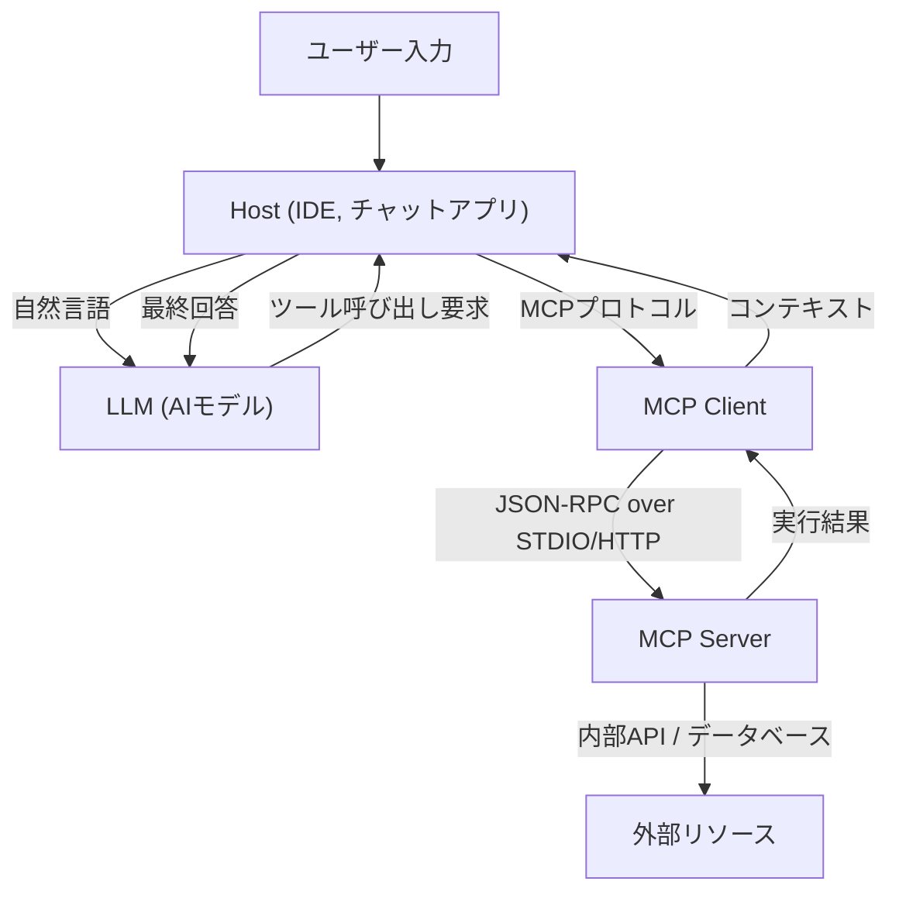

# Model Context Protocol (MCP) の全貌：AIとシステムをつなぐ次世代アーキテクチャ

近年、大規模言語モデル（LLM）の進化は目覚ましいものがあり、自然言語処理の領域を超えて、ソフトウェア開発、データ分析、業務自動化など、あらゆる産業に革命をもたらしています。しかし、LLMが真の価値を発揮するためには、モデル単体の知能だけでは不十分です。モデルが外部の世界—データベース、社内API、ファイルシステム、ウェブサービス—と安全かつ効率的に対話するための「インターフェース」が必要不可欠です。

この課題を解決するために登場したのが **Model Context Protocol (MCP)** です。MCPは、AIモデルと外部ツールやデータソースを接続するための標準化されたプロトコルであり、開発者が統一された方法でAIエージェントの能力を拡張することを可能にします。

本記事では、MCPが誕生した背景、解決する課題、アーキテクチャの深層、具体的な実装スキーマ、そしてセキュリティモデルについて、技術的な観点から詳細に解説します。

---

## 1. LLMへのコンテキスト提供の課題とMCPの誕生

### 1.1 コンテキストの壁
LLMは、事前学習されたパラメーター内に膨大な知識を保持していますが、最新の情報や特定の組織内のプライベートなデータにはアクセスできません。この「幻覚（ハルシネーション）」を防ぎ、正確な回答を生成するためには、RAG（Retrieval-Augmented Generation）やツールの呼び出し（Function Calling）を用いて、実行時に適切なコンテキストを提供する必要があります。

しかし、従来のコンテキスト提供には以下のような課題がありました。
- **インターフェースの分断**: 各LLMプロバイダー（OpenAI, Anthropic, Googleなど）が独自のツール呼び出し形式を定義しているため、開発者はモデルごとに異なる実装を維持する必要がありました。
- **ステート管理の複雑さ**: 複数ステップにわたるタスクを実行する際、どのツールがどの順序で呼ばれ、どのようなデータが返されたかをアプリケーション側で正確に管理する負担が大きかったのです。
- **セキュリティとガバナンス**: AIモデルに社内システムへのアクセスを許可する場合、最小特権の原則をどのように適用し、認証・認可をどのように一元管理するかが大きな懸念事項でした。

### 1.2 Model Context Protocolの設計思想
これらの課題に対処するため、MCPは以下の設計思想に基づいて構築されました。
1. **標準化（Standardization）**: プロバイダーに依存しない統一されたプロトコルを定義し、一度開発したツールをあらゆるモデルやクライアントで再利用可能にする。
2. **疎結合（Loose Coupling）**: ツールを提供するサーバーと、LLMを利用するクライアントを分離し、独立してスケーリング・更新できるようにする。
3. **安全な境界（Secure Boundaries）**: ネットワークの境界で明確なアクセス制御を行い、AIモデルへのコンテキスト提供を安全なサンドボックス内で行う。

---

## 2. MCPの3層アーキテクチャ：クライアント、サーバー、ホスト

MCPは、システム全体を **Host（ホスト）**、**Client（クライアント）**、**Server（サーバー）** の3つの主要コンポーネントに分割するアーキテクチャを採用しています。この分離により、複雑なAIアプリケーションの構築が容易になります。



### 2.1 Host (ホストアプリケーション)
Hostは、ユーザーと直接対話するインターフェース（例えば、VS CodeなどのIDE、社内のチャットボット、CLIツールなど）です。Hostはユーザーの入力を受け取り、LLMに送信します。また、LLMから「このツールを実行したい」という要求を受け取った場合、それを解釈してClientに処理を委譲します。

### 2.2 MCP Client (クライアント)
Clientは、Hostの内部または隣接して動作し、MCPプロトコルに従ってServerとの通信を管理します。Clientの主な役割は以下の通りです。
- 利用可能なServerのディスカバリと接続管理
- LLMからの抽象的なツール呼び出し要求を、具体的なMCPのJSON-RPCリクエストに変換
- Serverからのレスポンスを検証し、LLMが理解できる形式にフォーマットしてHostに返す

### 2.3 MCP Server (サーバー)
Serverは、実際の外部システム（データベース、API、ファイルシステム）と直接対話するコンポーネントです。開発者はServerを実装することで、自社のシステムをMCPエコシステムに接続します。
Serverは、自身がどのようなツール（関数）やリソースを提供しているかをClientにメタデータとして通知し、Clientからの実行要求を処理して結果を返します。

---

## 3. 具体的なツール定義のスキーマとJSON-RPCプロトコル

MCPは、通信プロトコルとして **JSON-RPC 2.0** を採用しています。トランスポート層には、ローカルプロセス間通信のための `stdio`、またはネットワーク経由の通信のための `HTTP/SSE (Server-Sent Events)` を使用します。

### 3.1 ツールのメタデータ通知
ClientがServerに接続すると、まず `tools/list` リクエストを送信し、利用可能なツールの一覧を取得します。

**リクエスト (Client -> Server):**
```json
{
  "jsonrpc": "2.0",
  "id": 1,
  "method": "tools/list",
  "params": {}
}
```

**レスポンス (Server -> Client):**
```json
{
  "jsonrpc": "2.0",
  "id": 1,
  "result": {
    "tools": [
      {
        "name": "query_database",
        "description": "社内データベースからSQLを使用して情報を取得します。",
        "inputSchema": {
          "type": "object",
          "properties": {
            "sql_query": {
              "type": "string",
              "description": "実行するSELECT文"
            },
            "limit": {
              "type": "integer",
              "default": 10
            }
          },
          "required": ["sql_query"]
        }
      }
    ]
  }
}
```

ここで重要なのは `inputSchema` です。JSON Schemaを使用して引数の型や必須項目を厳格に定義することで、LLMが正しい形式でツールを呼び出すことを強力にサポートします。このスキーマは、Hostを通じてLLMのプロンプト（Function Callingの定義）に直接マッピングされます。

### 3.2 ツールの実行
LLMが `query_database` の実行を決定すると、Clientは `tools/call` リクエストをServerに送信します。

**リクエスト (Client -> Server):**
```json
{
  "jsonrpc": "2.0",
  "id": 2,
  "method": "tools/call",
  "params": {
    "name": "query_database",
    "arguments": {
      "sql_query": "SELECT name, email FROM users WHERE status = 'active'",
      "limit": 5
    }
  }
}
```

**レスポンス (Server -> Client):**
```json
{
  "jsonrpc": "2.0",
  "id": 2,
  "result": {
    "content": [
      {
        "type": "text",
        "text": "name: Alice, email: alice@example.com\nname: Bob, email: bob@example.com"
      }
    ]
  }
}
```

---

## 4. プロンプトとツールの結びつけ：高度なコンテキスト管理

MCPは単なる関数のリモート呼び出し（RPC）プロトコルではありません。「プロンプトテンプレート」や「リソース」の管理機能も備えています。

### 4.1 リソース (Resources)
ツールが動的なアクション（データの書き込みや検索）を行うのに対し、リソースは静的なコンテキスト（ログファイル、Wikiページ、APIドキュメントなど）を提供します。Serverは `resources/list` や `resources/read` メソッドを通じて、LLMに読み込ませたいコンテキストをURIベースで公開できます。
これにより、HostはLLMのプロンプトに「このURIのテキストを前提知識として含める」といった処理を自動化できます。

### 4.2 プロンプト (Prompts)
Server側で事前に定義されたプロンプトテンプレートをClientに提供する機能です。例えば、「バグ修正用のプロンプト」というテンプレートをServerが提供し、Clientは引数（エラーメッセージなど）を渡して完成されたプロンプト文字列を取得します。
これにより、プロンプトのエンジニアリングをClient（アプリケーション側）から分離し、バックエンドのServer側で一元的にバージョン管理や最適化を行うことが可能になります。

---

## 5. セキュリティとアクセス制御

AIエージェントに自律的な行動を許可する際、最も重要なのがセキュリティです。MCPは、アーキテクチャレベルでいくつかの強力なセキュリティ境界を提供します。

### 5.1 ネットワーク隔離とトランスポートの選択
機密性の高い社内システムにアクセスするMCP Serverは、パブリックインターネットに公開する必要はありません。開発者のローカルマシンや、社内VPC内のプライベートネットワークで動作させ、`stdio` や内部ネットワーク経由でClientと通信させることができます。LLMのAPI自体はクラウド上にあっても、データの取得はローカルのClientとServer間で完結し、必要な情報だけがLLMに送信されます。

### 5.2 ヒューマン・イン・ザ・ループ (Human-in-the-loop)
MCPのプロトコル仕様では、データの変更を伴う重大なツール実行（データベースの更新、メールの送信など）の前に、Hostアプリケーションがユーザーに明示的な承認を求めるフローを実装することが推奨されています。サーバーはツールのメタデータに `require_approval: true` のようなフラグを付与（拡張仕様）し、クライアント側で確実に確認を促す設計が可能です。

### 5.3 認証とコンテキストの伝播
Serverが外部APIを呼び出す際、誰の権限で実行しているかが重要になります。MCPでは、リクエストのヘッダーや環境変数を通じて、Host側で取得したユーザーのOAuthトークンやセッション情報をServerに安全に伝播させる仕組みを構築できます。これにより、AIがユーザーの権限を超えてデータにアクセスすることを防ぎます。

---

## 6. MCPがもたらす未来のソフトウェア開発

Model Context Protocolの普及により、AIエコシステムは「個別のインテグレーション」から「プラグアンドプレイ」の時代へと移行します。

- **開発者の負担軽減**: 企業は自社のAPIをMCP Serverとして一度ラップするだけで、VS Code、Slackボット、独自の社内ツールなど、あらゆるMCP互換クライアントからLLM経由でアクセス可能になります。
- **AIエージェントの自律性の向上**: 統一されたスキーマと明確なエラーハンドリングにより、LLMはツール呼び出しの失敗を理解し、自律的にパラメータを修正して再試行する能力が飛躍的に向上します。
- **オープンなエコシステムの形成**: コミュニティ主導で多様なMCP Server（GitHubアクセス、Jira連携、AWS管理など）がオープンソースとして公開され、誰もが簡単に強力なAIアシスタントを構築できるようになるでしょう。

### 結論
MCPは、AIと外部システムを結ぶための強固で柔軟な架け橋です。プロンプト、ツール、リソースの管理を標準化し、クライアントとサーバーの関心事を分離することで、開発者はより安全でスケーラブルな次世代のAIアプリケーションを構築できます。AIの真のポテンシャルを引き出す基盤として、MCPの今後の発展から目が離せません。
