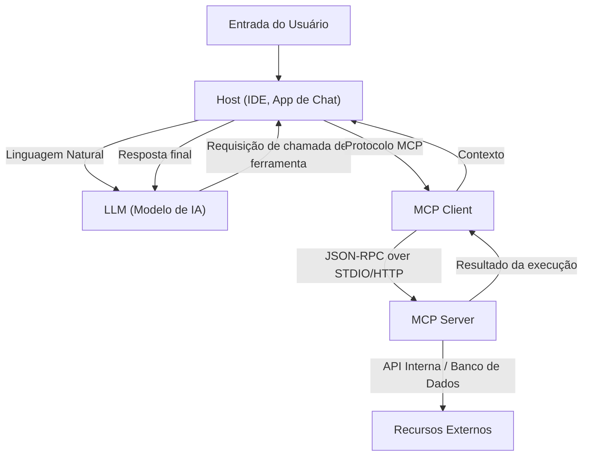

# Visão Geral do Model Context Protocol (MCP): A Arquitetura de Próxima Geração que Conecta IA e Sistemas

Nos últimos anos, a evolução dos Grandes Modelos de Linguagem (LLMs) tem sido notável, trazendo revoluções para todos os setores além do processamento de linguagem natural, incluindo desenvolvimento de software, análise de dados e automação de negócios. No entanto, para que os LLMs revelem seu verdadeiro valor, a inteligência do modelo por si só não é suficiente. É essencial uma "interface" para o modelo interagir de forma segura e eficiente com o mundo externo — bancos de dados, APIs internas, sistemas de arquivos e serviços da web.

Para resolver esse problema, surgiu o **Model Context Protocol (MCP)**. O MCP é um protocolo padronizado para conectar modelos de IA a ferramentas e fontes de dados externas, permitindo que os desenvolvedores expandam as capacidades dos agentes de IA de maneira uniforme.

Neste artigo, explicaremos em detalhes sob uma perspectiva técnica o contexto no qual o MCP foi criado, os problemas que ele resolve, as profundezas de sua arquitetura, esquemas específicos de implementação e seu modelo de segurança.

---

## 1. O Desafio de Fornecer Contexto aos LLMs e o Nascimento do MCP

### 1.1 A Barreira do Contexto
Embora os LLMs retenham uma vasta quantidade de conhecimento em seus parâmetros pré-treinados, eles não têm acesso às informações mais recentes ou aos dados privados dentro de uma organização específica. Para evitar essas "alucinações" e gerar respostas precisas, é necessário fornecer o contexto adequado em tempo de execução usando RAG (Geração Aumentada de Recuperação) ou chamadas de ferramentas (Function Calling).

No entanto, o fornecimento de contexto tradicional enfrentava os seguintes desafios:
- **Fragmentação de Interfaces**: Como cada provedor de LLM (OpenAI, Anthropic, Google, etc.) definiu seu próprio formato de chamada de ferramentas, os desenvolvedores precisavam manter implementações diferentes para cada modelo.
- **Complexidade do Gerenciamento de Estado**: Ao executar tarefas que envolvem várias etapas, a carga sobre a aplicação era imensa para gerenciar com precisão quais ferramentas eram chamadas, em qual ordem e quais dados eram retornados.
- **Segurança e Governança**: Ao conceder aos modelos de IA acesso a sistemas internos, a forma de aplicar o princípio do privilégio mínimo e centralizar o gerenciamento de autenticação e autorização era uma grande preocupação.

### 1.2 Filosofia de Design do Model Context Protocol
Para lidar com esses desafios, o MCP foi construído com base nas seguintes filosofias de design:
1. **Padronização (Standardization)**: Definir um protocolo unificado e independente de provedor para tornar ferramentas desenvolvidas uma vez reutilizáveis ​​em qualquer modelo ou cliente.
2. **Baixo Acoplamento (Loose Coupling)**: Separar o servidor que fornece a ferramenta e o cliente que usa o LLM, permitindo que eles sejam escalados e atualizados independentemente.
3. **Fronteiras Seguras (Secure Boundaries)**: Fornecer controle de acesso claro nos limites da rede e realizar o fornecimento de contexto aos modelos de IA em um ambiente seguro (sandbox).

---

## 2. A Arquitetura de 3 Camadas do MCP: Cliente, Servidor e Host

O MCP adota uma arquitetura que divide todo o sistema em três componentes principais: **Host**, **Cliente** e **Servidor**. Essa separação facilita a construção de aplicativos de IA complexos.



### 2.1 Host (Aplicação Host)
O Host é a interface que interage diretamente com o usuário (por exemplo, uma IDE como VS Code, chatbots internos, ferramentas de linha de comando - CLI, etc.). O Host recebe a entrada do usuário e a envia ao LLM. Além disso, ao receber um pedido "Eu quero executar esta ferramenta" do LLM, ele o interpreta e delega o processamento ao Cliente.

### 2.2 MCP Client (Cliente)
O Cliente opera dentro ou ao lado do Host e gerencia a comunicação com o Servidor de acordo com o protocolo MCP. Os principais papéis do Cliente são os seguintes:
- Descoberta e gerenciamento de conexão dos Servidores disponíveis
- Conversão das solicitações abstratas de chamadas de ferramentas do LLM em solicitações MCP JSON-RPC concretas
- Validação das respostas do Servidor, formatando-as em um formato que o LLM possa entender e retornando-as ao Host

### 2.3 MCP Server (Servidor)
O Servidor é o componente que interage diretamente com sistemas externos reais (bancos de dados, APIs, sistemas de arquivos). Os desenvolvedores conectam seus próprios sistemas ao ecossistema MCP implementando Servidores.
O Servidor notifica o Cliente por meio de metadados sobre as ferramentas (funções) e recursos que ele fornece, processa as solicitações de execução do Cliente e retorna os resultados.

---

## 3. Esquemas Específicos de Definição de Ferramentas e o Protocolo JSON-RPC

O MCP adota o **JSON-RPC 2.0** como seu protocolo de comunicação. A camada de transporte usa `stdio` para comunicação entre processos locais, ou `HTTP/SSE (Server-Sent Events)` para comunicação através da rede.

### 3.1 Notificação de Metadados da Ferramenta
Quando um Cliente se conecta a um Servidor, ele primeiro envia uma solicitação `tools/list` para recuperar uma lista das ferramentas disponíveis.

**Requisição (Client -> Server):**
```json
{
  "jsonrpc": "2.0",
  "id": 1,
  "method": "tools/list",
  "params": {}
}
```

**Resposta (Server -> Client):**
```json
{
  "jsonrpc": "2.0",
  "id": 1,
  "result": {
    "tools": [
      {
        "name": "query_database",
        "description": "Recupera informações do banco de dados interno usando SQL.",
        "inputSchema": {
          "type": "object",
          "properties": {
            "sql_query": {
              "type": "string",
              "description": "A declaração SELECT a ser executada"
            },
            "limit": {
              "type": "integer",
              "default": 10
            }
          },
          "required": ["sql_query"]
        }
      }
    ]
  }
}
```

O que é importante aqui é o `inputSchema`. Ao definir de forma estrita os tipos de argumentos e os itens obrigatórios usando JSON Schema, isso apoia fortemente a chamada da ferramenta no formato correto pelo LLM. Esse esquema é mapeado diretamente para o prompt do LLM (a definição da Function Calling) através do Host.

### 3.2 Execução da Ferramenta
Quando o LLM decide executar `query_database`, o Cliente envia uma solicitação `tools/call` para o Servidor.

**Requisição (Client -> Server):**
```json
{
  "jsonrpc": "2.0",
  "id": 2,
  "method": "tools/call",
  "params": {
    "name": "query_database",
    "arguments": {
      "sql_query": "SELECT name, email FROM users WHERE status = 'active'",
      "limit": 5
    }
  }
}
```

**Resposta (Server -> Client):**
```json
{
  "jsonrpc": "2.0",
  "id": 2,
  "result": {
    "content": [
      {
        "type": "text",
        "text": "name: Alice, email: alice@example.com\nname: Bob, email: bob@example.com"
      }
    ]
  }
}
```

---

## 4. Vinculando Prompts e Ferramentas: Gerenciamento de Contexto Avançado

O MCP não é apenas um protocolo de Chamada de Procedimento Remoto (RPC) para funções. Ele também fornece funcionalidades de gerenciamento para "templates de prompts" e "recursos".

### 4.1 Recursos (Resources)
Enquanto as ferramentas executam ações dinâmicas (gravação de dados ou pesquisa), os recursos fornecem contexto estático (arquivos de log, páginas Wiki, documentação de API, etc.). O Servidor pode expor o contexto que deseja que o LLM leia por meio de URIs através dos métodos `resources/list` e `resources/read`.
Isso permite que o Host automatize o processo de incluir o texto de uma URI específica como conhecimento prévio nos prompts do LLM, por exemplo.

### 4.2 Prompts (Prompts)
Esta é uma funcionalidade em que os templates de prompts predefinidos no lado do Servidor são fornecidos ao Cliente. Por exemplo, o Servidor fornece um template chamado "prompt de correção de bugs", e o Cliente passa os argumentos (como mensagens de erro) para obter a string de prompt finalizada.
Isso possibilita separar a engenharia de prompts do Cliente (lado da aplicação) e centralizar seu controle de versão e otimização no backend do lado do Servidor.

---

## 5. Segurança e Controle de Acesso

Ao conceder autonomia a agentes de IA, a segurança é a consideração mais importante. O MCP fornece vários limites de segurança robustos no nível da arquitetura.

### 5.1 Isolamento de Rede e Escolha de Transporte
Um Servidor MCP que acessa sistemas internos altamente sensíveis não precisa ser exposto à internet pública. Ele pode ser operado na máquina local do desenvolvedor ou em uma rede privada dentro de uma VPC corporativa, comunicando-se com o Cliente via `stdio` ou pela rede interna. Mesmo que a própria API do LLM esteja na nuvem, a recuperação de dados é confinada localmente entre o Cliente e o Servidor, e apenas as informações necessárias são enviadas para o LLM.

### 5.2 Humano-no-loop (Human-in-the-loop)
A especificação do protocolo MCP recomenda que as aplicações Host implementem um fluxo que exija a aprovação explícita do usuário antes da execução de ferramentas críticas que envolvam modificação de dados (atualizações de banco de dados, envio de e-mails, etc.). Os servidores podem adicionar flags como `require_approval: true` aos metadados da ferramenta (como uma extensão), permitindo o design no lado do cliente que obriga solicitações de confirmação.

### 5.3 Autenticação e Propagação de Contexto
Quando um Servidor chama uma API externa, as permissões sob as quais ela é executada tornam-se vitais. No MCP, é possível estabelecer um mecanismo para passar de forma segura tokens OAuth ou informações de sessão obtidas no lado do Host para o Servidor através de cabeçalhos de solicitação ou variáveis de ambiente. Isso impede que a IA acesse dados além da autorização do usuário.

---

## 6. O Desenvolvimento de Software do Futuro Trazido pelo MCP

Com a ampla adoção do Model Context Protocol, o ecossistema de IA mudará da era da "integração individual" para uma era "plug-and-play".

- **Redução de Carga para os Desenvolvedores**: As empresas precisam envolver (wrap) suas próprias APIs como um Servidor MCP apenas uma vez, tornando-as acessíveis via LLMs a partir de qualquer cliente compatível com MCP, incluindo VS Code, bots do Slack e ferramentas internas personalizadas.
- **Melhoria da Autonomia do Agente de IA**: Por meio de esquemas unificados e tratamento de erros claro, a capacidade do LLM de entender as falhas de chamadas de ferramentas e corrigir autonomamente os parâmetros e tentar novamente melhorará drasticamente.
- **Formação de um Ecossistema Aberto**: À medida que vários Servidores MCP (acesso ao GitHub, integração ao Jira, gerenciamento AWS, etc.) são lançados em código aberto liderados pela comunidade, qualquer um será capaz de construir facilmente assistentes de IA poderosos.

### Conclusão
O MCP é uma ponte robusta e flexível que conecta a IA e os sistemas externos. Ao padronizar o gerenciamento de prompts, ferramentas e recursos e separar as preocupações do cliente e do servidor, os desenvolvedores podem criar aplicações de IA de próxima geração mais seguras e escaláveis. Como base para desbloquear o verdadeiro potencial da IA, o desenvolvimento futuro do MCP é algo a se acompanhar de perto.
