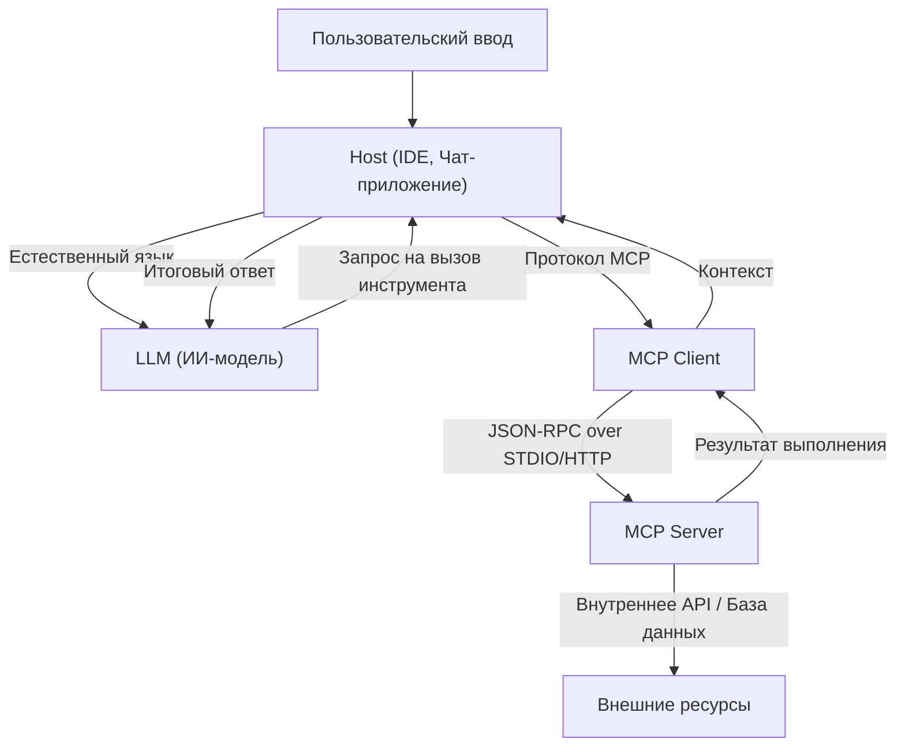

# Полный обзор Model Context Protocol (MCP): архитектура нового поколения, связывающая ИИ с системами

В последние годы эволюция больших языковых моделей (LLM) была поразительной, произведя революцию не только в области обработки естественного языка, но и во всех отраслях, таких как разработка программного обеспечения, анализ данных и автоматизация бизнес-процессов. Однако для того, чтобы LLM проявили свою истинную ценность, одного интеллекта самой модели недостаточно. Абсолютно необходим «интерфейс», с помощью которого модель сможет безопасно и эффективно взаимодействовать с внешним миром — базами данных, внутренними API, файловыми системами и веб-сервисами.

Для решения этой проблемы и был создан **Model Context Protocol (MCP)**. MCP — это стандартизированный протокол для подключения ИИ-моделей к внешним инструментам и источникам данных, который позволяет разработчикам расширять возможности ИИ-агентов единым способом.

В этой статье мы подробно, с технической точки зрения, рассмотрим предпосылки создания MCP, решаемые им проблемы, глубины его архитектуры, конкретные схемы реализации и модель безопасности.

---

## 1. Проблема предоставления контекста для LLM и появление MCP

### 1.1 Барьер контекста
Хотя LLM хранят в своих предварительно обученных параметрах огромный объем знаний, они не имеют доступа к новейшей информации или конфиденциальным данным конкретных организаций. Чтобы предотвратить «галлюцинации» и генерировать точные ответы, необходимо предоставлять соответствующий контекст во время выполнения, используя такие методы, как RAG (Retrieval-Augmented Generation) и вызов инструментов (Function Calling).

Однако при традиционных способах предоставления контекста возникали следующие проблемы:
- **Фрагментация интерфейсов**: поскольку каждый провайдер LLM (OpenAI, Anthropic, Google и т. д.) определяет свой собственный формат вызова инструментов, разработчикам приходилось поддерживать различные реализации для каждой модели.
- **Сложность управления состоянием**: при выполнении многошаговых задач на стороне приложения ложилось тяжелое бремя точного управления тем, какие инструменты вызывались в каком порядке и какие данные возвращались.
- **Безопасность и управление**: при предоставлении ИИ-модели доступа к внутренним системам главными проблемами были вопросы о том, как применять принцип наименьших привилегий и как централизованно управлять аутентификацией и авторизацией.

### 1.2 Философия проектирования Model Context Protocol
Для решения этих проблем MCP был построен на основе следующих принципов проектирования:
1. **Стандартизация (Standardization)**: определение единого протокола, независимого от провайдера, что позволяет повторно использовать однажды разработанный инструмент с любыми моделями или клиентами.
2. **Слабая связанность (Loose Coupling)**: разделение сервера, предоставляющего инструменты, и клиента, использующего LLM, что позволяет масштабировать и обновлять их независимо.
3. **Безопасные границы (Secure Boundaries)**: четкий контроль доступа на границе сети и предоставление контекста ИИ-модели в безопасной песочнице.

---

## 2. Трехуровневая архитектура MCP: Клиент, Сервер, Хост

MCP использует архитектуру, которая разделяет всю систему на три основных компонента: **Host (Хост)**, **Client (Клиент)** и **Server (Сервер)**. Такое разделение облегчает создание сложных ИИ-приложений.



### 2.1 Host (Хост-приложение)
Host — это интерфейс, который напрямую взаимодействует с пользователем (например, IDE вроде VS Code, внутренний чат-бот, CLI-инструмент и т. д.). Host принимает ввод пользователя и отправляет его в LLM. Кроме того, когда он получает от LLM запрос типа «Я хочу запустить этот инструмент», он интерпретирует его и делегирует обработку Client.

### 2.2 MCP Client (Клиент)
Client работает внутри Host или рядом с ним и управляет связью с Server в соответствии с протоколом MCP. Основные роли Client:
- Обнаружение доступных Server и управление подключениями.
- Преобразование абстрактных запросов на вызов инструментов от LLM в конкретные JSON-RPC запросы MCP.
- Проверка ответов от Server, их форматирование в понятный для LLM вид и возврат их в Host.

### 2.3 MCP Server (Сервер)
Server — это компонент, который напрямую взаимодействует с реальными внешними системами (базами данных, API, файловыми системами). Разрабатывая Server, разработчики подключают свои собственные системы к экосистеме MCP.
Server уведомляет Client в виде метаданных о том, какие инструменты (функции) и ресурсы он предоставляет, обрабатывает запросы на выполнение от Client и возвращает результаты.

---

## 3. Специфические схемы определения инструментов и протокол JSON-RPC

В качестве протокола связи в MCP используется **JSON-RPC 2.0**. На транспортном уровне используется `stdio` для межпроцессного взаимодействия на локальном устройстве или `HTTP/SSE (Server-Sent Events)` для связи по сети.

### 3.1 Уведомление о метаданных инструментов
Когда Client подключается к Server, он сначала отправляет запрос `tools/list`, чтобы получить список доступных инструментов.

**Запрос (Client -> Server):**
```json
{
  "jsonrpc": "2.0",
  "id": 1,
  "method": "tools/list",
  "params": {}
}
```

**Ответ (Server -> Client):**
```json
{
  "jsonrpc": "2.0",
  "id": 1,
  "result": {
    "tools": [
      {
        "name": "query_database",
        "description": "Получает информацию из внутренней базы данных с помощью SQL.",
        "inputSchema": {
          "type": "object",
          "properties": {
            "sql_query": {
              "type": "string",
              "description": "Оператор SELECT для выполнения"
            },
            "limit": {
              "type": "integer",
              "default": 10
            }
          },
          "required": ["sql_query"]
        }
      }
    ]
  }
}
```

Здесь важна часть `inputSchema`. Строго определяя типы аргументов и обязательные поля с помощью JSON Schema, мы оказываем мощную поддержку LLM в вызове инструмента в правильном формате. Эта схема напрямую сопоставляется с промптом LLM (определением Function Calling) через Host.

### 3.2 Выполнение инструмента
Когда LLM решает выполнить `query_database`, Client отправляет запрос `tools/call` на Server.

**Запрос (Client -> Server):**
```json
{
  "jsonrpc": "2.0",
  "id": 2,
  "method": "tools/call",
  "params": {
    "name": "query_database",
    "arguments": {
      "sql_query": "SELECT name, email FROM users WHERE status = 'active'",
      "limit": 5
    }
  }
}
```

**Ответ (Server -> Client):**
```json
{
  "jsonrpc": "2.0",
  "id": 2,
  "result": {
    "content": [
      {
        "type": "text",
        "text": "name: Alice, email: alice@example.com\nname: Bob, email: bob@example.com"
      }
    ]
  }
}
```

---

## 4. Связывание промптов и инструментов: продвинутое управление контекстом

MCP — это не просто протокол удаленного вызова процедур (RPC). В нем также есть функции управления «шаблонами промптов» и «ресурсами».

### 4.1 Ресурсы (Resources)
В то время как инструменты выполняют динамические действия (запись или поиск данных), ресурсы предоставляют статический контекст (лог-файлы, страницы Wiki, документация API и т. д.). Через методы `resources/list` и `resources/read` Server может публиковать на основе URI контекст, который он хочет, чтобы LLM прочитала.
Это позволяет Host автоматизировать такие процессы, как добавление инструкции «используйте текст по этому URI в качестве базовых знаний» в промпт LLM.

### 4.2 Промпты (Prompts)
Это функция, с помощью которой заранее определенные шаблоны промптов на стороне Server предоставляются Client. Например, Server может предоставить шаблон «промпт для исправления ошибок», а Client передает аргументы (например, сообщения об ошибках), чтобы получить готовую строку промпта.
Это позволяет отделить разработку промптов (prompt engineering) от Client (стороны приложения) и централизовать управление версиями и оптимизацию на бэкенд-стороне Server.

---

## 5. Безопасность и контроль доступа

При предоставлении автономности ИИ-агентам самым важным аспектом является безопасность. MCP обеспечивает несколько сильных границ безопасности на уровне архитектуры.

### 5.1 Сетевая изоляция и выбор транспорта
MCP Server, который обращается к высококонфиденциальным внутренним системам, не нужно выставлять в публичный интернет. Его можно запустить на локальной машине разработчика или в частной сети внутри корпоративного VPC и позволить ему общаться с Client через `stdio` или внутреннюю сеть. Даже если API самой LLM находится в облаке, получение данных происходит исключительно между локальным Client и Server, и LLM отправляется только необходимая информация.

### 5.2 Человек в контуре (Human-in-the-loop)
Спецификация протокола MCP рекомендует внедрять процесс, в котором хост-приложение требует от пользователя явного подтверждения перед выполнением критических инструментов, включающих изменение данных (обновление базы данных, отправка электронной почты и т. д.). Сервер может прикрепить флаг, такой как `require_approval: true`, к метаданным инструмента (как расширение спецификации), что позволяет разработать систему, надежно запрашивающую подтверждение на стороне клиента.

### 5.3 Аутентификация и распространение контекста
Когда Server вызывает внешние API, важно знать, с чьими правами он это делает. MCP позволяет построить механизм для безопасной передачи токенов OAuth или информации о сессии пользователя, полученных на стороне Host, в Server через заголовки запроса или переменные окружения. Это предотвращает доступ ИИ к данным за пределами прав пользователя.

---

## 6. Будущее разработки программного обеспечения, которое принесет MCP

С распространением Model Context Protocol экосистема ИИ перейдет от эпохи «индивидуальных интеграций» к эре «подключи и работай» (plug-and-play).

- **Снижение нагрузки на разработчиков**: компаниям достаточно один раз обернуть свои собственные API в виде MCP Server, и к ним можно будет получить доступ через LLM с любого MCP-совместимого клиента, такого как VS Code, Slack-боты или собственные внутренние инструменты.
- **Повышение автономности ИИ-агентов**: благодаря унифицированной схеме и четкой обработке ошибок способность LLM понимать неудачные вызовы инструментов, самостоятельно исправлять параметры и повторять попытки значительно возрастает.
- **Формирование открытой экосистемы**: благодаря инициативе сообщества разнообразные MCP-серверы (интеграция с GitHub, Jira, управление AWS и т. д.) будут опубликованы как приложения с открытым исходным кодом, что позволит любому желающему с легкостью создавать мощных ИИ-ассистентов.

### Заключение
MCP — это прочный и гибкий мост, соединяющий ИИ с внешними системами. Стандартизируя управление промптами, инструментами и ресурсами и разделяя зоны ответственности между клиентом и сервером, разработчики могут создавать более безопасные и масштабируемые ИИ-приложения следующего поколения. Нельзя спускать глаз с будущего развития MCP как фундамента для раскрытия истинного потенциала ИИ.
