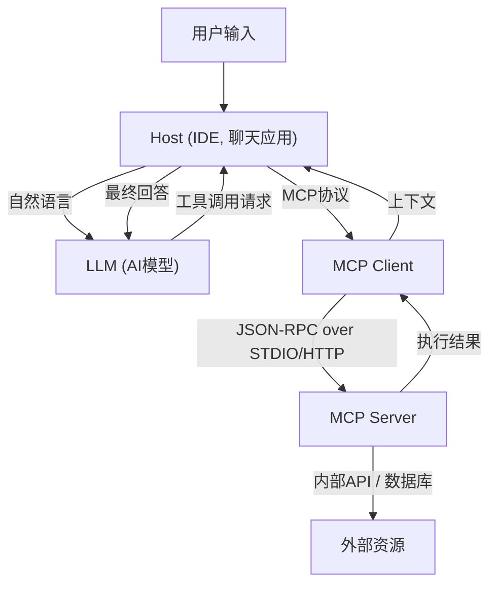

# Model Context Protocol (MCP) 全貌：连接AI与系统的下一代架构

近年来，大型语言模型（LLM）的进化令人瞩目，它不仅超越了自然语言处理领域，更在软件开发、数据分析、业务自动化等各行各业引发了革命。然而，要让LLM发挥真正的价值，仅靠模型单体的智能是不够的。模型必须能够与外部世界——数据库、内部API、文件系统、Web服务——进行安全且高效的交互，这就离不开“接口”的支持。

为了解决这一问题，**Model Context Protocol (MCP)** 应运而生。MCP是一种标准化协议，用于连接AI模型与外部工具及数据源，使开发者能够以统一的方式扩展AI智能体的能力。

本文将从技术视角详细解读MCP诞生的背景、解决的问题、架构深层原理、具体的实现模式以及安全模型。

---

## 1. 向LLM提供上下文的挑战与MCP的诞生

### 1.1 上下文壁垒
LLM在预训练的参数中保留了海量知识，但无法访问最新信息或特定组织内的私有数据。为了防止“幻觉（Hallucination）”并生成准确的回答，必须在运行时使用RAG（检索增强生成）或工具调用（Function Calling）提供合适的上下文。

然而，传统的上下文提供方式存在以下挑战：
- **接口割裂**: 各LLM提供商（如OpenAI、Anthropic、Google等）定义了各自独立的工具调用格式，导致开发者必须为不同模型维护不同的实现。
- **状态管理复杂**: 在执行多步任务时，应用端需要准确管理哪些工具以何种顺序被调用，以及返回了哪些数据，这带来了极大的负担。
- **安全与治理**: 当允许AI模型访问内部系统时，如何应用最小特权原则，以及如何集中管理身份验证与授权，成为了重大隐患。

### 1.2 Model Context Protocol 的设计理念
为了应对这些挑战，MCP基于以下设计理念构建：
1. **标准化 (Standardization)**: 定义独立于提供商的统一协议，使得开发一次的工具可在各种模型和客户端中复用。
2. **松耦合 (Loose Coupling)**: 将提供工具的服务器与使用LLM的客户端分离，使其能够独立扩展和更新。
3. **安全边界 (Secure Boundaries)**: 在网络边界实施明确的访问控制，在一个安全的沙盒内向AI模型提供上下文。

---

## 2. MCP 的三层架构：客户端、服务器、宿主

MCP采用了一种架构，将整个系统划分为三个主要组件：**Host（宿主）**、**Client（客户端）**、**Server（服务器）**。这种分离使构建复杂的AI应用程序变得更加容易。



### 2.1 Host (宿主应用程序)
Host是直接与用户交互的接口（例如，VS Code等IDE、内部聊天机器人、CLI工具等）。Host接收用户的输入并将其发送给LLM。此外，当接收到LLM提出的“希望执行此工具”请求时，它会进行解析，并将处理委托给Client。

### 2.2 MCP Client (客户端)
Client运行在Host内部或与其相邻，遵循MCP协议管理与Server的通信。Client的主要职责如下：
- 可用Server的发现与连接管理
- 将来自LLM的抽象工具调用请求转换为具体的MCP JSON-RPC请求
- 验证来自Server的响应，将其格式化为LLM能理解的形式并返回给Host

### 2.3 MCP Server (服务器)
Server是直接与实际外部系统（数据库、API、文件系统）交互的组件。开发者通过实现Server，将自身系统接入MCP生态。
Server向Client发送元数据，告知自身提供哪些工具（函数）或资源，并处理来自Client的执行请求以返回结果。

---

## 3. 具体的工具定义模式与 JSON-RPC 协议

MCP采用 **JSON-RPC 2.0** 作为通信协议。传输层使用 `stdio` 进行本地进程间通信，或使用 `HTTP/SSE (Server-Sent Events)` 进行网络通信。

### 3.1 工具的元数据通知
当Client连接到Server时，首先发送 `tools/list` 请求，获取可用工具的列表。

**请求 (Client -> Server):**
```json
{
  "jsonrpc": "2.0",
  "id": 1,
  "method": "tools/list",
  "params": {}
}
```

**响应 (Server -> Client):**
```json
{
  "jsonrpc": "2.0",
  "id": 1,
  "result": {
    "tools": [
      {
        "name": "query_database",
        "description": "使用SQL从内部数据库获取信息。",
        "inputSchema": {
          "type": "object",
          "properties": {
            "sql_query": {
              "type": "string",
              "description": "要执行的SELECT语句"
            },
            "limit": {
              "type": "integer",
              "default": 10
            }
          },
          "required": ["sql_query"]
        }
      }
    ]
  }
}
```

这里的关键在于 `inputSchema`。通过使用JSON Schema严格定义参数类型和必填项，它有力地支持了LLM以正确格式调用工具。此模式通过Host直接映射到LLM的提示词（Function Calling的定义）中。

### 3.2 工具的执行
当LLM决定执行 `query_database` 时，Client会向Server发送 `tools/call` 请求。

**请求 (Client -> Server):**
```json
{
  "jsonrpc": "2.0",
  "id": 2,
  "method": "tools/call",
  "params": {
    "name": "query_database",
    "arguments": {
      "sql_query": "SELECT name, email FROM users WHERE status = 'active'",
      "limit": 5
    }
  }
}
```

**响应 (Server -> Client):**
```json
{
  "jsonrpc": "2.0",
  "id": 2,
  "result": {
    "content": [
      {
        "type": "text",
        "text": "name: Alice, email: alice@example.com\nname: Bob, email: bob@example.com"
      }
    ]
  }
}
```

---

## 4. 提示词与工具的结合：高级上下文管理

MCP不仅仅是一个简单的远程函数调用（RPC）协议，它还具备“提示词模板”和“资源”的管理功能。

### 4.1 资源 (Resources)
与工具执行动态操作（数据写入或搜索）相对，资源提供静态上下文（日志文件、Wiki页面、API文档等）。Server可以通过 `resources/list` 或 `resources/read` 方法，以URI的形式公开希望LLM读取的上下文。
由此，Host可以自动执行诸如“将此URI的文本作为背景知识包含”在LLM提示词中的处理。

### 4.2 提示词 (Prompts)
此功能由Server向Client提供预先定义的提示词模板。例如，Server提供一个名为“用于错误修复的提示词”的模板，Client传入参数（如错误信息等）从而获取完整的提示词字符串。
这使得提示词工程能够从Client（应用程序端）解耦，在后端的Server端进行集中的版本控制与优化。

---

## 5. 安全与访问控制

当允许AI智能体进行自主操作时，安全是最重要的。MCP在架构层面提供了一些强大的安全边界。

### 5.1 网络隔离与传输选择
访问高机密性内部系统的MCP Server无需暴露在公共互联网中。可以使其在开发者的本地机器或内部VPC的私有网络中运行，通过 `stdio` 或内部网络与Client进行通信。即使LLM API本身在云端，数据获取也在本地的Client和Server之间完成，只有必要的信息才会被发送给LLM。

### 5.2 人机协同 (Human-in-the-loop)
MCP协议规范建议在执行涉及数据更改的重大工具（如更新数据库、发送邮件等）之前，实现由Host应用程序要求用户明确批准的流程。服务器可以在工具的元数据中添加类似 `require_approval: true` 的标志（扩展规范），并在客户端设计可靠的确认机制。

### 5.3 身份验证与上下文传播
当Server调用外部API时，以谁的权限执行变得至关重要。在MCP中，可以通过请求头或环境变量，建立起一种将Host端获取的用户OAuth令牌或会话信息安全传递给Server的机制。这可以防止AI越权访问数据。

---

## 6. MCP 带来的未来软件开发

随着 Model Context Protocol 的普及，AI生态系统将从“独立集成”走向“即插即用”的时代。

- **减轻开发者负担**: 企业只需将自家API封装为MCP Server一次，即可通过任何兼容MCP的客户端（如VS Code、Slack机器人、独立的内部工具等）经由LLM进行访问。
- **提升AI智能体的自主性**: 统一的模式与清晰的错误处理，使LLM能理解工具调用失败的原因，自主修改参数并重试的能力得到飞跃式提升。
- **形成开放生态**: 社区主导下，多样化的MCP Server（如GitHub访问、Jira集成、AWS管理等）将作为开源发布，任何人都能轻松构建强大的AI助手。

### 结论
MCP是连接AI与外部系统之间坚固而灵活的桥梁。通过标准化对提示词、工具和资源的管理，并分离客户端和服务器的关注点，开发者可以构建更安全、可扩展的下一代AI应用。作为释放AI真正潜能的基础，MCP未来的发展将备受瞩目。
