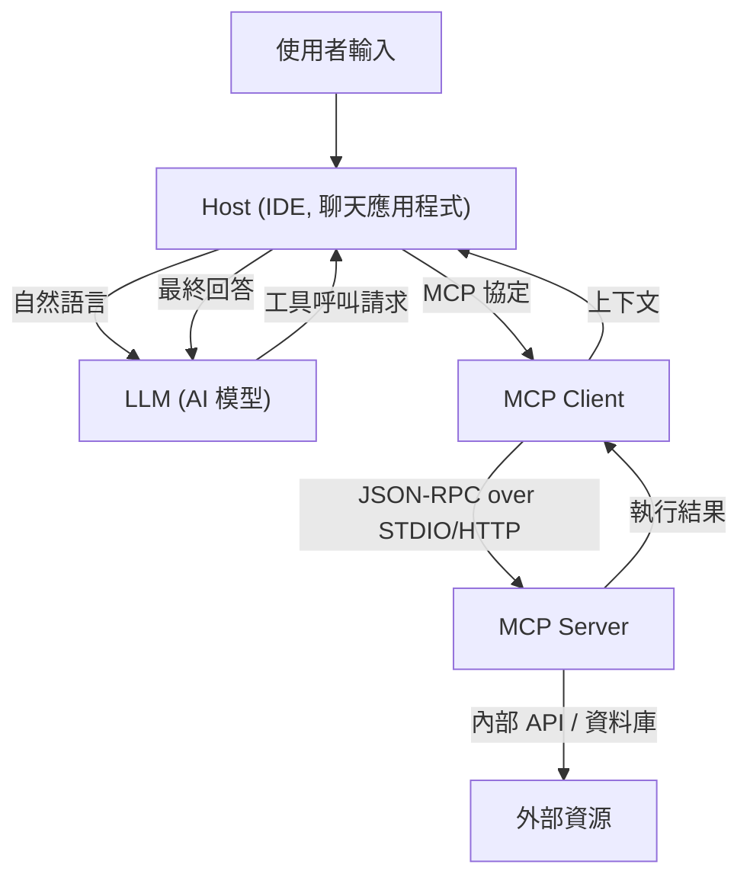

# Model Context Protocol (MCP) 全貌：連結 AI 與系統的次世代架構

近年，大型語言模型（LLM）的進化令人矚目，超越了自然語言處理的領域，為軟體開發、數據分析、業務自動化等各個產業帶來了革命。然而，為了讓 LLM 發揮真正的價值，僅靠模型單體的智慧是不夠的。模型必須具備一個「介面」，才能與外部世界——資料庫、內部 API、檔案系統、網路服務——進行安全且高效的互動。

為了解決這個課題而誕生的就是 **Model Context Protocol (MCP)**。MCP 是為了連接 AI 模型與外部工具或資料來源而標準化的協定，讓開發者能夠以統一的方式擴展 AI 代理（Agent）的能力。

本文將從技術觀點詳細解說 MCP 誕生的背景、解決的課題、架構的深層原理、具體的實作綱要（Schema），以及安全性模型。

---

## 1. 提供上下文給 LLM 的課題與 MCP 的誕生

### 1.1 上下文的障礙
LLM 在預先訓練的參數中保留了龐大的知識，但無法存取最新資訊或特定組織內的私有資料。為了防止這種「幻覺（Hallucination）」並產生正確的回覆，必須使用 RAG（檢索增強生成）或工具呼叫（Function Calling），在執行時提供適當的上下文。

然而，傳統的上下文提供方式存在以下課題：
- **介面的分裂**：各個 LLM 供應商（如 OpenAI、Anthropic、Google 等）都定義了自家的工具呼叫格式，導致開發者必須為每個模型維護不同的實作。
- **狀態管理的複雜性**：在執行跨越多個步驟的任務時，應用程式端需要準確管理哪個工具以什麼順序被呼叫、以及回傳了什麼資料，這帶來了很大的負擔。
- **安全性與治理**：當允許 AI 模型存取內部系統時，如何應用最小權限原則，以及如何集中管理身分驗證與授權，成為了巨大的隱憂。

### 1.2 Model Context Protocol 的設計思想
為了解決這些課題，MCP 基於以下設計思想而建立：
1. **標準化（Standardization）**：定義不依賴供應商的統一協定，讓開發過一次的工具可以在任何模型或客戶端上重複使用。
2. **鬆散耦合（Loose Coupling）**：將提供工具的伺服器與使用 LLM 的客戶端分離，使其能夠獨立擴展與更新。
3. **安全的邊界（Secure Boundaries）**：在網路邊界進行明確的存取控制，並在安全的沙盒內提供 AI 模型的上下文。

---

## 2. MCP 的三層架構：客戶端、伺服器、主機

MCP 採用了將整個系統分為 **Host（主機）**、**Client（客戶端）**、**Server（伺服器）** 三個主要元件的架構。這種分離使得建構複雜的 AI 應用程式變得更加容易。



### 2.1 Host（主機應用程式）
Host 是直接與使用者互動的介面（例如 VS Code 等 IDE、內部聊天機器人、CLI 工具等）。Host 接收使用者的輸入並將其傳送給 LLM。此外，當接收到來自 LLM「想要執行這個工具」的請求時，Host 會解析該請求並將處理委派給 Client。

### 2.2 MCP Client（客戶端）
Client 運作於 Host 內部或相鄰處，並根據 MCP 協定管理與 Server 的通訊。Client 的主要角色如下：
- 探索可用 Server 並管理連線
- 將 LLM 抽象的工具呼叫請求轉換為具體的 MCP JSON-RPC 請求
- 驗證來自 Server 的回應，並將其格式化為 LLM 能理解的形式後回傳給 Host

### 2.3 MCP Server（伺服器）
Server 是直接與實際外部系統（資料庫、API、檔案系統）互動的元件。開發者透過實作 Server，將自家的系統連接至 MCP 生態圈。
Server 會將自身提供哪些工具（函數）或資源以中繼資料（Metadata）的形式通知 Client，並處理來自 Client 的執行請求後回傳結果。

---

## 3. 具體的工具定義綱要與 JSON-RPC 協定

MCP 採用 **JSON-RPC 2.0** 作為通訊協定。在傳輸層，使用 `stdio` 進行本機處理程序間通訊，或是使用 `HTTP/SSE (Server-Sent Events)` 透過網路進行通訊。

### 3.1 工具的中繼資料通知
當 Client 連接至 Server 時，首先會發送 `tools/list` 請求，以取得可用的工具列表。

**請求 (Client -> Server):**
```json
{
  "jsonrpc": "2.0",
  "id": 1,
  "method": "tools/list",
  "params": {}
}
```

**回應 (Server -> Client):**
```json
{
  "jsonrpc": "2.0",
  "id": 1,
  "result": {
    "tools": [
      {
        "name": "query_database",
        "description": "使用 SQL 從內部資料庫取得資訊。",
        "inputSchema": {
          "type": "object",
          "properties": {
            "sql_query": {
              "type": "string",
              "description": "要執行的 SELECT 語句"
            },
            "limit": {
              "type": "integer",
              "default": 10
            }
          },
          "required": ["sql_query"]
        }
      }
    ]
  }
}
```

這裡最重要的是 `inputSchema`。透過使用 JSON Schema 嚴格定義參數的型別與必填項目，能強力支援 LLM 以正確的格式呼叫工具。這個綱要會透過 Host 直接對應到 LLM 的提示詞（Function Calling 的定義）。

### 3.2 工具的執行
當 LLM 決定執行 `query_database` 時，Client 會發送 `tools/call` 請求給 Server。

**請求 (Client -> Server):**
```json
{
  "jsonrpc": "2.0",
  "id": 2,
  "method": "tools/call",
  "params": {
    "name": "query_database",
    "arguments": {
      "sql_query": "SELECT name, email FROM users WHERE status = 'active'",
      "limit": 5
    }
  }
}
```

**回應 (Server -> Client):**
```json
{
  "jsonrpc": "2.0",
  "id": 2,
  "result": {
    "content": [
      {
        "type": "text",
        "text": "name: Alice, email: alice@example.com\nname: Bob, email: bob@example.com"
      }
    ]
  }
}
```

---

## 4. 提示詞與工具的結合：進階上下文管理

MCP 不僅僅是單純的遠端程序呼叫（RPC）協定。它還具備了「提示詞範本」與「資源」的管理功能。

### 4.1 資源（Resources）
相較於工具執行的是動態動作（寫入或搜尋資料），資源提供的是靜態上下文（日誌檔案、Wiki 頁面、API 文件等）。Server 能夠透過 `resources/list` 或 `resources/read` 方法，以 URI 為基礎公開希望 LLM 讀取的上下文。
如此一來，Host 就能自動將「將此 URI 的文字作為先備知識包含進去」這樣的處理加入 LLM 的提示詞中。

### 4.2 提示詞（Prompts）
這是 Server 端將預先定義好的提示詞範本提供給 Client 的功能。例如，Server 可以提供一個「除錯用提示詞」的範本，Client 傳入參數（如錯誤訊息）後即可取得完整的提示詞字串。
這使得提示詞工程（Prompt Engineering）得以從 Client（應用程式端）分離，並能在後端的 Server 端集中進行版本管理與最佳化。

---

## 5. 安全性與存取控制

在允許 AI 代理進行自主行動時，最重要的是安全性。MCP 在架構層面上提供了幾個強大的安全邊界。

### 5.1 網路隔離與傳輸選擇
存取高機密性內部系統的 MCP Server，不需要公開至網際網路上。可以讓它在開發者的本機或內部 VPC 的私有網路中運作，並透過 `stdio` 或內部網路與 Client 通訊。即使 LLM 的 API 本身位於雲端，資料的擷取也能在本機的 Client 與 Server 之間完成，只有必要的資訊才會傳送給 LLM。

### 5.2 迴圈中的人類（Human-in-the-loop）
在 MCP 的協定規範中，建議在執行涉及資料變更的重大工具（如更新資料庫、發送電子郵件等）之前，實作由 Host 應用程式向使用者要求明確批准的流程。伺服器可以在工具的中繼資料中加上如 `require_approval: true` 的標籤（擴展規範），讓設計上能確保在客戶端促請確認。

### 5.3 身分驗證與上下文傳遞
當 Server 呼叫外部 API 時，以誰的權限來執行是非常重要的。在 MCP 中，可以建立透過請求標頭或環境變數，將 Host 端取得的使用者 OAuth 權杖或工作階段資訊安全傳遞至 Server 的機制。這能防止 AI 越權存取使用者資料。

---

## 6. MCP 帶來的未來軟體開發

隨著 Model Context Protocol 的普及，AI 生態圈將從「個別整合」邁向「隨插即用（Plug-and-play）」的時代。

- **減輕開發者負擔**：企業只需將自家的 API 包裝成 MCP Server 一次，就能讓 VS Code、Slack 機器人、自有的內部工具等任何相容 MCP 的客戶端，透過 LLM 進行存取。
- **提升 AI 代理的自主性**：透過統一的綱要與明確的錯誤處理，LLM 能理解工具呼叫的失敗，並具備飛躍性提升的自主修正參數及重試能力。
- **形成開放的生態圈**：由社群主導的多樣化 MCP Server（如 GitHub 存取、Jira 整合、AWS 管理等）將會以開源形式發布，任何人都能輕鬆建構強大的 AI 助理。

### 結論
MCP 是連結 AI 與外部系統堅固且靈活的橋樑。透過標準化提示詞、工具與資源的管理，以及分離客戶端與伺服器的關注點，開發者能夠建構更安全、更具擴展性的次世代 AI 應用程式。作為激發 AI 真正潛力的基礎，MCP 未來的發展不容錯過。
